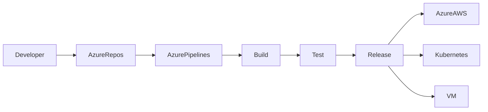
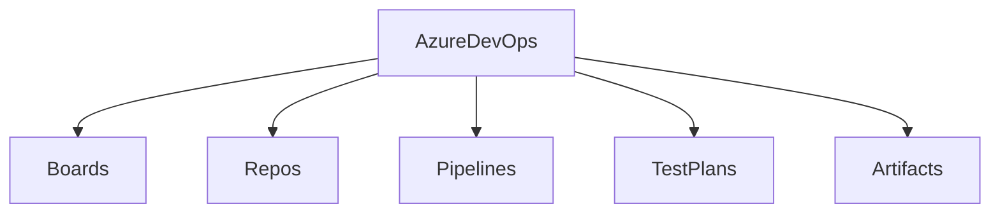
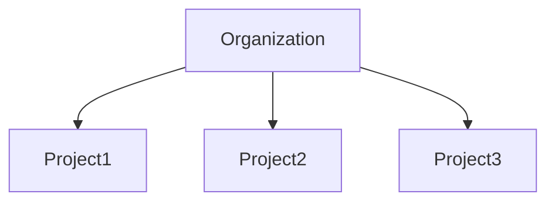
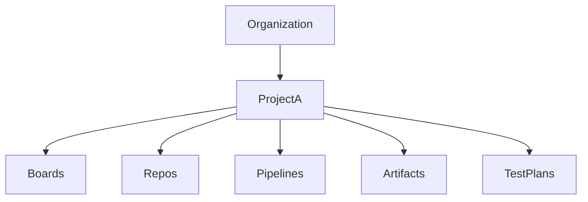
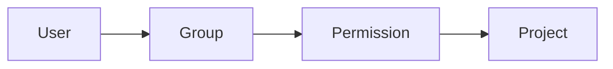
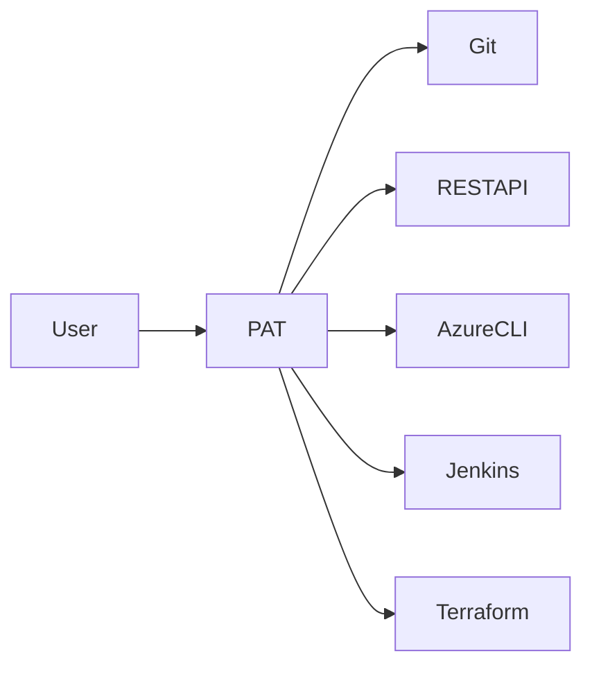
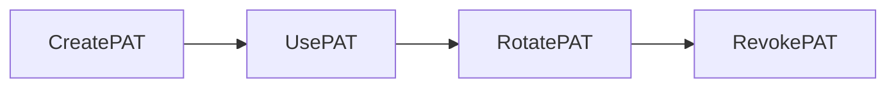

# Azure DevOps Fundamentals

## Overview

Azure DevOps is Microsoft's cloud-based DevOps platform that provides a complete set of services to plan, develop, test, deploy, and monitor applications.

It supports the entire Software Development Life Cycle (SDLC) by integrating project management, source code management, CI/CD, package management, and testing into a single platform.

Azure DevOps supports:

- Agile Development
- Scrum
- Kanban
- Continuous Integration (CI)
- Continuous Delivery (CD)
- Infrastructure as Code (IaC)
- Multi-cloud deployments (Azure, AWS, GCP, On-premises)

> **Interview Point**
>
> Azure DevOps is **not only for Azure**. It can deploy applications to **AWS, GCP, Kubernetes, VMware, On-Premises**, and many other environments.

---

# What is Azure DevOps

## Overview

Azure DevOps is a collection of development tools and services that help teams collaborate throughout the software development lifecycle.

It combines:

- Project Management
- Source Control
- Build Automation
- Release Automation
- Testing
- Artifact Management

into one integrated platform.

---

## Why It Is Used

Organizations use Azure DevOps to:

- Manage software projects
- Store source code securely
- Automate builds
- Automate deployments
- Improve collaboration
- Reduce manual work
- Deliver software faster
- Maintain application quality

---

## Architecture / Working



Workflow:

1. Developer writes code.
2. Code is pushed to Azure Repos.
3. Pipeline automatically starts.
4. Application is built.
5. Automated tests run.
6. Deployment happens.
7. Monitoring starts.

---

## Key Components

| Component | Purpose |
|------------|----------|
| Azure Boards | Project planning |
| Azure Repos | Git repositories |
| Azure Pipelines | CI/CD |
| Azure Test Plans | Manual & automated testing |
| Azure Artifacts | Package management |

---

## Real-World Use Cases

- CI/CD for web applications
- Kubernetes deployments
- Infrastructure automation
- Microservices deployment
- Enterprise software delivery

---

## Advantages

- End-to-end DevOps platform
- Cloud hosted
- Git support
- Azure integration
- Multi-cloud support
- Scalable
- Enterprise security

---

## Limitations

- Learning curve
- Licensing for advanced features
- Complex permissions in large organizations

---

## Common Interview Questions (Concept Only)

- What is Azure DevOps?
- Is Azure DevOps only for Azure?
- Explain Azure DevOps architecture.
- What services does Azure DevOps provide?
- Difference between Azure DevOps and GitHub?

---

## Common Mistakes

- Assuming Azure DevOps only works with Azure.
- Confusing Azure DevOps with Azure Portal.
- Mixing Azure DevOps Services with Azure DevOps Server.

---

## Troubleshooting

| Problem | Solution |
|----------|----------|
| Cannot access project | Check permissions |
| Pipeline not running | Verify trigger |
| Git authentication failed | Verify PAT/SSH |

---

## Summary

Azure DevOps is Microsoft's complete DevOps platform used to manage planning, development, testing, CI/CD, and deployment across any cloud or on-premises environment.

---

# Azure DevOps Services

## Overview

Azure DevOps consists of five major services.

These services work together to support the complete software delivery lifecycle.

---

## Why It Is Used

Instead of using multiple tools from different vendors, Azure DevOps provides everything in one platform.

---

## Architecture



---

## Key Components

### 1. Azure Boards

Used for:

- Agile planning
- Sprint planning
- User stories
- Epics
- Bugs
- Tasks
- Backlogs
- Kanban Boards

---

### 2. Azure Repos

Git repository hosting service.

Supports:

- Git
- Branches
- Pull Requests
- Code Reviews
- Merge Policies

---

### 3. Azure Pipelines

Used for CI/CD.

Supports:

- Build
- Test
- Release
- YAML Pipelines
- Classic Pipelines

Can deploy to:

- Azure
- AWS
- GCP
- Kubernetes
- Docker
- Linux
- Windows

---

### 4. Azure Test Plans

Supports:

- Manual testing
- Exploratory testing
- Test cases
- Test suites

---

### 5. Azure Artifacts

Package repository.

Supports:

- NuGet
- npm
- Maven
- Python
- Universal Packages

---

## Real-World Use Cases

- Agile project management
- Git repositories
- CI/CD pipelines
- Package hosting
- Software testing

---

## Advantages

- Fully integrated
- Easy collaboration
- Enterprise security
- Supports GitHub integration

---

## Limitations

- Some services require paid licenses
- Test Plans not used by every organization

---

## Common Interview Questions (Concept Only)

- Name Azure DevOps Services.
- Which service manages code?
- Which service creates CI/CD pipelines?
- What is Azure Boards?
- What is Azure Artifacts?

---

## Common Mistakes

- Confusing Boards with Repos.
- Assuming Pipelines only deploy Azure resources.

---

## Troubleshooting

- Missing service → Verify organization settings.
- Cannot access Repos → Check project permissions.

---

## Summary

Azure DevOps Services provide all essential DevOps capabilities through five integrated services.

---

# Azure DevOps Organization

## Overview

An Organization is the highest-level container in Azure DevOps.

Everything belongs inside an organization.

Examples:

```
Organization
    ├── Project A
    ├── Project B
    └── Project C
```

---

## Why It Is Used

Organizations provide:

- Identity management
- Billing
- User management
- Security
- Project management

---

## Architecture



---

## Key Components

- Organization Name
- Billing
- Azure Active Directory Integration
- Users
- Permissions
- Policies

---

## Real-World Use Cases

Example:

```
Organization

ABC Technologies

Projects

CRM
Website
Mobile App
ERP
```

---

## Advantages

- Centralized management
- Shared users
- Shared billing
- Security management

---

## Limitations

- Organization-wide permissions require careful planning

---

## Common Interview Questions (Concept Only)

- What is an Azure DevOps Organization?
- Can multiple projects exist in one organization?
- Difference between Organization and Project?

---

## Common Mistakes

- Creating multiple organizations unnecessarily.
- Assigning organization-level admin rights to everyone.

---

## Troubleshooting

| Issue | Solution |
|--------|----------|
| User cannot see project | Add user to organization first |
| Billing issues | Verify organization subscription |

---

## Summary

An Organization is the top-level management container that holds users, projects, permissions, and billing information.

---

# Azure DevOps Projects

## Overview

A Project is a logical container inside an Organization where teams manage application development.

Each project contains:

- Boards
- Repos
- Pipelines
- Artifacts
- Test Plans

---

## Why It Is Used

Projects isolate:

- Code
- Pipelines
- Teams
- Security
- Work Items

---

## Architecture



---

## Types

### Public Project

Anyone can view.

---

### Private Project

Only authorized users can access.

Most enterprises use **Private Projects**.

---

## Real-World Use Cases

Example:

```
Organization

ABC

Projects

Website
API
Mobile App
DevOps
```

---

## Advantages

- Team isolation
- Better security
- Separate pipelines
- Independent repositories

---

## Limitations

- Sharing resources across projects requires configuration

---

## Common Interview Questions (Concept Only)

- Difference between Organization and Project?
- Public vs Private Project?
- What services exist inside a project?

---

## Common Mistakes

- Putting unrelated applications into one project.
- Incorrect project visibility settings.

---

## Troubleshooting

- Cannot create pipeline → Verify project permissions.
- Repository missing → Check project selection.

---

## Summary

Projects organize and isolate application development resources within an Azure DevOps Organization.

---

# Users & Permissions

## Overview

Azure DevOps uses Role-Based Access Control (RBAC) to control what users can do.

Permissions can be assigned at:

- Organization level
- Project level
- Repository level
- Pipeline level

---

## Why It Is Used

RBAC ensures:

- Security
- Least privilege access
- Controlled administration
- Compliance

---

## Key Components

### Users

Developers

Testers

Project Managers

Administrators

DevOps Engineers

---

### Groups

- Project Administrators
- Contributors
- Readers
- Build Administrators
- Release Administrators

---

### Permission Levels

| Role | Access |
|------|---------|
| Project Administrator | Full control |
| Contributor | Create/Edit |
| Reader | Read-only |
| Stakeholder | Limited access |

---

## Working



---

## Real-World Use Cases

- Developers can commit code.
- QA accesses Test Plans.
- DevOps manages pipelines.
- Managers view Boards.

---

## Advantages

- Secure
- Flexible
- Granular permissions
- Azure AD integration

---

## Limitations

- Complex in large enterprises

---

## Common Interview Questions (Concept Only)

- Explain RBAC in Azure DevOps.
- Difference between Reader and Contributor?
- How are permissions inherited?
- What are built-in groups?

---

## Common Mistakes

- Giving Project Administrator to every user.
- Ignoring inheritance.

---

## Troubleshooting

| Problem | Solution |
|----------|----------|
| User cannot commit | Verify Contributor role |
| User cannot create pipeline | Check pipeline permissions |
| User missing repository | Verify repository security |

---

## Summary

Azure DevOps uses RBAC with users, groups, and permissions to secure projects and resources.

---

# Personal Access Tokens (PAT)

## Overview

A Personal Access Token (PAT) is an authentication token used instead of a password for Azure DevOps operations.

It allows applications, scripts, and Git clients to authenticate securely.

---

## Why It Is Used

PAT is commonly used for:

- Git authentication
- Azure CLI
- REST APIs
- Automation scripts
- Jenkins
- Terraform
- CI/CD integrations

---

## Architecture / Working



---

## Key Components

### Token Name

Friendly name.

---

### Expiration

Should have a limited validity period.

---

### Scope

Determines what the PAT can access.

Examples:

- Code
- Build
- Release
- Packaging
- Work Items

Always follow the **Principle of Least Privilege** by granting only the scopes required for the task.

---

## Lifecycle / Workflow

1. User generates PAT.
2. Select expiration.
3. Select required scopes.
4. Copy the token (shown only once).
5. Use it for Git, REST APIs, or automation.
6. Rotate or revoke when no longer needed.



---

## Configuration / Syntax

### Git Authentication

```bash
git clone https://dev.azure.com/organization/project/_git/repository
```

When prompted:

- **Username:** Any value (or your Azure DevOps username)
- **Password:** Personal Access Token (PAT)

---

### Example Authorization Header

```http
Authorization: Basic <Base64EncodedCredentials>
```

---

## Important Commands

Create Git credential cache (Linux):

```bash
git config --global credential.helper cache
```

Clear cached credentials:

```bash
git credential reject
```

---

## Important Files

Git configuration:

```text
~/.gitconfig
```

Git credentials (if stored):

```text
~/.git-credentials
```

---

## Real-World Use Cases

- Jenkins cloning Azure Repos
- Terraform authenticating with Azure DevOps
- Automation scripts calling Azure DevOps REST APIs
- Git authentication from local machines
- CI/CD integrations with third-party tools

---

## Advantages

- Easy to generate
- Supports automation
- Fine-grained scopes
- Expiration support
- Works with Git and REST APIs

---

## Limitations

- Manual rotation required
- Can be compromised if exposed
- Less secure than Microsoft Entra ID authentication for some scenarios

---

## Common Interview Questions (Concept Only)

- What is a PAT?
- Why use PAT instead of a password?
- How do you create a PAT?
- What is the purpose of PAT scopes?
- What happens if a PAT expires?
- How do you revoke a PAT?
- What are security best practices for PATs?

---

## Common Mistakes

- Using a PAT with excessive permissions.
- Creating PATs with very long expiration periods.
- Hardcoding PATs in source code or pipeline YAML.
- Committing PATs to Git repositories.
- Forgetting to rotate or revoke unused PATs.

---

## Troubleshooting

| Problem | Solution |
|----------|----------|
| Authentication failed | Verify PAT is valid and not expired |
| Permission denied | Check PAT scopes and user permissions |
| Git prompts repeatedly | Clear cached credentials and reauthenticate |
| API returns 401 Unauthorized | Ensure the correct PAT is used with required scopes |
| PAT lost after creation | Generate a new PAT; it cannot be viewed again |

---

## Summary

A Personal Access Token (PAT) is a secure authentication mechanism for Azure DevOps that enables Git operations, REST API access, and automation. In production, use the minimum required scopes, set appropriate expiration periods, store PATs securely (e.g., in secret stores or pipeline variables), and rotate them regularly.
