# Azure Repos

## Overview

Azure Repos is Azure DevOps' source code management service that provides unlimited private Git repositories for storing, managing, and collaborating on application source code.

It enables teams to:

- Store source code securely
- Track changes
- Collaborate with multiple developers
- Review code before merging
- Maintain version history
- Integrate with CI/CD pipelines

> **Interview Point**
>
> Azure Repos primarily supports **Git**, which is the most commonly used version control system in modern DevOps environments.

---

## Why It Is Used

Azure Repos helps teams:

- Collaborate on code
- Maintain version history
- Prevent code conflicts
- Enable code reviews
- Support Continuous Integration (CI)
- Improve software quality

---

## Architecture / Working

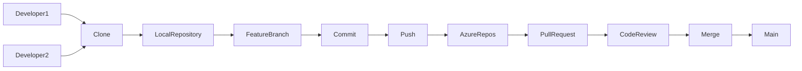

---

## Key Components

| Component | Purpose |
|------------|----------|
| Repository | Stores source code |
| Branch | Independent development line |
| Commit | Snapshot of code changes |
| Pull Request | Request to merge code |
| Branch Policy | Controls merge quality |
| Tags | Mark important versions |
| Permissions | Control repository access |

---

## Types

### Git Repository

- Distributed Version Control System (DVCS)
- Most widely used
- Supports offline commits
- Recommended for modern development

> Azure DevOps also supports TFVC (Team Foundation Version Control), but Git is the standard in almost all modern organizations.

---

## Lifecycle / Workflow

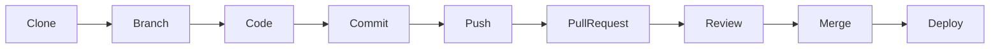

Development workflow:

1. Clone repository
2. Create feature branch
3. Write code
4. Commit changes
5. Push branch
6. Create Pull Request
7. Code review
8. Merge to main branch
9. Pipeline starts automatically

---

## Configuration / Syntax

### Clone Repository

```bash
git clone https://dev.azure.com/organization/project/_git/repository
```

---

### Configure Git User

```bash
git config --global user.name "Akshay"

git config --global user.email "user@example.com"
```

---

### View Remote Repository

```bash
git remote -v
```

---

## Important Commands

| Command | Description |
|----------|-------------|
| `git clone` | Clone repository |
| `git status` | Show working directory status |
| `git add` | Stage changes |
| `git commit` | Save changes locally |
| `git push` | Upload changes |
| `git pull` | Download latest changes |
| `git fetch` | Fetch remote changes |
| `git log` | Show commit history |
| `git diff` | Show code differences |
| `git remote -v` | Display remote repository |

---

## Important Files

| File | Purpose |
|------|---------|
| `.git` | Git metadata directory |
| `.gitignore` | Ignore unnecessary files |
| `.gitattributes` | Define Git file handling |

---

## Real-World Use Cases

- Enterprise application development
- Infrastructure as Code (Terraform)
- Kubernetes manifests
- Helm charts
- CI/CD pipeline YAML files
- Configuration management
- Team collaboration

---

## Advantages

- Unlimited private repositories
- Git-based collaboration
- Secure access
- Azure DevOps integration
- Supports branch policies
- Supports pull requests
- Complete commit history

---

## Limitations

- Learning curve for Git beginners
- Merge conflicts require resolution
- Repository permissions require proper planning

---

## Common Interview Questions (Concept Only)

- What is Azure Repos?
- How does Azure Repos differ from GitHub?
- What is a Git repository?
- Explain the Git workflow.
- Why is source control important?

---

## Common Mistakes

- Committing directly to the main branch.
- Storing secrets in repositories.
- Ignoring `.gitignore`.
- Not pulling latest changes before pushing.

---

## Troubleshooting

| Problem | Solution |
|----------|----------|
| Authentication failed | Verify PAT or SSH key |
| Merge conflict | Resolve conflicts manually |
| Repository not found | Verify repository URL and permissions |
| Push rejected | Pull latest changes and resolve conflicts |

---

## Summary

Azure Repos provides secure Git repositories for collaborative software development and integrates seamlessly with Azure DevOps services.

---

# Git Repositories

## Overview

A Git repository is a storage location that contains:

- Source code
- Commit history
- Branches
- Tags
- Configuration
- Version history

Every change made to the repository is recorded as a commit.

---

## Why It Is Used

Git repositories enable:

- Version control
- Team collaboration
- Backup of source code
- Rollback to previous versions
- Parallel development using branches

---

## Architecture / Working

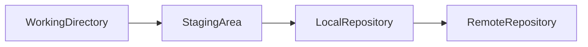

---

## Key Components

| Component | Purpose |
|------------|----------|
| Working Directory | Current project files |
| Staging Area | Files ready for commit |
| Local Repository | Local Git history |
| Remote Repository | Shared repository on Azure Repos |

---

## Lifecycle / Workflow

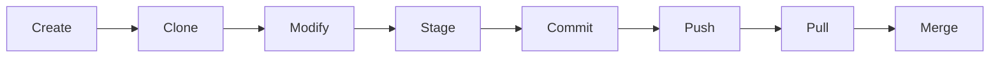

---

## Configuration / Syntax

Initialize repository:

```bash
git init
```

Clone existing repository:

```bash
git clone <repository-url>
```

---

## Important Commands

```bash
git init
git clone
git status
git add
git commit
git push
git pull
git fetch
git log
```

---

## Important Files

```text
.git/
.gitignore
.gitattributes
```

---

## Real-World Use Cases

- Java applications
- .NET applications
- Terraform code
- Kubernetes manifests
- Helm charts
- Ansible playbooks

---

## Advantages

- Distributed version control
- Offline commits
- Fast branching
- Easy collaboration

---

## Limitations

- Merge conflicts
- Requires Git knowledge

---

## Common Interview Questions (Concept Only)

- What is a Git repository?
- Difference between local and remote repository?
- What is the staging area?

---

## Common Mistakes

- Forgetting to commit changes.
- Committing build artifacts.
- Tracking unnecessary files.

---

## Troubleshooting

| Problem | Solution |
|----------|----------|
| Detached HEAD | Checkout a valid branch |
| Repository corrupted | Clone again if necessary |

---

## Summary

A Git repository stores source code and complete version history, enabling collaboration and version control.

---

# Clone Repository

## Overview

Cloning creates a complete local copy of a remote Git repository, including:

- Branches
- Commit history
- Tags
- Repository configuration

---

## Why It Is Used

Developers clone repositories to:

- Start development
- Access project history
- Work locally
- Push changes later

---

## Architecture / Working

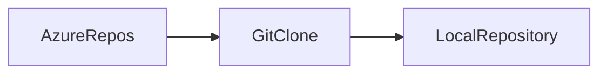

---

## Lifecycle / Workflow

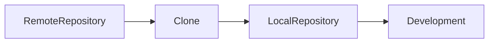

---

## Configuration / Syntax

HTTPS:

```bash
git clone https://dev.azure.com/org/project/_git/repository
```

SSH:

```bash
git clone git@ssh.dev.azure.com:v3/org/project/repository
```

---

## Important Commands

```bash
git clone
git remote -v
git pull
git fetch
```

---

## Real-World Use Cases

- New developer onboarding
- CI/CD agents cloning code
- Local development

---

## Advantages

- Complete project history
- Easy collaboration

---

## Limitations

- Large repositories take longer to clone

---

## Common Interview Questions (Concept Only)

- What happens during `git clone`?
- Difference between clone and pull?

---

## Common Mistakes

- Using incorrect repository URL.
- Forgetting authentication.

---

## Troubleshooting

| Problem | Solution |
|----------|----------|
| Authentication failed | Verify PAT or SSH key |
| Repository not found | Verify URL and permissions |

---

## Summary

Cloning creates a complete local copy of a remote repository for development.

---

# Branching

## Overview

A branch is an independent line of development that allows developers to work on features or fixes without affecting the main codebase.

---

## Why It Is Used

Branching enables:

- Parallel development
- Feature isolation
- Bug fixes
- Safe experimentation
- Easier collaboration

---

## Architecture / Working

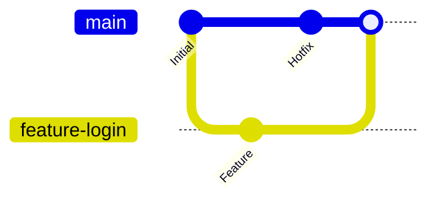

---

## Types

| Branch | Purpose |
|---------|----------|
| main | Production-ready code |
| develop | Integration branch (Git Flow) |
| feature | New features |
| bugfix | Bug fixes |
| hotfix | Critical production fixes |
| release | Release preparation |

> **Interview Point**
>
> Many organizations use **main + feature branches** instead of the full Git Flow model for simplicity.

---

## Lifecycle / Workflow

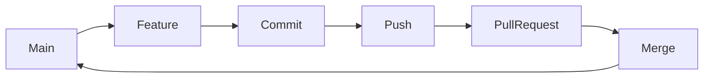

---

## Configuration / Syntax

Create branch:

```bash
git branch feature-login
```

Switch branch:

```bash
git checkout feature-login
```

Create and switch:

```bash
git checkout -b feature-login
```

Using the newer command:

```bash
git switch -c feature-login
```

---

## Important Commands

```bash
git branch
git checkout
git switch
git merge
git rebase
git branch -d
```

---

## Real-World Use Cases

- New feature development
- Production bug fixes
- Release preparation

---

## Advantages

- Safe development
- Parallel work
- Easy rollback

---

## Limitations

- Merge conflicts
- Branch management overhead

---

## Common Interview Questions (Concept Only)

- What is branching?
- Why use feature branches?
- Difference between merge and rebase?
- What is Git Flow?

---

## Common Mistakes

- Long-lived feature branches.
- Working directly on main.
- Forgetting to pull latest changes.

---

## Troubleshooting

| Problem | Solution |
|----------|----------|
| Merge conflicts | Resolve conflicts before merging |
| Wrong branch | Switch to correct branch |

---

## Summary

Branching allows isolated development, enabling multiple developers to work simultaneously without affecting stable code.

---

# Commits

## Overview

A commit is a snapshot of the repository at a specific point in time.

Each commit records:

- Code changes
- Author
- Timestamp
- Commit message

---

## Why It Is Used

Commits help:

- Track changes
- Restore previous versions
- Understand development history
- Audit code changes

---

## Architecture / Working

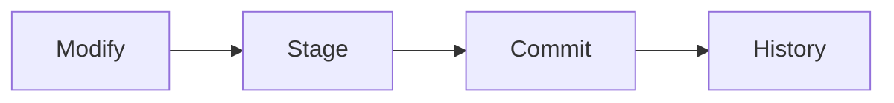

---

## Lifecycle / Workflow

```mermaid
flowchart LR

Code --> git add --> git commit --> git push
```

---

## Configuration / Syntax

```bash
git add .

git commit -m "Add login feature"
```

---

## Important Commands

```bash
git add
git commit
git log
git show
git reset
git revert
```

---

## Real-World Use Cases

- Feature development
- Bug fixes
- Infrastructure changes

---

## Advantages

- Version history
- Easy rollback
- Traceability

---

## Limitations

- Poor commit messages reduce clarity

---

## Common Interview Questions (Concept Only)

- What is a commit?
- Difference between commit and push?
- What information does a commit contain?

---

## Common Mistakes

- Large commits containing unrelated changes.
- Vague commit messages like "Update".

---

## Troubleshooting

| Problem | Solution |
|----------|----------|
| Forgot file | Stage and commit again |
| Wrong commit | Use `git revert` or `git reset` appropriately |

---

## Summary

Commits capture incremental changes and provide a complete history of a project's evolution.

---

# Pull Requests

## Overview

A Pull Request (PR) is a request to merge code from one branch into another after review and validation.

It is a key collaboration feature in Azure Repos.

---

## Why It Is Used

Pull Requests provide:

- Code reviews
- Automated validation
- Team collaboration
- Quality assurance
- Controlled merging

---

## Architecture / Working

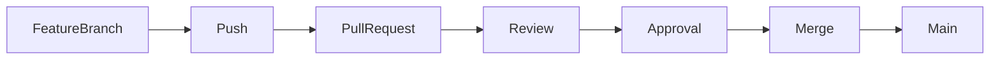

---

## Key Components

| Component | Purpose |
|------------|----------|
| Source Branch | Branch containing changes |
| Target Branch | Branch to receive changes |
| Reviewers | Review code |
| Comments | Discuss changes |
| Build Validation | Run CI checks |
| Merge | Combine changes |

---

## Lifecycle / Workflow

1. Create feature branch.
2. Commit changes.
3. Push branch.
4. Create Pull Request.
5. Review code.
6. Run validation pipeline.
7. Approve PR.
8. Merge into target branch.

---

## Real-World Use Cases

- Feature development
- Bug fixes
- Infrastructure updates
- Terraform changes
- Kubernetes YAML reviews

---

## Advantages

- Improves code quality
- Encourages collaboration
- Prevents direct production changes

---

## Limitations

- Can slow delivery if reviews are delayed

---

## Common Interview Questions (Concept Only)

- What is a Pull Request?
- Why are Pull Requests important?
- What happens before a Pull Request is merged?

---

## Common Mistakes

- Creating very large PRs.
- Merging without review.
- Ignoring failed build validations.

---

## Troubleshooting

| Problem | Solution |
|----------|----------|
| Merge blocked | Complete required reviews or fix failed checks |
| Merge conflicts | Resolve conflicts and update the PR |

---

## Summary

Pull Requests enforce collaboration and quality checks before code is merged into shared branches.

---

# Branch Policies

## Overview

Branch Policies are rules applied to branches (typically `main`) to ensure code quality and protect important branches from unsafe changes.

---

## Why It Is Used

Branch Policies help:

- Prevent direct pushes
- Enforce code reviews
- Require successful builds
- Maintain repository quality

---

## Key Components

| Policy | Purpose |
|----------|----------|
| Minimum reviewers | Require code reviews |
| Build validation | Ensure CI passes |
| Comment resolution | Resolve discussions before merge |
| Work item linking | Link code to tracked work |
| Merge strategy | Control merge behavior |

---

## Architecture / Working

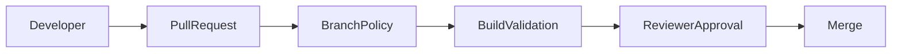

---

## Real-World Use Cases

- Protect production branches
- Enforce CI validation
- Ensure peer reviews

---

## Advantages

- Better code quality
- Improved security
- Reduced production issues

---

## Limitations

- Can delay merges if policies are too strict

---

## Common Interview Questions (Concept Only)

- What are Branch Policies?
- Why require build validation?
- Why block direct pushes to `main`?

---

## Common Mistakes

- Disabling required reviewers.
- Allowing direct commits to protected branches.

---

## Troubleshooting

| Problem | Solution |
|----------|----------|
| Cannot merge | Satisfy all required branch policies |
| Build validation failed | Fix pipeline errors and retry |

---

## Summary

Branch Policies protect critical branches by enforcing reviews, validations, and merge requirements.

---

# Repository Permissions

## Overview

Repository Permissions control who can access and perform actions within an Azure Repos Git repository.

Azure DevOps uses **Role-Based Access Control (RBAC)** to manage these permissions.

---

## Why It Is Used

Permissions help:

- Protect source code
- Restrict sensitive operations
- Support least privilege access
- Control collaboration

---

## Architecture / Working

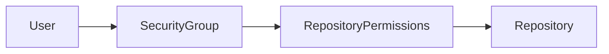

---

## Key Components

| Permission | Description |
|------------|-------------|
| Read | View repository |
| Contribute | Push commits |
| Create Branch | Create new branches |
| Create Tag | Create tags |
| Force Push | Rewrite history (avoid in production) |
| Delete Repository | Remove repository |
| Manage Permissions | Modify repository security |

---

## Types

### Built-in Security Groups

| Group | Typical Access |
|--------|----------------|
| Project Administrators | Full control |
| Contributors | Read, clone, push, create branches |
| Readers | Read-only access |
| Build Service | Used by pipelines |

---

## Real-World Use Cases

- Developers contribute code.
- QA teams have read-only access.
- DevOps engineers manage repository settings.
- CI/CD pipelines authenticate through service accounts.

---

## Advantages

- Fine-grained access control
- Improved security
- Supports enterprise governance

---

## Limitations

- Complex permission inheritance in large projects
- Misconfigured permissions can block development

---

## Common Interview Questions (Concept Only)

- How are repository permissions managed in Azure DevOps?
- What is the difference between Reader and Contributor?
- Why should Force Push be restricted?
- How does RBAC improve repository security?

---

## Common Mistakes

- Granting excessive permissions to all users.
- Allowing Force Push on protected branches.
- Ignoring inherited permissions.

---

## Troubleshooting

| Problem | Solution |
|----------|----------|
| User cannot push | Verify Contributor permission |
| User cannot clone | Check Read permission and authentication |
| Pipeline cannot access repository | Verify Build Service permissions |
| Permission changes not taking effect | Review inherited permissions and group membership |

---

## Summary

Repository Permissions use RBAC to secure Azure Repos by controlling who can read, contribute, manage branches, and administer repositories. Proper permission management is essential for secure and efficient team collaboration.
