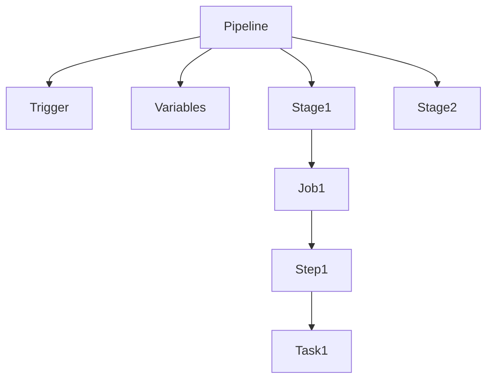
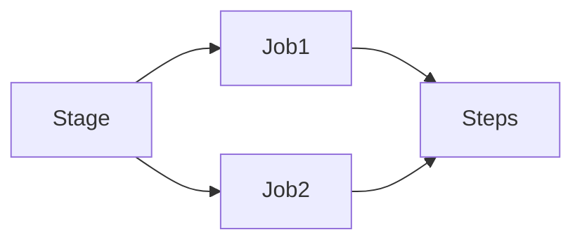
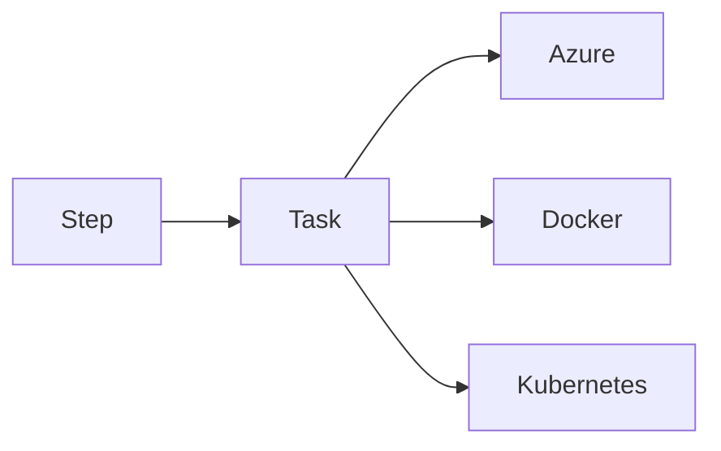
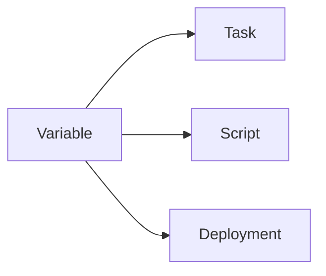
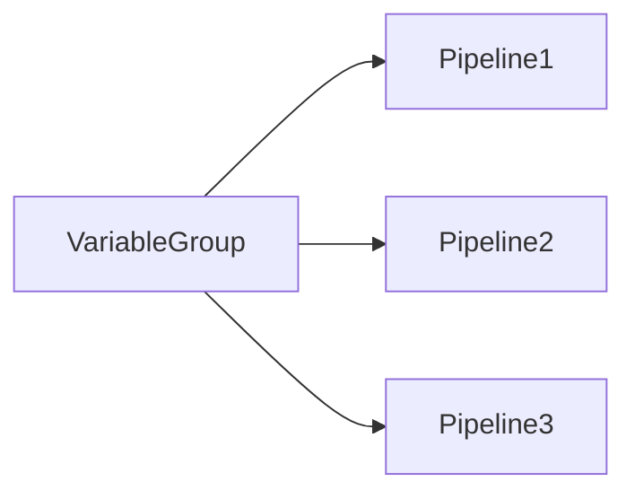
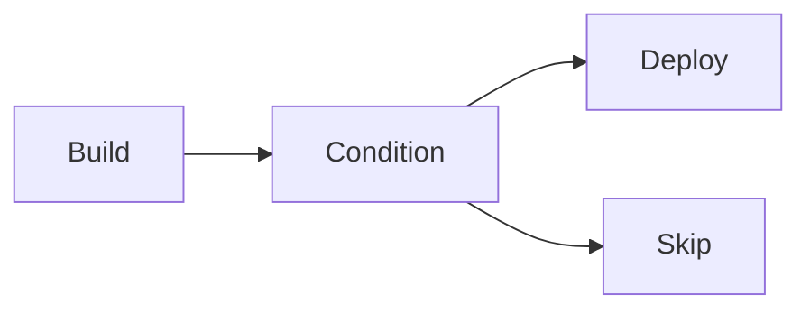
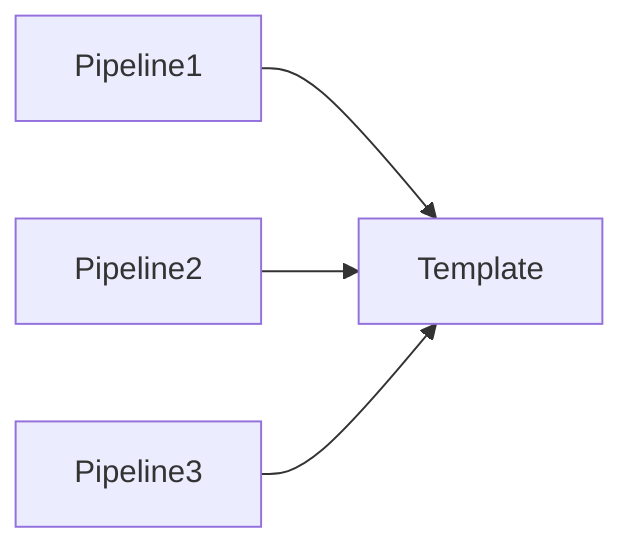

# Azure Pipeline YAML

## Overview

Azure Pipeline YAML is a **Pipeline as Code** approach where the entire CI/CD pipeline is defined using a YAML file (`azure-pipelines.yml`) stored in the source code repository.

Instead of configuring pipelines through the Azure DevOps UI, developers define the pipeline in code, making it version-controlled, reusable, and easier to maintain.

> **Interview Point**
>
> YAML Pipelines are the **recommended approach** for all modern Azure DevOps projects.

---

## Why It Is Used

Azure Pipeline YAML helps organizations:

- Store pipeline configuration with application code
- Version control pipeline changes
- Enable code reviews for pipeline updates
- Support reusable templates
- Automate CI/CD
- Reduce manual configuration
- Improve consistency across projects

---

## Architecture / Working


---

## Key Components

| Component | Purpose |
|------------|----------|
| Trigger | Starts pipeline |
| Pool | Selects build agent |
| Variables | Store reusable values |
| Stages | High-level phases |
| Jobs | Group of steps |
| Steps | Individual execution units |
| Tasks | Pre-built Azure DevOps operations |
| Scripts | Custom commands |
| Templates | Reusable pipeline code |
| Parameters | Runtime inputs |

---

## Lifecycle / Workflow


---

## Configuration / Syntax

Basic YAML Pipeline

```yaml
trigger:
- main

pool:
  vmImage: ubuntu-latest

steps:
- script: echo "Hello Azure DevOps"
```

---

## Important Commands

Azure Pipeline primarily executes shell or PowerShell commands.

Examples:

```bash
dotnet build

dotnet test

mvn clean install

npm install

terraform init

terraform apply
```

---

## Important Files

| File | Purpose |
|------|---------|
| azure-pipelines.yml | Pipeline definition |
| Dockerfile | Docker image build |
| pom.xml | Maven configuration |
| package.json | Node.js project |
| build.gradle | Gradle project |
| requirements.txt | Python dependencies |

---

## Real-World Use Cases

- CI/CD automation
- Infrastructure deployment
- Docker image creation
- Kubernetes deployment
- Multi-stage application deployment

---

## Advantages

- Pipeline as Code
- Version controlled
- Easy collaboration
- Reusable
- Supports GitOps
- Supports templates

---

## Limitations

- YAML syntax is indentation-sensitive
- Complex pipelines become difficult to manage without templates

---

## Common Interview Questions (Concept Only)

- What is Azure Pipeline YAML?
- Why is YAML preferred over Classic Pipelines?
- Where is the pipeline definition stored?
- What is Pipeline as Code?

---

## Common Mistakes

- Incorrect YAML indentation
- Hardcoding secrets
- Not using templates for repeated logic

---

## Troubleshooting

| Problem | Solution |
|----------|----------|
| YAML syntax error | Validate indentation |
| Pipeline not found | Ensure `azure-pipelines.yml` exists in the repository |
| Trigger not working | Verify trigger configuration |

---

## Summary

Azure Pipeline YAML enables version-controlled, reusable, and automated CI/CD pipelines using a declarative configuration file stored alongside the application code.

---

# Pipeline Structure

## Overview

Every Azure YAML Pipeline follows a hierarchical structure.

```text
Pipeline
 ├── Trigger
 ├── Variables
 ├── Pool
 ├── Stages
 │     ├── Jobs
 │     │      ├── Steps
 │     │      │      ├── Tasks
 │     │      │      └── Scripts
```

Understanding this hierarchy is essential for Azure DevOps interviews.

---

## Why It Is Used

The structure provides:

- Better organization
- Reusability
- Parallel execution
- Easy maintenance
- Multi-stage deployments

---

## Architecture / Working



---

## Key Components

| Component | Description |
|------------|-------------|
| Pipeline | Complete workflow |
| Stage | Major phase |
| Job | Group of steps |
| Step | Single operation |
| Task | Built-in Azure DevOps activity |
| Script | Custom command |

---

## Lifecycle / Workflow


---

## Configuration / Syntax

```yaml
trigger:
- main

pool:
  vmImage: ubuntu-latest

stages:

- stage: Build

  jobs:

  - job: BuildJob

    steps:

    - script: echo "Building"
```

---

## Real-World Use Cases

- Build stage
- Test stage
- Security scan stage
- Deployment stage

---

## Advantages

- Modular
- Easy to scale
- Supports approvals
- Supports parallel jobs

---

## Limitations

- Deep hierarchies can become difficult to manage

---

## Common Interview Questions (Concept Only)

- Explain Azure Pipeline structure.
- Difference between Stage, Job, and Step?
- What is the execution hierarchy?

---

## Common Mistakes

- Putting all logic into a single job
- Mixing deployment and build steps

---

## Troubleshooting

| Problem | Solution |
|----------|----------|
| Job skipped | Verify dependencies |
| Stage skipped | Check conditions |

---

## Summary

Azure Pipelines follow a hierarchical structure consisting of stages, jobs, steps, and tasks, enabling modular and maintainable CI/CD workflows.

---

# Stages

## Overview

A Stage is the highest logical grouping within an Azure Pipeline.

Each stage represents a major phase of the software delivery process.

Examples:

- Build
- Test
- Security Scan
- Deploy Dev
- Deploy QA
- Deploy Production

---

## Why It Is Used

Stages separate different phases of the pipeline and allow approvals, dependencies, and independent execution.

---

## Architecture / Working


---

## Key Components

- Stage Name
- Jobs
- Conditions
- Dependencies
- Approvals

---

## Lifecycle / Workflow


---

## Configuration / Syntax

```yaml
stages:

- stage: Build

- stage: Test

- stage: Deploy
```

---

## Real-World Use Cases

- Development deployment
- QA deployment
- Production deployment
- Security scanning

---

## Advantages

- Modular deployment
- Approval support
- Parallel execution

---

## Limitations

- Excessive stages increase complexity

---

## Common Interview Questions (Concept Only)

- What is a Stage?
- Can stages run in parallel?
- How are stages dependent on each other?

---

## Common Mistakes

- Combining all environments into one stage
- Ignoring stage dependencies

---

## Troubleshooting

| Problem | Solution |
|----------|----------|
| Stage skipped | Verify conditions and dependencies |
| Stage failed | Review logs |

---

## Summary

Stages divide the pipeline into major phases such as Build, Test, and Deploy, improving organization and deployment control.

---

# Jobs

## Overview

A Job is a collection of steps executed on a single agent.

Each job runs independently.

---

## Why It Is Used

Jobs help:

- Organize work
- Execute tasks
- Run in parallel
- Improve scalability

---

## Architecture / Working



---

## Types

### Agent Job

Runs on Microsoft-hosted or self-hosted agents.

---

### Server Job

Runs directly in Azure DevOps without an agent.

Used for:

- Approvals
- Delays
- Manual validation

---

### Deployment Job

Used specifically for deployments to environments and supports deployment history and environment tracking.

---

## Lifecycle / Workflow


---

## Configuration / Syntax

```yaml
jobs:

- job: BuildJob

  steps:

  - script: echo "Build"
```

---

## Real-World Use Cases

- Build application
- Run tests
- Build Docker image
- Publish artifacts

---

## Advantages

- Parallel execution
- Better organization
- Independent execution

---

## Limitations

- Separate agents do not automatically share files

---

## Common Interview Questions (Concept Only)

- What is a Job?
- Difference between Stage and Job?
- Can jobs run in parallel?
- What is a Deployment Job?

---

## Common Mistakes

- Assuming jobs share workspace automatically
- Creating unnecessary jobs

---

## Troubleshooting

| Problem | Solution |
|----------|----------|
| Job timeout | Increase timeout or optimize tasks |
| Job cannot find files | Publish and download artifacts between jobs |

---

## Summary

Jobs are execution units within stages and contain one or more steps that run on an agent or server.

---

# Steps

## Overview

A Step is the smallest execution unit inside a Job.

Each step performs one action.

---

## Why It Is Used

Steps make pipelines modular and readable.

Examples:

- Run script
- Copy files
- Install packages
- Execute tests

---

## Architecture / Working


---

## Types

- Script Step
- Task Step
- Checkout Step
- Publish Step
- Download Step

---

## Lifecycle / Workflow


---

## Configuration / Syntax

```yaml
steps:

- script: echo "Hello"

- script: dotnet build
```

---

## Real-World Use Cases

- Build project
- Execute tests
- Deploy application

---

## Advantages

- Simple
- Modular
- Reusable

---

## Limitations

- Too many steps reduce readability

---

## Common Interview Questions (Concept Only)

- What is a Step?
- Difference between Step and Task?

---

## Common Mistakes

- Combining unrelated commands into one step

---

## Troubleshooting

| Problem | Solution |
|----------|----------|
| Step failed | Review logs |
| Command not found | Verify agent image and dependencies |

---

## Summary

Steps represent individual operations within a job and execute sequentially by default.

---

# Tasks

## Overview

Tasks are pre-built Azure DevOps operations that perform common CI/CD activities without requiring custom scripts.

---

## Why It Is Used

Tasks simplify pipeline creation by providing ready-made functionality.

Examples:

- Build
- Copy files
- Publish artifacts
- Azure deployment
- Docker build
- Kubernetes deployment

---

## Architecture / Working



---

## Key Components

| Task | Purpose |
|------|---------|
| Bash | Run Bash commands |
| PowerShell | Run PowerShell scripts |
| Docker | Build and push images |
| AzureCLI | Execute Azure CLI commands |
| PublishBuildArtifacts | Publish build output |
| DownloadBuildArtifacts | Download build artifacts |
| KubernetesManifest | Deploy Kubernetes resources |

---

## Configuration / Syntax

Example:

```yaml
steps:

- task: AzureCLI@2

  inputs:

    azureSubscription: 'My-Service-Connection'

    scriptType: bash

    scriptLocation: inlineScript

    inlineScript: |

      az group list
```

---

## Real-World Use Cases

- Deploy Azure resources
- Push Docker images
- Publish artifacts
- Run Terraform
- Deploy Kubernetes manifests

---

## Advantages

- Easy to use
- Standardized
- Well-tested
- Reduces scripting effort

---

## Limitations

- Some advanced scenarios require custom scripts

---

## Common Interview Questions (Concept Only)

- What is a Task?
- Difference between Task and Script?
- Name common Azure DevOps tasks.

---

## Common Mistakes

- Using scripts where built-in tasks are more appropriate
- Incorrect task version

---

## Troubleshooting

| Problem | Solution |
|----------|----------|
| Task failed | Verify task inputs and logs |
| Authentication error | Check service connection |

---

## Summary

Tasks are reusable, pre-built operations that simplify pipeline creation and reduce custom scripting.

---

# Variables

## Overview

Variables store reusable values that can be referenced throughout a pipeline.

They reduce duplication and make pipelines easier to maintain.

---

## Why It Is Used

Variables help:

- Avoid hardcoding values
- Reuse configuration
- Manage environment-specific settings
- Improve maintainability

---

## Types

| Type | Description |
|------|-------------|
| Pipeline Variable | Defined in YAML or UI |
| System Variable | Provided by Azure DevOps |
| Runtime Variable | Set during execution |
| Secret Variable | Stores sensitive information |

---

## Architecture / Working



---

## Configuration / Syntax

```yaml
variables:

  appName: DemoApp

steps:

- script: echo $(appName)
```

---

## Important Files

```text
azure-pipelines.yml
```

---

## Real-World Use Cases

- Environment names
- Image tags
- Resource groups
- Build configuration

---

## Advantages

- Reusable
- Centralized
- Easy updates

---

## Limitations

- Incorrect variable names cause runtime failures

---

## Common Interview Questions (Concept Only)

- What are pipeline variables?
- Difference between variables and parameters?
- What are system variables?

---

## Common Mistakes

- Hardcoding environment values
- Printing secret variables in logs

---

## Troubleshooting

| Problem | Solution |
|----------|----------|
| Variable empty | Verify name and scope |
| Secret not available | Ensure secret variable is configured correctly |

---

## Summary

Variables store reusable values that improve pipeline flexibility and maintainability.

---

# Variable Groups

## Overview

Variable Groups allow multiple pipelines to share the same set of variables.

They centralize common configuration and secrets.

---

## Why It Is Used

Variable Groups reduce duplication and simplify management across multiple pipelines.

---

## Architecture / Working



---

## Key Components

- Shared Variables
- Secret Variables
- Azure Key Vault Integration

---

## Configuration / Syntax

```yaml
variables:

- group: Production-Variables
```

---

## Real-World Use Cases

- Database connection strings
- API endpoints
- Shared resource names
- Environment configuration

---

## Advantages

- Central management
- Reusable
- Secure secret storage
- Reduces duplication

---

## Limitations

- Changes affect all linked pipelines

---

## Common Interview Questions (Concept Only)

- What is a Variable Group?
- Why use Variable Groups?
- Can Variable Groups store secrets?

---

## Common Mistakes

- Editing shared variables without impact analysis
- Storing secrets as plain text

---

## Troubleshooting

| Problem | Solution |
|----------|----------|
| Variable not found | Verify Variable Group is linked |
| Permission denied | Grant pipeline access to the Variable Group |

---

## Summary

Variable Groups centralize shared variables and secrets, enabling consistent configuration across multiple pipelines.

---

# Conditions

## Overview

Conditions determine **whether** a stage, job, or step should execute.

By default, Azure Pipelines execute the next stage or job only if the previous one succeeds.

---

## Why It Is Used

Conditions enable:

- Conditional execution
- Failure handling
- Environment-specific deployments
- Branch-based deployments

---

## Architecture / Working



---

## Types

| Condition | Purpose |
|-----------|----------|
| `succeeded()` | Run only if previous succeeded |
| `failed()` | Run only if previous failed |
| `always()` | Run regardless of result |
| `succeededOrFailed()` | Run unless canceled |

---

## Configuration / Syntax

```yaml
condition: succeeded()
```

Branch-based condition:

```yaml
condition: eq(variables['Build.SourceBranch'], 'refs/heads/main')
```

---

## Real-World Use Cases

- Deploy only from `main`
- Send notifications on failure
- Skip production deployment for feature branches

---

## Advantages

- Flexible execution
- Better control
- Reduced unnecessary deployments

---

## Limitations

- Complex expressions reduce readability

---

## Common Interview Questions (Concept Only)

- What are Conditions?
- What does `always()` do?
- How do you deploy only from the `main` branch?

---

## Common Mistakes

- Incorrect condition expressions
- Forgetting default `succeeded()` behavior

---

## Troubleshooting

| Problem | Solution |
|----------|----------|
| Stage skipped | Review condition expression |
| Unexpected execution | Verify variable values |

---

## Summary

Conditions control pipeline execution flow based on success, failure, branch, or custom expressions.

---

# Templates

## Overview

Templates enable reusable YAML code that can be shared across multiple pipelines.

Instead of duplicating pipeline definitions, organizations create templates and reference them from different pipelines.

> **Interview Point**
>
> Templates are widely used in enterprise environments to standardize CI/CD processes.

---

## Why It Is Used

Templates provide:

- Code reuse
- Standardization
- Easier maintenance
- Reduced duplication
- Centralized pipeline logic

---

## Architecture / Working



---

## Types

| Template | Purpose |
|-----------|----------|
| Step Template | Reusable steps |
| Job Template | Reusable jobs |
| Stage Template | Reusable stages |
| Variable Template | Shared variables |

---

## Configuration / Syntax

Template (`build-template.yml`)

```yaml
steps:

- script: dotnet build
```

Main Pipeline

```yaml
steps:

- template: build-template.yml
```

---

## Important Files

```text
azure-pipelines.yml

templates/
    build-template.yml
    deploy-template.yml
```

---

## Real-World Use Cases

- Standard build process
- Standard deployment
- Shared security scans
- Shared testing workflows

---

## Advantages

- Reusable
- Easy maintenance
- Consistent pipelines
- Reduced duplication

---

## Limitations

- Too many nested templates reduce readability

---

## Common Interview Questions (Concept Only)

- What are YAML Templates?
- Why use templates?
- What types of templates exist?

---

## Common Mistakes

- Copying pipeline code instead of using templates
- Excessive template nesting

---

## Troubleshooting

| Problem | Solution |
|----------|----------|
| Template not found | Verify file path |
| Parameters missing | Check required template parameters |

---

## Summary

Templates promote reusable, standardized, and maintainable pipeline definitions across multiple projects.

---

# Parameters

## Overview

Parameters are runtime inputs supplied to a pipeline before execution.

Unlike variables, **parameters are evaluated during template compilation**, making them ideal for selecting pipeline behavior or infrastructure before the run starts.

> **Interview Point**
>
> **Variables** can change during pipeline execution, whereas **parameters** are resolved before the pipeline begins running.

---

## Why It Is Used

Parameters help:

- Create reusable pipelines
- Choose environments
- Select deployment targets
- Enable configurable templates

---

## Types

| Type | Description |
|------|-------------|
| String | Text value |
| Number | Numeric value |
| Boolean | True/False |
| Object | Complex data structure |
| Step/Job/Stage List | Reusable pipeline definitions |

---

## Architecture / Working


---

## Configuration / Syntax

```yaml
parameters:

- name: environment

  type: string

  default: dev

steps:

- script: echo ${{ parameters.environment }}
```

---

## Real-World Use Cases

- Choose deployment environment
- Select agent image
- Enable or disable optional stages
- Reuse deployment templates

---

## Advantages

- Flexible pipelines
- Reusable templates
- Strong typing
- Runtime customization

---

## Limitations

- Cannot be modified after pipeline compilation
- Less suitable for values generated during execution

---

## Common Interview Questions (Concept Only)

- What are pipeline parameters?
- Difference between parameters and variables?
- When should you use parameters?

---

## Common Mistakes

- Using parameters when runtime variables are required
- Expecting parameter values to change during execution

---

## Troubleshooting

| Problem | Solution |
|----------|----------|
| Parameter not recognized | Verify declaration and syntax |
| Unexpected value | Check default value and user input |

---

## Summary

Parameters provide strongly typed, compile-time inputs that make Azure Pipelines more reusable, configurable, and suitable for enterprise-scale CI/CD workflows.
