# Build Pipelines (CI)

## Overview

A **Build Pipeline** is the Continuous Integration (CI) component of Azure Pipelines. It automatically retrieves source code, restores dependencies, builds the application, runs automated tests, and generates deployable artifacts whenever code changes are detected.

The primary goal of a Build Pipeline is to ensure that every code change is validated before deployment.

> **Interview Point**
>
> A Build Pipeline **does not deploy** the application. Its primary responsibility is to **produce validated build artifacts** that are later consumed by deployment pipelines.

---

## Why It Is Used

Build Pipelines help organizations:

- Automate software builds
- Detect compilation errors early
- Validate code quality
- Execute automated tests
- Generate deployable packages
- Reduce manual work
- Support Continuous Integration

---

## Architecture / Working


---

## Key Components

| Component | Purpose |
|------------|----------|
| Repository | Stores source code |
| Trigger | Starts pipeline automatically |
| Agent | Executes build jobs |
| Dependencies | Required packages/libraries |
| Build Task | Compiles application |
| Test Task | Executes automated tests |
| Artifact | Packaged build output |
| Variables | Store configurable values |

---

## Lifecycle / Workflow


Pipeline Flow:

1. Developer commits code.
2. Pipeline trigger starts.
3. Repository is checked out.
4. Dependencies are restored.
5. Application is compiled.
6. Automated tests execute.
7. Build artifacts are published.
8. Pipeline completes successfully.

---

## Configuration / Syntax

Example YAML Build Pipeline

```yaml
trigger:
- main

pool:
  vmImage: ubuntu-latest

steps:

- checkout: self

- script: dotnet restore

- script: dotnet build --configuration Release

- script: dotnet test

- task: PublishBuildArtifacts@1
  inputs:
    pathToPublish: '$(Build.ArtifactStagingDirectory)'
    artifactName: 'drop'
```

---

## Important Commands

### .NET

```bash
dotnet restore

dotnet build

dotnet test

dotnet publish
```

### Maven

```bash
mvn clean

mvn compile

mvn test

mvn package
```

### Node.js

```bash
npm install

npm test

npm run build
```

### Python

```bash
pip install -r requirements.txt

pytest
```

---

## Important Files

| File | Purpose |
|------|---------|
| azure-pipelines.yml | Pipeline definition |
| pom.xml | Maven project |
| package.json | Node.js project |
| build.gradle | Gradle project |
| requirements.txt | Python dependencies |
| *.csproj | .NET project |

---

## Real-World Use Cases

- Java application builds
- .NET application builds
- Docker image creation
- Terraform validation
- Kubernetes manifest validation
- Automated testing

---

## Advantages

- Automated builds
- Early error detection
- Faster feedback
- Consistent builds
- Artifact generation
- Improved software quality

---

## Limitations

- Long build times for large projects
- Requires automated testing
- Dependency management complexity

---

## Common Interview Questions (Concept Only)

- What is a Build Pipeline?
- What is Continuous Integration?
- What is produced by a Build Pipeline?
- What happens after a developer commits code?
- Why should builds be automated?

---

## Common Mistakes

- Skipping automated tests
- Publishing incorrect artifacts
- Hardcoding configuration values
- Ignoring build failures

---

## Troubleshooting

| Problem | Solution |
|----------|----------|
| Build failed | Review compilation errors |
| Dependency missing | Restore packages |
| Artifact missing | Verify publish task |
| Build timeout | Optimize build process |

---

## Summary

A Build Pipeline automates the Continuous Integration process by compiling code, running tests, and generating deployment-ready artifacts.

---

# Source Code Integration

## Overview

Source Code Integration is the process of automatically integrating developers' code changes into the shared repository.

Every commit is validated through a Build Pipeline to ensure new changes do not break the application.

This practice is known as **Continuous Integration (CI).**

---

## Why It Is Used

Source Code Integration helps teams:

- Detect integration issues early
- Prevent broken builds
- Improve collaboration
- Validate code automatically
- Reduce merge conflicts

---

## Architecture / Working

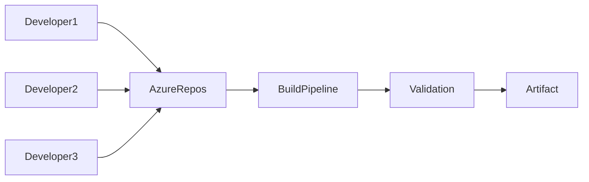

---

## Key Components

| Component | Purpose |
|------------|----------|
| Repository | Stores source code |
| Branch | Isolated development |
| Commit | Code snapshot |
| Merge | Combine code changes |
| Build Pipeline | Validate code |

---

## Lifecycle / Workflow

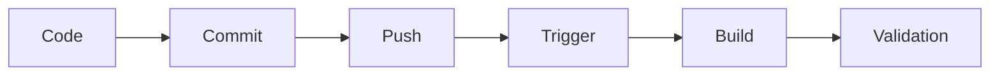

---

## Real-World Use Cases

- Multiple developers working simultaneously
- Feature branch integration
- Daily code integration
- Automated build validation

---

## Advantages

- Early bug detection
- Better collaboration
- Improved software quality

---

## Limitations

- Frequent integrations require reliable automated tests

---

## Common Interview Questions (Concept Only)

- What is Source Code Integration?
- Why is Continuous Integration important?
- What happens after every commit?

---

## Common Mistakes

- Integrating code infrequently
- Skipping code reviews
- Ignoring failed builds

---

## Troubleshooting

| Problem | Solution |
|----------|----------|
| Merge conflicts | Resolve before merging |
| Build failures | Fix compilation or test errors |

---

## Summary

Source Code Integration ensures all code changes are automatically validated before becoming part of the shared codebase.

---

# Restore Dependencies

## Overview

Most applications depend on external libraries or packages.

The **Restore Dependencies** stage downloads these required packages before the application is built.

Without restoring dependencies, the application cannot compile successfully.

---

## Why It Is Used

Dependency restoration:

- Downloads required libraries
- Ensures consistent builds
- Avoids compilation failures
- Supports reproducible builds

---

## Architecture / Working

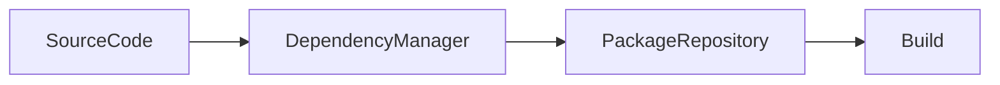

---

## Key Components

| Component | Purpose |
|------------|----------|
| Dependency Manager | Restores packages |
| Package Repository | Stores packages |
| Build Agent | Downloads dependencies |

---

## Types

| Platform | Command |
|----------|----------|
| .NET | `dotnet restore` |
| Maven | `mvn dependency:resolve` |
| Node.js | `npm install` |
| Python | `pip install -r requirements.txt` |

---

## Lifecycle / Workflow

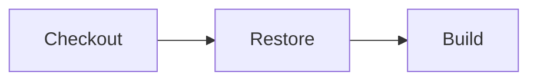

---

## Configuration / Syntax

.NET

```yaml
- script: dotnet restore
```

Node.js

```yaml
- script: npm install
```

Maven

```yaml
- script: mvn dependency:resolve
```

---

## Important Commands

```bash
dotnet restore

npm install

mvn dependency:resolve

pip install -r requirements.txt
```

---

## Real-World Use Cases

- Java applications
- .NET projects
- Node.js applications
- Python automation

---

## Advantages

- Consistent dependencies
- Automated package management
- Reproducible builds

---

## Limitations

- Network dependency for package downloads
- Build failures if repositories are unavailable

---

## Common Interview Questions (Concept Only)

- Why restore dependencies?
- What happens if dependencies are missing?
- Which command restores packages?

---

## Common Mistakes

- Forgetting dependency restoration
- Using outdated package versions

---

## Troubleshooting

| Problem | Solution |
|----------|----------|
| Package not found | Verify package source |
| Restore failed | Check internet or feed access |

---

## Summary

Dependency restoration ensures all required libraries are available before the application build starts.

---

# Build Application

## Overview

The Build Application stage compiles the application's source code into executable binaries or deployment packages.

---

## Why It Is Used

Building the application:

- Detects compilation errors
- Produces executable files
- Validates source code
- Generates deployment packages

---

## Architecture / Working

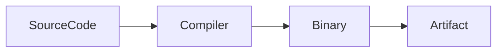

---

## Key Components

| Component | Purpose |
|------------|----------|
| Source Code | Input |
| Compiler | Compiles code |
| Binary | Output |
| Build Configuration | Release/Debug |

---

## Lifecycle / Workflow

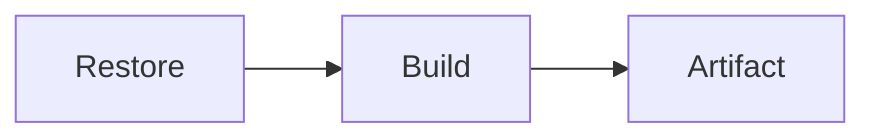

---

## Configuration / Syntax

.NET

```yaml
- script: dotnet build --configuration Release
```

Java

```yaml
- script: mvn package
```

---

## Important Commands

```bash
dotnet build

mvn package

npm run build

go build
```

---

## Real-World Use Cases

- Build web applications
- Create Docker images
- Build APIs
- Generate binaries

---

## Advantages

- Automatic compilation
- Early validation
- Consistent output

---

## Limitations

- Large projects increase build time

---

## Common Interview Questions (Concept Only)

- What happens during the build stage?
- What is generated during compilation?
- Difference between restore and build?

---

## Common Mistakes

- Building without restoring dependencies
- Ignoring compiler warnings

---

## Troubleshooting

| Problem | Solution |
|----------|----------|
| Compilation error | Review build logs |
| Missing SDK | Install required SDK on the agent |

---

## Summary

The Build Application stage compiles source code into deployable binaries while validating application correctness.

---

# Run Tests

## Overview

The Run Tests stage executes automated tests to verify that the application functions correctly before artifacts are published.

Testing is a critical part of Continuous Integration.

---

## Why It Is Used

Testing helps:

- Detect bugs early
- Validate application behavior
- Prevent faulty deployments
- Improve software quality

---

## Architecture / Working

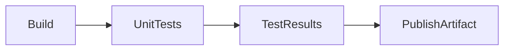

---

## Types

| Test Type | Purpose |
|-----------|----------|
| Unit Test | Test individual components |
| Integration Test | Test interactions between components |
| Functional Test | Validate business functionality |
| Smoke Test | Verify basic functionality |

> **Interview Point**
>
> Unit tests are most commonly executed during the Build Pipeline. More extensive integration or end-to-end tests may run in later pipeline stages.

---

## Lifecycle / Workflow

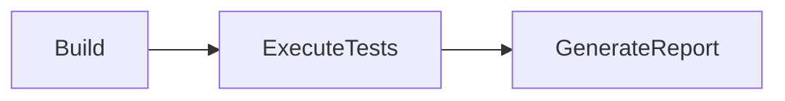

---

## Configuration / Syntax

```yaml
- script: dotnet test
```

Node.js

```yaml
- script: npm test
```

---

## Important Commands

```bash
dotnet test

mvn test

npm test

pytest
```

---

## Real-World Use Cases

- Validate APIs
- Verify microservices
- Test infrastructure code
- Prevent production defects

---

## Advantages

- Early bug detection
- Improved software quality
- Reliable deployments

---

## Limitations

- Poor test coverage reduces effectiveness
- Long-running test suites increase pipeline duration

---

## Common Interview Questions (Concept Only)

- Why run tests in a Build Pipeline?
- What is the difference between unit and integration tests?
- What happens if tests fail?

---

## Common Mistakes

- Skipping tests to save time
- Ignoring failed test reports
- Writing unstable or flaky tests

---

## Troubleshooting

| Problem | Solution |
|----------|----------|
| Tests failed | Review logs and fix code or tests |
| Test framework missing | Install required testing tools |

---

## Summary

Running automated tests ensures application quality before artifacts are created and deployments begin.

---

# Publish Build Artifacts

## Overview

Build Artifacts are the outputs generated by a successful Build Pipeline.

Publishing artifacts makes these outputs available for deployment pipelines or manual download.

Examples include:

- ZIP packages
- DLL files
- JAR files
- WAR files
- Docker image metadata
- Configuration files

> **Interview Point**
>
> Build once, deploy many. The same validated artifact should be promoted through Dev, QA, Staging, and Production without rebuilding.

---

## Why It Is Used

Publishing artifacts:

- Stores build outputs
- Supports deployment pipelines
- Enables artifact reuse
- Maintains deployment consistency

---

## Architecture / Working

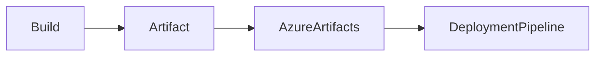

---

## Key Components

| Component | Purpose |
|------------|----------|
| Build Output | Generated files |
| Artifact Storage | Stores artifacts |
| Release Pipeline | Downloads artifacts |

---

## Lifecycle / Workflow

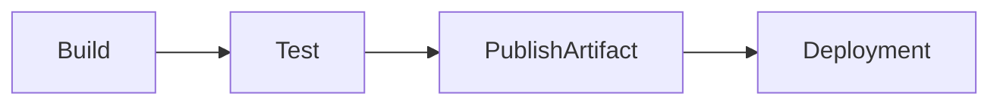

---

## Configuration / Syntax

```yaml
- task: PublishBuildArtifacts@1

  inputs:

    pathToPublish: '$(Build.ArtifactStagingDirectory)'

    artifactName: 'drop'
```

---

## Important Commands

Artifacts are usually published using built-in tasks rather than CLI commands.

---

## Important Files

```text
$(Build.ArtifactStagingDirectory)
```

---

## Real-World Use Cases

- Publish application packages
- Publish Terraform plans
- Publish deployment manifests
- Store Helm charts

---

## Advantages

- Reusable
- Versioned
- Reliable deployments
- Supports rollback

---

## Limitations

- Large artifacts increase storage requirements

---

## Common Interview Questions (Concept Only)

- What are Build Artifacts?
- Why publish artifacts?
- Where are artifacts used?

---

## Common Mistakes

- Publishing unnecessary files
- Forgetting to publish deployment packages

---

## Troubleshooting

| Problem | Solution |
|----------|----------|
| Artifact missing | Verify publish task |
| Artifact corrupted | Validate build output before publishing |

---

## Summary

Publishing Build Artifacts creates reusable deployment packages that can be consistently promoted across environments.

---

# Build Triggers

## Overview

Build Triggers define when a Build Pipeline starts automatically.

They enable Continuous Integration by launching builds based on specific events.

---

## Why It Is Used

Triggers:

- Automate builds
- Reduce manual effort
- Validate every code change
- Improve developer feedback

---

## Architecture / Working

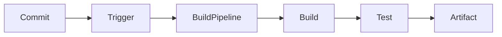

---

## Types

### Continuous Integration (CI) Trigger

Starts a build after every commit.

```yaml
trigger:
- main
```

---

### Pull Request (PR) Trigger

Runs validation builds for Pull Requests.

```yaml
pr:
- main
```

---

### Scheduled Trigger

Executes builds at predefined times.

```yaml
schedules:
- cron: "0 2 * * *"
```

---

### Manual Trigger

Started manually by a user through the Azure DevOps portal or CLI.

---

### Pipeline Completion Trigger

Starts a build after another pipeline completes successfully.

---

## Lifecycle / Workflow


---

## Configuration / Syntax

CI Trigger

```yaml
trigger:
- main
```

Branch Filter

```yaml
trigger:
  branches:
    include:
      - main
      - develop
    exclude:
      - experimental/*
```

PR Trigger

```yaml
pr:
- main
```

---

## Real-World Use Cases

- Validate every commit
- Build feature branches
- Nightly builds
- Validate Pull Requests
- Trigger downstream pipelines

---

## Advantages

- Fully automated
- Fast feedback
- Consistent validation
- Reduced manual intervention

---

## Limitations

- Poor trigger configuration can cause unnecessary pipeline runs
- Frequent builds increase agent consumption

---

## Common Interview Questions (Concept Only)

- What is a Build Trigger?
- Difference between CI Trigger and PR Trigger?
- What is a Scheduled Trigger?
- When would you use a Pipeline Completion Trigger?

---

## Common Mistakes

- Triggering builds for all branches unnecessarily
- Not validating Pull Requests
- Ignoring branch filters

---

## Troubleshooting

| Problem | Solution |
|----------|----------|
| Build not starting | Verify trigger configuration and branch filters |
| Unexpected builds | Review include/exclude branch settings |
| PR build not running | Check PR trigger configuration and branch policies |

---

## Summary

Build Triggers automatically start Build Pipelines based on events such as commits, pull requests, schedules, manual execution, or the completion of other pipelines, enabling efficient and reliable Continuous Integration.
