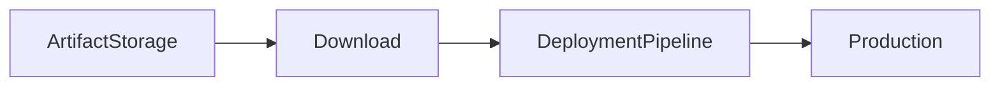

# Artifacts

## Overview

Artifacts are the files or packages generated during the Build Pipeline that are stored and later used by deployment pipelines or other applications.

Artifacts ensure that the **same validated build output** is deployed across all environments without rebuilding the application.

Examples of artifacts:

- ZIP packages
- JAR files
- WAR files
- DLL files
- EXE files
- Docker image metadata
- Helm charts
- Kubernetes manifests
- Terraform plans

> **Interview Point**
>
> One of the core DevOps principles is **Build Once, Deploy Many**. Build the application once, create an artifact, and deploy that same artifact to Development, QA, Staging, and Production.

---

## Why It Is Used

Artifacts help organizations:

- Store build outputs
- Reuse deployment packages
- Maintain deployment consistency
- Enable rollback
- Improve traceability
- Separate build and deployment processes

---

## Architecture / Working


---

## Key Components

| Component | Purpose |
|------------|----------|
| Source Code | Application source |
| Build Pipeline | Generates artifact |
| Artifact | Deployment package |
| Artifact Storage | Stores artifacts |
| Release Pipeline | Downloads artifact |
| Environment | Deployment target |

---

## Types

### Build Artifacts

Generated during a Build Pipeline.

Examples:

- ZIP
- DLL
- JAR
- WAR

---

### Azure Artifacts

Package management service.

Stores:

- NuGet
- npm
- Maven
- Python
- Universal Packages

---

### Pipeline Artifacts

Optimized artifact storage for Azure Pipelines.

Designed for:

- Faster uploads
- Faster downloads
- Better pipeline performance

> **Interview Point**
>
> **Pipeline Artifacts** are generally preferred over **Build Artifacts** for Azure Pipelines because they provide better performance and lower storage overhead.

---

## Lifecycle / Workflow


---

## Configuration / Syntax

Publish Pipeline Artifact

```yaml
steps:

- publish: $(Build.ArtifactStagingDirectory)

  artifact: drop
```

Download Pipeline Artifact

```yaml
steps:

- download: current

  artifact: drop
```

---

## Important Commands

Artifacts are generally managed using built-in pipeline tasks.

Azure CLI example:

```bash
az artifacts universal publish

az artifacts universal download
```

---

## Important Files

| File | Purpose |
|------|---------|
| azure-pipelines.yml | Pipeline definition |
| $(Build.ArtifactStagingDirectory) | Temporary artifact staging directory |
| $(Pipeline.Workspace) | Downloaded artifact location |

---

## Real-World Use Cases

- Deploy web applications
- Store Docker manifests
- Publish Helm charts
- Store Terraform plans
- Deploy Kubernetes YAML
- Package enterprise applications

---

## Advantages

- Reusable deployments
- Version tracking
- Easy rollback
- Faster deployments
- Separation of CI and CD

---

## Limitations

- Large artifacts require additional storage
- Artifact retention policies must be managed
- Sensitive data should never be included in artifacts

---

## Common Interview Questions (Concept Only)

- What is an Artifact?
- Why are artifacts important?
- What is the Build Once, Deploy Many principle?
- Where are artifacts stored?
- Difference between Build Artifacts and Pipeline Artifacts?

---

## Common Mistakes

- Rebuilding applications for every environment
- Publishing unnecessary files
- Including secrets in artifacts
- Forgetting artifact cleanup

---

## Troubleshooting

| Problem | Solution |
|----------|----------|
| Artifact missing | Verify publish step |
| Download failed | Verify artifact name |
| Incorrect artifact version | Verify build number |
| Storage issue | Configure retention policy |

---

## Summary

Artifacts are deployment-ready outputs generated during CI and reused across deployment environments, ensuring consistency, reliability, and traceability.

---

# Build Artifacts

## Overview

Build Artifacts are the output generated by a successful Build Pipeline.

They are stored in Azure DevOps and later consumed by deployment pipelines.

Examples:

- ZIP files
- DLL files
- Executables
- Configuration files

---

## Why It Is Used

Build Artifacts:

- Preserve build output
- Enable deployment
- Support rollback
- Separate build and deployment

---

## Architecture / Working


---

## Key Components

| Component | Purpose |
|------------|----------|
| Build Output | Application files |
| Artifact Storage | Stores artifacts |
| Release Pipeline | Downloads artifacts |

---

## Lifecycle / Workflow


---

## Configuration / Syntax

Classic Build Artifact Task

```yaml
- task: PublishBuildArtifacts@1

  inputs:

    pathToPublish: '$(Build.ArtifactStagingDirectory)'

    artifactName: 'drop'
```

---

## Important Commands

Build Artifacts are primarily managed using Azure DevOps tasks rather than command-line tools.

---

## Important Files

```text
$(Build.ArtifactStagingDirectory)
```

---

## Real-World Use Cases

- ASP.NET deployments
- Java deployments
- Desktop applications
- Legacy deployment workflows

---

## Advantages

- Easy deployment
- Version tracking
- Supports rollback

---

## Limitations

- Slower than Pipeline Artifacts
- Mainly intended for classic build/release scenarios

---

## Common Interview Questions (Concept Only)

- What are Build Artifacts?
- Why publish Build Artifacts?
- Difference between Build Artifacts and Pipeline Artifacts?

---

## Common Mistakes

- Publishing temporary files
- Forgetting artifact versioning

---

## Troubleshooting

| Problem | Solution |
|----------|----------|
| Artifact missing | Verify publish task |
| Publish failed | Check artifact staging directory |

---

## Summary

Build Artifacts package the outputs of a successful build so they can be deployed consistently across environments.

---

# Azure Artifacts

## Overview

Azure Artifacts is Azure DevOps' package management service.

It allows organizations to create secure package feeds and share packages across projects and teams.

Supported package types include:

- NuGet
- npm
- Maven
- Python (PyPI)
- Universal Packages

> **Interview Point**
>
> Azure Artifacts stores **packages**, whereas Build/Pipeline Artifacts store **deployment outputs**.

---

## Why It Is Used

Azure Artifacts helps:

- Share reusable libraries
- Manage package versions
- Secure package distribution
- Reduce dependency on public repositories

---

## Architecture / Working


---

## Key Components

| Component | Purpose |
|------------|----------|
| Feed | Package repository |
| Package | Versioned library |
| Upstream Source | Connects to public package repositories |
| Consumer | Pipeline or application |

---

## Types

| Package Type | Example |
|--------------|----------|
| NuGet | .NET |
| npm | Node.js |
| Maven | Java |
| Python | PyPI |
| Universal Package | Generic files |

---

## Lifecycle / Workflow


---

## Configuration / Syntax

Publish Universal Package

```bash
az artifacts universal publish \
  --organization https://dev.azure.com/<organization> \
  --feed MyFeed \
  --name MyPackage \
  --version 1.0.0 \
  --path .
```

Restore packages is usually handled by the package manager:

```bash
dotnet restore

npm install

mvn dependency:resolve
```

---

## Important Commands

```bash
az artifacts universal publish

az artifacts universal download

dotnet restore

npm install

mvn dependency:resolve
```

---

## Important Files

| File | Purpose |
|------|---------|
| nuget.config | NuGet feed configuration |
| package.json | npm dependencies |
| pom.xml | Maven dependencies |
| requirements.txt | Python dependencies |

---

## Real-World Use Cases

- Share internal libraries
- Private npm packages
- Internal NuGet feeds
- Enterprise package management

---

## Advantages

- Secure package feeds
- Version management
- Supports multiple package types
- Azure DevOps integration

---

## Limitations

- Storage quotas apply
- Requires feed permission management

---

## Common Interview Questions (Concept Only)

- What is Azure Artifacts?
- What package types are supported?
- Difference between Azure Artifacts and Build Artifacts?
- What is an Artifact Feed?

---

## Common Mistakes

- Publishing unstable package versions
- Granting excessive feed permissions
- Not using semantic versioning

---

## Troubleshooting

| Problem | Solution |
|----------|----------|
| Package restore failed | Verify feed authentication |
| Feed inaccessible | Check permissions |
| Version conflict | Publish a new package version instead of overwriting |

---

## Summary

Azure Artifacts is a package management service that securely stores, versions, and distributes reusable software packages.

---

# Publish Artifacts

## Overview

Publishing Artifacts is the process of storing build outputs after a successful build so that they can be reused in later pipeline stages or deployment pipelines.

---

## Why It Is Used

Publishing ensures:

- Build outputs are preserved
- Deployments use validated packages
- Multiple environments use the same artifact
- Rollback is possible

---

## Architecture / Working


---

## Lifecycle / Workflow


---

## Configuration / Syntax

### Publish Pipeline Artifact (Recommended)

```yaml
steps:

- publish: $(Build.ArtifactStagingDirectory)

  artifact: drop
```

### Publish Build Artifact (Legacy)

```yaml
steps:

- task: PublishBuildArtifacts@1

  inputs:

    pathToPublish: '$(Build.ArtifactStagingDirectory)'

    artifactName: 'drop'
```

---

## Important Commands

Publishing is typically performed using built-in YAML keywords or tasks.

---

## Important Files

```text
$(Build.ArtifactStagingDirectory)
```

---

## Real-World Use Cases

- Store application packages
- Publish Helm charts
- Publish Terraform plans
- Publish deployment manifests

---

## Advantages

- Reusable deployments
- Version control
- Reliable releases

---

## Limitations

- Storage management required

---

## Common Interview Questions (Concept Only)

- Why publish artifacts?
- What happens after publishing?
- What is the difference between PublishBuildArtifacts and Pipeline Artifacts?

---

## Common Mistakes

- Publishing unnecessary files
- Publishing secrets
- Not cleaning staging directories

---

## Troubleshooting

| Problem | Solution |
|----------|----------|
| Publish failed | Verify staging directory |
| Empty artifact | Confirm build output exists before publishing |

---

## Summary

Publishing artifacts stores validated build outputs so they can be reused consistently across deployment environments.

---

# Consume Artifacts

## Overview

Consuming Artifacts is the process of downloading previously published artifacts and using them during deployment or another pipeline.

Deployment Pipelines should consume existing artifacts instead of rebuilding the application.

---

## Why It Is Used

Consuming artifacts:

- Ensures deployment consistency
- Reduces build time
- Prevents rebuilding
- Supports rollback

---

## Architecture / Working



---

## Lifecycle / Workflow


---

## Configuration / Syntax

Download Pipeline Artifact

```yaml
steps:

- download: current

  artifact: drop
```

Download using a task

```yaml
steps:

- task: DownloadPipelineArtifact@2

  inputs:

    artifact: drop
    path: $(Pipeline.Workspace)
```

---

## Important Commands

```bash
az artifacts universal download
```

---

## Important Files

| File | Purpose |
|------|---------|
| $(Pipeline.Workspace) | Download location |
| azure-pipelines.yml | Pipeline definition |

---

## Real-World Use Cases

- Production deployment
- Disaster recovery
- Rollback deployment
- Multi-stage pipelines

---

## Advantages

- Faster deployments
- Consistent releases
- Improved traceability
- Reduced build overhead

---

## Limitations

- Deployment depends on artifact availability
- Artifact retention policies must be managed

---

## Common Interview Questions (Concept Only)

- What does it mean to consume an artifact?
- Why should deployment pipelines download artifacts instead of rebuilding?
- Where are downloaded Pipeline Artifacts stored?
- How do Pipeline Artifacts support rollback?

---

## Common Mistakes

- Rebuilding instead of downloading artifacts
- Downloading the wrong artifact version
- Not validating artifact integrity before deployment

---

## Troubleshooting

| Problem | Solution |
|----------|----------|
| Download failed | Verify artifact name and permissions |
| Artifact not found | Confirm it was published successfully |
| Incorrect version deployed | Verify build number or artifact version selection |
| Download path incorrect | Check `$(Pipeline.Workspace)` and task configuration |

---

## Summary

Consuming Artifacts enables deployment pipelines to download and deploy previously validated build outputs, ensuring consistent, reliable, and repeatable software releases across all environments.
