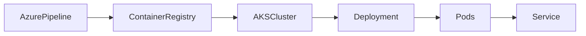
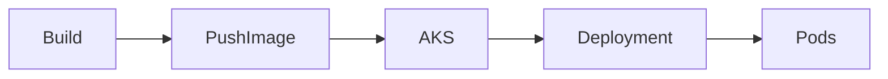
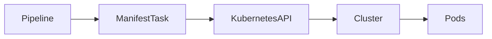
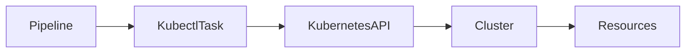
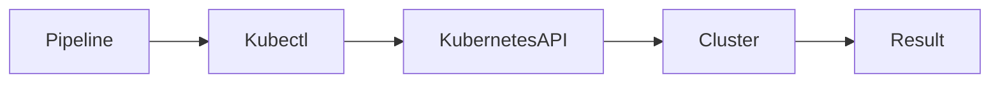

# Kubernetes Integration

## Overview

Kubernetes Integration in Azure DevOps enables CI/CD pipelines to automate the deployment and management of containerized applications on Kubernetes clusters.

Azure DevOps integrates with:

- Azure Kubernetes Service (AKS)
- Amazon EKS
- Google Kubernetes Engine (GKE)
- Red Hat OpenShift
- Self-managed Kubernetes clusters

Typical deployment workflow:

1. Build application
2. Build Docker image
3. Push image to Container Registry
4. Deploy image to Kubernetes
5. Verify deployment

> **Interview Point**
>
> Azure DevOps **does not deploy containers directly**. It uses Kubernetes APIs through **kubectl**, the **KubernetesManifest task**, or **Helm** to deploy applications.

---

## Why It Is Used

Kubernetes Integration helps organizations:

- Automate deployments
- Reduce manual operations
- Support rolling updates
- Simplify microservices deployment
- Improve scalability
- Enable GitOps and Infrastructure as Code workflows

---

## Architecture / Working


---

## Key Components

| Component | Purpose |
|------------|----------|
| Azure DevOps Pipeline | Automates deployment |
| Docker Image | Application package |
| Container Registry | Stores images |
| Kubernetes Cluster | Runs containers |
| Manifest Files | Define Kubernetes resources |
| Service Connection | Authenticates to the cluster |

---

## Types

| Deployment Method | Description |
|-------------------|-------------|
| Kubernetes Manifest Task | Deploy using YAML manifests |
| Kubectl Task | Execute kubectl commands |
| Helm Task | Deploy Helm charts |

---

## Lifecycle / Workflow


---

## Configuration / Syntax

Example deployment

```yaml
steps:

- task: KubernetesManifest@1

  inputs:

    action: deploy

    kubernetesServiceConnection: AKS-Connection

    manifests: |

      manifests/deployment.yaml

      manifests/service.yaml
```

---

## Important Commands

```bash
kubectl apply

kubectl get pods

kubectl get deployments

kubectl rollout status

kubectl describe pod
```

---

## Important Files

| File | Purpose |
|------|---------|
| deployment.yaml | Application deployment |
| service.yaml | Service definition |
| ingress.yaml | Ingress configuration |
| azure-pipelines.yml | Pipeline definition |

---

## Real-World Use Cases

- AKS deployments
- Microservices
- Rolling updates
- Blue-Green deployments
- Canary deployments

---

## Advantages

- Automated deployments
- High availability
- Scalable
- Supports rolling updates
- Kubernetes-native deployment process

---

## Limitations

- Kubernetes knowledge required
- Cluster management complexity
- Service Connection configuration required

---

## Common Interview Questions (Concept Only)

- How does Azure DevOps integrate with Kubernetes?
- What is required before deploying to Kubernetes?
- Which deployment tasks are available?
- Why use Kubernetes with Azure DevOps?

---

## Common Mistakes

- Hardcoding image tags
- Deploying without image versioning
- Not verifying rollout status
- Ignoring namespace configuration

---

## Troubleshooting

| Problem | Solution |
|----------|----------|
| Deployment failed | Review Kubernetes events and pipeline logs |
| Authentication failed | Verify Kubernetes Service Connection |
| ImagePullBackOff | Verify image exists and registry authentication |
| Pod not running | Check pod events and container logs |

---

## Summary

Kubernetes Integration enables Azure DevOps pipelines to automate container deployments, providing scalable, reliable, and repeatable application delivery to Kubernetes clusters.

---

# AKS Deployment

## Overview

Azure Kubernetes Service (AKS) Deployment is the process of deploying containerized applications from Azure DevOps pipelines to an AKS cluster.

AKS is Microsoft's managed Kubernetes service that simplifies Kubernetes cluster management while Azure DevOps automates application deployment.

> **Interview Point**
>
> Azure DevOps deploys **applications** to AKS, while AKS manages **containers and cluster infrastructure**.

---

## Why It Is Used

AKS deployments help:

- Automate container deployments
- Simplify Kubernetes operations
- Enable rolling updates
- Improve scalability
- Reduce downtime

---

## Architecture / Working



---

## Key Components

| Component | Purpose |
|------------|----------|
| AKS Cluster | Runs containers |
| Node Pool | Worker nodes |
| Pods | Running containers |
| Deployment | Manages Pods |
| Service | Exposes applications |

---

## Lifecycle / Workflow



---

## Configuration / Syntax

```yaml
steps:

- task: KubernetesManifest@1

  inputs:

    action: deploy

    kubernetesServiceConnection: AKS-ServiceConnection

    manifests: manifests/deployment.yaml
```

---

## Important Commands

```bash
kubectl apply

kubectl get pods

kubectl get services

kubectl rollout status

kubectl rollout undo
```

---

## Important Files

| File | Purpose |
|------|---------|
| deployment.yaml | Deployment configuration |
| service.yaml | Service |
| ingress.yaml | Ingress |
| namespace.yaml | Namespace |

---

## Real-World Use Cases

- Microservices
- APIs
- Containerized web applications
- Enterprise applications

---

## Advantages

- Managed Kubernetes
- Automatic scaling
- High availability
- Azure integration

---

## Limitations

- Kubernetes learning curve
- Requires cluster monitoring and cost management

---

## Common Interview Questions (Concept Only)

- What is AKS?
- Why use AKS with Azure DevOps?
- What is required to deploy to AKS?
- Difference between AKS and Kubernetes?

---

## Common Mistakes

- Deploying to the wrong namespace
- Using mutable image tags like `latest`
- Forgetting rollout verification
- Not configuring registry authentication

---

## Troubleshooting

| Problem | Solution |
|----------|----------|
| Pods pending | Check node capacity and scheduling events |
| Image pull failed | Verify ACR permissions or image name |
| Service unavailable | Verify Service and Ingress configuration |
| Deployment timeout | Review rollout status and pod logs |

---

## Summary

AKS Deployment automates application delivery to Azure Kubernetes Service, enabling scalable and reliable container orchestration through Azure DevOps pipelines.

---

# Kubernetes Manifest Task

## Overview

The **KubernetesManifest@1** task is the recommended Azure DevOps task for deploying Kubernetes resources using YAML manifest files.

It simplifies deployment by handling:

- Image substitution
- Secret creation
- Manifest deployment
- Rollout status verification

> **Interview Point**
>
> The Kubernetes Manifest Task is preferred over manually running `kubectl apply` because it integrates with Azure DevOps deployment tracking and supports deployment strategies.

---

## Why It Is Used

The Manifest Task helps:

- Deploy Kubernetes resources
- Standardize deployments
- Replace image tags dynamically
- Verify rollout status
- Improve deployment reliability

---

## Architecture / Working



---

## Key Components

| Component | Purpose |
|------------|----------|
| Manifest Task | Deployment automation |
| Manifest Files | Kubernetes configuration |
| Kubernetes API | Applies resources |
| Cluster | Runs workloads |

---

## Types

Supported actions include:

| Action | Purpose |
|---------|----------|
| deploy | Deploy manifests |
| bake | Generate manifests from Helm or Kustomize |
| createSecret | Create Kubernetes secrets |
| delete | Remove resources |
| patch | Update existing resources |

---

## Lifecycle / Workflow


---

## Configuration / Syntax

Deploy manifests

```yaml
steps:

- task: KubernetesManifest@1

  inputs:

    action: deploy

    kubernetesServiceConnection: AKS-ServiceConnection

    namespace: production

    manifests: |

      manifests/deployment.yaml

      manifests/service.yaml
```

Image substitution

```yaml
containers: |

  myregistry.azurecr.io/demoapp:$(Build.BuildId)
```

---

## Important Commands

The task internally performs operations equivalent to:

```bash
kubectl apply

kubectl rollout status

kubectl describe
```

---

## Important Files

| File | Purpose |
|------|---------|
| deployment.yaml | Deployment |
| service.yaml | Service |
| ingress.yaml | Ingress |
| secret.yaml | Secret |

---

## Real-World Use Cases

- AKS deployments
- Microservices
- Rolling updates
- Namespace deployments

---

## Advantages

- Native Azure DevOps integration
- Automatic rollout verification
- Image substitution
- Simplified Kubernetes deployments

---

## Limitations

- Limited flexibility compared to raw `kubectl` for advanced administrative operations
- Requires valid Kubernetes manifests

---

## Common Interview Questions (Concept Only)

- What is the Kubernetes Manifest Task?
- Why use it instead of `kubectl apply`?
- What actions does it support?
- How does image substitution work?

---

## Common Mistakes

- Incorrect manifest paths
- Wrong namespace
- Missing image tags
- Invalid YAML syntax

---

## Troubleshooting

| Problem | Solution |
|----------|----------|
| Manifest validation failed | Verify YAML syntax |
| Rollout failed | Review deployment events and pod logs |
| Image not updated | Check image substitution configuration |
| Deployment stuck | Verify pod health and rollout status |

---

## Summary

The Kubernetes Manifest Task provides a standardized and Azure DevOps-native way to deploy Kubernetes applications while supporting rollout verification, image updates, and deployment tracking.

---

# Kubectl Task

## Overview

The **Kubectl Task** executes Kubernetes CLI (`kubectl`) commands directly from an Azure DevOps pipeline.

Unlike the Kubernetes Manifest Task, which focuses on deployment workflows, the Kubectl Task provides complete control over Kubernetes cluster operations.

It is useful for both deployment and administrative tasks.

> **Interview Point**
>
> Use the **Kubernetes Manifest Task** for standard application deployments and the **Kubectl Task** when custom or advanced Kubernetes commands are required.

---

## Why It Is Used

Kubectl Task enables:

- Execute Kubernetes CLI commands
- Manage cluster resources
- Troubleshoot deployments
- Perform operational tasks
- Automate cluster administration

---

## Architecture / Working



---

## Key Components

| Component | Purpose |
|------------|----------|
| Kubectl Task | Executes CLI commands |
| kubectl | Kubernetes CLI |
| Kubernetes API | Cluster interface |
| Cluster | Managed infrastructure |

---

## Types

Common operations include:

| Command | Purpose |
|----------|----------|
| apply | Create or update resources |
| delete | Remove resources |
| get | Retrieve resource information |
| describe | Display resource details |
| logs | View container logs |
| rollout | Manage deployments |
| scale | Scale workloads |

---

## Lifecycle / Workflow



---

## Configuration / Syntax

```yaml
steps:

- task: KubectlInstaller@0

- task: Kubernetes@1

  inputs:

    connectionType: Kubernetes Service Connection

    kubernetesServiceEndpoint: AKS-ServiceConnection

    command: apply

    useConfigurationFile: true

    configuration: manifests/deployment.yaml
```

Example using inline command

```yaml
steps:

- task: Kubernetes@1

  inputs:

    connectionType: Kubernetes Service Connection

    kubernetesServiceEndpoint: AKS-ServiceConnection

    command: get

    arguments: pods -n production
```

---

## Important Commands

```bash
kubectl apply

kubectl get pods

kubectl get deployments

kubectl describe pod

kubectl logs

kubectl rollout status

kubectl rollout undo

kubectl scale

kubectl delete
```

---

## Important Files

| File | Purpose |
|------|---------|
| deployment.yaml | Deployment |
| service.yaml | Service |
| ingress.yaml | Ingress |
| configmap.yaml | ConfigMap |
| secret.yaml | Secret |

---

## Real-World Use Cases

- Deploy applications
- Debug Kubernetes workloads
- Scale deployments
- Check pod status
- Roll back failed deployments
- Perform cluster maintenance

---

## Advantages

- Full Kubernetes CLI functionality
- Flexible administration
- Supports advanced troubleshooting
- Works with any Kubernetes cluster supported by Azure DevOps

---

## Limitations

- Requires Kubernetes command knowledge
- More scripting than the Kubernetes Manifest Task
- Easier to introduce inconsistent deployment practices if commands are not standardized

---

## Common Interview Questions (Concept Only)

- What is the Kubectl Task?
- Difference between Kubectl Task and Kubernetes Manifest Task?
- When should you use Kubectl instead of Kubernetes Manifest?
- What Kubernetes operations can be automated with Kubectl?

---

## Common Mistakes

- Running destructive commands against the wrong cluster or namespace
- Forgetting to specify namespaces
- Executing `kubectl apply` without validating manifests
- Ignoring rollout status after deployment

---

## Troubleshooting

| Problem | Solution |
|----------|----------|
| Authentication failed | Verify Kubernetes Service Connection |
| Resource not found | Check namespace and resource name |
| Pod not running | Review pod events, logs, and descriptions |
| Command failed | Verify syntax and cluster connectivity |

---

## Summary

The Kubectl Task enables Azure DevOps pipelines to execute Kubernetes CLI commands for deployment, administration, troubleshooting, and operational automation, making it the preferred choice when fine-grained control over Kubernetes resources is required.
