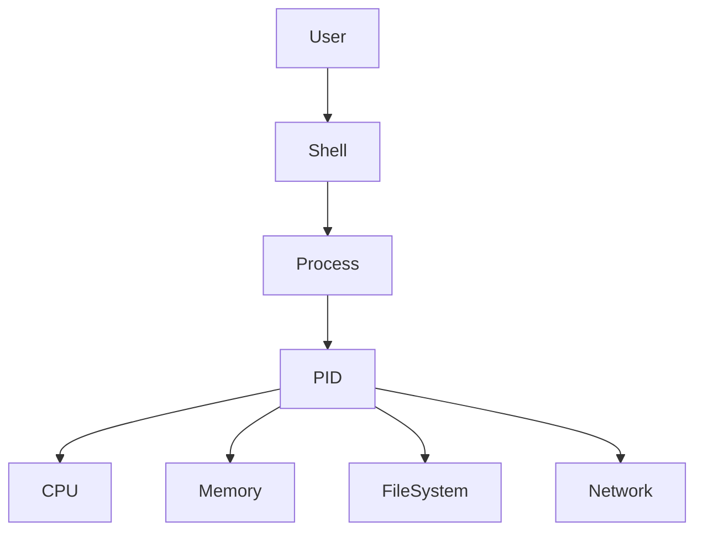
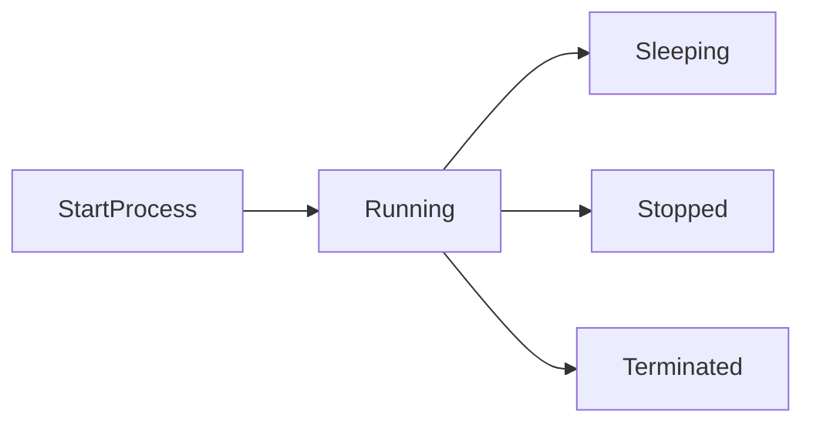
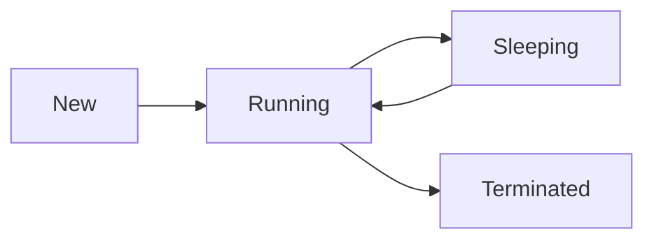

# Process Management

## Overview

A **process** is a running instance of a program. Every command, application, or service executed in Linux runs as one or more processes.

Linux Process Management involves:

- Viewing running processes
- Monitoring CPU and memory usage
- Managing foreground and background jobs
- Starting and stopping processes
- Troubleshooting hung or high-resource applications

Process management is one of the most frequently tested Linux topics in DevOps, Cloud, and SRE interviews.

> **Interview Point**
>
> Every process in Linux is identified by a unique **Process ID (PID)**.

---

## Why It Is Used

Process management helps:

- Monitor system performance
- Troubleshoot applications
- Stop unresponsive programs
- Manage services
- Optimize resource utilization
- Maintain server stability

---

## Architecture / Working



---

## Key Components

| Component | Purpose |
|------------|----------|
| Process | Running program |
| PID | Process Identifier |
| PPID | Parent Process ID |
| Foreground Process | Uses the current terminal |
| Background Process | Runs without occupying the terminal |
| Signal | Used to control processes |

---

## Types

| Process Type | Description |
|--------------|-------------|
| Foreground | Runs in the active terminal |
| Background | Runs independently of the terminal prompt |
| Daemon | Background system service |
| Zombie | Process that has finished but has not been cleaned up by its parent |
| Orphan | Process whose parent has exited; adopted by the init/systemd process |

---

## Lifecycle / Workflow



---

## Configuration / Syntax

General syntax

```bash
command [options]
```

---

## Important Commands

```bash
ps

top

kill

killall

jobs

bg

fg

nohup
```

---

## Important Files

| File | Purpose |
|------|---------|
| /proc | Virtual filesystem containing process information |
| /proc/<PID> | Information for a specific process |
| /proc/cpuinfo | CPU information |
| /proc/meminfo | Memory information |

---

## Real-World Use Cases

- Stop hung applications
- Monitor server resource usage
- Manage background jobs
- Investigate high CPU usage
- Troubleshoot production servers

---

## Advantages

- Fine-grained process control
- Efficient resource management
- Strong monitoring capabilities

---

## Limitations

- Killing critical processes may destabilize the system
- Requires appropriate privileges for system processes

---

## Common Interview Questions (Concept Only)

- What is a process?
- What is a PID?
- Difference between a process and a service?
- Difference between foreground and background processes?
- What is a Zombie process?
- What is an Orphan process?

---

## Common Mistakes

- Killing the wrong PID
- Using `kill -9` before attempting graceful termination
- Ignoring parent-child process relationships
- Running long tasks in the foreground unnecessarily

---

## Troubleshooting

| Problem | Solution |
|----------|----------|
| High CPU usage | Use `top` or `ps` to identify the process |
| Process not responding | Send `SIGTERM`, then `SIGKILL` if necessary |
| Terminal blocked | Move the process to the background or open another session |
| Zombie process | Investigate and restart or fix the parent process if needed |

---

## Summary

Linux Process Management enables administrators to monitor, control, and troubleshoot running applications, making it a critical skill for DevOps Engineers, Cloud Engineers, and SREs.

---

# Process Basics

## Overview

A process is an executing instance of a program.

When a command is executed:

1. The executable is loaded into memory.
2. The kernel assigns a Process ID (PID).
3. CPU and memory resources are allocated.
4. The process begins execution.

> **Interview Point**
>
> Multiple processes can be created from the same program, each with a different PID.

---

## Why It Is Used

Processes allow Linux to:

- Execute applications
- Run services
- Support multitasking
- Isolate workloads

---

## Architecture / Working


---

## Key Components

| Component | Description |
|------------|-------------|
| PID | Process Identifier |
| PPID | Parent Process ID |
| Process State | Running, Sleeping, Stopped, Zombie |
| Owner | User running the process |

---

## Types

Common process states

| State | Description |
|--------|-------------|
| R | Running |
| S | Sleeping |
| D | Uninterruptible sleep (usually waiting for I/O) |
| T | Stopped/Traced |
| Z | Zombie |

---

## Lifecycle / Workflow



---

## Configuration / Syntax

View process

```bash
ps
```

---

## Important Commands

```bash
ps

top

kill
```

---

## Real-World Use Cases

- Application monitoring
- Service management
- Performance tuning

---

## Advantages

- Efficient multitasking
- Resource isolation

---

## Limitations

- Poorly written processes can consume excessive resources

---

## Common Interview Questions (Concept Only)

- What is a process?
- What is PID?
- What is PPID?
- What are common process states?

---

## Common Mistakes

- Confusing programs with processes

---

## Troubleshooting

| Problem | Solution |
|----------|----------|
| Unknown PID | Use `ps` to inspect running processes |

---

## Summary

Processes are running instances of programs managed by the Linux kernel through unique PIDs and lifecycle states.

---

# ps

## Overview

`ps` (Process Status) displays information about running processes.

Unlike `top`, it provides a snapshot rather than a continuously updating view.

> **Interview Point**
>
> `ps -ef` and `ps aux` are the most commonly used formats in interviews and production.

---

## Why It Is Used

- View running processes
- Identify PIDs
- Troubleshoot applications

---

## Architecture / Working


---

## Key Components

| Option | Purpose |
|---------|----------|
| -e | All processes |
| -f | Full format |
| aux | BSD-style detailed listing |
| -u | Processes for a specific user |

---

## Configuration / Syntax

```bash
ps

ps -ef

ps aux

ps -u akshay
```

---

## Important Commands

```bash
ps

ps -ef

ps aux

ps -u
```

---

## Real-World Use Cases

- Identify application PIDs
- Verify services are running
- Troubleshoot resource usage

---

## Advantages

- Fast
- Detailed process information

---

## Limitations

- Snapshot only (does not update automatically)

---

## Common Interview Questions (Concept Only)

- Difference between `ps` and `top`?
- Difference between `ps -ef` and `ps aux`?

---

## Common Mistakes

- Assuming `ps` updates automatically

---

## Troubleshooting

| Problem | Solution |
|----------|----------|
| Process not visible | Use `ps -ef` or `ps aux` |

---

## Summary

`ps` displays detailed information about running processes and is one of the most frequently used Linux administration commands.

---

# top

## Overview

`top` provides a real-time, interactive view of running processes and system resource usage.

It displays:

- CPU utilization
- Memory usage
- Running processes
- Process priority
- System load

> **Interview Point**
>
> `top` updates continuously, unlike `ps`, which provides a static snapshot.

---

## Why It Is Used

- Monitor servers
- Identify high CPU usage
- Analyze memory consumption
- Troubleshoot performance

---

## Architecture / Working


---

## Key Components

| Information | Description |
|------------|-------------|
| PID | Process ID |
| USER | Owner |
| %CPU | CPU utilization |
| %MEM | Memory utilization |
| TIME+ | CPU time consumed |

---

## Configuration / Syntax

```bash
top
```

---

## Important Commands

Interactive shortcuts

| Key | Purpose |
|-----|----------|
| P | Sort by CPU |
| M | Sort by Memory |
| k | Kill process |
| q | Quit |

---

## Real-World Use Cases

- Production monitoring
- Capacity planning
- Performance troubleshooting

---

## Advantages

- Live monitoring
- Interactive
- Easy troubleshooting

---

## Limitations

- Displays only current system state
- Can become overwhelming on systems with many processes

---

## Common Interview Questions (Concept Only)

- Difference between `ps` and `top`?
- How do you identify a high CPU process?

---

## Common Mistakes

- Misinterpreting CPU percentages on multi-core systems

---

## Troubleshooting

| Problem | Solution |
|----------|----------|
| High CPU | Sort by CPU (`P`) and investigate the process |
| High Memory | Sort by Memory (`M`) |

---

## Summary

`top` provides real-time monitoring of system performance and running processes.

---

# kill

## Overview

`kill` sends signals to processes.

By default, it sends **SIGTERM (15)**, allowing a process to exit gracefully.

> **Interview Point**
>
> `kill` does not always terminate a process immediately. It sends a signal requesting the process to act.

---

## Why It Is Used

- Stop applications
- Restart services
- Terminate hung processes

---

## Architecture / Working


---

## Key Components

Common signals

| Signal | Number | Purpose |
|--------|--------:|----------|
| SIGTERM | 15 | Graceful termination |
| SIGKILL | 9 | Immediate termination |
| SIGHUP | 1 | Reload configuration (for many daemons) |
| SIGSTOP | 19 | Pause process |
| SIGCONT | 18 | Resume process |

---

## Configuration / Syntax

Graceful termination

```bash
kill PID
```

Force termination

```bash
kill -9 PID
```

---

## Important Commands

```bash
kill

kill -9

kill -15

kill -l
```

---

## Real-World Use Cases

- Stop applications
- Restart deployments
- Recover hung processes

---

## Advantages

- Flexible signal handling
- Supports graceful shutdown

---

## Limitations

- Wrong PID may terminate the wrong process
- `SIGKILL` prevents cleanup by the application

---

## Common Interview Questions (Concept Only)

- Difference between `kill` and `kill -9`?
- What is SIGTERM?
- When should SIGKILL be used?

---

## Common Mistakes

- Using `kill -9` as the first option
- Killing critical system processes

---

## Troubleshooting

| Problem | Solution |
|----------|----------|
| Process still running | Verify PID or use `SIGKILL` if appropriate |
| Permission denied | Use appropriate privileges |

---

## Summary

`kill` sends signals to processes, enabling graceful or forceful process management.

---

# killall

## Overview

`killall` terminates processes by **process name** rather than PID.

> **Interview Point**
>
> `killall nginx` terminates all processes named `nginx`.

---

## Why It Is Used

- Stop multiple processes
- Simplify administration

---

## Configuration / Syntax

```bash
killall nginx

killall -9 nginx
```

---

## Important Commands

```bash
killall

killall -9
```

---

## Real-World Use Cases

- Restart web servers
- Stop multiple application instances

---

## Advantages

- Easier than finding PIDs manually

---

## Limitations

- Can terminate multiple matching processes unintentionally

---

## Common Interview Questions (Concept Only)

- Difference between `kill` and `killall`?

---

## Common Mistakes

- Terminating unintended processes with the same name

---

## Troubleshooting

| Problem | Solution |
|----------|----------|
| Process still running | Verify process name or permissions |

---

## Summary

`killall` terminates all processes with a specified name, simplifying process management.

---

# jobs

## Overview

`jobs` displays background and suspended jobs associated with the **current shell session**.

> **Interview Point**
>
> `jobs` lists shell jobs, **not all system processes**.

---

## Why It Is Used

- Monitor background jobs
- Resume suspended tasks

---

## Architecture / Working


---

## Configuration / Syntax

```bash
jobs
```

---

## Important Commands

```bash
jobs

jobs -l
```

---

## Real-World Use Cases

- Long-running scripts
- Background file transfers

---

## Advantages

- Easy job tracking

---

## Limitations

- Limited to the current shell session

---

## Common Interview Questions (Concept Only)

- Difference between `jobs` and `ps`?

---

## Common Mistakes

- Expecting `jobs` to show system-wide processes

---

## Troubleshooting

| Problem | Solution |
|----------|----------|
| No jobs listed | Verify background jobs exist in the current shell |

---

## Summary

`jobs` displays background and suspended jobs managed by the current shell.

---

# bg

## Overview

`bg` resumes a stopped job and continues running it in the background.

> **Interview Point**
>
> A job is commonly stopped with **Ctrl + Z**, then resumed in the background using `bg`.

---

## Why It Is Used

- Continue long-running commands
- Free the terminal

---

## Architecture / Working


---

## Configuration / Syntax

Resume most recent job

```bash
bg
```

Resume a specific job

```bash
bg %1
```

---

## Important Commands

```bash
bg

bg %1
```

---

## Real-World Use Cases

- Resume backups
- Continue log analysis

---

## Advantages

- Keeps tasks running
- Frees the terminal

---

## Limitations

- Applies only to shell-managed jobs

---

## Common Interview Questions (Concept Only)

- What does `bg` do?

---

## Common Mistakes

- Trying to use `bg` without a suspended job

---

## Troubleshooting

| Problem | Solution |
|----------|----------|
| No current job | Suspend a process first using `Ctrl + Z` |

---

## Summary

`bg` resumes suspended shell jobs in the background, allowing continued execution without blocking the terminal.

---

# fg

## Overview

`fg` brings a background or suspended job back to the foreground.

> **Interview Point**
>
> `fg` is commonly used after `bg` or after suspending a process with **Ctrl + Z**.

---

## Why It Is Used

- Interact with background jobs
- Resume paused processes

---

## Architecture / Working


---

## Configuration / Syntax

Bring the most recent job to the foreground

```bash
fg
```

Bring a specific job to the foreground

```bash
fg %1
```

---

## Important Commands

```bash
fg

fg %1
```

---

## Real-World Use Cases

- Resume editors
- Continue installations
- Interactive scripts

---

## Advantages

- Restores terminal interaction

---

## Limitations

- Works only with jobs in the current shell session

---

## Common Interview Questions (Concept Only)

- Difference between `bg` and `fg`?

---

## Common Mistakes

- Attempting to foreground a non-existent job

---

## Troubleshooting

| Problem | Solution |
|----------|----------|
| No such job | Verify available jobs with `jobs` |

---

## Summary

`fg` moves a background or suspended job into the foreground for interactive execution.

---

# nohup

## Overview

`nohup` (No Hang Up) runs a command so it continues executing even after the user logs out or the terminal session ends.

By default, command output is written to:

```text
nohup.out
```

unless redirected elsewhere.

> **Interview Point**
>
> `nohup` is commonly combined with `&` to run long-running processes in the background that survive terminal disconnection.

---

## Why It Is Used

- Long-running scripts
- Server maintenance
- Backups
- Application deployments
- Data processing

---

## Architecture / Working


---

## Key Components

| Component | Purpose |
|------------|----------|
| nohup | Ignores hang-up signals |
| `&` | Runs the command in the background |
| nohup.out | Default output file |

---

## Lifecycle / Workflow


---

## Configuration / Syntax

Run a command in the background

```bash
nohup python app.py &
```

Redirect output

```bash
nohup ./backup.sh > backup.log 2>&1 &
```

---

## Important Commands

```bash
nohup

nohup command &
```

---

## Important Files

| File | Purpose |
|------|---------|
| nohup.out | Default output file if stdout/stderr are not redirected |

---

## Real-World Use Cases

- Running deployments over SSH
- Long-running backups
- Data migration
- Batch processing
- Machine learning training jobs

---

## Advantages

- Continues running after logout
- Ideal for remote server administration
- Simple to use

---

## Limitations

- Limited process management compared to tools such as `systemd`, `screen`, or `tmux`
- Default output can grow large if not redirected

---

## Common Interview Questions (Concept Only)

- What is `nohup`?
- Why is `nohup` used with `&`?
- Where does `nohup` store output by default?
- Difference between `nohup` and running a process in the background using only `&`?

---

## Common Mistakes

- Forgetting to redirect output
- Assuming `&` alone keeps a process running after logout
- Losing track of the process PID

---

## Troubleshooting

| Problem | Solution |
|----------|----------|
| Output not visible | Check `nohup.out` or the redirected log file |
| Process stopped unexpectedly | Verify it was started with `nohup` and inspect application logs |
| Cannot find the process | Use `ps` or `pgrep` to locate it |

---

## Summary

`nohup` allows commands to continue running after a terminal session ends, making it an essential tool for long-running administrative tasks, deployments, and automation on remote Linux servers.
