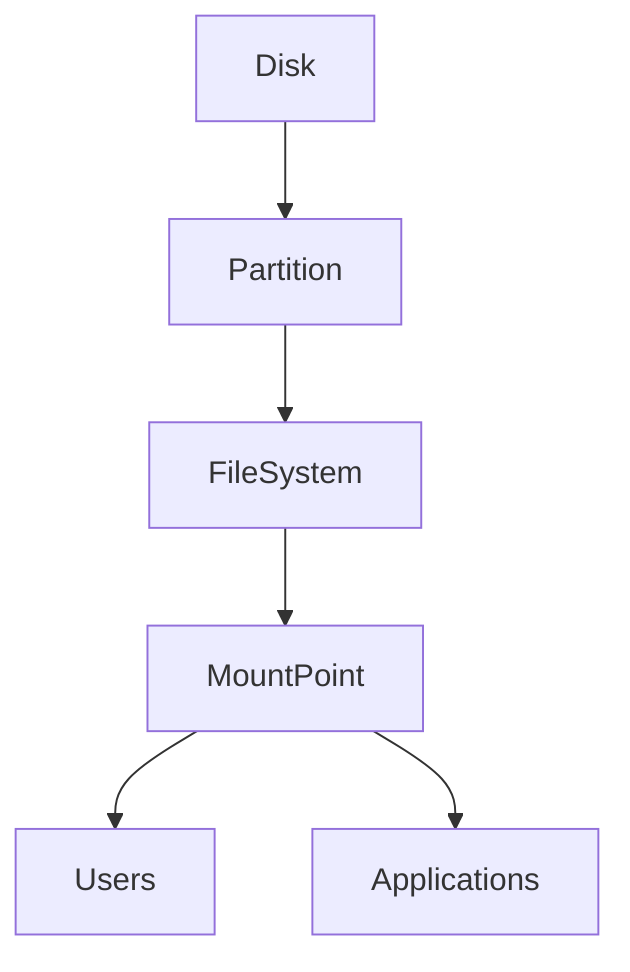

# Disk & File System Management

## Overview

Disk & File System Management involves monitoring, organizing, and managing storage devices and mounted file systems in Linux.

It helps administrators:

- Monitor disk usage
- Identify storage bottlenecks
- Mount and unmount storage devices
- Troubleshoot disk-related issues
- Manage server storage efficiently

This is one of the most frequently asked Linux topics in DevOps, Cloud, SRE, and System Administration interviews.

> **Interview Point**
>
> Linux does **not** assign drive letters (like `C:` or `D:`). Instead, storage devices are mounted into the **single directory hierarchy** starting from the root (`/`).

---

## Why It Is Used

Disk management helps to:

- Prevent disk space exhaustion
- Attach additional storage
- Mount cloud volumes
- Analyze storage consumption
- Configure application storage
- Troubleshoot file system issues

---

## Architecture / Working



---

## Key Components

| Component | Purpose |
|------------|----------|
| Disk | Physical or virtual storage device |
| Partition | Logical division of a disk |
| File System | Organizes data on storage |
| Mount Point | Directory where a filesystem is attached |
| Block Device | Device represented under `/dev` |

---

## Types

### Common Storage Devices

- HDD
- SSD
- NVMe
- Cloud Volumes (Azure Managed Disk, AWS EBS)

### Common Linux File Systems

| File System | Usage |
|-------------|-------|
| ext4 | Most common Linux filesystem |
| XFS | Large servers, enterprise storage |
| Btrfs | Advanced filesystem |
| FAT32 | USB drives |
| NTFS | Windows compatibility |

---

## Lifecycle / Workflow


---

## Configuration / Syntax

Common workflow

```bash
lsblk

mount

df

du

umount
```

---

## Important Commands

```bash
df

du

lsblk

mount

umount
```

---

## Important Files

| File | Purpose |
|------|---------|
| /etc/fstab | Persistent mount configuration |
| /proc/mounts | Mounted file systems |
| /etc/mtab | Mounted file systems (distribution-dependent) |

---

## Real-World Use Cases

- Mount Azure Managed Disks
- Mount AWS EBS volumes
- Monitor disk usage
- Troubleshoot full disks
- Attach backup storage
- Manage Kubernetes node storage

---

## Advantages

- Efficient storage management
- Easy troubleshooting
- Supports dynamic storage

---

## Limitations

- Incorrect mounts may prevent system boot
- Full disks can impact application performance

---

## Common Interview Questions (Concept Only)

- What is mounting?
- Difference between `df` and `du`?
- What is `/etc/fstab`?
- What is a mount point?
- Difference between a partition and a file system?

---

## Common Mistakes

- Forgetting to unmount removable devices
- Editing `/etc/fstab` incorrectly
- Confusing disk size with filesystem usage
- Mounting to a non-existent directory

---

## Troubleshooting

| Problem | Solution |
|----------|----------|
| Disk full | Use `du` to locate large directories |
| Mount failed | Verify device name, filesystem, and mount point |
| Device busy during unmount | Check open files using `lsof` or `fuser` |
| Storage not visible | Verify with `lsblk` |

---

## Summary

Disk & File System Management enables Linux administrators to manage storage devices, monitor usage, and configure mounted file systems effectively.

---

# df

## Overview

`df` (Disk Free) displays disk space usage for mounted file systems.

It reports:

- Total space
- Used space
- Available space
- Mount point

> **Interview Point**
>
> `df` reports **filesystem usage**, **not** the size of individual directories.

---

## Why It Is Used

- Monitor disk usage
- Detect full file systems
- Capacity planning
- Troubleshoot storage issues

---

## Architecture / Working


---

## Key Components

| Column | Meaning |
|----------|----------|
| Filesystem | Mounted filesystem |
| Size | Total capacity |
| Used | Used space |
| Avail | Available space |
| Use% | Percentage used |
| Mounted on | Mount point |

---

## Lifecycle / Workflow


---

## Configuration / Syntax

Display filesystem usage

```bash
df
```

Human-readable format

```bash
df -h
```

Display filesystem type

```bash
df -Th
```

---

## Important Commands

```bash
df

df -h

df -T

df -Th
```

---

## Important Files

| File | Purpose |
|------|---------|
| /proc/mounts | Mounted filesystems |

---

## Real-World Use Cases

- Monitor production servers
- Check disk space before deployments
- Troubleshoot application failures caused by full disks

---

## Advantages

- Quick overview
- Human-readable output
- Lightweight

---

## Limitations

- Does not identify which directories consume space

---

## Common Interview Questions (Concept Only)

- Difference between `df` and `du`?
- What does `df -h` display?
- What does the `Use%` column represent?

---

## Common Mistakes

- Using `df` to locate large directories
- Ignoring reserved filesystem space

---

## Troubleshooting

| Problem | Solution |
|----------|----------|
| Filesystem 100% full | Use `du` to identify large directories |
| Missing mount | Verify with `mount` or `lsblk` |

---

## Summary

`df` displays filesystem usage and is the primary command for monitoring available disk space.

---

# du

## Overview

`du` (Disk Usage) reports the disk space used by files and directories.

Unlike `df`, it calculates usage for specific paths.

> **Interview Point**
>
> `du` measures **directory and file size**, whereas `df` measures **filesystem usage**.

---

## Why It Is Used

- Find large directories
- Analyze storage usage
- Clean up disk space

---

## Architecture / Working


---

## Key Components

| Option | Purpose |
|---------|----------|
| -h | Human-readable |
| -s | Summary |
| -a | Include files |
| --max-depth | Limit recursion depth |

---

## Lifecycle / Workflow


---

## Configuration / Syntax

Directory size

```bash
du -h
```

Summary

```bash
du -sh /var/log
```

Top-level directories

```bash
du -h --max-depth=1 /home
```

---

## Important Commands

```bash
du

du -h

du -sh

du --max-depth
```

---

## Real-World Use Cases

- Identify large log directories
- Find disk space consumers
- Capacity planning

---

## Advantages

- Detailed storage analysis
- Flexible reporting

---

## Limitations

- Can be slow on very large directory trees

---

## Common Interview Questions (Concept Only)

- Difference between `du` and `df`?
- What does `du -sh` display?

---

## Common Mistakes

- Running `du` on the root directory without limiting depth
- Confusing directory size with available disk space

---

## Troubleshooting

| Problem | Solution |
|----------|----------|
| Command slow | Limit recursion depth using `--max-depth` |
| Large directory unknown | Sort output to identify largest directories |

---

## Summary

`du` analyzes directory and file sizes, making it essential for troubleshooting disk space issues.

---

# lsblk

## Overview

`lsblk` (List Block Devices) displays information about storage devices and their partitions.

It shows:

- Disks
- Partitions
- Mount points
- Sizes

> **Interview Point**
>
> `lsblk` displays **block devices** without requiring the filesystem to be mounted.

---

## Why It Is Used

- Identify attached disks
- View partition layout
- Verify cloud storage attachments
- Troubleshoot storage issues

---

## Architecture / Working


---

## Key Components

| Column | Description |
|----------|-------------|
| NAME | Device name |
| SIZE | Device size |
| TYPE | Disk or partition |
| MOUNTPOINT | Mounted directory |

---

## Lifecycle / Workflow


---

## Configuration / Syntax

Display block devices

```bash
lsblk
```

Filesystem information

```bash
lsblk -f
```

---

## Important Commands

```bash
lsblk

lsblk -f
```

---

## Important Files

| Directory | Purpose |
|------------|----------|
| /dev | Device files |

---

## Real-World Use Cases

- Verify Azure Managed Disk attachment
- Verify AWS EBS attachment
- Troubleshoot missing storage

---

## Advantages

- Clear device tree
- Fast
- Easy to read

---

## Limitations

- Does not show filesystem usage

---

## Common Interview Questions (Concept Only)

- What does `lsblk` display?
- Difference between `lsblk` and `df`?

---

## Common Mistakes

- Assuming devices are automatically mounted after attachment

---

## Troubleshooting

| Problem | Solution |
|----------|----------|
| Disk not visible | Verify VM attachment or hardware detection |
| Missing mount point | Mount the filesystem manually |

---

## Summary

`lsblk` displays storage devices and partition information, making it an essential command for storage administration.

---

# mount

## Overview

`mount` attaches a filesystem to a directory (mount point) so it becomes accessible.

Linux accesses storage through mount points rather than drive letters.

> **Interview Point**
>
> A disk must be **mounted** before users and applications can access its contents.

---

## Why It Is Used

- Access new storage devices
- Mount cloud disks
- Mount network storage
- Attach USB drives

---

## Architecture / Working


---

## Key Components

| Component | Purpose |
|------------|----------|
| Device | Storage device |
| Mount Point | Directory where the filesystem is attached |
| Filesystem | Data organization format |

---

## Lifecycle / Workflow


---

## Configuration / Syntax

Display mounted filesystems

```bash
mount
```

Mount device

```bash
sudo mount /dev/sdb1 /mnt/data
```

Mount using filesystem type

```bash
sudo mount -t ext4 /dev/sdb1 /mnt/data
```

---

## Important Commands

```bash
mount

mount -t
```

---

## Important Files

| File | Purpose |
|------|---------|
| /etc/fstab | Persistent mounts |

---

## Real-World Use Cases

- Mount Azure disks
- Mount AWS EBS
- Attach backup drives
- Mount NFS storage

---

## Advantages

- Flexible storage management
- Supports many filesystem types

---

## Limitations

- Incorrect mounts can make data inaccessible
- Temporary mounts disappear after reboot unless configured in `/etc/fstab`

---

## Common Interview Questions (Concept Only)

- What is mounting?
- What is a mount point?
- What is `/etc/fstab` used for?

---

## Common Mistakes

- Mounting to a non-empty directory without understanding the effect
- Forgetting persistent configuration in `/etc/fstab`

---

## Troubleshooting

| Problem | Solution |
|----------|----------|
| Mount failed | Verify filesystem type and mount point |
| Permission denied | Check privileges and directory permissions |

---

## Summary

`mount` connects storage devices to the Linux directory hierarchy, making them accessible to users and applications.

---

# umount

## Overview

`umount` safely detaches a mounted filesystem.

Unmounting ensures all pending writes are completed before the storage device is removed.

> **Interview Point**
>
> Always use `umount` before disconnecting removable storage to prevent data corruption.

---

## Why It Is Used

- Safely remove storage
- Prevent data loss
- Perform maintenance
- Replace storage devices

---

## Architecture / Working


---

## Key Components

| Component | Purpose |
|------------|----------|
| Mounted Filesystem | Active filesystem |
| umount | Safely detach filesystem |

---

## Lifecycle / Workflow


---

## Configuration / Syntax

Unmount using mount point

```bash
sudo umount /mnt/data
```

Unmount using device

```bash
sudo umount /dev/sdb1
```

Lazy unmount (when appropriate)

```bash
sudo umount -l /mnt/data
```

---

## Important Commands

```bash
umount

umount -l
```

---

## Important Files

| File | Purpose |
|------|---------|
| /proc/mounts | Mounted filesystems |

---

## Real-World Use Cases

- Remove USB drives
- Detach cloud storage
- Perform filesystem maintenance
- Replace disks

---

## Advantages

- Prevents data corruption
- Ensures pending writes are completed

---

## Limitations

- Cannot unmount a filesystem that is actively in use without resolving the usage

---

## Common Interview Questions (Concept Only)

- Difference between `mount` and `umount`?
- Why should a filesystem be unmounted before removing a disk?
- What causes a "device is busy" error during unmount?

---

## Common Mistakes

- Removing storage without unmounting
- Forgetting applications still have open files on the filesystem

---

## Troubleshooting

| Problem | Solution |
|----------|----------|
| Device is busy | Use `lsof` or `fuser` to identify processes using the filesystem |
| Unmount fails | Stop processes accessing the mount point and retry |
| Filesystem remounts after reboot | Review `/etc/fstab` configuration |

---

## Summary

`umount` safely detaches mounted filesystems, ensuring data integrity and preventing corruption during storage removal or maintenance.
