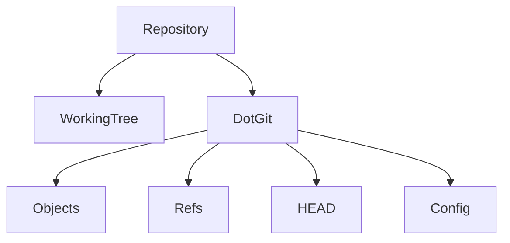
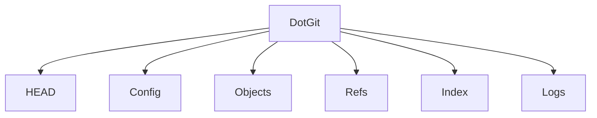

# Repository Management

## Overview

A Git repository (repo) is a storage location that contains:

- Project source code
- Complete version history
- Branches
- Tags
- Commits
- Configuration

Repository Management involves creating, cloning, and maintaining Git repositories throughout the software development lifecycle.

Every DevOps workflow begins with a Git repository because CI/CD pipelines, Infrastructure as Code (IaC), Kubernetes manifests, and application code are all stored in repositories.

> **Interview Point**
>
> A Git repository consists of:
>
> - Working Tree
> - `.git` directory (repository database)

---

## Why It Is Used

Repository management enables developers to:

- Track project history
- Collaborate with teams
- Manage source code
- Maintain multiple versions
- Recover previous changes
- Integrate with CI/CD systems

---

## Architecture / Working


---

## Key Components

| Component | Purpose |
|------------|----------|
| Working Tree | Project files |
| `.git` Directory | Git database and metadata |
| Repository | Complete project history |
| Local Repository | Developer's copy |
| Remote Repository | Shared repository |

---

## Types

### Local Repository

Stored on the developer's computer.

### Remote Repository

Hosted on platforms such as:

- GitHub
- Azure DevOps Repos
- GitLab
- Bitbucket

---

## Lifecycle / Workflow


---

## Configuration / Syntax

Create a repository

```bash
git init
```

Clone an existing repository

```bash
git clone <repository-url>
```

---

## Important Commands

```bash
git init

git clone

git status

git add

git commit

git remote

git push

git pull
```

---

## Important Files

| File | Purpose |
|------|---------|
| .git/ | Repository database |
| .git/config | Repository configuration |
| .gitignore | Ignore files and directories |
| README.md | Project documentation |

---

## Real-World Use Cases

- Store application code
- Infrastructure as Code
- Kubernetes manifests
- Dockerfiles
- CI/CD pipelines
- Configuration management

---

## Advantages

- Complete project history
- Easy collaboration
- Backup through remote repositories
- Supports branching and merging
- Enables CI/CD integration

---

## Limitations

- Large repositories can take longer to clone
- Binary files increase repository size without specialized tools like Git LFS

---

## Common Interview Questions (Concept Only)

- What is a Git repository?
- Difference between local and remote repository?
- How do you create a repository?
- How do you clone an existing repository?
- What is stored inside a repository?

---

## Common Mistakes

- Initializing Git inside an existing Git repository unintentionally
- Deleting the `.git` directory accidentally
- Committing generated or temporary files
- Ignoring `.gitignore`

---

## Troubleshooting

| Problem | Solution |
|----------|----------|
| Not a Git repository | Run `git init` or navigate to the correct repository |
| Clone failed | Verify the repository URL and access permissions |
| Repository corrupted | Restore from backup or clone a fresh copy if possible |
| Remote missing | Check configured remotes with `git remote -v` |

---

## Summary

Repository Management is the foundation of Git. Understanding how repositories are created, cloned, and organized is essential for every DevOps engineer.

---

# git init

## Overview

`git init` creates a **new local Git repository** in the current directory.

It initializes Git by creating the hidden `.git` directory.

> **Interview Point**
>
> `git init` does **not** create project files—it only initializes Git tracking.

---

## Why It Is Used

- Start version control for a new project
- Convert an existing directory into a Git repository
- Begin tracking project history

---

## Architecture / Working


---

## Key Components

| Component | Purpose |
|------------|----------|
| Working Directory | Project files |
| `.git` | Repository metadata |
| HEAD | Current branch reference |
| Objects | Commit database |

---

## Lifecycle / Workflow


---

## Configuration / Syntax

Initialize repository

```bash
git init
```

Initialize with a specific default branch (Git 2.28+)

```bash
git init --initial-branch=main
```

---

## Important Commands

```bash
git init
```

---

## Important Files

Created after initialization:

```text
.git/
```

---

## Real-World Use Cases

- New software projects
- Infrastructure repositories
- Terraform projects
- Kubernetes repositories

---

## Advantages

- Simple
- Fast
- Creates a fully functional local repository

---

## Limitations

- Does not connect to a remote repository automatically
- Existing files remain untracked until added

---

## Common Interview Questions (Concept Only)

- What does `git init` do?
- What is created after running `git init`?
- Can Git be initialized in an existing directory?

---

## Common Mistakes

- Running `git init` inside another Git repository
- Assuming files are automatically committed after initialization

---

## Troubleshooting

| Problem | Solution |
|----------|----------|
| Existing repository detected | Verify the current directory before running `git init` |
| Files not tracked | Stage files using `git add` |

---

## Summary

`git init` initializes a new Git repository by creating the `.git` directory, enabling version control for the project.

---

# git clone

## Overview

`git clone` creates a complete copy of an existing Git repository.

The cloned repository contains:

- Source code
- Commit history
- Branches
- Tags
- Remote configuration

> **Interview Point**
>
> `git clone` downloads the **entire repository history**, not just the latest files.

---

## Why It Is Used

- Obtain a copy of an existing project
- Contribute to open-source software
- Join team projects
- Create local development environments

---

## Architecture / Working


---

## Key Components

| Component | Purpose |
|------------|----------|
| Remote Repository | Source repository |
| Local Repository | Local Git database |
| Working Tree | Checked-out project files |
| origin | Default remote name |

---

## Lifecycle / Workflow


---

## Configuration / Syntax

Clone repository

```bash
git clone <repository-url>
```

Clone into a specific directory

```bash
git clone <repository-url> myproject
```

Clone a specific branch

```bash
git clone --branch main <repository-url>
```

---

## Important Commands

```bash
git clone
```

---

## Important Files

After cloning:

- `.git/`
- Working Tree
- Project files

---

## Real-World Use Cases

- Clone GitHub repositories
- Azure DevOps projects
- Infrastructure repositories
- Team collaboration

---

## Advantages

- Complete history
- Immediate collaboration
- Includes remote configuration

---

## Limitations

- Large repositories require more download time and disk space
- Network connectivity is required for the initial clone

---

## Common Interview Questions (Concept Only)

- What does `git clone` do?
- Difference between `git clone` and `git init`?
- What remote is created automatically?

---

## Common Mistakes

- Cloning into an incorrect directory
- Using the wrong repository URL
- Assuming cloning retrieves only the latest commit

---

## Troubleshooting

| Problem | Solution |
|----------|----------|
| Authentication failed | Verify credentials, SSH keys, or access token |
| Repository not found | Check the repository URL and access permissions |
| Slow clone | Consider shallow cloning (`--depth`) if full history is unnecessary |

---

## Summary

`git clone` creates a complete local copy of an existing repository, including its history and remote configuration.

---

# Repository Structure

## Overview

A Git repository consists of two primary parts:

1. Working Tree
2. `.git` directory

The Working Tree contains project files, while the `.git` directory stores all version control information.

---

## Why It Is Used

The repository structure separates:

- Source code
- Git metadata
- Commit history
- Configuration

---

## Architecture / Working



---

## Key Components

| Component | Purpose |
|------------|----------|
| Working Tree | Project files |
| `.git` | Repository metadata |
| Objects | Commit database |
| Refs | Branch and tag references |
| HEAD | Current branch reference |

---

## Lifecycle / Workflow


---

## Configuration / Syntax

View hidden files

```bash
ls -la
```

---

## Important Commands

```bash
ls -la
```

---

## Important Files

| File | Purpose |
|------|---------|
| `.git/HEAD` | Current branch reference |
| `.git/config` | Local configuration |
| `.git/index` | Staging area (index) |
| `.git/objects/` | Git object database |
| `.git/refs/` | Branches and tags |

---

## Real-World Use Cases

- Repository inspection
- Debugging Git issues
- Understanding Git internals

---

## Advantages

- Organized repository layout
- Efficient storage
- Fast operations

---

## Limitations

- Modifying files inside `.git` manually can corrupt the repository

---

## Common Interview Questions (Concept Only)

- What is inside a Git repository?
- What is the purpose of the `.git` directory?

---

## Common Mistakes

- Deleting the `.git` directory
- Editing Git internal files manually

---

## Troubleshooting

| Problem | Solution |
|----------|----------|
| Missing `.git` directory | Reinitialize with `git init` if appropriate or restore the repository |

---

## Summary

A Git repository separates project files from version control metadata, allowing efficient storage and history management.

---

# .git Directory

## Overview

The `.git` directory is the heart of every Git repository.

It contains:

- Commit history
- Branches
- Tags
- Configuration
- Staging information
- Object database

Without the `.git` directory, the project is simply a collection of files and is **no longer a Git repository**.

> **Interview Point**
>
> Deleting the `.git` directory removes all Git history and repository metadata while leaving the project files intact.

---

## Why It Is Used

The `.git` directory stores everything Git needs to manage version control.

---

## Architecture / Working



---

## Key Components

| Directory/File | Purpose |
|---------------|----------|
| HEAD | Points to the current branch |
| config | Repository configuration |
| objects | Commit, tree, and blob storage |
| refs | Branches and tags |
| index | Staging area |
| logs | Reference history |

---

## Lifecycle / Workflow


---

## Configuration / Syntax

View `.git`

```bash
ls -la
```

View Git configuration

```bash
cat .git/config
```

---

## Important Commands

```bash
ls -la

git status

git log
```

---

## Important Files

| File | Purpose |
|------|---------|
| `.git/HEAD` | Current branch reference |
| `.git/config` | Repository configuration |
| `.git/index` | Staging area |
| `.git/objects/` | Object database |
| `.git/refs/` | Branch references |
| `.git/logs/` | Reference logs |

---

## Real-World Use Cases

- Repository recovery
- Git troubleshooting
- Repository inspection
- Branch management

---

## Advantages

- Complete version history
- Efficient object storage
- Fast branching and commits
- Local operation without network dependency

---

## Limitations

- Manual modification of `.git` contents can corrupt the repository
- The object database grows over time as history accumulates

---

## Common Interview Questions (Concept Only)

- What is the `.git` directory?
- What happens if it is deleted?
- What does the `HEAD` file contain?
- Where is the staging area stored?

---

## Common Mistakes

- Deleting the `.git` directory accidentally
- Editing internal Git files manually
- Copying project files without the `.git` directory when version history is required

---

## Troubleshooting

| Problem | Solution |
|----------|----------|
| "Not a git repository" | Ensure the `.git` directory exists and you are inside the repository |
| Corrupted repository | Restore from backup or clone the repository again if possible |
| Missing history | Verify the `.git` directory was not deleted or replaced |

---

## Summary

The `.git` directory contains the complete Git repository database, including commit history, branches, configuration, and staging information. It is the core of Git's version control system and should never be modified manually unless you fully understand Git internals.
