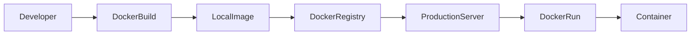
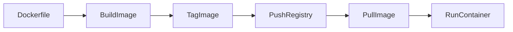
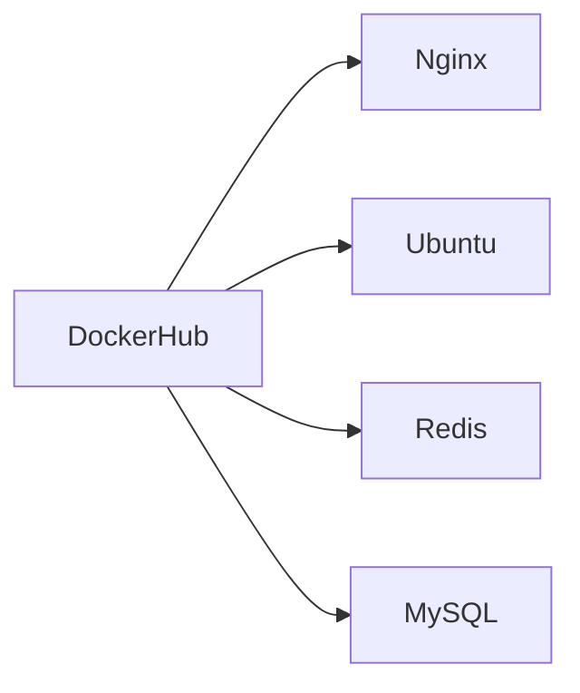
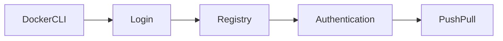
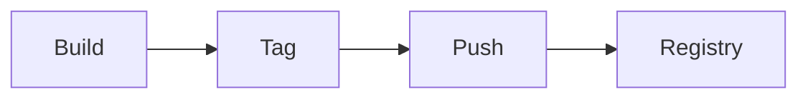
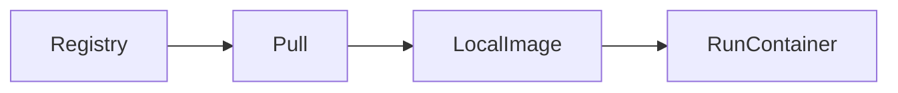
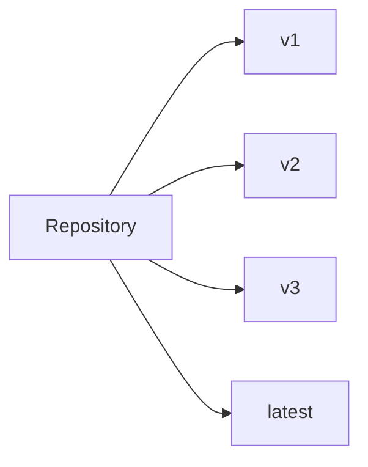

# Docker Registry

## Overview

A **Docker Registry** is a centralized repository used to **store, manage, and distribute Docker Images**.

After building an image locally, it can be pushed to a registry so that other developers, CI/CD pipelines, or production servers can pull and run the same image.

Docker supports both:

- Public Registries
- Private Registries

The most commonly used registry is **Docker Hub**.

> **Interview Point**
>
> **Docker Registry** is the service that stores images.
>
> **Docker Hub** is Docker's default public registry.

---

## Why It Is Used

Docker Registries are used to:

- Store Docker Images
- Share images across teams
- Version container images
- Support CI/CD pipelines
- Deploy applications consistently
- Maintain private application images

---

## Architecture / Working



---

## Key Components

| Component | Purpose |
|-----------|----------|
| Docker Registry | Stores Docker Images |
| Docker Hub | Public Docker Registry |
| Repository | Collection of image versions |
| Image Tag | Identifies image version |
| Docker Client | Pushes and pulls images |

---

## Types (if applicable)

| Registry Type | Description |
|--------------|-------------|
| Public Registry | Accessible by everyone |
| Private Registry | Accessible only to authorized users |
| Self-Hosted Registry | Managed within an organization |

Examples:

- Docker Hub
- Azure Container Registry (ACR)
- Amazon Elastic Container Registry (ECR)
- Google Artifact Registry
- Harbor

> **Interview Point**
>
> Enterprises typically use **private registries** for internal applications.

---

## Lifecycle / Workflow



---

## Configuration / Syntax (if applicable)

Login

```bash
docker login
```

Build image

```bash
docker build -t username/myapp:v1 .
```

Push

```bash
docker push username/myapp:v1
```

Pull

```bash
docker pull username/myapp:v1
```

Run

```bash
docker run username/myapp:v1
```

---

## Important Commands (if applicable)

```bash
docker login

docker logout

docker push

docker pull

docker tag

docker search
```

---

## Important Files (if applicable)

| File | Purpose |
|------|----------|
| Dockerfile | Builds images |
| ~/.docker/config.json | Stores Docker client authentication information |

---

## Real-World Use Cases

- CI/CD pipelines
- Production deployments
- Kubernetes image storage
- Version-controlled application releases
- Team collaboration

---

## Advantages

- Centralized image storage
- Version control
- Easy distribution
- Supports automation
- Reusable images

---

## Limitations

- Requires authentication for private repositories
- Large images increase transfer time
- Network dependency

---

## Common Interview Questions (Concept Only)

- What is a Docker Registry?
- What is Docker Hub?
- Difference between Registry and Repository?
- Why are registries used in CI/CD?
- Public vs Private Registry?

---

## Common Mistakes

- Forgetting to tag images before pushing
- Pushing images to the wrong repository
- Using `latest` for production releases
- Forgetting to authenticate

---

## Troubleshooting

| Problem | Solution |
|----------|----------|
| Push denied | Verify authentication and repository permissions |
| Image not found | Confirm the repository name and tag |
| Unauthorized | Run `docker login` with valid credentials |
| Slow pull | Optimize image size and use a closer registry mirror if available |

---

## Summary

Docker Registries provide centralized storage and distribution for Docker Images, enabling consistent deployments and collaboration across development, testing, and production environments.

---

# Docker Hub

## Overview

Docker Hub is Docker's **official cloud-based public registry**.

It hosts millions of Docker Images and is the default registry used by Docker.

If no registry is specified, Docker automatically pulls images from Docker Hub.

Example

```bash
docker pull nginx
```

actually pulls

```
docker.io/library/nginx
```

---

## Why It Is Used

Docker Hub provides:

- Public images
- Private repositories
- Image versioning
- Team collaboration
- Automated builds

---

## Architecture / Working



---

## Key Components

| Component | Purpose |
|-----------|----------|
| Repository | Stores images |
| Tags | Image versions |
| Users | Image owners |
| Organizations | Team management |

---

## Configuration / Syntax (if applicable)

Search image

```bash
docker search nginx
```

Pull image

```bash
docker pull nginx
```

---

## Important Commands (if applicable)

```bash
docker search

docker pull

docker push

docker login
```

---

## Real-World Use Cases

- Pulling official images
- Sharing custom images
- CI/CD pipelines
- Development environments

---

## Advantages

- Free public repositories
- Large ecosystem
- Official images
- Easy integration

---

## Limitations

- Pull rate limits for anonymous users
- Public repositories are visible to everyone
- Private repositories may require a paid plan depending on usage

---

## Common Interview Questions (Concept Only)

- What is Docker Hub?
- Why is Docker Hub popular?
- What are Official Images?

---

## Common Mistakes

- Using unofficial images without verification
- Depending on the `latest` tag

---

## Troubleshooting

| Problem | Solution |
|----------|----------|
| Image unavailable | Verify the repository name and tag |
| Pull limit exceeded | Authenticate or use a private registry if appropriate |

---

## Summary

Docker Hub is the default Docker Registry used worldwide for storing and sharing container images.

---

# Login & Logout

## Overview

Authentication is required before pushing images to private repositories and may also be required to increase pull limits.

Docker stores login credentials locally after successful authentication.

---

## Why It Is Used

Authentication provides:

- Secure access
- Image ownership verification
- Repository permissions
- Private repository access

---

## Architecture / Working



---

## Configuration / Syntax (if applicable)

Login

```bash
docker login
```

Specify registry

```bash
docker login myregistry.example.com
```

Logout

```bash
docker logout
```

Logout from specific registry

```bash
docker logout myregistry.example.com
```

---

## Important Commands (if applicable)

```bash
docker login

docker logout
```

---

## Important Files (if applicable)

| File | Purpose |
|------|----------|
| ~/.docker/config.json | Stores authentication configuration |

---

## Real-World Use Cases

- Azure Container Registry
- Docker Hub
- Amazon ECR
- Google Artifact Registry

---

## Advantages

- Secure authentication
- Supports private repositories
- Enables automated pipelines

---

## Limitations

- Credentials should be protected
- Avoid storing plaintext credentials without a credential helper

---

## Common Interview Questions (Concept Only)

- Why is `docker login` required?
- Where are Docker credentials stored?
- How do you log out?

---

## Common Mistakes

- Forgetting to log in before pushing
- Committing authentication files to source control

---

## Troubleshooting

| Problem | Solution |
|----------|----------|
| Login failed | Verify username, password, or access token |
| Unauthorized | Confirm repository permissions |

---

## Summary

Authentication enables secure interaction with Docker Registries and is required for most private repository operations.

---

# Push Images

## Overview

`docker push` uploads a local Docker Image to a registry.

Before pushing, the image must be correctly tagged with the destination repository.

---

## Why It Is Used

Push is required for:

- CI/CD
- Production deployment
- Team collaboration
- Image distribution

---

## Lifecycle / Workflow



---

## Configuration / Syntax (if applicable)

Build

```bash
docker build -t myapp:v1 .
```

Tag

```bash
docker tag myapp:v1 username/myapp:v1
```

Push

```bash
docker push username/myapp:v1
```

---

## Important Commands (if applicable)

```bash
docker push

docker tag
```

---

## Real-World Use Cases

- Deploying to Kubernetes
- Azure DevOps pipelines
- Jenkins pipelines
- GitHub Actions

---

## Advantages

- Centralized distribution
- Version management
- Easy deployment

---

## Limitations

- Requires authentication
- Image upload time depends on size and network speed

---

## Common Interview Questions (Concept Only)

- How do you push an image?
- Why must an image be tagged before pushing?

---

## Common Mistakes

- Forgetting to tag the image with the target repository
- Pushing the wrong version
- Attempting to push without authentication

---

## Troubleshooting

| Problem | Solution |
|----------|----------|
| Push rejected | Verify repository name, authentication, and permissions |
| Repository not found | Create the repository or correct the image tag |

---

## Summary

`docker push` uploads Docker Images to registries for sharing and deployment.

---

# Pull Images

## Overview

`docker pull` downloads Docker Images from a registry to the local system.

Docker checks local images before downloading layers, avoiding duplicate downloads.

---

## Why It Is Used

Used to:

- Download application images
- Deploy applications
- Update container versions
- Retrieve official images

---

## Lifecycle / Workflow



---

## Configuration / Syntax (if applicable)

Pull latest

```bash
docker pull nginx
```

Pull specific version

```bash
docker pull nginx:1.27
```

---

## Important Commands (if applicable)

```bash
docker pull

docker images
```

---

## Real-World Use Cases

- Production deployment
- Kubernetes nodes
- Local development
- CI/CD pipelines

---

## Advantages

- Fast downloads using cached layers
- Simple deployment
- Version selection

---

## Limitations

- Requires network access
- Large images take longer to download

---

## Common Interview Questions (Concept Only)

- What does `docker pull` do?
- What happens if the image already exists locally?

---

## Common Mistakes

- Pulling `latest` instead of a fixed version
- Pulling from the wrong repository

---

## Troubleshooting

| Problem | Solution |
|----------|----------|
| Image not found | Verify repository name and tag |
| Access denied | Authenticate if pulling from a private repository |

---

## Summary

`docker pull` retrieves images from registries for local use or deployment.

---

# Repository Tags

## Overview

A Repository Tag identifies a specific version of a Docker Image.

Format:

```text
repository:tag
```

Example

```text
myapp:v1.0.0
```

Without specifying a tag, Docker defaults to:

```text
latest
```

---

## Why It Is Used

Tags provide:

- Version control
- Rollback capability
- Stable deployments
- Release management

---

## Architecture / Working



---

## Key Components

| Component | Purpose |
|-----------|----------|
| Repository | Image collection |
| Tag | Specific image version |
| Digest | Immutable image identifier |

---

## Configuration / Syntax (if applicable)

Tag image

```bash
docker tag myapp:v1 username/myapp:v1
```

Push

```bash
docker push username/myapp:v1
```

Pull

```bash
docker pull username/myapp:v1
```

List local images

```bash
docker images
```

---

## Important Commands (if applicable)

```bash
docker tag

docker images

docker push

docker pull
```

---

## Real-World Use Cases

- Application versioning
- Production releases
- Rollbacks
- Blue/Green deployments
- CI/CD pipelines

---

## Advantages

- Easy version identification
- Reliable deployments
- Supports release management

---

## Limitations

- Tags are mutable and can be reassigned
- Poor tagging practices can cause deployment confusion

> **Interview Point**
>
> Prefer immutable version tags (for example, `v1.2.3`) over relying on `latest` in production environments.

---

## Common Interview Questions (Concept Only)

- What is a Docker Tag?
- Why avoid using `latest` in production?
- Difference between an Image Tag and an Image Digest?
- How do you tag an existing image?

---

## Common Mistakes

- Reusing the same tag for different image contents
- Not following a consistent versioning strategy
- Forgetting to update deployment manifests after changing tags

---

## Troubleshooting

| Problem | Solution |
|----------|----------|
| Incorrect version deployed | Use explicit version tags and verify deployment configuration |
| Image not found | Confirm the repository name and tag exist in the registry |

---

## Summary

Repository Tags provide version control for Docker Images and are essential for predictable deployments, CI/CD pipelines, and application release management.
