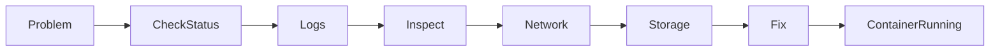
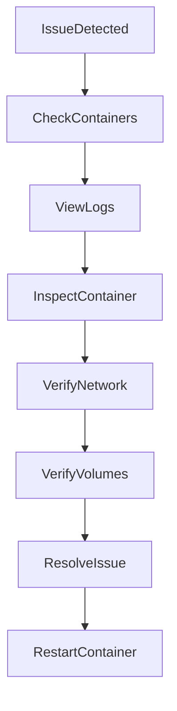
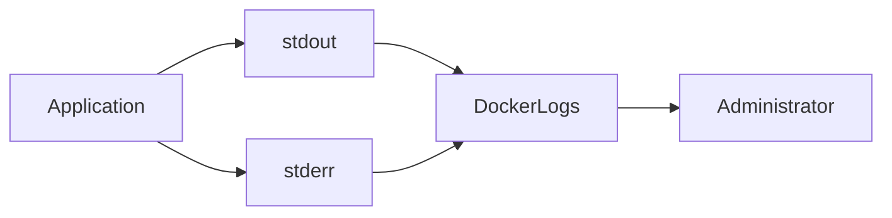
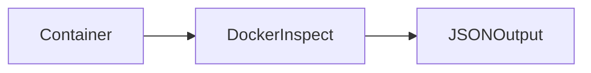
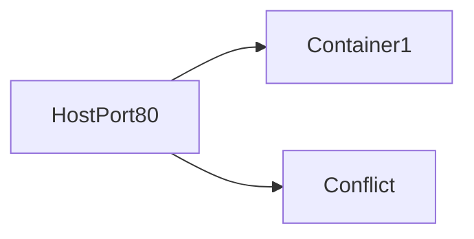
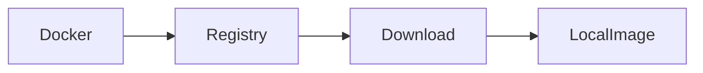

# Docker Troubleshooting

## Overview

Docker Troubleshooting is the process of identifying, diagnosing, and resolving issues related to Docker Images, Containers, Networks, Volumes, and the Docker Engine.

Troubleshooting is one of the **most frequently tested skills** in DevOps and Docker interviews because real-world production environments regularly experience container failures.

Typical troubleshooting workflow:

1. Check container status
2. View logs
3. Inspect container configuration
4. Verify networking
5. Verify storage
6. Verify image availability
7. Restart or recreate container

> **Interview Point**
>
> The first three commands every DevOps Engineer should know during troubleshooting are:
>
> ```bash
> docker ps -a
> docker logs <container>
> docker inspect <container>
> ```

---

## Why It Is Used

Docker troubleshooting helps to:

- Identify application failures
- Diagnose deployment problems
- Fix networking issues
- Resolve storage problems
- Recover failed containers
- Minimize production downtime

---

## Architecture / Working



---

## Key Components

| Component | Purpose |
|-----------|----------|
| docker ps | Check container status |
| docker logs | View application logs |
| docker inspect | Inspect container configuration |
| docker exec | Access running container |
| docker network | Troubleshoot networking |
| docker volume | Verify storage |
| Docker Engine | Manages containers |

---

## Types (if applicable)

Common Docker issues include:

- Container startup failures
- Application crashes
- Port conflicts
- Missing volumes
- Image download failures
- Network connectivity issues
- Permission problems

---

## Lifecycle / Workflow



---

## Configuration / Syntax (if applicable)

General troubleshooting commands:

```bash
docker ps -a

docker logs container_name

docker inspect container_name

docker exec -it container_name bash

docker restart container_name
```

---

## Important Commands (if applicable)

```bash
docker ps

docker ps -a

docker logs

docker inspect

docker exec

docker restart

docker stop

docker start

docker port

docker volume

docker network

docker events

docker system df

docker system prune
```

---

## Important Files (if applicable)

| File | Purpose |
|------|----------|
| `/var/lib/docker/containers/` | Container metadata and logs (Linux) |
| `/etc/docker/daemon.json` | Docker daemon configuration |
| `~/.docker/config.json` | Docker client authentication settings |
| Dockerfile | Image build instructions |
| `docker-compose.yml` | Multi-container configuration |

---

## Real-World Use Cases

- Production container failures
- CI/CD pipeline debugging
- Kubernetes image issues
- Database container recovery
- Microservice troubleshooting
- Docker host maintenance

---

## Advantages

- Fast issue identification
- Minimal downtime
- Easier root cause analysis
- Improved production stability
- Better monitoring and debugging

---

## Limitations

- Logs may be unavailable if containers are removed
- Minimal container images may not include debugging tools
- Troubleshooting often requires access to the Docker host

---

# Viewing Logs

## Overview

Container logs provide the first indication of why an application failed.

Logs are generated from the container's **stdout** and **stderr** streams.

> **Interview Point**
>
> Most Docker troubleshooting begins with:
>
> ```bash
> docker logs <container>
> ```

---

## Why It Is Used

Logs help identify:

- Application crashes
- Configuration issues
- Startup failures
- Runtime exceptions
- Dependency problems

---

## Architecture / Working



---

## Configuration / Syntax (if applicable)

View logs

```bash
docker logs web
```

Follow logs

```bash
docker logs -f web
```

Show last 100 lines

```bash
docker logs --tail 100 web
```

Show timestamps

```bash
docker logs --timestamps web
```

---

## Important Commands (if applicable)

```bash
docker logs

docker logs -f

docker logs --tail

docker logs --timestamps
```

---

## Real-World Use Cases

- Debug startup failures
- Monitor applications
- Investigate production incidents

---

## Advantages

- Simple debugging
- Real-time monitoring
- Easy access to application output

---

## Limitations

- Logs disappear if the container is removed (unless centralized logging is configured)
- Excessive logging can consume disk space

---

## Common Interview Questions (Concept Only)

- What does `docker logs` display?
- Difference between stdout and stderr?
- How do you monitor logs in real time?

---

## Common Mistakes

- Removing failed containers before reviewing logs
- Not following logs during troubleshooting

---

## Troubleshooting

| Problem | Solution |
|----------|----------|
| No logs displayed | Verify the application writes to stdout/stderr |
| Logs stop unexpectedly | Check if the container exited |

---

## Summary

Container logs are the primary source for diagnosing Docker application failures.

---

# Inspecting Containers

## Overview

`docker inspect` provides complete configuration details about a container or image in JSON format.

It is commonly used to diagnose networking, storage, restart policies, and environment configuration.

---

## Why It Is Used

Inspect provides:

- IP Address
- Mounted volumes
- Restart policies
- Environment variables
- Network settings
- Image details

---

## Architecture / Working



---

## Configuration / Syntax (if applicable)

Inspect container

```bash
docker inspect web
```

Inspect image

```bash
docker inspect nginx
```

Inspect network

```bash
docker inspect bridge
```

---

## Important Commands (if applicable)

```bash
docker inspect
```

---

## Real-World Use Cases

- Find container IP
- Verify environment variables
- Check mounted volumes
- Validate restart policy

---

## Advantages

- Complete configuration details
- Useful for debugging

---

## Limitations

- JSON output can be extensive and may require filtering

---

## Common Interview Questions (Concept Only)

- What information does `docker inspect` provide?
- How do you determine a container's IP address?

---

## Common Mistakes

- Confusing `docker inspect` with `docker logs`

---

## Troubleshooting

| Problem | Solution |
|----------|----------|
| Missing volume | Verify the Mounts section in the inspect output |
| Incorrect IP | Check the Networks section |

---

## Summary

`docker inspect` is one of the most valuable tools for troubleshooting Docker containers.

---

# Port Conflicts

## Overview

Port conflicts occur when two services attempt to use the same host port.

Example:

```
Nginx -> Port 80

Apache -> Port 80
```

Only one process can bind to the same host port.

---

## Why It Is Used

Understanding port conflicts helps prevent deployment failures.

---

## Architecture / Working



---

## Configuration / Syntax (if applicable)

Run container

```bash
docker run -p 8080:80 nginx
```

Check running containers

```bash
docker ps
```

Check port mapping

```bash
docker port web
```

---

## Important Commands (if applicable)

```bash
docker ps

docker port

docker inspect

ss -tulpn

netstat -tulpn
```

---

## Real-World Use Cases

- Multiple web servers
- Kubernetes NodePort conflicts
- Development environments

---

## Advantages

- Easy to detect
- Simple to resolve

---

## Limitations

- Host ports must be unique

---

## Common Interview Questions (Concept Only)

- Why does "port already allocated" occur?
- How do you resolve Docker port conflicts?

---

## Common Mistakes

- Mapping multiple containers to the same host port
- Forgetting existing services already use the port

---

## Troubleshooting

| Error | Solution |
|--------|----------|
| Bind for 0.0.0.0 failed | Use another host port or stop the conflicting service |
| Port already allocated | Identify the process using the port and free it |

---

## Summary

Port conflicts occur when multiple services compete for the same host port and are resolved by using unique host ports or stopping conflicting services.

---

# Volume Issues

## Overview

Volumes provide persistent storage for containers.

Most volume-related problems occur because of:

- Incorrect mount paths
- Permission issues
- Missing volumes
- Wrong bind mount directories

---

## Why It Is Used

Troubleshooting volumes prevents data loss and application failures.

---

## Architecture / Working


---

## Configuration / Syntax (if applicable)

List volumes

```bash
docker volume ls
```

Inspect volume

```bash
docker volume inspect data
```

Mount volume

```bash
docker run -v data:/app nginx
```

---

## Important Commands (if applicable)

```bash
docker volume ls

docker volume inspect

docker volume rm
```

---

## Real-World Use Cases

- Database persistence
- Shared application storage
- Backup and restore operations

---

## Advantages

- Persistent data
- Easy backup
- Shared storage

---

## Limitations

- Permission mismatches between host and container can cause access issues
- Removing volumes permanently deletes stored data

---

## Common Interview Questions (Concept Only)

- Why isn't data persisting?
- Difference between volumes and bind mounts?

---

## Common Mistakes

- Storing important data only inside containers
- Removing volumes accidentally

---

## Troubleshooting

| Problem | Solution |
|----------|----------|
| Data missing | Verify the mount path and volume mapping |
| Permission denied | Correct file ownership and permissions |

---

## Summary

Most Docker storage issues are caused by incorrect volume mounts or file permissions.

---

# Image Pull Failures

## Overview

Image pull failures occur when Docker cannot download an image from a registry.

---

## Why It Is Used

Understanding pull failures helps diagnose registry and deployment issues.

---

## Common Causes

- Incorrect image name
- Incorrect tag
- Authentication failure
- Network problems
- Private repository access
- Registry unavailable

---

## Architecture / Working



---

## Configuration / Syntax (if applicable)

Pull image

```bash
docker pull nginx
```

Login

```bash
docker login
```

---

## Important Commands (if applicable)

```bash
docker pull

docker login

docker logout

docker search
```

---

## Real-World Use Cases

- CI/CD pipelines
- Kubernetes deployments
- Production servers

---

## Advantages

- Easy diagnosis
- Clear error messages

---

## Limitations

- Dependent on network connectivity and registry availability

---

## Common Interview Questions (Concept Only)

- Why does `docker pull` fail?
- What causes "image not found"?

---

## Common Mistakes

- Typographical errors in repository names
- Using non-existent tags
- Attempting to access private repositories without authentication

---

## Troubleshooting

| Error | Solution |
|--------|----------|
| Image not found | Verify the repository name and tag |
| Access denied | Authenticate and verify permissions |
| Network timeout | Check internet connectivity and registry status |

---

## Summary

Most image pull failures are caused by incorrect image names, invalid tags, authentication issues, or connectivity problems.

---

# Container Exit Issues

## Overview

Containers that exit immediately usually indicate an application or configuration problem.

A healthy container should continue running while its primary process is active.

> **Interview Point**
>
> If the main process inside a container stops, the container also stops.

---

## Why It Is Used

Understanding exit issues helps restore failed production applications.

---

## Common Causes

- Application crash
- Invalid configuration
- Missing dependencies
- Incorrect command
- Missing environment variables
- Port conflicts
- Permission issues

---

## Architecture / Working


---

## Configuration / Syntax (if applicable)

View exited containers

```bash
docker ps -a
```

View logs

```bash
docker logs web
```

Restart

```bash
docker restart web
```

Inspect exit code

```bash
docker inspect web
```

---

## Important Commands (if applicable)

```bash
docker ps -a

docker logs

docker inspect

docker restart
```

---

## Real-World Use Cases

- Failed deployments
- Database startup failures
- Missing configuration files
- Invalid environment variables

---

## Advantages

- Easy to diagnose with logs and inspect output
- Exit codes provide clues about failures

---

## Limitations

- Some failures require application-level debugging beyond Docker

---

## Common Interview Questions (Concept Only)

- Why does a Docker container exit immediately?
- How do you troubleshoot a container in the Exited state?
- What happens when the main process terminates?

---

## Common Mistakes

- Assuming Docker is at fault when the application is crashing
- Restarting containers repeatedly without reviewing logs
- Ignoring container exit codes

---

## Troubleshooting

| Problem | Solution |
|----------|----------|
| Container exits instantly | Review `docker logs` and inspect the container configuration |
| Restart loop | Verify the application, configuration, and restart policy |
| Exit code 127 | Confirm the command or executable exists inside the image |
| Exit code 137 | Investigate memory limits or forced termination (SIGKILL) |

---

## Summary

Most Docker troubleshooting follows a consistent workflow:

1. Check the container status with `docker ps -a`
2. Review logs using `docker logs`
3. Inspect configuration using `docker inspect`
4. Verify networking, ports, and volumes
5. Correct the issue and restart or recreate the container

Following this structured approach helps quickly identify and resolve the majority of Docker issues encountered in development and production environments.
