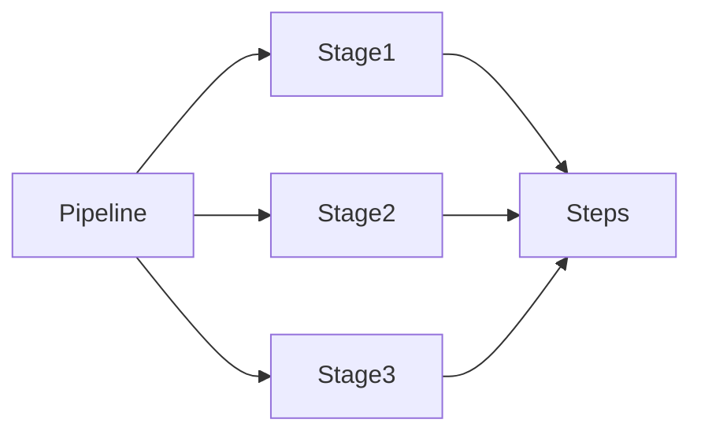
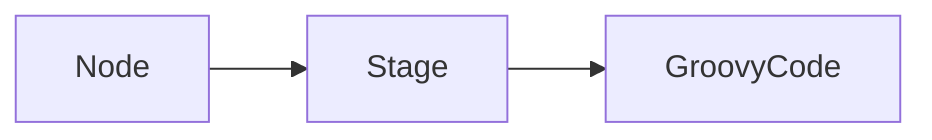
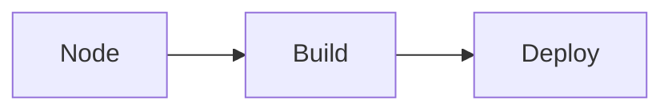
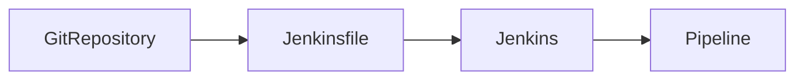
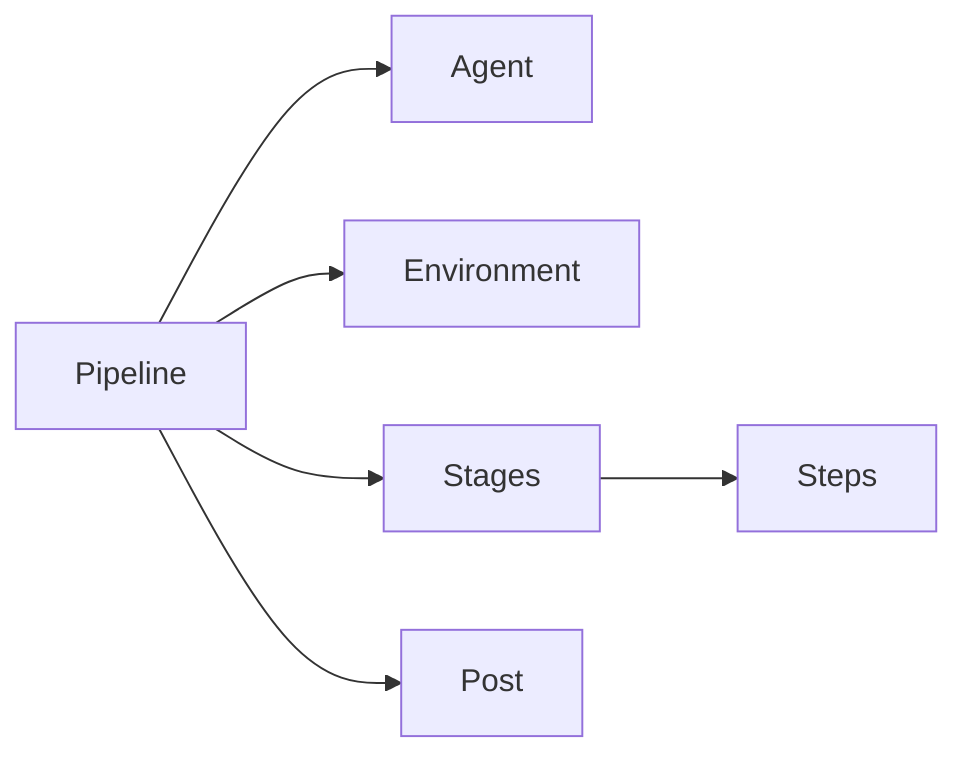

# Jenkins Pipeline

## Overview

A **Jenkins Pipeline** is a collection of automated steps that define the complete **CI/CD workflow** of an application.

Instead of configuring jobs manually through the Jenkins UI, pipelines define the workflow as **code** using a **Jenkinsfile** stored in a source code repository.

A pipeline can automate:

- Source code checkout
- Build
- Unit testing
- Code quality analysis
- Docker image creation
- Artifact publishing
- Infrastructure provisioning
- Application deployment
- Notifications

> **Interview Point**
>
> A Jenkins Pipeline implements the concept of **Pipeline as Code**, where the CI/CD workflow is version-controlled alongside the application source code.

---

## Why It Is Used

Jenkins Pipelines help organizations:

- Automate software delivery
- Eliminate manual deployment steps
- Standardize CI/CD processes
- Improve build consistency
- Enable Continuous Integration
- Enable Continuous Delivery
- Support Infrastructure as Code (IaC)
- Easily reproduce builds

---

## Architecture / Working


---

## Key Components

| Component | Purpose |
|------------|----------|
| Jenkinsfile | Defines the pipeline workflow |
| Pipeline | Complete CI/CD workflow |
| Stage | Logical phase of execution |
| Step | Individual task inside a stage |
| Agent | Executes the pipeline |
| Workspace | Directory where the pipeline runs |
| Environment Variables | Store configuration values |
| Post Actions | Execute tasks after pipeline completion |

---

## Types (if applicable)

| Pipeline Type | Description | Recommended |
|---------------|-------------|-------------|
| Declarative Pipeline | Structured, simplified syntax | ✅ Yes |
| Scripted Pipeline | Full Groovy scripting | Used for advanced workflows |

---

## Lifecycle / Workflow


---

## Configuration / Syntax (if applicable)

Basic Pipeline Structure

```groovy
pipeline {

    agent any

    stages {

        stage('Build') {

            steps {

                echo 'Building Application'

            }

        }

        stage('Test') {

            steps {

                echo 'Running Tests'

            }

        }

        stage('Deploy') {

            steps {

                echo 'Deploying Application'

            }

        }

    }

}
```

---

## Important Commands (if applicable)

Restart Jenkins

```bash
sudo systemctl restart jenkins
```

Check Jenkins Status

```bash
sudo systemctl status jenkins
```

View Logs

```bash
journalctl -u jenkins
```

View Workspace

```bash
ls /var/lib/jenkins/workspace/
```

---

## Important Files (if applicable)

| File | Purpose |
|------|----------|
| Jenkinsfile | Pipeline definition |
| config.xml | Job configuration |
| /var/lib/jenkins/workspace | Build workspace |
| /var/lib/jenkins/jobs | Job configuration |
| /var/lib/jenkins/plugins | Installed plugins |

---

## Real-World Use Cases

- Java CI/CD
- Docker image builds
- Kubernetes deployments
- Terraform automation
- Azure deployments
- AWS deployments
- Automated testing
- Multi-stage deployments

---

## Advantages

- Pipeline as Code
- Version controlled
- Repeatable builds
- Easy collaboration
- Supports complex workflows
- Easy rollback using Git
- Supports distributed builds

---

## Limitations

- Requires learning Pipeline syntax
- Complex pipelines require careful design
- Scripted Pipelines can become difficult to maintain
- Poor pipeline design increases execution time

---

## Common Interview Questions (Concept Only)

- What is Jenkins Pipeline?
- What is Pipeline as Code?
- Why use Jenkins Pipeline instead of Freestyle Jobs?
- What are Stages?
- What are Steps?
- What is an Agent?
- What is a Jenkinsfile?
- How is Pipeline stored?

---

## Common Mistakes

- Hardcoding credentials
- Creating one large stage instead of multiple logical stages
- Ignoring workspace cleanup
- Not storing Jenkinsfile in Git
- Running builds on the controller
- Not using environment variables

---

## Troubleshooting

| Problem | Solution |
|----------|----------|
| Pipeline fails | Review Console Output |
| Syntax error | Validate Jenkinsfile syntax |
| Stage skipped | Verify stage conditions |
| Workspace issues | Clean workspace |
| SCM checkout failure | Verify Git credentials |
| Agent unavailable | Verify node connectivity |

---

## Summary

Jenkins Pipeline automates the complete software delivery lifecycle using **Pipeline as Code**. It is the preferred approach over Freestyle Projects because it is scalable, maintainable, and stored in version control.

---

# Pipeline Concepts

## Overview

A Jenkins Pipeline consists of multiple components working together to automate CI/CD.

The main concepts are:

- Pipeline
- Stage
- Step
- Agent
- Workspace
- Environment Variables
- Post Actions

---

## Why It Is Used

These concepts divide complex CI/CD workflows into manageable stages.

---

## Architecture / Working



---

## Key Components

| Component | Description |
|------------|-------------|
| Pipeline | Entire workflow |
| Stage | Major phase |
| Step | Individual command |
| Agent | Executes jobs |
| Workspace | Build directory |
| Environment | Variables |
| Post | Executes after build |

---

## Types (if applicable)

Typical pipeline stages

- Checkout
- Build
- Test
- Package
- Publish
- Deploy

---

## Lifecycle / Workflow


---

## Configuration / Syntax (if applicable)

Example

```groovy
stage('Build') {

    steps {

        echo 'Build Started'

    }

}
```

---

## Important Commands (if applicable)

Not applicable.

---

## Important Files (if applicable)

```
Jenkinsfile
```

---

## Real-World Use Cases

- CI pipelines
- Docker build pipelines
- Kubernetes deployment pipelines

---

## Advantages

- Organized workflow
- Easy debugging
- Better readability

---

## Limitations

- Poor stage design affects maintainability

---

## Common Interview Questions (Concept Only)

- What is a Stage?
- What is a Step?
- What is an Agent?
- What is Workspace?

---

## Common Mistakes

- Too many unrelated steps inside one stage
- No logical separation

---

## Troubleshooting

- Review stage logs
- Verify workspace

---

## Summary

Pipeline Concepts divide the CI/CD workflow into reusable, manageable stages.

---

# Declarative Pipeline

## Overview

A **Declarative Pipeline** is the recommended Jenkins Pipeline syntax.

It provides a structured format with built-in validation.

> **Interview Point**
>
> Declarative Pipelines are used in most production environments because they are easier to read, maintain, and validate.

---

## Why It Is Used

- Simpler syntax
- Easier maintenance
- Built-in validation
- Better readability
- Consistent structure

---

## Architecture / Working


---

## Key Components

- pipeline
- agent
- stages
- stage
- steps
- environment
- post

---

## Types (if applicable)

Not applicable.

---

## Lifecycle / Workflow


---

## Configuration / Syntax (if applicable)

```groovy
pipeline {

    agent any

    stages {

        stage('Build') {

            steps {

                echo 'Hello'

            }

        }

    }

}
```

---

## Important Commands (if applicable)

Not applicable.

---

## Important Files (if applicable)

```
Jenkinsfile
```

---

## Real-World Use Cases

- Enterprise CI/CD
- Production deployments

---

## Advantages

- Easy to read
- Standardized
- Recommended

---

## Limitations

- Less flexible than Scripted Pipeline

---

## Common Interview Questions (Concept Only)

- What is Declarative Pipeline?
- Why is it recommended?

---

## Common Mistakes

- Mixing Scripted syntax incorrectly
- Ignoring stage organization

---

## Troubleshooting

- Validate syntax
- Review Console Output

---

## Summary

Declarative Pipeline is the recommended approach for modern Jenkins CI/CD workflows.

---

# Scripted Pipeline

## Overview

A **Scripted Pipeline** is a Groovy-based Jenkins Pipeline that provides complete programming flexibility.

It is primarily used for highly customized workflows.

> **Interview Point**
>
> Scripted Pipelines are powerful but harder to read and maintain than Declarative Pipelines.

---

## Why It Is Used

- Complex logic
- Dynamic pipelines
- Conditional execution
- Advanced scripting

---

## Architecture / Working



---

## Key Components

- node
- stage
- Groovy
- steps

---

## Types (if applicable)

Not applicable.

---

## Lifecycle / Workflow



---

## Configuration / Syntax (if applicable)

```groovy
node {

    stage('Build') {

        echo 'Building'

    }

}
```

---

## Important Commands (if applicable)

Not applicable.

---

## Important Files (if applicable)

```
Jenkinsfile
```

---

## Real-World Use Cases

- Dynamic deployments
- Custom workflows
- Shared libraries

---

## Advantages

- Highly flexible
- Supports advanced logic

---

## Limitations

- Difficult to maintain
- More complex
- No strict structure

---

## Common Interview Questions (Concept Only)

- What is Scripted Pipeline?
- Difference between Declarative and Scripted Pipeline?

---

## Common Mistakes

- Writing overly complex Groovy code
- Poor readability

---

## Troubleshooting

- Review Groovy syntax
- Check Console Output

---

## Summary

Scripted Pipelines provide maximum flexibility but are generally used only when Declarative Pipelines cannot satisfy the required workflow.

---

# Jenkinsfile

## Overview

A **Jenkinsfile** is a text file that contains the Jenkins Pipeline definition.

It is stored in the root of the Git repository.

> **Interview Point**
>
> The Jenkinsfile enables **Pipeline as Code**, allowing the pipeline definition to be version-controlled with the application code.

---

## Why It Is Used

- Version control
- Reproducibility
- Team collaboration
- Easier maintenance
- CI/CD automation

---

## Architecture / Working



---

## Key Components

- pipeline
- stages
- steps
- agent
- environment
- post

---

## Types (if applicable)

| Type | Description |
|------|-------------|
| Declarative Jenkinsfile | Recommended |
| Scripted Jenkinsfile | Advanced |

---

## Lifecycle / Workflow


---

## Configuration / Syntax (if applicable)

Example

```groovy
pipeline {

    agent any

    stages {

        stage('Build') {

            steps {

                echo 'Hello World'

            }

        }

    }

}
```

---

## Important Commands (if applicable)

Not applicable.

---

## Important Files (if applicable)

```
Jenkinsfile
```

---

## Real-World Use Cases

- CI/CD
- Docker builds
- Azure deployment
- Kubernetes deployment

---

## Advantages

- Version controlled
- Easy rollback
- Repeatable builds

---

## Limitations

- Syntax learning curve

---

## Common Interview Questions (Concept Only)

- What is Jenkinsfile?
- Where is Jenkinsfile stored?
- Why store Jenkinsfile in Git?

---

## Common Mistakes

- Keeping Jenkinsfile outside the repository
- Hardcoding secrets
- Large monolithic Jenkinsfiles

---

## Troubleshooting

- Validate syntax
- Verify repository path
- Check pipeline logs

---

## Summary

The Jenkinsfile is the foundation of Pipeline as Code and is considered a best practice for modern Jenkins implementations.

---

# Pipeline Syntax

## Overview

Pipeline Syntax defines the structure and keywords used to write Jenkins Pipelines.

---

## Why It Is Used

Pipeline Syntax ensures:

- Standardization
- Readability
- Validation
- Automation

---

## Architecture / Working



---

## Key Components

| Keyword | Purpose |
|----------|----------|
| pipeline | Root block |
| agent | Execution environment |
| stages | Collection of stages |
| stage | Pipeline phase |
| steps | Commands |
| environment | Variables |
| post | Actions after execution |
| when | Conditional stage execution |
| parameters | User inputs |

---

## Types (if applicable)

Declarative Syntax

Scripted Syntax

---

## Lifecycle / Workflow


---

## Configuration / Syntax (if applicable)

Example

```groovy
pipeline {

    agent any

    environment {

        APP_NAME = "demo"

    }

    stages {

        stage('Build') {

            steps {

                echo "Building ${APP_NAME}"

            }

        }

    }

    post {

        always {

            echo "Pipeline Completed"

        }

    }

}
```

---

## Important Commands (if applicable)

Not applicable.

---

## Important Files (if applicable)

```
Jenkinsfile
```

---

## Real-World Use Cases

- CI/CD
- Enterprise deployments
- Infrastructure automation

---

## Advantages

- Standardized syntax
- Easy maintenance
- Built-in validation

---

## Limitations

- Learning curve for beginners

---

## Common Interview Questions (Concept Only)

- What is Pipeline Syntax?
- What are the main pipeline blocks?
- What is the purpose of the `post` block?
- What is the purpose of the `environment` block?
- What is the difference between `stage` and `steps`?

---

## Common Mistakes

- Incorrect block nesting
- Missing required pipeline blocks
- Mixing Declarative and Scripted syntax incorrectly
- Not validating Jenkinsfile syntax before committing

---

## Troubleshooting

| Problem | Solution |
|----------|----------|
| Syntax error | Use the Pipeline Syntax Generator or validate the Jenkinsfile |
| Pipeline fails to load | Check block hierarchy and matching braces |
| Stage not executed | Review `when` conditions and pipeline logic |

---

## Summary

Pipeline Syntax provides the standardized structure for Jenkins Pipelines. Understanding keywords such as `pipeline`, `agent`, `stages`, `steps`, `environment`, and `post` is essential for designing reliable, maintainable, and production-ready CI/CD pipelines.
