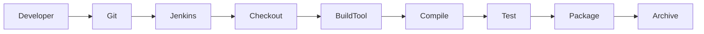
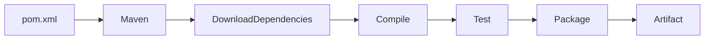
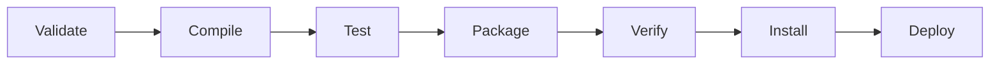
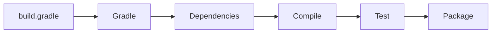
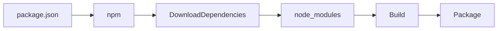

# Build Tools Integration

## Overview

**Build Tools Integration** is the process of connecting Jenkins with build tools such as **Maven**, **Gradle**, and **npm** to automate application compilation, dependency management, testing, packaging, and artifact generation.

Instead of manually executing build commands on a developer machine, Jenkins automatically runs the appropriate build tool during the CI/CD pipeline.

> **Interview Point**
>
> Jenkins does not build applications by itself. It invokes external build tools like Maven, Gradle, or npm to perform build-related tasks.

---

## Why It Is Used

Build Tool Integration helps to:

- Automate application builds
- Download project dependencies
- Compile source code
- Execute automated tests
- Package applications
- Generate build artifacts
- Standardize builds across environments

---

## Architecture / Working



---

## Key Components

| Component | Purpose |
|------------|----------|
| Jenkins | CI/CD Automation Server |
| Build Tool | Maven, Gradle, npm |
| Source Repository | Stores source code |
| Build Agent | Executes build |
| Artifact | Build output |
| Jenkinsfile | Defines build pipeline |

---

## Types (if applicable)

Common Build Tools

| Tool | Language |
|------|----------|
| Maven | Java |
| Gradle | Java, Kotlin |
| npm | JavaScript, Node.js |

---

## Lifecycle / Workflow


---

## Configuration / Syntax (if applicable)

Example Pipeline

```groovy
pipeline {

    agent any

    stages {

        stage('Build') {

            steps {

                sh 'mvn clean package'

            }

        }

    }

}
```

---

## Important Commands (if applicable)

Maven

```bash
mvn clean install
```

Gradle

```bash
gradle build
```

npm

```bash
npm install
npm run build
```

---

## Important Files (if applicable)

| File | Purpose |
|------|----------|
| Jenkinsfile | Pipeline definition |
| pom.xml | Maven configuration |
| build.gradle | Gradle configuration |
| package.json | npm configuration |

---

## Real-World Use Cases

- Java application builds
- Spring Boot applications
- React applications
- Angular applications
- Node.js microservices
- Enterprise CI/CD pipelines

---

## Advantages

- Automated builds
- Dependency management
- Repeatable builds
- Easy integration
- Supports testing
- Generates deployable artifacts

---

## Limitations

- Build tools must be installed on Jenkins agents
- Incorrect configuration causes build failures
- Dependency repositories must be accessible

---

## Common Interview Questions (Concept Only)

- What are build tools?
- Why does Jenkins require build tools?
- Which build tools are commonly used with Jenkins?
- What is dependency management?
- How does Jenkins execute Maven or Gradle builds?

---

## Common Mistakes

- Missing build tool installation
- Incorrect PATH configuration
- Hardcoding tool locations
- Ignoring dependency download failures
- Using incompatible JDK versions

---

## Troubleshooting

| Problem | Solution |
|----------|----------|
| Build tool not found | Install and configure the tool |
| Build failed | Review Console Output |
| Dependency download failed | Verify repository access |
| Java version mismatch | Configure correct JDK |
| Workspace issues | Clean workspace |

---

## Summary

Build Tool Integration enables Jenkins to automate application compilation, dependency management, testing, and packaging using tools such as Maven, Gradle, and npm.

---

# Maven

## Overview

**Maven** is the most widely used build automation and dependency management tool for Java applications.

It manages:

- Project structure
- Dependencies
- Compilation
- Testing
- Packaging
- Deployment

Maven follows the **Convention over Configuration** principle, reducing the amount of manual configuration required.

> **Interview Point**
>
> Maven automatically downloads project dependencies from remote repositories such as Maven Central.

---

## Why It Is Used

Maven helps to:

- Build Java projects
- Manage dependencies
- Execute unit tests
- Package applications
- Standardize builds
- Automate software delivery

---

## Architecture / Working



---

## Key Components

| Component | Purpose |
|------------|----------|
| pom.xml | Project configuration |
| Dependencies | Required libraries |
| Plugins | Additional functionality |
| Repository | Stores dependencies |
| Lifecycle | Defines build phases |

---

## Types (if applicable)

Common Maven Lifecycles

| Lifecycle | Purpose |
|-----------|----------|
| Default | Build application |
| Clean | Remove previous build files |
| Site | Generate documentation |

---

## Lifecycle / Workflow



---

## Configuration / Syntax (if applicable)

Basic Build

```bash
mvn clean package
```

Compile Only

```bash
mvn compile
```

Run Tests

```bash
mvn test
```

Install Package

```bash
mvn install
```

---

## Important Commands (if applicable)

| Command | Purpose |
|----------|----------|
| `mvn clean` | Delete previous build output |
| `mvn compile` | Compile source code |
| `mvn test` | Execute tests |
| `mvn package` | Create JAR/WAR |
| `mvn install` | Install artifact locally |
| `mvn deploy` | Publish artifact to remote repository |

---

## Important Files (if applicable)

| File | Purpose |
|------|----------|
| pom.xml | Maven project configuration |
| settings.xml | Maven configuration |
| target/ | Build output directory |

---

## Real-World Use Cases

- Spring Boot
- Microservices
- Enterprise Java
- REST APIs
- Jenkins CI/CD

---

## Advantages

- Automatic dependency management
- Standard project structure
- Rich plugin ecosystem
- Easy CI/CD integration
- Cross-platform

---

## Limitations

- XML configuration can become large
- Slower than Gradle for some projects
- Less flexible than Gradle

---

## Common Interview Questions (Concept Only)

- What is Maven?
- What is `pom.xml`?
- What are Maven lifecycles?
- Difference between `package` and `install`?
- What is Maven Central?

---

## Common Mistakes

- Incorrect dependency versions
- Missing plugins
- Wrong JDK version
- Ignoring dependency conflicts

---

## Troubleshooting

| Problem | Solution |
|----------|----------|
| Dependency not found | Verify repository and version |
| Build failed | Check `pom.xml` |
| Plugin error | Verify plugin version |
| Java version mismatch | Configure correct JDK |

---

## Summary

Maven is the industry-standard build automation tool for Java applications, providing dependency management, compilation, testing, and packaging through a standardized project structure and lifecycle.

---

# Gradle

## Overview

**Gradle** is a modern build automation tool that combines the flexibility of scripting with efficient dependency management.

Unlike Maven, Gradle uses the **Groovy** or **Kotlin DSL**, making build scripts shorter and more flexible.

> **Interview Point**
>
> Gradle is generally faster than Maven because it supports **incremental builds**, **build caching**, and **parallel execution**.

---

## Why It Is Used

Gradle helps to:

- Build Java applications
- Manage dependencies
- Execute tests
- Package applications
- Improve build performance

---

## Architecture / Working



---

## Key Components

| Component | Purpose |
|------------|----------|
| build.gradle | Build configuration |
| Plugins | Extend functionality |
| Dependencies | External libraries |
| Tasks | Individual build operations |

---

## Types (if applicable)

Gradle DSL

- Groovy DSL
- Kotlin DSL

---

## Lifecycle / Workflow


---

## Configuration / Syntax (if applicable)

Build Project

```bash
gradle build
```

Run Tests

```bash
gradle test
```

Clean Project

```bash
gradle clean
```

---

## Important Commands (if applicable)

| Command | Purpose |
|----------|----------|
| `gradle build` | Build project |
| `gradle clean` | Remove build files |
| `gradle test` | Execute tests |
| `gradle tasks` | List available tasks |
| `gradle dependencies` | Show dependency tree |

---

## Important Files (if applicable)

| File | Purpose |
|------|----------|
| build.gradle | Build configuration |
| settings.gradle | Project settings |
| gradle.properties | Configuration properties |
| build/ | Build output |

---

## Real-World Use Cases

- Spring Boot
- Android applications
- Enterprise Java
- CI/CD pipelines

---

## Advantages

- Faster builds
- Incremental compilation
- Flexible scripting
- Excellent plugin ecosystem

---

## Limitations

- Learning curve
- Script complexity
- More flexible, which can reduce consistency across projects

---

## Common Interview Questions (Concept Only)

- What is Gradle?
- Difference between Maven and Gradle?
- Why is Gradle faster?
- What is `build.gradle`?

---

## Common Mistakes

- Incorrect plugin versions
- Dependency conflicts
- Complex custom scripts

---

## Troubleshooting

| Problem | Solution |
|----------|----------|
| Build failure | Review Gradle output |
| Dependency issue | Refresh dependencies |
| Plugin missing | Verify plugin configuration |

---

## Summary

Gradle is a high-performance build automation tool that provides flexible scripting, dependency management, and efficient builds, making it popular for modern Java and Android projects.

---

# npm

## Overview

**npm (Node Package Manager)** is the default package manager for **Node.js** and is widely used to manage JavaScript project dependencies, execute scripts, and build frontend or backend applications.

Although npm originally stood for **Node Package Manager**, it is now considered a package manager for the JavaScript ecosystem.

> **Interview Point**
>
> npm is not only a package manager—it is also a task runner capable of executing build, test, and deployment scripts defined in `package.json`.

---

## Why It Is Used

npm helps to:

- Install project dependencies
- Manage package versions
- Execute build scripts
- Run automated tests
- Package JavaScript applications
- Support CI/CD pipelines

---

## Architecture / Working



---

## Key Components

| Component | Purpose |
|------------|----------|
| package.json | Project configuration |
| package-lock.json | Dependency version lock |
| node_modules | Installed packages |
| npm Registry | Package repository |
| Scripts | Build and automation tasks |

---

## Types (if applicable)

Dependency Types

| Type | Purpose |
|------|----------|
| Dependencies | Required in production |
| DevDependencies | Used only during development |

---

## Lifecycle / Workflow


---

## Configuration / Syntax (if applicable)

Install Dependencies

```bash
npm install
```

Build Application

```bash
npm run build
```

Run Tests

```bash
npm test
```

Start Application

```bash
npm start
```

Install a Package

```bash
npm install express
```

Install Development Dependency

```bash
npm install --save-dev jest
```

---

## Important Commands (if applicable)

| Command | Purpose |
|----------|----------|
| `npm install` | Install dependencies |
| `npm update` | Update packages |
| `npm run build` | Build project |
| `npm test` | Execute tests |
| `npm start` | Start application |
| `npm list` | List installed packages |
| `npm uninstall` | Remove package |
| `npm audit` | Check for security vulnerabilities |

---

## Important Files (if applicable)

| File | Purpose |
|------|----------|
| package.json | Project configuration |
| package-lock.json | Locked dependency versions |
| node_modules/ | Installed packages |

---

## Real-World Use Cases

- React applications
- Angular applications
- Vue.js projects
- Node.js APIs
- Express.js applications
- Frontend CI/CD pipelines

---

## Advantages

- Huge package ecosystem
- Automatic dependency management
- Easy integration with Jenkins
- Version locking
- Supports build automation

---

## Limitations

- Large `node_modules` directories
- Dependency conflicts
- Frequent package updates require maintenance

---

## Common Interview Questions (Concept Only)

- What is npm?
- What is `package.json`?
- What is `package-lock.json`?
- Difference between dependencies and devDependencies?
- What does `npm install` do?
- What is `npm run build`?

---

## Common Mistakes

- Committing the `node_modules` directory to Git
- Not committing `package-lock.json`
- Installing packages globally when local installation is required
- Ignoring security vulnerabilities reported by `npm audit`

---

## Troubleshooting

| Problem | Solution |
|----------|----------|
| Module not found | Run `npm install` |
| Version conflict | Delete `node_modules` and reinstall dependencies |
| Build failed | Review npm build logs |
| Permission denied | Verify file permissions or use a Node version manager |

---

## Summary

npm is the standard package manager for Node.js applications. It manages dependencies, executes build scripts, and integrates seamlessly with Jenkins to automate frontend and backend application builds within CI/CD pipelines.
