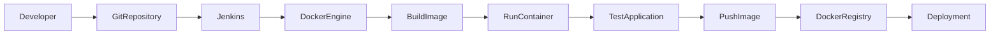
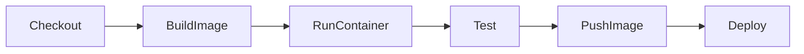
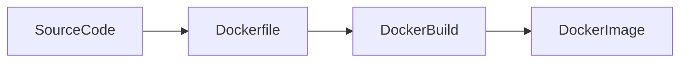
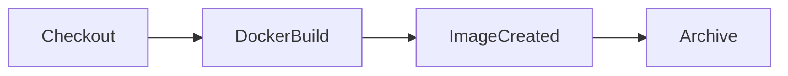
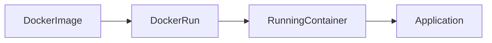
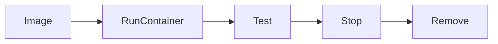
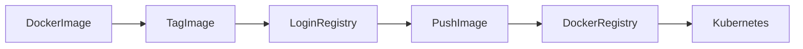
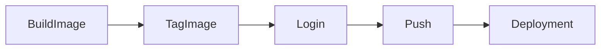

# Docker Integration

## Overview

**Docker Integration** in Jenkins enables CI/CD pipelines to build Docker images, run containers, test applications in isolated environments, and push images to container registries.

Instead of deploying applications directly on servers, Jenkins packages applications into Docker images, ensuring consistency across development, testing, and production environments.

Docker integration is one of the most common real-world Jenkins use cases.

> **Interview Point**
>
> Jenkins itself does **not** build Docker images. It invokes the **Docker CLI** or uses Docker-related plugins to communicate with the Docker Engine.

---

## Why It Is Used

Docker Integration helps to:

- Automate Docker image creation
- Standardize application deployments
- Create reproducible build environments
- Package applications with dependencies
- Push images to registries
- Support Kubernetes deployments

---

## Architecture / Working



---

## Key Components

| Component | Purpose |
|-----------|----------|
| Jenkins | CI/CD automation |
| Docker Engine | Builds and runs containers |
| Dockerfile | Defines image contents |
| Docker CLI | Executes Docker commands |
| Docker Registry | Stores Docker images |
| Jenkinsfile | Defines CI/CD pipeline |

---

## Types (if applicable)

Docker Integration Methods

| Method | Description |
|---------|-------------|
| Docker CLI | Uses Docker commands in pipeline |
| Docker Pipeline Plugin | Native Docker pipeline support |
| Docker Agent | Executes pipeline inside Docker container |

---

## Lifecycle / Workflow



---

## Configuration / Syntax (if applicable)

Basic Jenkins Pipeline

```groovy
pipeline {

    agent any

    stages {

        stage('Build Image') {

            steps {

                sh 'docker build -t myapp:v1 .'

            }

        }

        stage('Run Container') {

            steps {

                sh 'docker run -d myapp:v1'

            }

        }

    }

}
```

---

## Important Commands (if applicable)

```bash
docker build
docker run
docker images
docker ps
docker stop
docker rm
docker tag
docker login
docker push
docker pull
```

---

## Important Files (if applicable)

| File | Purpose |
|------|----------|
| Dockerfile | Docker image definition |
| Jenkinsfile | Pipeline definition |
| .dockerignore | Excludes unnecessary files during image build |

---

## Real-World Use Cases

- Build Spring Boot Docker images
- Build Node.js containers
- Package Python applications
- Push images to Docker Hub
- Push images to Azure Container Registry (ACR)
- Push images to Amazon Elastic Container Registry (ECR)
- Deploy containers to Kubernetes

---

## Advantages

- Consistent environments
- Faster deployments
- Immutable application packaging
- Easy rollback
- Portable applications
- Simplifies Kubernetes deployments

---

## Limitations

- Docker Engine must be installed
- Large images increase build time
- Image management required
- Docker daemon permissions required

---

## Common Interview Questions (Concept Only)

- How does Jenkins integrate with Docker?
- Why is Docker used in Jenkins pipelines?
- What is required before Jenkins can build Docker images?
- What is the role of Dockerfile?
- Why push Docker images to a registry?

---

## Common Mistakes

- Docker daemon not running
- Incorrect Dockerfile path
- Missing registry authentication
- Large image sizes
- Forgetting to tag images

---

## Troubleshooting

| Problem | Solution |
|----------|----------|
| Docker command not found | Install Docker CLI |
| Cannot connect to Docker daemon | Start Docker service |
| Permission denied | Add Jenkins user to docker group |
| Build failed | Review Dockerfile |
| Push failed | Verify registry credentials |

---

## Summary

Docker Integration enables Jenkins to automate container-based application packaging, testing, and deployment, making it a core component of modern CI/CD pipelines.

---

# Build Docker Images

## Overview

Building a Docker image is the process of packaging an application and its dependencies into a portable container image using a **Dockerfile**.

During CI/CD, Jenkins automatically builds a new Docker image whenever source code changes.

> **Interview Point**
>
> Every successful application build should produce a uniquely tagged Docker image (for example, using the Jenkins build number or Git commit hash).

---

## Why It Is Used

Building Docker images helps to:

- Package applications
- Ensure consistent deployments
- Create immutable artifacts
- Version releases
- Simplify cloud deployments

---

## Architecture / Working



---

## Key Components

| Component | Purpose |
|-----------|----------|
| Dockerfile | Build instructions |
| Build Context | Files sent to Docker |
| Docker Engine | Creates image |
| Image Tag | Version identifier |

---

## Types (if applicable)

Common Image Tags

- latest
- v1.0
- build-105
- git commit hash
- semantic version

---

## Lifecycle / Workflow



---

## Configuration / Syntax (if applicable)

Docker Build

```groovy
stage('Build Image') {

    steps {

        sh 'docker build -t myapp:1.0 .'

    }

}
```

Build Using Jenkins Build Number

```groovy
sh "docker build -t myapp:${BUILD_NUMBER} ."
```

---

## Important Commands (if applicable)

Build Image

```bash
docker build -t myapp:v1 .
```

List Images

```bash
docker images
```

Inspect Image

```bash
docker inspect myapp:v1
```

Remove Image

```bash
docker rmi myapp:v1
```

---

## Important Files (if applicable)

| File | Purpose |
|------|----------|
| Dockerfile | Build instructions |
| .dockerignore | Ignore unnecessary files |

---

## Real-World Use Cases

- Build Java applications
- Build Node.js images
- Build Python applications
- Package microservices

---

## Advantages

- Portable deployment
- Consistent environments
- Immutable artifact
- Easy versioning

---

## Limitations

- Large images consume storage
- Poor Dockerfiles increase build time

---

## Common Interview Questions (Concept Only)

- How does Jenkins build Docker images?
- What is the purpose of Dockerfile?
- Why tag Docker images?

---

## Common Mistakes

- Missing Dockerfile
- Large build context
- Incorrect image tags

---

## Troubleshooting

| Problem | Solution |
|----------|----------|
| Docker build failed | Review Dockerfile syntax |
| Context too large | Use `.dockerignore` |
| Build slow | Optimize image layers |

---

## Summary

Jenkins automates Docker image creation using Dockerfiles, producing versioned images that can be tested and deployed consistently across environments.

---

# Run Docker Containers

## Overview

After building an image, Jenkins can automatically start a Docker container for testing, integration testing, or temporary application execution.

Containers are lightweight runtime instances created from Docker images.

> **Interview Point**
>
> Docker **Images** are templates, whereas Docker **Containers** are running instances of those templates.

---

## Why It Is Used

Running containers helps to:

- Test applications
- Verify deployments
- Execute integration tests
- Run temporary services
- Validate image functionality

---

## Architecture / Working



---

## Key Components

| Component | Purpose |
|-----------|----------|
| Docker Image | Application package |
| Docker Container | Running application |
| Docker Engine | Executes container |

---

## Types (if applicable)

Container Modes

| Mode | Description |
|------|-------------|
| Interactive | User interaction |
| Detached | Background execution |

---

## Lifecycle / Workflow



---

## Configuration / Syntax (if applicable)

Run Container

```groovy
stage('Run Container') {

    steps {

        sh 'docker run -d -p 8080:8080 myapp:v1'

    }

}
```

---

## Important Commands (if applicable)

Run Container

```bash
docker run
```

List Containers

```bash
docker ps
```

Stop Container

```bash
docker stop
```

Remove Container

```bash
docker rm
```

Container Logs

```bash
docker logs
```

---

## Important Files (if applicable)

Dockerfile

---

## Real-World Use Cases

- Smoke testing
- Integration testing
- Temporary databases
- Container validation

---

## Advantages

- Fast startup
- Isolated execution
- Easy cleanup
- Reproducible environments

---

## Limitations

- Resource consumption
- Port conflicts
- Container cleanup required

---

## Common Interview Questions (Concept Only)

- Difference between Image and Container?
- Why run containers during CI?
- How are containers removed after testing?

---

## Common Mistakes

- Port already in use
- Forgetting to stop containers
- Container name conflicts

---

## Troubleshooting

| Problem | Solution |
|----------|----------|
| Port conflict | Change host port |
| Container exited | Review logs |
| Container not starting | Verify image and command |

---

## Summary

Running Docker containers in Jenkins enables automated application validation before deployment.

---

# Push Images to Registry

## Overview

After a Docker image is successfully built and tested, Jenkins pushes it to a **Docker Registry** so it can be deployed by downstream environments.

A registry stores Docker images centrally and allows multiple systems to pull the same version.

Common registries include:

- Docker Hub
- Azure Container Registry (ACR)
- Amazon Elastic Container Registry (ECR)
- Google Artifact Registry
- Harbor
- JFrog Artifactory

> **Interview Point**
>
> CI pipelines typically **build and push** Docker images, while CD pipelines **pull and deploy** those images.

---

## Why It Is Used

Pushing images helps to:

- Store versioned images
- Share images across environments
- Enable Kubernetes deployments
- Maintain release history
- Support rollback strategies

---

## Architecture / Working



---

## Key Components

| Component | Purpose |
|-----------|----------|
| Docker Registry | Stores images |
| Authentication | Secure registry access |
| Image Tag | Version tracking |
| Repository | Image location |

---

## Types (if applicable)

Common Registries

| Registry | Description |
|----------|-------------|
| Docker Hub | Public and private registry |
| Azure Container Registry | Azure-managed registry |
| Amazon ECR | AWS-managed registry |
| Harbor | Self-hosted registry |
| Google Artifact Registry | Google Cloud registry |

---

## Lifecycle / Workflow



---

## Configuration / Syntax (if applicable)

Login

```groovy
sh 'docker login'
```

Tag Image

```groovy
sh 'docker tag myapp:v1 username/myapp:v1'
```

Push Image

```groovy
sh 'docker push username/myapp:v1'
```

---

## Important Commands (if applicable)

Login

```bash
docker login
```

Logout

```bash
docker logout
```

Tag

```bash
docker tag
```

Push

```bash
docker push
```

Pull

```bash
docker pull
```

---

## Important Files (if applicable)

| File | Purpose |
|------|----------|
| Jenkinsfile | Push pipeline |
| Dockerfile | Image definition |

---

## Real-World Use Cases

- Publish application releases
- Kubernetes deployments
- Multi-environment deployments
- Disaster recovery
- Image version management

---

## Advantages

- Centralized image storage
- Easy deployment
- Supports rollback
- Version control
- Secure sharing

---

## Limitations

- Registry credentials required
- Storage costs
- Network dependency
- Image cleanup required

---

## Common Interview Questions (Concept Only)

- Why push Docker images to a registry?
- Difference between Docker Hub and Azure Container Registry?
- How does Jenkins authenticate with a registry?
- Why tag images before pushing?
- What happens if an image with the same tag is pushed again?

---

## Common Mistakes

- Using the `latest` tag for production releases
- Forgetting to authenticate before pushing
- Pushing untested images
- Inconsistent image tagging
- Storing registry credentials directly in the Jenkinsfile instead of Jenkins Credentials

---

## Troubleshooting

| Problem | Solution |
|----------|----------|
| Access denied | Verify registry credentials |
| Push rejected | Confirm repository exists and permissions are correct |
| Image not found | Check image name and tag |
| Authentication failed | Validate username, token, or password |
| Network timeout | Verify connectivity to the registry |

---

## Summary

Pushing Docker images to a registry is the final step of the CI pipeline. Jenkins authenticates with the registry, tags the image appropriately, and uploads it for deployment by CD pipelines, Kubernetes clusters, or other runtime environments.
