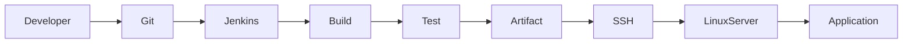
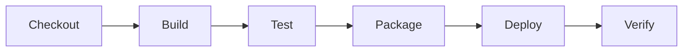
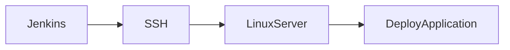
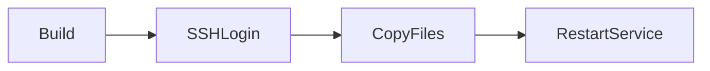
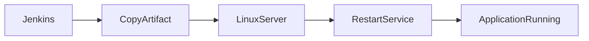
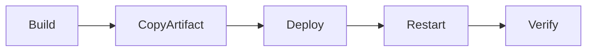
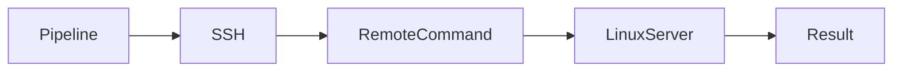
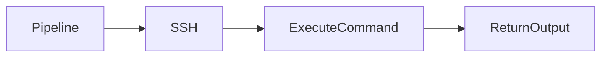

# Deployment

## Overview

**Deployment** is the process of delivering a built application from the CI/CD pipeline to a target environment (Development, QA, Staging, or Production).

In Jenkins, deployment is typically the final stage of the pipeline, where build artifacts or Docker images are deployed to remote servers or cloud platforms.

A common deployment workflow is:

1. Build the application
2. Run tests
3. Archive artifacts
4. Connect to the target server
5. Deploy the application
6. Verify deployment

> **Interview Point**
>
> Jenkins does **not** perform deployment by itself. It executes deployment tools and commands such as **SSH, Ansible, Docker, Kubernetes, Azure CLI, AWS CLI**, etc.

---

## Why It Is Used

Deployment helps to:

- Automate software releases
- Eliminate manual deployment errors
- Ensure consistent deployments
- Reduce downtime
- Support Continuous Delivery and Continuous Deployment
- Improve release speed

---

## Architecture / Working



---

## Key Components

| Component | Purpose |
|-----------|----------|
| Jenkins Pipeline | Automates deployment |
| SSH | Secure remote connection |
| Linux Server | Deployment target |
| Artifact | Deployable package |
| Credentials | Secure authentication |

---

## Types (if applicable)

Common Deployment Targets

| Target | Example |
|---------|----------|
| Linux Server | Ubuntu, RHEL |
| Virtual Machine | Azure VM, AWS EC2 |
| Docker Host | Docker Engine |
| Kubernetes | AKS, EKS, GKE |
| Cloud Services | Azure App Service |

---

## Lifecycle / Workflow



---

## Configuration / Syntax (if applicable)

Basic Deployment Stage

```groovy
stage('Deploy') {

    steps {

        sh 'echo Deploying Application'

    }

}
```

SSH Deployment

```groovy
stage('Deploy') {

    steps {

        sh 'ssh user@server "systemctl restart myapp"'

    }

}
```

---

## Important Commands (if applicable)

```bash
ssh
scp
rsync
systemctl
chmod
tar
```

---

## Important Files (if applicable)

| File | Purpose |
|------|----------|
| Jenkinsfile | Deployment pipeline |
| SSH Private Key | Authentication |
| Known Hosts | Server verification |

---

## Real-World Use Cases

- Deploy Java WAR files
- Deploy Spring Boot applications
- Deploy Node.js applications
- Restart Linux services
- Deploy Docker containers
- Deploy Kubernetes applications

---

## Advantages

- Automated deployments
- Faster releases
- Reduced human errors
- Repeatable deployment process
- Easy rollback integration

---

## Limitations

- Requires secure credentials
- Network dependency
- Deployment failures affect delivery
- Server permissions required

---

## Common Interview Questions (Concept Only)

- What is deployment in Jenkins?
- How does Jenkins deploy applications?
- What tools can Jenkins use for deployment?
- What is the difference between deployment and build?
- Why is SSH commonly used for deployment?

---

## Common Mistakes

- Hardcoding credentials
- Deploying without testing
- Deploying directly to production
- No rollback strategy
- Running deployment as root unnecessarily

---

## Troubleshooting

| Problem | Solution |
|----------|----------|
| Deployment failed | Review pipeline logs |
| SSH connection failed | Verify network and credentials |
| Permission denied | Check user permissions |
| Service not starting | Review application logs |
| Artifact missing | Verify build stage completed successfully |

---

## Summary

Deployment is the final CI/CD stage where Jenkins automates application delivery to target environments using tools such as SSH, Docker, Kubernetes, or cloud-specific deployment services.

---

# Deploy Using SSH

## Overview

**SSH (Secure Shell)** is the most common method Jenkins uses to deploy applications to remote Linux servers.

Jenkins connects securely to the remote server using SSH keys or credentials and executes deployment commands remotely.

> **Interview Point**
>
> SSH key authentication is preferred over password authentication because it is more secure and better suited for automation.

---

## Why It Is Used

Deploying using SSH helps to:

- Securely connect to remote servers
- Execute deployment scripts
- Transfer files
- Restart services
- Automate application deployment

---

## Architecture / Working



---

## Key Components

| Component | Purpose |
|-----------|----------|
| Jenkins | Executes deployment |
| SSH Client | Secure connection |
| SSH Server | Accepts connections |
| SSH Keys | Authentication |

---

## Types (if applicable)

Authentication Methods

| Type | Description |
|------|-------------|
| SSH Keys | Recommended |
| Username & Password | Less secure |

---

## Lifecycle / Workflow



---

## Configuration / Syntax (if applicable)

Execute Remote Command

```groovy
sh 'ssh user@server "hostname"'
```

Copy File

```groovy
sh 'scp app.jar user@server:/opt/app/'
```

---

## Important Commands (if applicable)

SSH

```bash
ssh user@server
```

Copy Files

```bash
scp file user@server:/path
```

Generate SSH Key

```bash
ssh-keygen
```

---

## Important Files (if applicable)

| File | Purpose |
|------|----------|
| ~/.ssh/id_rsa | Private key |
| ~/.ssh/id_rsa.pub | Public key |
| ~/.ssh/authorized_keys | Allowed public keys |
| ~/.ssh/known_hosts | Trusted hosts |

---

## Real-World Use Cases

- Restart services
- Copy artifacts
- Execute deployment scripts
- Deploy WAR files
- Deploy Docker Compose applications

---

## Advantages

- Secure communication
- Widely supported
- Easy automation
- Works with most Linux servers

---

## Limitations

- SSH access required
- Firewall configuration required
- Key management overhead

---

## Common Interview Questions (Concept Only)

- Why is SSH used in Jenkins deployment?
- Why use SSH keys instead of passwords?
- What is `authorized_keys`?
- What is `known_hosts`?

---

## Common Mistakes

- Incorrect private key
- Wrong permissions on SSH keys
- Hardcoding passwords
- Missing host verification

---

## Troubleshooting

| Problem | Solution |
|----------|----------|
| Permission denied (publickey) | Verify SSH key configuration |
| Connection refused | Check SSH service and firewall |
| Host verification failed | Update `known_hosts` |
| Timeout | Verify network connectivity |

---

## Summary

SSH enables Jenkins to securely connect to remote Linux servers, transfer files, and execute deployment commands as part of an automated CI/CD pipeline.

---

# Deploy to Linux Servers

## Overview

Deploying to Linux servers involves transferring application artifacts from Jenkins to a Linux machine and starting or updating the application.

Typical deployment targets include:

- Ubuntu Server
- Red Hat Enterprise Linux (RHEL)
- CentOS
- Rocky Linux
- Amazon Linux

> **Interview Point**
>
> Jenkins usually deploys application artifacts (JAR, WAR, binaries, Docker images) rather than source code.

---

## Why It Is Used

Deploying to Linux servers helps to:

- Host production applications
- Automate releases
- Maintain consistent environments
- Reduce deployment time

---

## Architecture / Working



---

## Key Components

| Component | Purpose |
|-----------|----------|
| Linux Server | Deployment target |
| SSH | Remote access |
| Artifact | Application package |
| Service Manager | Starts application |

---

## Types (if applicable)

Deployment Methods

- Copy JAR
- Copy WAR
- Docker Deployment
- Shell Script Deployment

---

## Lifecycle / Workflow



---

## Configuration / Syntax (if applicable)

Copy JAR

```groovy
sh 'scp target/app.jar user@server:/opt/app/'
```

Restart Service

```groovy
sh 'ssh user@server "systemctl restart app"'
```

---

## Important Commands (if applicable)

Copy File

```bash
scp
```

Restart Service

```bash
systemctl restart
```

View Service

```bash
systemctl status
```

---

## Important Files (if applicable)

| File | Purpose |
|------|----------|
| application.jar | Deployable artifact |
| systemd service file | Service configuration |

---

## Real-World Use Cases

- Spring Boot deployment
- Tomcat deployment
- Nginx configuration updates
- Node.js deployment

---

## Advantages

- Fully automated
- Faster deployment
- Repeatable process
- Supports rollback strategies

---

## Limitations

- Requires SSH access
- Service downtime if not using rolling deployments
- Server maintenance required

---

## Common Interview Questions (Concept Only)

- How does Jenkins deploy to Linux?
- What files are typically deployed?
- Why restart services after deployment?

---

## Common Mistakes

- Deploying to incorrect directory
- Wrong file permissions
- Forgetting to restart services
- Missing application dependencies

---

## Troubleshooting

| Problem | Solution |
|----------|----------|
| File copy failed | Verify destination path and permissions |
| Service failed | Check `systemctl status` and logs |
| Application not starting | Review application logs |
| Permission denied | Verify deployment user permissions |

---

## Summary

Deploying to Linux servers involves securely transferring application artifacts and starting or updating services using SSH and Linux service management tools.

---

# Execute Remote Commands

## Overview

Jenkins frequently executes remote commands over SSH to automate server administration and deployment tasks.

Examples include:

- Restarting services
- Updating configuration files
- Creating directories
- Running deployment scripts
- Checking application status

> **Interview Point**
>
> Executing remote commands is one of the simplest and most common deployment techniques in Jenkins pipelines.

---

## Why It Is Used

Remote command execution helps to:

- Automate server administration
- Reduce manual effort
- Standardize deployments
- Execute scripts remotely
- Verify deployment success

---

## Architecture / Working



---

## Key Components

| Component | Purpose |
|-----------|----------|
| SSH | Secure communication |
| Linux Shell | Executes commands |
| Jenkins Pipeline | Automation |

---

## Types (if applicable)

Common Remote Operations

- Service restart
- Directory creation
- File removal
- Script execution
- Log verification

---

## Lifecycle / Workflow



---

## Configuration / Syntax (if applicable)

Restart Service

```groovy
sh 'ssh user@server "systemctl restart nginx"'
```

Execute Script

```groovy
sh 'ssh user@server "bash deploy.sh"'
```

Multiple Commands

```groovy
sh '''
ssh user@server "
cd /opt/app &&
chmod +x deploy.sh &&
./deploy.sh
"
'''
```

---

## Important Commands (if applicable)

SSH

```bash
ssh
```

Execute Command

```bash
ssh user@server "command"
```

Execute Script

```bash
bash deploy.sh
```

---

## Important Files (if applicable)

| File | Purpose |
|------|----------|
| deploy.sh | Deployment script |
| Jenkinsfile | Pipeline definition |

---

## Real-World Use Cases

- Restart Nginx
- Restart Tomcat
- Restart Spring Boot service
- Clean log files
- Rotate backups
- Execute database migrations

---

## Advantages

- Easy automation
- No manual login required
- Flexible
- Supports any shell command

---

## Limitations

- Depends on SSH availability
- Requires proper permissions
- Poorly written scripts can affect production systems

---

## Common Interview Questions (Concept Only)

- How does Jenkins execute remote commands?
- Why is SSH commonly used for remote execution?
- What is the benefit of deployment scripts?
- How do you securely authenticate remote commands?

---

## Common Mistakes

- Executing commands as the root user without necessity
- Not validating command exit codes
- Hardcoding server IPs or credentials in the Jenkinsfile
- Running commands without first testing them in a non-production environment

---

## Troubleshooting

| Problem | Solution |
|----------|----------|
| SSH authentication failed | Verify SSH keys or credentials |
| Command not found | Ensure the executable exists and is in the user's `PATH` |
| Permission denied | Check file permissions and user privileges |
| Script failed | Review script logs and exit status |
| Service did not restart | Inspect `systemctl status` and application logs |

---

## Summary

Executing remote commands allows Jenkins to automate deployment and server management tasks over SSH. It is a lightweight and widely used approach for deploying applications, restarting services, running scripts, and performing routine administrative operations on Linux servers.
