# Pipeline Integration

## Overview

**Pipeline Integration** is the process of connecting Jenkins with various DevOps tools to automate the complete Software Development Life Cycle (SDLC).

Instead of performing tasks manually, Jenkins orchestrates tools such as:

- Git (Source Code Management)
- Maven (Build Automation)
- SonarQube (Code Quality)
- Docker (Containerization)
- Nexus (Artifact Repository)
- Kubernetes (Deployment)

A typical production Jenkins pipeline integrates all these tools to build, test, package, analyze, store, and deploy applications automatically.

> **Interview Point**
>
> Jenkins acts as the **orchestrator**, while external tools perform specialized tasks like building, scanning, storing artifacts, and deploying applications.

---

## Why It Is Used

Pipeline Integration helps to:

- Automate the complete CI/CD workflow
- Reduce manual intervention
- Improve software quality
- Accelerate deployments
- Enable Continuous Integration and Continuous Delivery
- Standardize deployment processes

---

## Architecture / Working

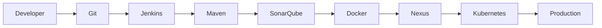

---

## Key Components

| Component | Purpose |
|-----------|----------|
| Git | Source code management |
| Jenkins | Pipeline orchestration |
| Maven | Build automation |
| SonarQube | Static code analysis |
| Docker | Containerization |
| Nexus | Artifact repository |
| Kubernetes | Container orchestration |

---

## Types (if applicable)

Typical CI/CD Integrations

| Integration | Purpose |
|------------|----------|
| Git | Source control |
| Maven | Build |
| SonarQube | Code quality |
| Docker | Packaging |
| Nexus | Artifact storage |
| Kubernetes | Deployment |

---

## Lifecycle / Workflow

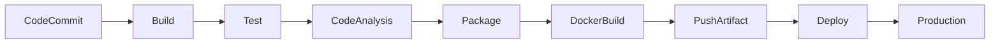

---

## Configuration / Syntax (if applicable)

Typical Pipeline

```groovy
pipeline {

    agent any

    stages {

        stage('Checkout') {

            steps {

                git 'https://github.com/example/repo.git'

            }

        }

        stage('Build') {

            steps {

                sh 'mvn clean package'

            }

        }

        stage('Sonar Scan') {

            steps {

                sh 'mvn sonar:sonar'

            }

        }

        stage('Docker Build') {

            steps {

                sh 'docker build -t app .'

            }

        }

    }

}
```

---

## Important Commands (if applicable)

```bash
git clone
mvn clean package
docker build
docker push
kubectl apply
```

---

## Important Files (if applicable)

| File | Purpose |
|------|----------|
| Jenkinsfile | Pipeline definition |
| Dockerfile | Docker image |
| pom.xml | Maven configuration |
| deployment.yaml | Kubernetes deployment |

---

## Real-World Use Cases

- Java application CI/CD
- Spring Boot deployment
- Microservices deployment
- Kubernetes automation
- Enterprise DevOps pipelines

---

## Advantages

- Complete automation
- Reduced deployment time
- Consistent workflows
- Improved software quality
- Faster releases

---

## Limitations

- Multiple tool dependencies
- Pipeline complexity
- Version compatibility issues

---

## Common Interview Questions (Concept Only)

- What is Pipeline Integration?
- Why integrate multiple tools with Jenkins?
- What tools are commonly integrated?
- What is the typical CI/CD workflow?

---

## Common Mistakes

- Hardcoding credentials
- Incorrect tool versions
- Missing plugins
- Improper stage ordering

---

## Troubleshooting

| Problem | Solution |
|----------|----------|
| Tool not found | Verify installation and PATH |
| Authentication failure | Verify credentials |
| Pipeline failure | Review console logs |
| Plugin issue | Verify required plugins |

---

## Summary

Pipeline Integration connects Jenkins with DevOps tools such as Git, Maven, Docker, SonarQube, Nexus, and Kubernetes to automate the entire software delivery lifecycle.

---

# Git Integration

## Overview

**Git Integration** enables Jenkins to automatically retrieve source code from Git repositories whenever changes are pushed.

Supported repositories include:

- GitHub
- GitLab
- Bitbucket
- Azure Repos

Git is usually the **first stage** of every Jenkins pipeline.

> **Interview Point**
>
> Jenkins never stores source code permanently. It checks out the latest code from Git into the workspace before every build.

---

## Why It Is Used

Git Integration helps to:

- Retrieve latest source code
- Trigger automatic builds
- Support branch-based development
- Enable Continuous Integration

---

## Architecture / Working

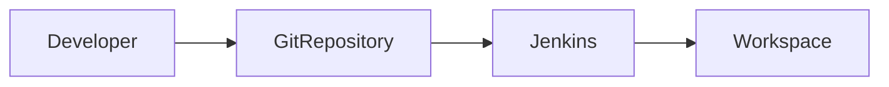

---

## Key Components

| Component | Purpose |
|-----------|----------|
| Repository URL | Source location |
| Branch | Code branch |
| Credentials | Authentication |
| Webhooks | Automatic triggering |

---

## Types (if applicable)

Supported SCM

- GitHub
- GitLab
- Azure Repos
- Bitbucket

---

## Lifecycle / Workflow

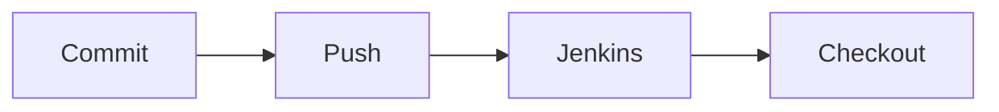

---

## Configuration / Syntax (if applicable)

```groovy
git branch: 'main',
url: 'https://github.com/example/repo.git'
```

---

## Important Commands (if applicable)

```bash
git clone
git fetch
git checkout
```

---

## Important Files (if applicable)

Jenkinsfile

---

## Real-World Use Cases

- CI pipelines
- Feature branch builds
- Pull Request validation

---

## Advantages

- Automatic source retrieval
- Supports multiple repositories
- Easy integration

---

## Limitations

- Requires Git installation
- Credentials for private repositories

---

## Common Interview Questions (Concept Only)

- How does Jenkins integrate with Git?
- What triggers Jenkins builds?

---

## Common Mistakes

- Incorrect repository URL
- Wrong branch
- Invalid credentials

---

## Troubleshooting

| Problem | Solution |
|----------|----------|
| Authentication failed | Verify credentials |
| Branch not found | Verify branch name |

---

## Summary

Git Integration allows Jenkins to automatically retrieve source code and start CI pipelines.

---

# Docker Integration

## Overview

**Docker Integration** enables Jenkins to build Docker images, run containers, and push images to container registries.

Docker packages applications together with their dependencies, ensuring consistency across all environments.

> **Interview Point**
>
> Jenkins invokes the Docker CLI or Docker Pipeline Plugin to interact with the Docker Engine.

---

## Why It Is Used

Docker Integration helps to:

- Build images
- Run containers
- Package applications
- Push images to registries

---

## Architecture / Working

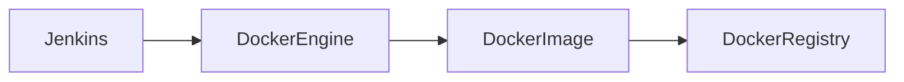

---

## Key Components

| Component | Purpose |
|-----------|----------|
| Docker Engine | Builds images |
| Dockerfile | Image definition |
| Registry | Image storage |

---

## Types (if applicable)

- Docker CLI
- Docker Plugin
- Docker Agent

---

## Lifecycle / Workflow

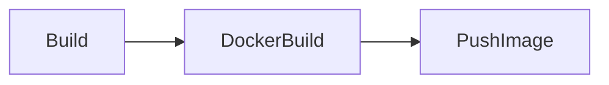

---

## Configuration / Syntax (if applicable)

```groovy
sh 'docker build -t app:v1 .'
```

---

## Important Commands (if applicable)

```bash
docker build
docker run
docker push
docker pull
```

---

## Important Files (if applicable)

Dockerfile

---

## Real-World Use Cases

- Containerized applications
- Kubernetes deployments
- Microservices

---

## Advantages

- Portable
- Consistent
- Fast deployment

---

## Limitations

- Docker Engine required

---

## Common Interview Questions (Concept Only)

- Why integrate Docker with Jenkins?
- How are Docker images built?

---

## Common Mistakes

- Docker daemon not running
- Missing Dockerfile

---

## Troubleshooting

| Problem | Solution |
|----------|----------|
| Build failed | Verify Dockerfile |
| Push failed | Verify registry login |

---

## Summary

Docker Integration allows Jenkins to package applications into containers for reliable deployments.

---

# Maven Integration

## Overview

**Maven Integration** enables Jenkins to automate Java application builds, dependency management, testing, and packaging.

It uses the project's **pom.xml** file to execute the Maven lifecycle.

> **Interview Point**
>
> Maven is one of the most commonly used build tools in Jenkins for Java projects.

---

## Why It Is Used

Maven Integration helps to:

- Compile code
- Download dependencies
- Execute unit tests
- Package applications
- Generate artifacts

---

## Architecture / Working

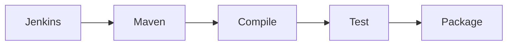

---

## Key Components

| Component | Purpose |
|-----------|----------|
| Maven | Build tool |
| pom.xml | Project configuration |
| Repository | Dependencies |

---

## Types (if applicable)

Common Goals

- clean
- compile
- test
- package
- install

---

## Lifecycle / Workflow

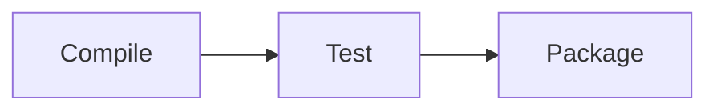

---

## Configuration / Syntax (if applicable)

```groovy
sh 'mvn clean package'
```

---

## Important Commands (if applicable)

```bash
mvn clean
mvn package
mvn install
```

---

## Important Files (if applicable)

pom.xml

---

## Real-World Use Cases

- Spring Boot
- Java applications

---

## Advantages

- Dependency management
- Automated builds

---

## Limitations

- Java only

---

## Common Interview Questions (Concept Only)

- What is Maven Integration?
- What is pom.xml?

---

## Common Mistakes

- Invalid pom.xml
- Wrong Java version

---

## Troubleshooting

| Problem | Solution |
|----------|----------|
| Build failed | Review Maven logs |

---

## Summary

Maven Integration automates Java application builds within Jenkins pipelines.

---

# SonarQube Integration

## Overview

**SonarQube Integration** enables Jenkins to perform **Static Application Security Testing (SAST)** and code quality analysis during the pipeline.

It identifies:

- Bugs
- Vulnerabilities
- Code smells
- Duplicated code
- Maintainability issues
- Test coverage

> **Interview Point**
>
> SonarQube analyzes source code without executing it, making it a Static Code Analysis tool.

---

## Why It Is Used

SonarQube helps to:

- Improve code quality
- Detect security vulnerabilities
- Enforce quality gates
- Reduce technical debt

---

## Architecture / Working

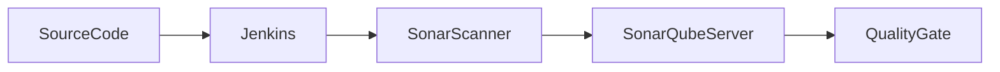

---

## Key Components

| Component | Purpose |
|-----------|----------|
| Sonar Scanner | Sends code |
| SonarQube Server | Analysis |
| Quality Gate | Pass/Fail |

---

## Types (if applicable)

Analysis

- Bugs
- Vulnerabilities
- Code Smells

---

## Lifecycle / Workflow

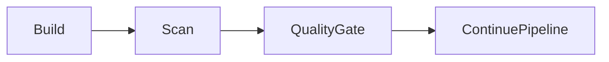

---

## Configuration / Syntax (if applicable)

```groovy
sh 'mvn sonar:sonar'
```

---

## Important Commands (if applicable)

```bash
mvn sonar:sonar
```

---

## Important Files (if applicable)

sonar-project.properties

---

## Real-World Use Cases

- Security scanning
- Code quality checks

---

## Advantages

- Early bug detection
- Improves code quality

---

## Limitations

- Requires SonarQube Server

---

## Common Interview Questions (Concept Only)

- What is SonarQube?
- What is a Quality Gate?

---

## Common Mistakes

- Ignoring Quality Gate failures

---

## Troubleshooting

| Problem | Solution |
|----------|----------|
| Scan failed | Verify Sonar credentials |

---

## Summary

SonarQube Integration improves application quality by automatically analyzing source code during CI.

---

# Nexus Integration

## Overview

**Nexus Integration** enables Jenkins to store and retrieve build artifacts such as JAR, WAR, ZIP files, and Docker images.

Nexus acts as a centralized artifact repository.

> **Interview Point**
>
> Git stores **source code**, whereas Nexus stores **compiled artifacts**.

---

## Why It Is Used

Nexus helps to:

- Store build artifacts
- Version releases
- Share artifacts
- Support rollback

---

## Architecture / Working

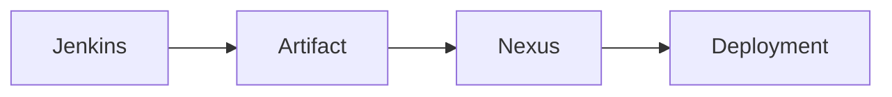

---

## Key Components

| Component | Purpose |
|-----------|----------|
| Nexus Repository | Artifact storage |
| Jenkins | Upload artifacts |

---

## Types (if applicable)

Repositories

- Maven
- Docker
- npm

---

## Lifecycle / Workflow

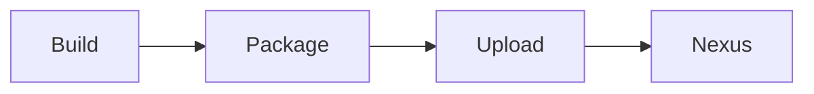

---

## Configuration / Syntax (if applicable)

```groovy
sh 'mvn deploy'
```

---

## Important Commands (if applicable)

```bash
mvn deploy
```

---

## Important Files (if applicable)

pom.xml

---

## Real-World Use Cases

- Store Java artifacts
- Docker images
- Release management

---

## Advantages

- Centralized storage
- Versioning
- Easy rollback

---

## Limitations

- Repository maintenance

---

## Common Interview Questions (Concept Only)

- What is Nexus?
- Why store artifacts?

---

## Common Mistakes

- Uploading snapshots to release repository

---

## Troubleshooting

| Problem | Solution |
|----------|----------|
| Upload failed | Verify repository credentials |

---

## Summary

Nexus Integration enables Jenkins to securely store and manage build artifacts.

---

# Kubernetes Integration

## Overview

**Kubernetes Integration** enables Jenkins to deploy containerized applications into Kubernetes clusters automatically.

Jenkins can:

- Deploy applications
- Update deployments
- Roll back releases
- Scale applications

> **Interview Point**
>
> Jenkins typically deploys Docker images to Kubernetes using **kubectl**, **Helm**, or GitOps tools such as Argo CD.

---

## Why It Is Used

Kubernetes Integration helps to:

- Automate deployments
- Scale applications
- Support rolling updates
- Improve availability

---

## Architecture / Working

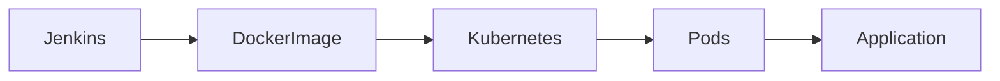

---

## Key Components

| Component | Purpose |
|-----------|----------|
| Kubernetes Cluster | Deployment platform |
| kubectl | CLI |
| Deployment | Workload |
| Service | Networking |

---

## Types (if applicable)

Deployment Methods

- kubectl
- Helm
- Argo CD

---

## Lifecycle / Workflow

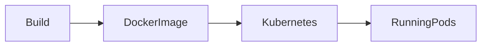

---

## Configuration / Syntax (if applicable)

```groovy
sh 'kubectl apply -f deployment.yaml'
```

---

## Important Commands (if applicable)

```bash
kubectl apply
kubectl get pods
kubectl rollout status
kubectl delete
```

---

## Important Files (if applicable)

| File | Purpose |
|------|----------|
| deployment.yaml | Deployment |
| service.yaml | Service |
| Jenkinsfile | Pipeline |

---

## Real-World Use Cases

- AKS deployments
- EKS deployments
- GKE deployments
- Microservices

---

## Advantages

- Automated deployments
- High availability
- Rolling updates
- Self-healing

---

## Limitations

- Kubernetes knowledge required
- Cluster management overhead

---

## Common Interview Questions (Concept Only)

- How does Jenkins deploy to Kubernetes?
- What is kubectl?
- Why use Helm?

---

## Common Mistakes

- Wrong namespace
- Missing kubeconfig
- Incorrect image tags

---

## Troubleshooting

| Problem | Solution |
|----------|----------|
| Pod not starting | Check pod logs |
| Deployment failed | Verify YAML files |
| ImagePullBackOff | Verify registry credentials |

---

## Summary

Kubernetes Integration enables Jenkins to automate container deployment, scaling, and management, making it a key component of modern cloud-native CI/CD pipelines.
