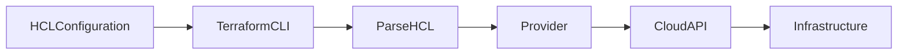
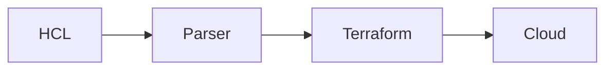
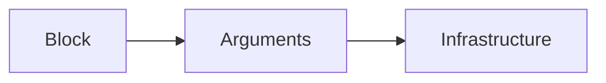
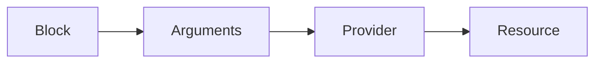
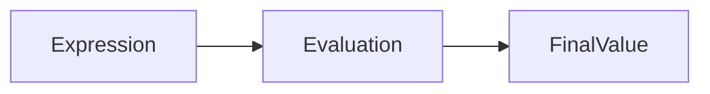
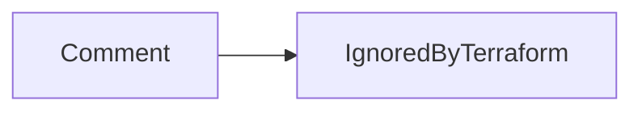

# Terraform Configuration Language (HCL)

## Overview

**HashiCorp Configuration Language (HCL)** is the configuration language used by Terraform to define Infrastructure as Code (IaC).

HCL is:

- Human-readable
- Declarative
- Easy to learn
- Machine-friendly

Terraform uses HCL to define:

- Cloud resources
- Variables
- Providers
- Outputs
- Modules
- Data sources

Instead of writing procedural scripts, you describe the **desired state** of your infrastructure, and Terraform determines how to create or modify it.

> **Interview Tip**
>
> HCL is **declarative**, meaning you define **what** infrastructure should exist—not **how** to create it.

---

## Why It Is Used

HCL is used because it:

- Is easy to read and maintain
- Supports Infrastructure as Code
- Enables reusable infrastructure
- Supports version control
- Simplifies automation
- Allows variable interpolation
- Supports complex expressions

---

## Architecture / Working



---

## Key Components

| Component | Purpose |
|-----------|----------|
| Blocks | Define infrastructure objects |
| Arguments | Configure block behavior |
| Expressions | Compute values dynamically |
| Variables | Parameterize configuration |
| Comments | Document configuration |

---

## Types (if applicable)

### HCL Components

| Component | Description |
|-----------|-------------|
| Block | Groups related configuration |
| Argument | Assigns values within a block |
| Expression | Calculates or references values |
| Comment | Adds documentation |

---

## Lifecycle / Workflow


---

## Configuration / Syntax (if applicable)

Basic Example

```hcl
resource "azurerm_resource_group" "rg" {

  name     = "demo-rg"

  location = "Central India"

}
```

General Structure

```hcl
block_type "resource_type" "resource_name" {

    argument = value

}
```

---

## Important Commands (if applicable)

Format Configuration

```bash
terraform fmt
```

Validate Configuration

```bash
terraform validate
```

View Plan

```bash
terraform plan
```

---

## Important Files (if applicable)

| File | Purpose |
|------|----------|
| main.tf | Main configuration |
| variables.tf | Variable definitions |
| outputs.tf | Output values |
| providers.tf | Provider configuration |
| terraform.tfvars | Variable values |

---

## Real-World Use Cases

- Deploy Azure Virtual Machines
- Create AWS EC2 instances
- Build Kubernetes clusters
- Configure Azure Networking
- Create Storage Accounts
- Deploy complete cloud environments

---

## Advantages

- Easy to read
- Declarative
- Version controllable
- Supports automation
- Reusable
- Modular

---

## Limitations

- Requires understanding of Terraform concepts
- Syntax errors prevent execution
- Large configurations require modularization

---

## Common Interview Questions (Concept Only)

- What is HCL?
- Why does Terraform use HCL?
- Is HCL declarative or imperative?
- What are the components of HCL?
- What is the difference between Blocks and Arguments?

---

## Common Mistakes

- Incorrect block syntax
- Missing quotation marks
- Incorrect argument names
- Hardcoding values
- Ignoring formatting (`terraform fmt`)

---

## Troubleshooting

| Problem | Solution |
|----------|----------|
| Syntax error | Run `terraform validate` |
| Formatting inconsistent | Run `terraform fmt` |
| Invalid argument | Check provider documentation |
| Unknown block | Verify block type and spelling |

---

## Summary

HCL is Terraform's declarative configuration language used to define infrastructure. It consists of blocks, arguments, expressions, and comments, allowing infrastructure to be described clearly, consistently, and in a version-controlled manner.

---

# HCL Syntax

## Overview

HCL syntax defines the structure used to write Terraform configuration files.

Every Terraform configuration consists of:

- Blocks
- Arguments
- Expressions
- Values

A typical HCL configuration follows this pattern:

```hcl
block_type "type" "name" {

    argument = value

}
```

> **Interview Tip**
>
> Every Terraform resource is written as an HCL block containing one or more arguments.

---

## Why It Is Used

HCL syntax provides:

- Readable infrastructure definitions
- Standardized configuration
- Easy maintenance
- Machine parsing

---

## Architecture / Working



---

## Key Components

| Component | Purpose |
|-----------|----------|
| Keywords | Identify block types |
| Braces `{}` | Define block boundaries |
| Equal Sign `=` | Assign values |
| Quotes `""` | Define strings |

---

## Types (if applicable)

Common Syntax Elements

- Blocks
- Arguments
- Strings
- Numbers
- Booleans
- Lists
- Maps

---

## Lifecycle / Workflow

Write Configuration → Validate → Execute

---

## Configuration / Syntax (if applicable)

String

```hcl
name = "web-server"
```

Number

```hcl
count = 2
```

Boolean

```hcl
enabled = true
```

List

```hcl
availability_zones = [

  "eastus",

  "westus"

]
```

Map

```hcl
tags = {

  Environment = "Dev"

  Owner = "DevOps"

}
```

---

## Important Commands (if applicable)

```bash
terraform fmt

terraform validate
```

---

## Important Files (if applicable)

All `.tf` files

---

## Real-World Use Cases

- VM configuration
- Networking
- Storage provisioning
- Resource tagging

---

## Advantages

- Simple syntax
- Easy to learn
- Human-readable

---

## Limitations

- Syntax errors stop execution
- Large files become difficult to manage

---

## Common Interview Questions (Concept Only)

- What is HCL syntax?
- How are strings, lists, and maps represented?

---

## Common Mistakes

- Missing braces
- Incorrect quotation marks
- Invalid indentation

---

## Troubleshooting

Use:

```bash
terraform fmt

terraform validate
```

---

## Summary

HCL syntax provides a consistent structure for defining Terraform infrastructure configurations.

---

# Blocks

## Overview

A **Block** is the primary building block of every Terraform configuration.

Almost everything in Terraform is defined using blocks.

Examples include:

- resource
- provider
- variable
- output
- module
- data
- terraform

> **Interview Tip**
>
> A block represents an infrastructure object or configuration section.

---

## Why It Is Used

Blocks organize infrastructure into logical units.

---

## Architecture / Working



---

## Key Components

| Component | Purpose |
|-----------|----------|
| Block Type | Identifies configuration |
| Labels | Resource identification |
| Body | Contains arguments |

---

## Types (if applicable)

### Resource Block

```hcl
resource "aws_instance" "web" {

}
```

### Provider Block

```hcl
provider "aws" {

}
```

### Variable Block

```hcl
variable "region" {

}
```

### Output Block

```hcl
output "public_ip" {

}
```

### Module Block

```hcl
module "network" {

}
```

---

## Lifecycle / Workflow

Define Block → Configure Arguments → Apply

---

## Configuration / Syntax (if applicable)

```hcl
resource "aws_instance" "web" {

  ami = "ami-123"

  instance_type = "t2.micro"

}
```

---

## Important Commands (if applicable)

```bash
terraform validate
```

---

## Important Files (if applicable)

main.tf

---

## Real-World Use Cases

- VM creation
- Resource groups
- Storage accounts
- Networking

---

## Advantages

- Modular
- Organized
- Easy to maintain

---

## Limitations

- Incorrect nesting causes validation failures

---

## Common Interview Questions (Concept Only)

- What is a Terraform block?
- What are common block types?

---

## Common Mistakes

- Wrong block type
- Duplicate resource names

---

## Troubleshooting

Validate block names and syntax.

---

## Summary

Blocks are the foundation of Terraform configurations and define infrastructure resources and settings.

---

# Arguments

## Overview

An **Argument** is a key-value pair inside a Terraform block.

Arguments configure the behavior of the block.

Example:

```hcl
instance_type = "t2.micro"
```

Here:

- `instance_type` → Argument
- `"t2.micro"` → Value

---

## Why It Is Used

Arguments define:

- Resource properties
- Configuration values
- Provider settings
- Variable defaults

---

## Architecture / Working



---

## Key Components

| Component | Purpose |
|-----------|----------|
| Name | Argument identifier |
| Value | Assigned configuration |

---

## Types (if applicable)

Argument Value Types

- String
- Number
- Boolean
- List
- Map
- Expression

---

## Lifecycle / Workflow

Argument → Provider → Infrastructure

---

## Configuration / Syntax (if applicable)

```hcl
name = "demo"

location = "East US"

count = 2
```

---

## Important Commands (if applicable)

Not Applicable

---

## Important Files (if applicable)

Terraform configuration files

---

## Real-World Use Cases

- VM size
- Region
- Storage type
- Tags

---

## Advantages

- Flexible
- Easy to configure

---

## Limitations

- Invalid arguments fail validation

---

## Common Interview Questions (Concept Only)

- What is an argument?
- Difference between block and argument?

---

## Common Mistakes

- Misspelled argument names
- Unsupported arguments

---

## Troubleshooting

Check provider documentation for valid arguments.

---

## Summary

Arguments configure resources by assigning values inside Terraform blocks.

---

# Expressions

## Overview

An **Expression** is used to calculate values or reference other resources dynamically.

Expressions eliminate hardcoded values and make Terraform configurations reusable.

> **Interview Tip**
>
> Expressions allow Terraform to create relationships between resources.

---

## Why It Is Used

Expressions enable:

- Dynamic values
- Resource references
- Variable usage
- Conditional logic
- Functions

---

## Architecture / Working



---

## Key Components

| Component | Purpose |
|-----------|----------|
| Variables | Input values |
| Functions | Value transformation |
| References | Resource relationships |

---

## Types (if applicable)

Common Expressions

- Variable references
- Resource references
- Function calls
- Conditional expressions
- Arithmetic expressions

---

## Lifecycle / Workflow

Evaluate Expression → Generate Value → Apply

---

## Configuration / Syntax (if applicable)

Variable Reference

```hcl
location = var.location
```

Resource Reference

```hcl
resource_group_name = azurerm_resource_group.rg.name
```

Function

```hcl
upper(var.environment)
```

Conditional

```hcl
count = var.enabled ? 1 : 0
```

---

## Important Commands (if applicable)

```bash
terraform console
```

---

## Important Files (if applicable)

variables.tf

---

## Real-World Use Cases

- Dynamic naming
- Conditional resources
- Environment-specific deployments

---

## Advantages

- Reusable
- Flexible
- Dynamic

---

## Limitations

- Complex expressions reduce readability

---

## Common Interview Questions (Concept Only)

- What are Terraform expressions?
- How do expressions reference resources?

---

## Common Mistakes

- Incorrect resource references
- Circular dependencies

---

## Troubleshooting

Use:

```bash
terraform console
```

to evaluate expressions interactively.

---

## Summary

Expressions allow Terraform configurations to calculate values dynamically and reference other infrastructure resources.

---

# Comments

## Overview

Comments are used to explain Terraform configurations and improve readability.

Terraform ignores comments during execution.

Comments should document:

- Resource purpose
- Configuration decisions
- Important notes
- Future improvements

---

## Why It Is Used

Comments improve:

- Readability
- Team collaboration
- Code maintenance
- Documentation

---

## Architecture / Working



---

## Key Components

| Component | Purpose |
|-----------|----------|
| Single-line Comment | Explain one line |
| Multi-line Comment | Document larger sections |

---

## Types (if applicable)

Single-Line

```hcl
# Create Resource Group
```

```hcl
// Create Resource Group
```

Multi-Line

```hcl
/*

Creates production resources.

Used by DevOps pipeline.

*/
```

---

## Lifecycle / Workflow

Write Comment → Ignored During Execution

---

## Configuration / Syntax (if applicable)

```hcl
# Storage Account

resource "azurerm_storage_account" "sa" {

}
```

---

## Important Commands (if applicable)

Not Applicable

---

## Important Files (if applicable)

All `.tf` files

---

## Real-World Use Cases

- Document infrastructure
- Explain resource dependencies
- Team collaboration

---

## Advantages

- Better readability
- Easier maintenance
- Improved collaboration

---

## Limitations

- Outdated comments can become misleading if not maintained

---

## Common Interview Questions (Concept Only)

- Which comment styles are supported in HCL?
- Do comments affect Terraform execution?

---

## Common Mistakes

- Leaving outdated comments
- Commenting obvious code instead of explaining intent

---

## Troubleshooting

Remove or update inaccurate comments during code reviews.

---

## Summary

Comments improve the readability and maintainability of Terraform configurations without affecting execution.
