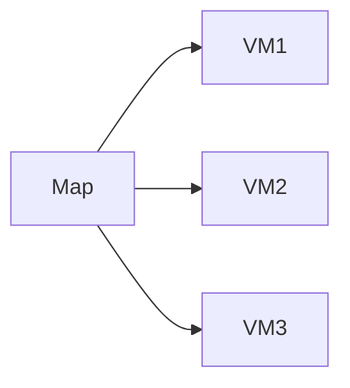
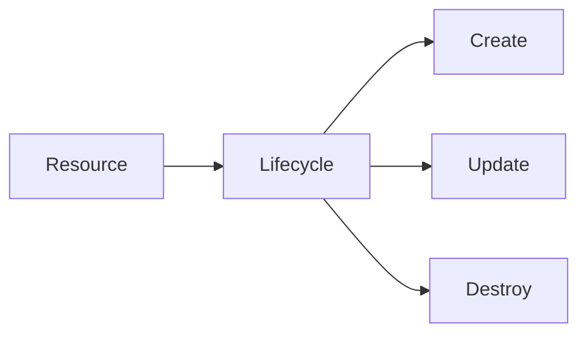

# Meta-Arguments

## Overview

**Meta-Arguments** are special Terraform arguments that control **how resources are created, managed, and destroyed**, rather than defining the resource itself.

They are supported by almost every Terraform resource and provide advanced control over infrastructure deployment.

The most commonly used meta-arguments are:

- `depends_on`
- `count`
- `for_each`
- `lifecycle`

> **Interview Tip**
>
> Meta-arguments are one of the most frequently asked Terraform interview topics because they control resource behavior rather than resource configuration.

---

## Why It Is Used

Meta-arguments help to:

- Control resource creation order
- Create multiple resources efficiently
- Avoid duplicate code
- Manage resource lifecycle
- Prevent accidental infrastructure deletion
- Improve Infrastructure as Code flexibility

---

## Architecture / Working


---

## Key Components

| Meta-Argument | Purpose |
|--------------|----------|
| depends_on | Explicit dependency between resources |
| count | Create multiple identical resources |
| for_each | Create multiple resources using maps or sets |
| lifecycle | Control creation, update, and deletion behavior |

---

## Types (if applicable)

Terraform Meta-Arguments

| Type | Purpose |
|------|----------|
| Dependency | depends_on |
| Iteration | count |
| Iteration | for_each |
| Lifecycle Management | lifecycle |

---

## Lifecycle / Workflow


---

## Configuration / Syntax (if applicable)

General Example

```hcl
resource "RESOURCE_TYPE" "example" {

  count = 2

}
```

---

## Important Commands (if applicable)

Validate Configuration

```bash
terraform validate
```

Preview Changes

```bash
terraform plan
```

Deploy Infrastructure

```bash
terraform apply
```

Destroy Infrastructure

```bash
terraform destroy
```

---

## Important Files (if applicable)

| File | Purpose |
|------|----------|
| main.tf | Meta-argument definitions |
| variables.tf | Variables for count and for_each |
| terraform.tfstate | Stores managed resources |

---

## Real-World Use Cases

- Create multiple Virtual Machines
- Deploy multiple Storage Accounts
- Create multiple AWS EC2 instances
- Ensure Network Security Groups are created before Virtual Machines
- Prevent accidental deletion of production resources

---

## Advantages

- Eliminates repetitive code
- Improves automation
- Better dependency management
- Dynamic infrastructure deployment
- Safer production deployments

---

## Limitations

- Incorrect usage causes deployment failures
- Complex dependency chains can reduce readability
- Switching between `count` and `for_each` requires state migration

---

## Common Interview Questions (Concept Only)

- What are Terraform Meta-Arguments?
- Which Meta-Arguments are used most frequently?
- What is the difference between `count` and `for_each`?
- What is the purpose of `depends_on`?
- Why is `lifecycle` important?

---

## Common Mistakes

- Using `count` when `for_each` is more appropriate
- Overusing `depends_on`
- Forgetting lifecycle rules in production
- Changing `count` indexes unexpectedly

---

## Troubleshooting

| Problem | Solution |
|----------|----------|
| Unexpected resource recreation | Check `count` or `for_each` values |
| Dependency error | Verify `depends_on` configuration |
| Resource deletion blocked | Review lifecycle rules |
| State mismatch | Inspect Terraform state |

---

## Summary

Meta-Arguments control how Terraform creates, updates, and destroys infrastructure. They are essential for writing scalable, reusable, and production-ready Infrastructure as Code.

---

# depends_on

## Overview

Terraform automatically determines dependencies by analyzing resource references. However, in some situations, Terraform cannot infer dependencies. The **`depends_on`** meta-argument explicitly tells Terraform that one resource must be created before another.

> **Interview Tip**
>
> Use `depends_on` only when Terraform cannot determine the dependency automatically. Resource references usually create **implicit dependencies**, so explicit dependencies should be used sparingly.

---

## Why It Is Used

`depends_on` is used to:

- Control resource creation order
- Handle hidden dependencies
- Avoid deployment failures
- Ensure prerequisite resources exist

---

## Architecture / Working


---

## Key Components

| Component | Purpose |
|-----------|----------|
| Resource A | Dependent resource |
| depends_on | Explicit dependency |
| Resource B | Resource created first |

---

## Types (if applicable)

Explicit Dependency

---

## Lifecycle / Workflow

Evaluate Dependencies → Create Parent Resource → Create Dependent Resource

---

## Configuration / Syntax (if applicable)

```hcl
resource "azurerm_linux_virtual_machine" "vm" {

  depends_on = [

    azurerm_network_interface.nic

  ]

}
```

Multiple Dependencies

```hcl
depends_on = [

  azurerm_resource_group.rg,

  azurerm_virtual_network.vnet

]
```

---

## Important Commands (if applicable)

```bash
terraform plan

terraform apply
```

---

## Important Files (if applicable)

main.tf

---

## Real-World Use Cases

- VM depends on Network Interface
- Kubernetes Cluster depends on Virtual Network
- Storage Account depends on Resource Group
- Load Balancer depends on Public IP

---

## Advantages

- Prevents race conditions
- Controls deployment order
- Useful for hidden dependencies

---

## Limitations

- Can increase deployment time
- Overuse creates unnecessary dependencies
- Usually unnecessary when resource references exist

---

## Common Interview Questions (Concept Only)

- What is `depends_on`?
- When should `depends_on` be used?
- Difference between implicit and explicit dependencies?

---

## Common Mistakes

- Using `depends_on` for every resource
- Ignoring implicit dependencies

---

## Troubleshooting

Verify that only resources with true hidden dependencies use `depends_on`.

---

## Summary

`depends_on` explicitly defines resource dependencies when Terraform cannot automatically determine the correct creation order.

---

# count

## Overview

`count` creates multiple identical resource instances using a numeric value.

Instead of writing the same resource multiple times, Terraform loops based on the `count` value.

> **Interview Tip**
>
> Use `count` when resources are nearly identical and can be referenced by numeric indexes.

---

## Why It Is Used

- Create multiple identical resources
- Reduce duplicate code
- Automate deployments

---

## Architecture / Working

```mermaid
flowchart LR

count=3 --> Resource1

count=3 --> Resource2

count=3 --> Resource3
```

---

## Key Components

| Component | Purpose |
|-----------|----------|
| count | Number of resource instances |
| count.index | Current numeric index |

---

## Types (if applicable)

Fixed Count

Variable Count

Conditional Count

---

## Lifecycle / Workflow

Evaluate Count → Create Resource Instances → Update State

---

## Configuration / Syntax (if applicable)

```hcl
resource "azurerm_storage_account" "storage" {

  count = 3

}
```

Using Index

```hcl
name = "vm-${count.index}"
```

Conditional Creation

```hcl
count = var.create_vm ? 1 : 0
```

---

## Important Commands (if applicable)

```bash
terraform plan

terraform apply
```

---

## Important Files (if applicable)

main.tf

variables.tf

---

## Real-World Use Cases

- Multiple Virtual Machines
- Multiple Storage Accounts
- Multiple EC2 Instances
- Multiple Load Balancers

---

## Advantages

- Very simple
- Less repetitive code
- Easy automation

---

## Limitations

- Uses numeric indexes
- Index shifting can recreate resources
- Not suitable for uniquely named resources

---

## Common Interview Questions (Concept Only)

- What is `count`?
- What is `count.index`?
- When should `count` be used?

---

## Common Mistakes

- Removing middle resources
- Hardcoding indexes

---

## Troubleshooting

Review changes carefully before applying if the `count` value changes.

---

## Summary

`count` creates multiple identical resources using numeric indexing and is ideal for simple repetitive infrastructure.

---

# for_each

## Overview

`for_each` creates multiple resource instances using a **map** or **set** instead of numeric indexes.

Each resource has its own unique key.

> **Interview Tip**
>
> **Production environments generally prefer `for_each` over `count`** because resources are identified by stable keys rather than indexes.

---

## Why It Is Used

- Create uniquely named resources
- Prevent index shifting
- Improve resource stability

---

## Architecture / Working



---

## Key Components

| Component | Purpose |
|-----------|----------|
| for_each | Collection to iterate |
| each.key | Current key |
| each.value | Current value |

---

## Types (if applicable)

Map

Set

---

## Lifecycle / Workflow

Read Collection → Create Resource Per Key → Update State

---

## Configuration / Syntax (if applicable)

Map Example

```hcl
for_each = {

  web = "Standard_B2s"

  app = "Standard_B4ms"

}
```

Access Key

```hcl
name = each.key
```

Access Value

```hcl
size = each.value
```

Set Example

```hcl
for_each = toset(["dev","test","prod"])
```

---

## Important Commands (if applicable)

```bash
terraform plan

terraform apply
```

---

## Important Files (if applicable)

main.tf

variables.tf

---

## Real-World Use Cases

- Multiple Virtual Machines
- Multiple Resource Groups
- Multiple Storage Accounts
- Multiple Subnets
- Environment deployments

---

## Advantages

- Stable resource identities
- Easy management
- Supports unique names
- Better than `count` for production

---

## Limitations

- Requires maps or sets
- Slightly more complex than `count`

---

## Common Interview Questions (Concept Only)

- Difference between `count` and `for_each`?
- What are `each.key` and `each.value`?
- When should `for_each` be preferred?

---

## Common Mistakes

- Using lists instead of maps
- Confusing `count.index` with `each.key`

---

## Troubleshooting

Convert lists to sets using:

```hcl
toset(...)
```

when required.

---

## Summary

`for_each` creates resources using unique keys, making it the preferred choice for production environments where resource identity should remain stable.

---

# lifecycle

## Overview

The **`lifecycle`** meta-argument controls how Terraform creates, updates, and destroys resources.

It helps protect critical infrastructure and manage resource replacement behavior.

Frequently used lifecycle rules:

- `create_before_destroy`
- `prevent_destroy`
- `ignore_changes`

> **Interview Tip**
>
> `prevent_destroy` is commonly used to protect production databases, storage accounts, and other critical resources from accidental deletion.

---

## Why It Is Used

Lifecycle rules help to:

- Prevent accidental deletion
- Minimize downtime
- Ignore externally managed changes
- Control replacement behavior

---

## Architecture / Working



---

## Key Components

| Rule | Purpose |
|------|----------|
| create_before_destroy | Create replacement before deleting old resource |
| prevent_destroy | Block accidental deletion |
| ignore_changes | Ignore specified attribute changes |

---

## Types (if applicable)

### create_before_destroy

Creates the replacement resource first, then deletes the old one.

### prevent_destroy

Prevents Terraform from deleting the resource unless the rule is removed.

### ignore_changes

Ignores updates to selected attributes, allowing external systems to manage them.

---

## Lifecycle / Workflow

Evaluate Lifecycle Rules → Apply Resource Changes → Update State

---

## Configuration / Syntax (if applicable)

Basic Lifecycle Block

```hcl
lifecycle {

}
```

Create Before Destroy

```hcl
lifecycle {

  create_before_destroy = true

}
```

Prevent Destroy

```hcl
lifecycle {

  prevent_destroy = true

}
```

Ignore Changes

```hcl
lifecycle {

  ignore_changes = [

    tags

  ]

}
```

---

## Important Commands (if applicable)

```bash
terraform plan

terraform apply

terraform destroy
```

---

## Important Files (if applicable)

main.tf

---

## Real-World Use Cases

- Zero-downtime VM replacement
- Protect production databases
- Protect Storage Accounts
- Ignore automatically updated tags
- Manage externally modified resources

---

## Advantages

- Prevents accidental deletion
- Supports high availability
- Better production safety
- Reduces unnecessary resource recreation

---

## Limitations

- Misconfigured lifecycle rules may block legitimate updates
- `prevent_destroy` can stop planned infrastructure removal
- Overusing `ignore_changes` may hide configuration drift

---

## Common Interview Questions (Concept Only)

- What is the purpose of the `lifecycle` block?
- What does `create_before_destroy` do?
- When should `prevent_destroy` be used?
- What is `ignore_changes`?
- Can `ignore_changes` hide infrastructure drift?

---

## Common Mistakes

- Applying `prevent_destroy` to temporary resources
- Ignoring important configuration changes
- Forgetting lifecycle rules during troubleshooting
- Assuming `ignore_changes` updates Terraform state

---

## Troubleshooting

| Problem | Solution |
|----------|----------|
| Resource cannot be destroyed | Check for `prevent_destroy` |
| Unexpected replacement | Review lifecycle settings and immutable attributes |
| External changes ignored | Verify `ignore_changes` configuration |
| Downtime during replacement | Use `create_before_destroy` where supported |

---

## Summary

The `lifecycle` meta-argument provides fine-grained control over how Terraform manages resources. Features such as `create_before_destroy`, `prevent_destroy`, and `ignore_changes` are essential for building safe, reliable, and production-ready Infrastructure as Code. Mastering these lifecycle rules is critical for both real-world DevOps work and Terraform interviews.
