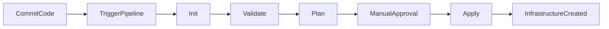
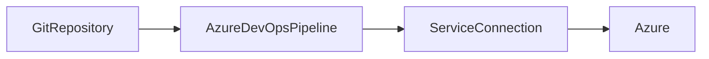
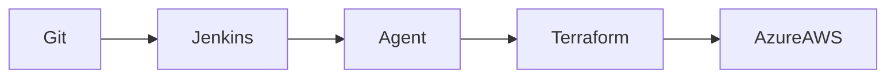
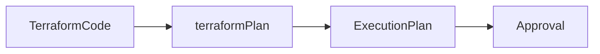
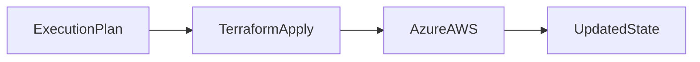

# Terraform in CI/CD

## Overview

Terraform is commonly integrated into **CI/CD pipelines** to automate infrastructure provisioning and management. Instead of manually executing Terraform commands, CI/CD tools such as **Azure DevOps** and **Jenkins** automatically validate, plan, and deploy infrastructure whenever changes are committed to a Git repository.

A typical Terraform CI/CD pipeline performs the following:

1. Fetch Terraform code from Git
2. Initialize Terraform
3. Validate configuration
4. Generate an execution plan
5. Apply the infrastructure changes (after approval if required)

> **Interview Tip**
>
> In production environments, `terraform apply` is almost never executed manually. It is typically triggered through a CI/CD pipeline with approvals and remote state management.

---

## Why It Is Used

Terraform is integrated with CI/CD to:

- Automate infrastructure deployments
- Eliminate manual provisioning
- Standardize deployments
- Reduce human errors
- Support Infrastructure as Code (IaC)
- Enable version-controlled infrastructure
- Deploy multiple environments consistently

---

## Architecture / Working


---

## Key Components

| Component | Purpose |
|-----------|----------|
| Git Repository | Stores Terraform code |
| CI/CD Pipeline | Automates execution |
| Terraform CLI | Executes Terraform commands |
| Remote Backend | Stores Terraform state |
| Service Connection / Credentials | Authenticates with cloud provider |
| Approval Stage | Controls production deployments |

---

## Types (if applicable)

| Pipeline Type | Purpose |
|--------------|---------|
| Validation Pipeline | Syntax and formatting checks |
| Plan Pipeline | Generates execution plan |
| Apply Pipeline | Deploys infrastructure |
| Destroy Pipeline | Removes infrastructure (rare in production) |

---

## Lifecycle / Workflow



---

## Configuration / Syntax (if applicable)

Typical Pipeline Commands

```bash
terraform init

terraform fmt -check

terraform validate

terraform plan -out=tfplan

terraform apply tfplan
```

---

## Important Commands (if applicable)

Initialize

```bash
terraform init
```

Format

```bash
terraform fmt
```

Validate

```bash
terraform validate
```

Plan

```bash
terraform plan -out=tfplan
```

Apply

```bash
terraform apply tfplan
```

Destroy

```bash
terraform destroy
```

---

## Important Files (if applicable)

| File | Purpose |
|------|----------|
| main.tf | Infrastructure |
| variables.tf | Variables |
| terraform.tfvars | Variable values |
| providers.tf | Provider configuration |
| backend.tf | Remote backend |
| azure-pipelines.yml | Azure DevOps pipeline |
| Jenkinsfile | Jenkins pipeline |

---

## Real-World Use Cases

- Azure infrastructure deployment
- AWS infrastructure deployment
- Multi-environment deployments
- Automated infrastructure updates
- Disaster recovery automation
- Infrastructure standardization

---

## Advantages

- Fully automated deployments
- Repeatable infrastructure
- Version-controlled changes
- Supports approvals
- Faster deployments
- Easier auditing

---

## Limitations

- Incorrect pipeline configuration can affect production
- Requires secure credential management
- Remote state must be protected

---

## Common Interview Questions (Concept Only)

- Why integrate Terraform with CI/CD?
- What stages are included in a Terraform pipeline?
- Why should `terraform apply` use a saved plan file?
- Why is manual approval recommended before production deployments?
- Why is remote state important in CI/CD?

---

## Common Mistakes

- Running `terraform apply` without a saved plan
- Hardcoding cloud credentials
- Storing Terraform state locally
- Ignoring approval stages
- Running production deployments directly from feature branches

---

## Troubleshooting

| Problem | Solution |
|----------|----------|
| Provider authentication fails | Verify service connection or credentials |
| Backend initialization fails | Check backend configuration |
| Plan differs unexpectedly | Refresh state and review changes |
| State lock error | Verify state locking configuration |
| Apply fails | Review pipeline logs and Terraform output |

---

## Summary

Terraform CI/CD pipelines automate infrastructure provisioning using version-controlled Terraform code. Production pipelines typically include validation, planning, approvals, and deployment stages to ensure safe and repeatable infrastructure changes.

---

# Terraform in Azure DevOps Pipelines

## Overview

Azure DevOps Pipelines automate Terraform deployments to Azure using YAML pipelines or Classic Pipelines.

A Service Connection authenticates the pipeline with Azure.

> **Interview Tip**
>
> The Azure Resource Manager (ARM) Service Connection is the preferred authentication method instead of embedding credentials in pipeline files.

---

## Why It Is Used

Azure DevOps provides:

- Automated deployments
- Pipeline approvals
- Environment management
- Secret storage
- Integration with Azure Repos and GitHub

---

## Architecture / Working



---

## Key Components

| Component | Purpose |
|-----------|----------|
| Azure Pipeline | Executes Terraform |
| Service Connection | Azure authentication |
| Agent | Runs pipeline |
| Backend | Stores Terraform state |

---

## Types (if applicable)

- YAML Pipeline
- Classic Pipeline

---

## Lifecycle / Workflow

Commit Code → Pipeline Trigger → Init → Validate → Plan → Approval → Apply

---

## Configuration / Syntax (if applicable)

Typical Pipeline Steps

```yaml
- terraform init
- terraform validate
- terraform plan
- terraform apply
```

---

## Important Commands (if applicable)

```bash
terraform init

terraform plan

terraform apply
```

---

## Important Files (if applicable)

- azure-pipelines.yml
- backend.tf

---

## Real-World Use Cases

- Azure Landing Zones
- Infrastructure deployment
- Environment provisioning

---

## Advantages

- Native Azure integration
- Secure authentication
- Pipeline approvals

---

## Limitations

- Azure DevOps permissions must be configured correctly

---

## Common Interview Questions (Concept Only)

- How does Azure DevOps authenticate with Azure?
- What is a Service Connection?
- Why use YAML pipelines?

---

## Common Mistakes

- Hardcoding Azure credentials
- Incorrect Service Connection permissions

---

## Troubleshooting

Verify Service Connection, pipeline permissions, and backend configuration.

---

## Summary

Azure DevOps Pipelines automate Terraform deployments using Azure Service Connections and are widely used for enterprise Azure infrastructure provisioning.

---

# Terraform in Jenkins Pipelines

## Overview

Jenkins executes Terraform commands through Pipeline jobs using agents.

Terraform is installed on the Jenkins agent, and cloud credentials are securely stored using Jenkins Credentials.

> **Interview Tip**
>
> Never store cloud credentials directly inside the Jenkinsfile. Use Jenkins Credentials and environment variables.

---

## Why It Is Used

Jenkins enables:

- Automated deployments
- Multi-cloud pipelines
- Integration with Git
- Flexible pipeline scripting

---

## Architecture / Working



---

## Key Components

| Component | Purpose |
|-----------|----------|
| Jenkins Controller | Pipeline management |
| Jenkins Agent | Executes Terraform |
| Credentials | Cloud authentication |
| Jenkinsfile | Pipeline definition |

---

## Types (if applicable)

- Declarative Pipeline
- Scripted Pipeline

---

## Lifecycle / Workflow

Git Push → Jenkins Trigger → Checkout → Init → Validate → Plan → Approval → Apply

---

## Configuration /Syntax (if applicable)

Typical Pipeline

```groovy
stage('Init') {
    sh 'terraform init'
}

stage('Plan') {
    sh 'terraform plan -out=tfplan'
}

stage('Apply') {
    sh 'terraform apply tfplan'
}
```

---

## Important Commands (if applicable)

```bash
terraform init

terraform validate

terraform plan

terraform apply
```

---

## Important Files (if applicable)

- Jenkinsfile
- backend.tf

---

## Real-World Use Cases

- Azure deployments
- AWS deployments
- Kubernetes infrastructure
- Multi-cloud automation

---

## Advantages

- Highly customizable
- Supports many plugins
- Easy Git integration

---

## Limitations

- Requires Jenkins maintenance
- Plugin compatibility management

---

## Common Interview Questions (Concept Only)

- How does Jenkins execute Terraform?
- Where should cloud credentials be stored?
- Why use Jenkins agents?

---

## Common Mistakes

- Installing Terraform only on the controller
- Hardcoding credentials

---

## Troubleshooting

Verify Jenkins agent configuration, Terraform installation, and credential bindings.

---

## Summary

Jenkins Pipelines automate Terraform deployments by executing Terraform commands on agents while securely managing cloud credentials.

---

# Plan Stage

## Overview

The **Plan Stage** generates an execution plan that shows the infrastructure changes Terraform intends to make without modifying any resources.

It is the most important validation step before deployment.

> **Interview Tip**
>
> In production pipelines, save the execution plan to a file (`-out=tfplan`) and use that same file during the Apply stage to guarantee that the reviewed changes are the ones being deployed.

---

## Why It Is Used

The Plan Stage helps to:

- Detect configuration errors
- Preview infrastructure changes
- Prevent accidental modifications
- Support approval workflows

---

## Architecture / Working



---

## Key Components

| Component | Purpose |
|-----------|----------|
| Configuration | Desired infrastructure |
| State File | Current infrastructure |
| Plan Output | Proposed changes |

---

## Types (if applicable)

- Standard Plan
- Saved Plan (`tfplan`)

---

## Lifecycle / Workflow

Init → Validate → Plan → Review → Approval

---

## Configuration / Syntax (if applicable)

```bash
terraform plan -out=tfplan
```

---

## Important Commands (if applicable)

```bash
terraform plan

terraform plan -out=tfplan
```

---

## Important Files (if applicable)

- tfplan
- terraform.tfstate

---

## Real-World Use Cases

- Infrastructure review
- Change approval
- Deployment validation

---

## Advantages

- Safe deployment preview
- Supports approval workflows
- Detects unexpected changes

---

## Limitations

- Plan can become outdated if infrastructure changes before Apply

---

## Common Interview Questions (Concept Only)

- Why is the Plan stage important?
- Why save the plan to a file?
- Can Plan modify infrastructure?

---

## Common Mistakes

- Ignoring plan output
- Applying without reviewing changes

---

## Troubleshooting

Verify provider credentials, state file, and variable values.

---

## Summary

The Plan Stage previews infrastructure changes and is the primary review point before applying Terraform changes in production.

---

# Apply Stage

## Overview

The **Apply Stage** creates, updates, or deletes infrastructure based on the execution plan generated during the Plan stage.

It is the deployment stage of the pipeline.

> **Interview Tip**
>
> Production pipelines typically execute `terraform apply tfplan` instead of generating a new plan during the Apply stage.

---

## Why It Is Used

The Apply Stage:

- Deploys infrastructure
- Updates existing resources
- Removes obsolete resources
- Synchronizes actual infrastructure with Terraform configuration

---

## Architecture / Working



---

## Key Components

| Component | Purpose |
|-----------|----------|
| Execution Plan | Approved changes |
| Provider | Cloud communication |
| State File | Updated infrastructure state |

---

## Types (if applicable)

- Automatic Apply
- Manual Approval Apply

---

## Lifecycle / Workflow

Approved Plan → Apply → Resource Creation → State Update

---

## Configuration / Syntax (if applicable)

```bash
terraform apply tfplan
```

---

## Important Commands (if applicable)

```bash
terraform apply

terraform apply tfplan
```

---

## Important Files (if applicable)

- tfplan
- terraform.tfstate

---

## Real-World Use Cases

- Production deployments
- Infrastructure updates
- Disaster recovery provisioning

---

## Advantages

- Automated deployments
- Consistent infrastructure
- Reduced manual effort

---

## Limitations

- Incorrect configuration can modify production resources
- Requires secure approvals for sensitive environments

---

## Common Interview Questions (Concept Only)

- What happens during the Apply stage?
- Why use a saved execution plan?
- When should manual approval be required before Apply?

---

## Common Mistakes

- Running `terraform apply` directly against production without review
- Regenerating a plan instead of using the approved plan file
- Applying with stale state information

---

## Troubleshooting

| Problem | Solution |
|----------|----------|
| Apply fails | Review Terraform output and provider logs |
| State lock detected | Wait for the lock to clear or investigate the locking backend |
| Permission denied | Verify cloud credentials and IAM/RBAC permissions |
| Resource already exists | Import the resource or reconcile the Terraform state |

---

## Summary

The Apply Stage executes the approved Terraform plan to provision or update infrastructure. In production environments, it should use a previously approved plan file and appropriate approval gates to ensure safe, predictable deployments.
