# Essential Terraform Commands

## Overview

Terraform commands are used to initialize a project, validate configuration, preview infrastructure changes, deploy resources, manage state, and destroy infrastructure.

These commands form the core Terraform workflow and are used daily by DevOps Engineers, Cloud Engineers, Platform Engineers, and SREs.

> **Interview Tip**
>
> The most frequently asked Terraform commands in interviews are:
>
> - `terraform init`
> - `terraform validate`
> - `terraform fmt`
> - `terraform plan`
> - `terraform apply`
> - `terraform destroy`
> - `terraform output`
> - `terraform show`
> - `terraform state`

---

## Why It Is Used

Terraform commands help to:

- Initialize Terraform projects
- Verify configuration correctness
- Standardize Terraform code
- Preview infrastructure changes
- Deploy cloud infrastructure
- Destroy infrastructure safely
- View outputs
- Manage Terraform state

---

## Architecture / Working

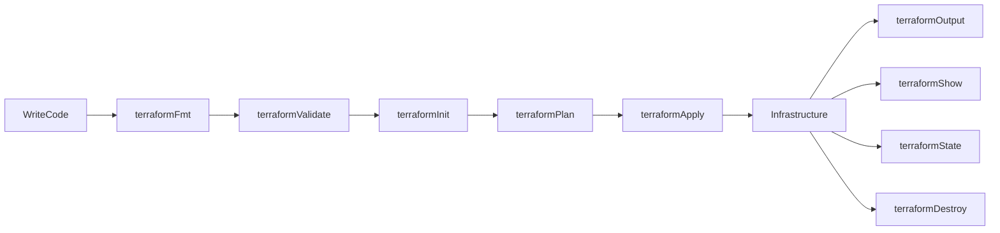

---

## Key Components

| Command | Purpose |
|----------|----------|
| terraform init | Initialize project |
| terraform validate | Validate configuration |
| terraform fmt | Format code |
| terraform plan | Preview changes |
| terraform apply | Deploy infrastructure |
| terraform destroy | Remove infrastructure |
| terraform output | Display outputs |
| terraform show | Show state and plan details |
| terraform state | Manage state |

---

## Types (if applicable)

Terraform commands are grouped into:

| Category | Commands |
|----------|-----------|
| Initialization | init |
| Validation | validate, fmt |
| Deployment | plan, apply |
| Destruction | destroy |
| Inspection | output, show |
| State Management | state |

---

## Lifecycle / Workflow

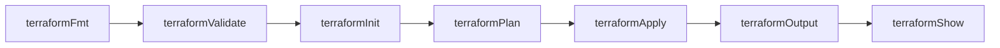

---

## Configuration / Syntax (if applicable)

Typical Workflow

```bash
terraform fmt

terraform validate

terraform init

terraform plan

terraform apply
```

---

## Important Commands (if applicable)

```bash
terraform init

terraform validate

terraform fmt

terraform plan

terraform apply

terraform destroy

terraform output

terraform show

terraform state
```

---

## Important Files (if applicable)

| File | Purpose |
|------|----------|
| main.tf | Infrastructure |
| variables.tf | Variables |
| outputs.tf | Outputs |
| terraform.tfvars | Variable values |
| terraform.tfstate | Infrastructure state |
| terraform.lock.hcl | Provider lock file |

---

## Real-World Use Cases

- Azure Infrastructure Deployment
- AWS Infrastructure Deployment
- CI/CD Pipelines
- Infrastructure Validation
- Infrastructure Updates
- Disaster Recovery

---

## Advantages

- Fully automated infrastructure
- Repeatable deployments
- Easy rollback through code changes
- Consistent infrastructure
- Supports Infrastructure as Code

---

## Limitations

- Incorrect commands can modify infrastructure
- State must be managed carefully
- Destroy command should be used cautiously

---

## Common Interview Questions (Concept Only)

- What is the typical Terraform workflow?
- What is the difference between `plan` and `apply`?
- What does `terraform init` download?
- Why should `terraform validate` be executed before `plan`?
- What information is stored in Terraform state?

---

## Common Mistakes

- Skipping `terraform validate`
- Applying changes without reviewing the plan
- Editing the state file manually
- Forgetting to initialize providers
- Running `destroy` in the wrong environment

---

## Troubleshooting

| Problem | Solution |
|----------|----------|
| Initialization fails | Run `terraform init` and verify provider configuration |
| Plan fails | Validate syntax and variable values |
| Apply fails | Review provider errors and permissions |
| Output missing | Verify outputs are defined in `outputs.tf` |
| State issue | Review state with `terraform state` |

---

## Summary

Terraform commands automate the complete infrastructure lifecycle—from project initialization to deployment, inspection, state management, and destruction. Mastering these commands is essential for Terraform interviews and production environments.

---

# terraform init

## Overview

`terraform init` initializes a Terraform working directory.

It is the **first command** executed in every Terraform project.

Initialization performs the following tasks:

- Downloads providers
- Initializes backend
- Downloads modules
- Creates provider dependency lock file

> **Interview Tip**
>
> `terraform init` does **not** create infrastructure.

---

## Why It Is Used

- Prepare Terraform project
- Download required providers
- Configure backend
- Initialize modules

---

## Architecture / Working

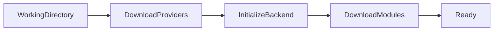

---

## Key Components

| Component | Purpose |
|-----------|----------|
| Providers | Cloud plugins |
| Backend | State configuration |
| Modules | Reusable infrastructure |

---

## Types (if applicable)

- Standard Initialization
- Upgrade Providers
- Reconfigure Backend

---

## Lifecycle / Workflow

Run `terraform init` → Download Providers → Configure Backend → Ready

---

## Configuration / Syntax (if applicable)

Initialize

```bash
terraform init
```

Upgrade Providers

```bash
terraform init -upgrade
```

Reconfigure Backend

```bash
terraform init -reconfigure
```

---

## Important Commands (if applicable)

```bash
terraform init

terraform init -upgrade

terraform init -reconfigure
```

---

## Important Files (if applicable)

- terraform.lock.hcl
- .terraform/

---

## Real-World Use Cases

- New project setup
- Backend migration
- Module download

---

## Advantages

- Downloads dependencies
- Initializes backend
- Prepares working directory

---

## Limitations

- Requires internet access (unless cached)
- Backend must be reachable

---

## Common Interview Questions (Concept Only)

- What does `terraform init` do?
- When should `terraform init` be executed?
- Does `terraform init` create infrastructure?

---

## Common Mistakes

- Forgetting to initialize after changing providers
- Running Terraform commands before initialization

---

## Troubleshooting

Verify internet access, backend configuration, and provider versions.

---

## Summary

`terraform init` prepares the Terraform project by downloading providers, initializing the backend, and preparing modules.

---

# terraform validate

## Overview

`terraform validate` checks Terraform configuration for syntax errors and configuration correctness.

It does **not** contact the cloud provider.

> **Interview Tip**
>
> `terraform validate` checks configuration only; it does not verify whether Azure or AWS resources exist.

---

## Why It Is Used

- Validate syntax
- Detect configuration errors
- Prevent deployment failures

---

## Architecture / Working

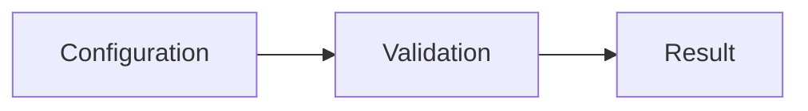

---

## Key Components

| Component | Purpose |
|-----------|----------|
| HCL Parser | Reads configuration |
| Validator | Detects errors |

---

## Types (if applicable)

Configuration Validation

---

## Lifecycle / Workflow

Read Files → Validate → Report Errors

---

## Configuration / Syntax (if applicable)

```bash
terraform validate
```

---

## Important Commands (if applicable)

```bash
terraform validate
```

---

## Important Files (if applicable)

- *.tf

---

## Real-World Use Cases

- CI/CD validation
- Local testing

---

## Advantages

- Fast
- Prevents syntax errors

---

## Limitations

- Does not verify cloud resources

---

## Common Interview Questions (Concept Only)

- What does `terraform validate` check?
- Does it connect to Azure?

---

## Common Mistakes

- Assuming validation deploys infrastructure

---

## Troubleshooting

Run `terraform fmt` before validation if formatting issues exist.

---

## Summary

`terraform validate` checks Terraform configuration for correctness before planning or deployment.

---

# terraform fmt

## Overview

`terraform fmt` automatically formats Terraform configuration files according to the official Terraform style guide.

It improves readability and consistency.

---

## Why It Is Used

- Standardize formatting
- Improve readability
- Maintain consistent code

---

## Architecture / Working

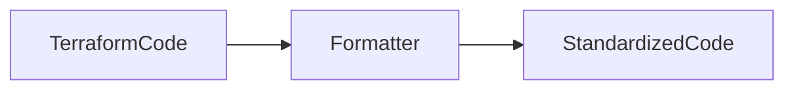

---

## Key Components

| Component | Purpose |
|-----------|----------|
| Formatter | Formats HCL |

---

## Types (if applicable)

- Format
- Check Only

---

## Lifecycle / Workflow

Read File → Format → Save

---

## Configuration / Syntax (if applicable)

```bash
terraform fmt
```

Check Formatting

```bash
terraform fmt -check
```

---

## Important Commands (if applicable)

```bash
terraform fmt

terraform fmt -check
```

---

## Important Files (if applicable)

- *.tf

---

## Real-World Use Cases

- CI/CD quality checks
- Team collaboration

---

## Advantages

- Consistent formatting
- Easier code reviews

---

## Limitations

- Only formats code

---

## Common Interview Questions (Concept Only)

- What does `terraform fmt` do?

---

## Common Mistakes

- Skipping formatting before commits

---

## Troubleshooting

Run `terraform fmt -recursive` for nested modules.

---

## Summary

`terraform fmt` formats Terraform files according to HashiCorp's recommended coding style.

---

# terraform plan

## Overview

`terraform plan` generates an execution plan that shows what Terraform will create, modify, or destroy without making changes.

> **Interview Tip**
>
> `terraform plan` is a read-only operation.

---

## Why It Is Used

- Review infrastructure changes
- Prevent accidental modifications
- Support approval workflows

---

## Architecture / Working

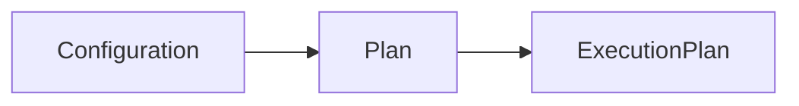

---

## Key Components

| Component | Purpose |
|-----------|----------|
| Configuration | Desired state |
| State | Current state |
| Execution Plan | Proposed changes |

---

## Types (if applicable)

- Standard Plan
- Saved Plan

---

## Lifecycle / Workflow

Read State → Compare Configuration → Generate Plan

---

## Configuration / Syntax (if applicable)

```bash
terraform plan
```

Save Plan

```bash
terraform plan -out=tfplan
```

---

## Important Commands (if applicable)

```bash
terraform plan

terraform plan -out=tfplan
```

---

## Important Files (if applicable)

- tfplan

---

## Real-World Use Cases

- Production approvals
- Change reviews

---

## Advantages

- Safe preview
- No infrastructure changes

---

## Limitations

- Plan can become outdated

---

## Common Interview Questions (Concept Only)

- What is the purpose of `terraform plan`?
- Why save a plan file?

---

## Common Mistakes

- Ignoring plan output

---

## Troubleshooting

Validate configuration before planning.

---

## Summary

`terraform plan` previews infrastructure changes before deployment.

---

# terraform apply

## Overview

`terraform apply` executes the Terraform execution plan and creates, updates, or deletes infrastructure.

---

## Why It Is Used

- Deploy infrastructure
- Update resources
- Synchronize infrastructure

---

## Architecture / Working

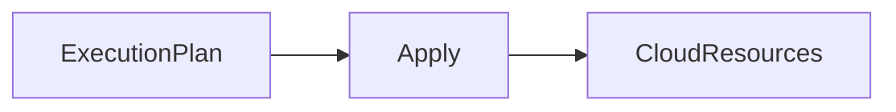

---

## Key Components

| Component | Purpose |
|-----------|----------|
| Provider | Executes API calls |
| State | Updated after deployment |

---

## Types (if applicable)

- Automatic Apply
- Apply Saved Plan

---

## Lifecycle / Workflow

Read Plan → Execute → Update State

---

## Configuration / Syntax (if applicable)

```bash
terraform apply
```

Apply Saved Plan

```bash
terraform apply tfplan
```

---

## Important Commands (if applicable)

```bash
terraform apply

terraform apply tfplan
```

---

## Important Files (if applicable)

- terraform.tfstate

---

## Real-World Use Cases

- Infrastructure deployment
- Production updates

---

## Advantages

- Automated deployment
- Consistent infrastructure

---

## Limitations

- Changes real infrastructure

---

## Common Interview Questions (Concept Only)

- What happens during `terraform apply`?

---

## Common Mistakes

- Applying without reviewing the plan

---

## Troubleshooting

Review provider authentication and API errors.

---

## Summary

`terraform apply` executes approved infrastructure changes and updates the Terraform state.

---

# terraform destroy

## Overview

`terraform destroy` removes all infrastructure managed by the current Terraform configuration.

> **Interview Tip**
>
> Always review the destruction plan before confirming.

---

## Why It Is Used

- Remove environments
- Clean up test resources
- Reduce cloud costs

---

## Architecture / Working

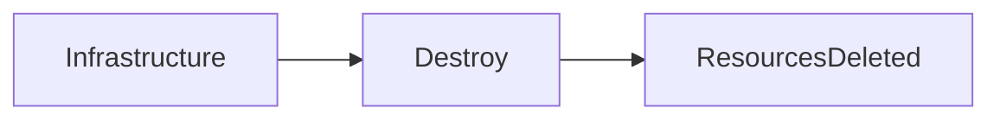

---

## Key Components

| Component | Purpose |
|-----------|----------|
| State | Identifies resources |
| Provider | Deletes resources |

---

## Types (if applicable)

Complete Destruction

---

## Lifecycle / Workflow

Read State → Delete Resources → Update State

---

## Configuration / Syntax (if applicable)

```bash
terraform destroy
```

---

## Important Commands (if applicable)

```bash
terraform destroy
```

---

## Important Files (if applicable)

- terraform.tfstate

---

## Real-World Use Cases

- Lab cleanup
- Temporary environments

---

## Advantages

- Automated cleanup
- Cost savings

---

## Limitations

- Deletes managed infrastructure

---

## Common Interview Questions (Concept Only)

- What does `terraform destroy` do?

---

## Common Mistakes

- Running destroy in production

---

## Troubleshooting

Review the destruction plan before confirmation.

---

## Summary

`terraform destroy` removes Terraform-managed infrastructure safely and updates the state.

---

# terraform output

## Overview

`terraform output` displays output values defined in `outputs.tf`.

Outputs expose useful information such as:

- Public IP addresses
- Resource IDs
- Storage account names
- Virtual Network IDs

---

## Why It Is Used

- Display deployment results
- Share resource information
- Integrate with CI/CD

---

## Architecture / Working

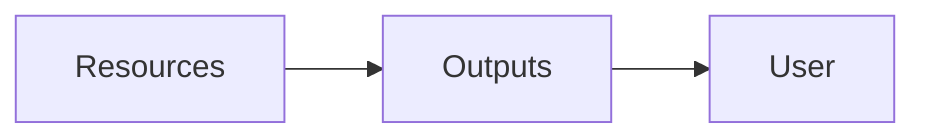

---

## Key Components

| Component | Purpose |
|-----------|----------|
| Outputs | Exposed values |

---

## Types (if applicable)

Single Output

All Outputs

---

## Lifecycle / Workflow

Deploy → Read Outputs → Display Values

---

## Configuration / Syntax (if applicable)

```bash
terraform output
```

Single Output

```bash
terraform output vm_ip
```

---

## Important Commands (if applicable)

```bash
terraform output

terraform output <name>
```

---

## Important Files (if applicable)

outputs.tf

---

## Real-World Use Cases

- VM Public IP
- Storage Account Name
- Resource IDs

---

## Advantages

- Easy access to deployed resources
- CI/CD integration

---

## Limitations

- Requires defined outputs

---

## Common Interview Questions (Concept Only)

- What is `terraform output` used for?

---

## Common Mistakes

- Forgetting to define outputs

---

## Troubleshooting

Verify outputs are declared in `outputs.tf`.

---

## Summary

`terraform output` displays values exported from Terraform configurations.

---

# terraform show

## Overview

`terraform show` displays the current Terraform state or the contents of a saved execution plan.

---

## Why It Is Used

- Inspect deployed infrastructure
- Review saved plans
- Debug state

---

## Architecture / Working

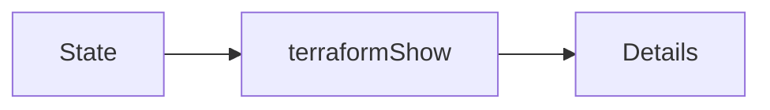

---

## Key Components

| Component | Purpose |
|-----------|----------|
| State | Infrastructure information |

---

## Types (if applicable)

- State View
- Plan View

---

## Lifecycle / Workflow

Read State → Display Details

---

## Configuration / Syntax (if applicable)

```bash
terraform show
```

Show Saved Plan

```bash
terraform show tfplan
```

---

## Important Commands (if applicable)

```bash
terraform show

terraform show tfplan
```

---

## Important Files (if applicable)

- terraform.tfstate
- tfplan

---

## Real-World Use Cases

- Infrastructure inspection
- Debugging deployments

---

## Advantages

- Detailed infrastructure information

---

## Limitations

- Read-only

---

## Common Interview Questions (Concept Only)

- What does `terraform show` display?

---

## Common Mistakes

- Confusing `show` with `output`

---

## Troubleshooting

Verify the state or plan file exists before running the command.

---

## Summary

`terraform show` displays detailed information about Terraform state or saved execution plans.

---

# terraform state

## Overview

`terraform state` manages and inspects the Terraform state file.

It is primarily used for advanced state management and troubleshooting.

> **Interview Tip**
>
> Avoid manually editing `terraform.tfstate`. Use `terraform state` commands whenever possible.

---

## Why It Is Used

- Inspect state
- Move resources
- Remove resources from state
- List managed resources

---

## Architecture / Working

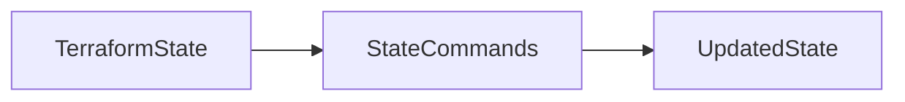

---

## Key Components

| Component | Purpose |
|-----------|----------|
| State File | Tracks resources |
| State Commands | Manage state |

---

## Types (if applicable)

- List
- Show
- Move
- Remove

---

## Lifecycle / Workflow

Read State → Execute Command → Update State

---

## Configuration / Syntax (if applicable)

List Resources

```bash
terraform state list
```

Show Resource

```bash
terraform state show RESOURCE_NAME
```

Remove Resource from State

```bash
terraform state rm RESOURCE_NAME
```

Move Resource

```bash
terraform state mv SOURCE DESTINATION
```

---

## Important Commands (if applicable)

```bash
terraform state list

terraform state show

terraform state mv

terraform state rm
```

---

## Important Files (if applicable)

- terraform.tfstate
- terraform.tfstate.backup

---

## Real-World Use Cases

- Import existing infrastructure
- Refactor Terraform code
- Resolve state issues
- Troubleshoot deployments

---

## Advantages

- Safe state management
- Powerful troubleshooting capabilities

---

## Limitations

- Incorrect state operations can affect managed infrastructure

---

## Common Interview Questions (Concept Only)

- What is the purpose of `terraform state`?
- Why should you avoid editing the state file manually?
- What is the difference between `terraform show` and `terraform state show`?

---

## Common Mistakes

- Editing the state file manually
- Removing resources from state accidentally
- Running state commands without backups

---

## Troubleshooting

Always back up the state before performing state operations and use remote state with locking in team environments.

---

## Summary

`terraform state` provides commands to inspect and manage Terraform state safely. It is an essential tool for troubleshooting, refactoring, and maintaining Terraform-managed infrastructure.
