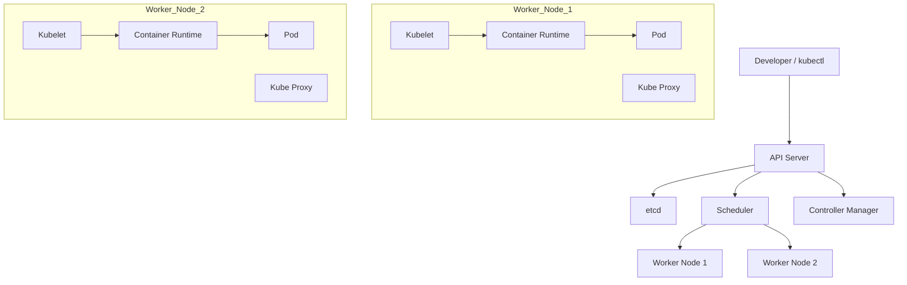
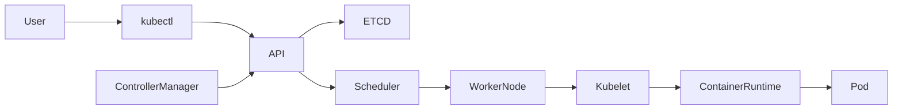
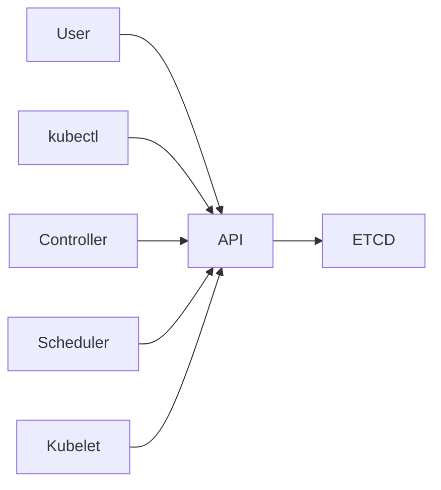
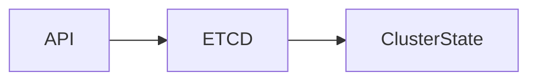
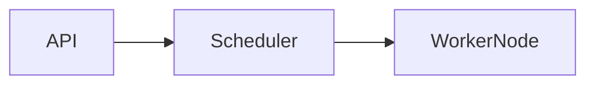
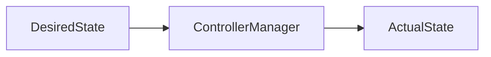
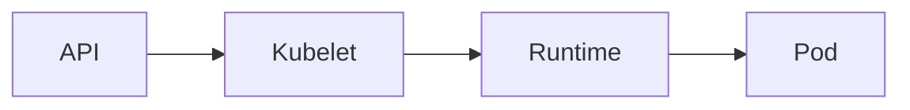
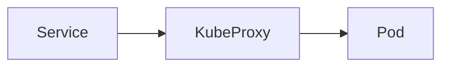
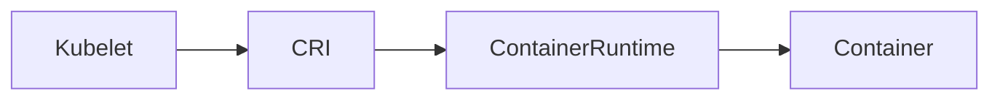

# Cluster Architecture

## Overview

A Kubernetes Cluster is a collection of machines (nodes) that work together to deploy, manage, scale, and maintain containerized applications.

A Kubernetes Cluster consists of two main parts:

- **Control Plane** – Manages the cluster.
- **Worker Nodes** – Run application workloads.

The Control Plane makes decisions about the cluster, while Worker Nodes execute those decisions by running Pods.

> **Interview Tip**
>
> The most frequently asked Kubernetes interview question is:
>
> **"Explain the Kubernetes Cluster Architecture."**
>
> You should be able to explain every major component and how they interact.

---

## Why It Is Used

Kubernetes Cluster Architecture is designed to:

- Automate application deployment
- Maintain desired application state
- Provide high availability
- Enable automatic scaling
- Recover failed containers automatically
- Distribute workloads across multiple servers
- Simplify cluster management

---

## Architecture / Working



---

## Key Components

### Control Plane Components

| Component | Responsibility |
|-----------|----------------|
| API Server | Entry point of Kubernetes |
| etcd | Stores cluster state |
| Scheduler | Assigns Pods to Worker Nodes |
| Controller Manager | Maintains desired state |

---

### Worker Node Components

| Component | Responsibility |
|-----------|----------------|
| Kubelet | Manages Pods on the node |
| Kube Proxy | Handles networking |
| Container Runtime | Runs containers |
| Pods | Run applications |

---

## Types (if applicable)

### Cluster Types

| Type | Description |
|------|-------------|
| Single Node Cluster | Learning and testing |
| Multi Node Cluster | Production deployments |
| Managed Cluster | AKS, EKS, GKE |
| Self Managed Cluster | kubeadm, Rancher, OpenShift, etc. |

---

## Lifecycle / Workflow



### Cluster Workflow

1. User submits YAML.
2. API Server validates request.
3. Desired state stored in etcd.
4. Scheduler selects Worker Node.
5. Kubelet receives instructions.
6. Container Runtime creates containers.
7. Controller Manager continuously checks cluster health.
8. Kube Proxy provides networking.

---

## Configuration / Syntax (if applicable)

Deploy Application

```bash
kubectl apply -f deployment.yaml
```

View Cluster

```bash
kubectl cluster-info
```

---

## Important Commands (if applicable)

Cluster Information

```bash
kubectl cluster-info
```

View Nodes

```bash
kubectl get nodes
```

Describe Node

```bash
kubectl describe node <node-name>
```

View Components

```bash
kubectl get componentstatuses
```

View Pods

```bash
kubectl get pods -A
```

View Events

```bash
kubectl get events
```

---

## Important Files (if applicable)

| File | Purpose |
|------|----------|
| ~/.kube/config | Cluster configuration |
| deployment.yaml | Deploy applications |
| service.yaml | Define services |
| kubeconfig | Cluster authentication |

---

## Real-World Use Cases

- Microservices deployment
- Auto scaling applications
- High availability systems
- Enterprise container platforms
- CI/CD deployments
- Cloud-native applications
- Hybrid cloud infrastructure

---

## Advantages

- High availability
- Automatic scaling
- Self-healing
- Automated scheduling
- Efficient resource utilization
- Centralized management
- Rolling updates
- Automatic recovery

---

## Limitations

- Steep learning curve
- Initial setup complexity
- Networking complexity
- Requires monitoring
- More infrastructure overhead

---

## Common Interview Questions (Concept Only)

- Explain Kubernetes Cluster Architecture.
- What are the components of the Control Plane?
- What are Worker Nodes?
- How does Kubernetes schedule Pods?
- What is the role of Kubelet?
- How does API Server work?
- What is etcd?
- Why is etcd important?
- How does Kube Proxy work?
- Which component communicates with the Container Runtime?

---

## Common Mistakes

- Confusing Control Plane with Worker Nodes
- Assuming Scheduler runs containers
- Thinking API Server stores data permanently
- Not understanding Controller Manager responsibilities
- Assuming Kube Proxy is a load balancer only
- Confusing Pods with Containers

---

## Troubleshooting

| Problem | Cause | Solution |
|----------|--------|----------|
| Node Not Ready | Kubelet stopped | Restart Kubelet |
| API Server unavailable | Control Plane issue | Check API Server status |
| Scheduler not assigning Pods | Resource shortage | Check node resources |
| Pods not starting | Runtime issue | Check Container Runtime |
| Network issues | Kube Proxy problem | Restart Kube Proxy |
| Cluster state inconsistency | etcd issue | Verify etcd health |

Useful Commands

```bash
kubectl cluster-info

kubectl get nodes

kubectl get pods -A

kubectl describe node <node-name>

kubectl get events
```

---

## Summary

A Kubernetes Cluster consists of a **Control Plane** that manages the cluster and **Worker Nodes** that execute application workloads. The Control Plane includes the **API Server**, **etcd**, **Scheduler**, and **Controller Manager**, while Worker Nodes include the **Kubelet**, **Kube Proxy**, **Container Runtime**, and **Pods**. Understanding the interaction between these components is fundamental for designing, operating, and troubleshooting Kubernetes clusters.

---

# API Server

## Overview

The **API Server (`kube-apiserver`)** is the central management component of Kubernetes and acts as the **front end of the Control Plane**.

All communication with the Kubernetes cluster passes through the API Server.

Whether requests come from:

- `kubectl`
- CI/CD pipelines
- Kubernetes controllers
- Scheduler
- Kubelets
- External applications

they are first received and processed by the API Server.

> **Interview Tip**
>
> The API Server is often described as the **"Gateway"** or **"Front Door"** of Kubernetes.

---

## Why It Is Used

The API Server:

- Accepts REST API requests
- Validates requests
- Authenticates users
- Authorizes actions
- Stores cluster state in etcd
- Coordinates communication between cluster components

---

## Architecture / Working



---

## Key Components

| Component | Purpose |
|-----------|----------|
| REST API | Receives requests |
| Authentication | Verifies identity |
| Authorization | Checks permissions |
| Admission Controllers | Validate requests |
| etcd Client | Reads/Writes cluster state |

---

## Types (if applicable)

Single API Server

Highly Available API Servers

---

## Lifecycle / Workflow

1. User sends request.
2. API Server authenticates user.
3. Authorization check.
4. Admission Controller validation.
5. Store desired state in etcd.
6. Notify Scheduler and Controllers.

---

## Configuration / Syntax (if applicable)

View API Versions

```bash
kubectl api-versions
```

View API Resources

```bash
kubectl api-resources
```

---

## Important Commands (if applicable)

```bash
kubectl cluster-info

kubectl api-resources

kubectl api-versions
```

---

## Important Files (if applicable)

- kube-apiserver.yaml (static pod)
- ~/.kube/config

---

## Real-World Use Cases

- Deploy applications
- Scale workloads
- Delete resources
- Update cluster state

---

## Advantages

- Central communication point
- Secure API
- Highly scalable

---

## Limitations

- Single point of failure if HA is not configured

---

## Common Interview Questions (Concept Only)

- What is the API Server?
- Is API Server the entry point of Kubernetes?
- Which component stores cluster state?

---

## Common Mistakes

- Thinking API Server runs containers
- Confusing API Server with Scheduler

---

## Troubleshooting

- Check API Server health
- Verify certificates
- Check Control Plane status

---

## Summary

The API Server is the entry point to Kubernetes and coordinates communication between all cluster components while storing the desired state in etcd.

---

# etcd

## Overview

**etcd** is Kubernetes' distributed key-value database.

It stores the **entire cluster state**, including:

- Nodes
- Pods
- Deployments
- Services
- Secrets
- ConfigMaps
- RBAC policies

> **Interview Tip**
>
> If etcd is lost and no backup exists, the Kubernetes cluster cannot recover its state.

---

## Why It Is Used

- Store cluster configuration
- Store desired state
- Support high availability
- Enable recovery

---

## Architecture / Working



---

## Key Components

| Component | Purpose |
|-----------|----------|
| Key-Value Store | Stores data |
| Replication | High availability |

---

## Types (if applicable)

Single Node

Clustered etcd

---

## Lifecycle / Workflow

API Server → Store State → Read State → Update State

---

## Configuration /Syntax (if applicable)

No daily commands required for application developers.

---

## Important Commands (if applicable)

Health checks are typically performed using `etcdctl` by cluster administrators.

---

## Important Files (if applicable)

etcd database

---

## Real-World Use Cases

- Store deployments
- Store Secrets
- Store cluster metadata

---

## Advantages

- Fast
- Reliable
- Highly available

---

## Limitations

- Critical dependency
- Requires backups

---

## Common Interview Questions (Concept Only)

- What is etcd?
- What does etcd store?
- Why should etcd be backed up?

---

## Common Mistakes

- Assuming etcd stores container images

---

## Troubleshooting

Monitor etcd health, disk usage, and backup status.

---

## Summary

etcd is the distributed database that stores Kubernetes cluster state and configuration.

---

# Scheduler

## Overview

The **Scheduler (`kube-scheduler`)** assigns newly created Pods to the most appropriate Worker Node.

It decides **where** Pods should run—it does **not** start containers.

> **Interview Tip**
>
> The Scheduler only schedules Pods. The **Kubelet** actually creates and runs them.

---

## Why It Is Used

- Efficient workload placement
- Resource optimization
- High availability

---

## Architecture / Working



---

## Key Components

| Component | Purpose |
|-----------|----------|
| Scheduling Queue | Pending Pods |
| Node Selection | Best-fit node |

---

## Types (if applicable)

Default Scheduler

Custom Scheduler

---

## Lifecycle / Workflow

Pending Pod → Scheduler → Select Node → Assign Pod

---

## Configuration / Syntax (if applicable)

No routine user configuration.

---

## Important Commands (if applicable)

```bash
kubectl describe pod <pod-name>
```

---

## Important Files (if applicable)

kube-scheduler configuration

---

## Real-World Use Cases

- Production workload scheduling
- Auto scaling

---

## Advantages

- Intelligent scheduling
- Resource-aware decisions

---

## Limitations

- Does not execute containers

---

## Common Interview Questions (Concept Only)

- What does the Scheduler do?
- Does the Scheduler create Pods?

---

## Common Mistakes

- Confusing scheduling with execution

---

## Troubleshooting

Review Pod events and node resource availability.

---

## Summary

The Scheduler selects the most appropriate Worker Node for each pending Pod based on available resources and scheduling rules.

---

# Controller Manager

## Overview

The **Controller Manager (`kube-controller-manager`)** runs controllers that continuously monitor the cluster and ensure the actual state matches the desired state.

It is responsible for Kubernetes' self-healing behavior.

---

## Why It Is Used

- Maintain desired state
- Replace failed Pods
- Handle node failures
- Manage ReplicaSets and Deployments

---

## Architecture / Working



---

## Key Components

| Controller | Responsibility |
|-----------|----------------|
| Node Controller | Monitors node health |
| ReplicaSet Controller | Maintains replica count |
| Deployment Controller | Manages Deployments |
| Job Controller | Handles Jobs |
| Endpoint Controller | Updates Service endpoints |

---

## Types (if applicable)

Built-in Controllers

---

## Lifecycle / Workflow

Monitor Cluster → Detect Difference → Correct Difference

---

## Configuration / Syntax (if applicable)

No routine user configuration.

---

## Important Commands (if applicable)

```bash
kubectl get deployments

kubectl get replicasets
```

---

## Important Files (if applicable)

kube-controller-manager configuration

---

## Real-World Use Cases

- Pod recovery
- Scaling
- Deployment management

---

## Advantages

- Self-healing
- Automated reconciliation

---

## Limitations

- Depends on a healthy Control Plane

---

## Common Interview Questions (Concept Only)

- What is the Controller Manager?
- How does Kubernetes maintain desired state?

---

## Common Mistakes

- Assuming controllers create Pods directly

---

## Troubleshooting

Review controller logs and Deployment/ReplicaSet status.

---

## Summary

The Controller Manager continuously reconciles the actual cluster state with the desired state, enabling Kubernetes' self-healing capabilities.

---

# Kubelet

## Overview

The **Kubelet** is the primary agent running on every Worker Node.

It receives Pod specifications from the API Server and ensures the required containers are running.

---

## Why It Is Used

- Start Pods
- Monitor containers
- Report node status
- Execute health checks

---

## Architecture / Working



---

## Key Components

| Component | Purpose |
|-----------|----------|
| Pod Manager | Creates Pods |
| Health Checker | Monitors containers |
| Status Reporter | Reports node health |

---

## Types (if applicable)

Worker Node Agent

---

## Lifecycle / Workflow

Receive Pod Spec → Start Containers → Monitor → Report Status

---

## Configuration / Syntax (if applicable)

Managed as a system service on Worker Nodes.

---

## Important Commands (if applicable)

```bash
kubectl describe node <node-name>

kubectl get nodes
```

---

## Important Files (if applicable)

kubelet configuration

---

## Real-World Use Cases

- Pod lifecycle management
- Health monitoring

---

## Advantages

- Self-healing support
- Continuous monitoring

---

## Limitations

- Requires a functioning Container Runtime

---

## Common Interview Questions (Concept Only)

- What is Kubelet?
- Does Kubelet communicate with the API Server?

---

## Common Mistakes

- Confusing Kubelet with Scheduler

---

## Troubleshooting

Verify the Kubelet service and inspect node events if Pods are not starting.

---

## Summary

Kubelet is the node agent responsible for creating, monitoring, and maintaining Pods on each Worker Node.

---

# Kube Proxy

## Overview

**Kube Proxy** is the networking component running on every Worker Node.

It manages network rules and enables communication between Pods and Services.

---

## Why It Is Used

- Service networking
- Load balancing
- Pod communication

---

## Architecture / Working



---

## Key Components

| Component | Purpose |
|-----------|----------|
| Network Rules | Traffic routing |
| Load Balancing | Distribute traffic |

---

## Types (if applicable)

iptables Mode

IPVS Mode

---

## Lifecycle / Workflow

Service Created → Kube Proxy Updates Rules → Traffic Routed

---

## Configuration / Syntax (if applicable)

Automatically configured by Kubernetes.

---

## Important Commands (if applicable)

```bash
kubectl get services
```

---

## Important Files (if applicable)

kube-proxy configuration

---

## Real-World Use Cases

- Service discovery
- Internal load balancing

---

## Advantages

- Automatic networking
- Built-in traffic routing

---

## Limitations

- Does not replace Ingress or external load balancers

---

## Common Interview Questions (Concept Only)

- What is Kube Proxy?
- How are Services implemented?

---

## Common Mistakes

- Assuming Kube Proxy is an Ingress Controller

---

## Troubleshooting

Check Service definitions, Endpoints, and node networking if traffic is not reaching Pods.

---

## Summary

Kube Proxy manages networking rules that enable communication between Services and Pods across the cluster.

---

# Container Runtime

## Overview

The **Container Runtime** is responsible for pulling container images and running containers on Worker Nodes.

Kubernetes communicates with the runtime through the **Container Runtime Interface (CRI)**.

Modern Kubernetes deployments commonly use **containerd** or **CRI-O**.

> **Interview Tip**
>
> Docker Engine is no longer the default runtime in Kubernetes. Kubernetes uses CRI-compatible runtimes such as **containerd** and **CRI-O**.

---

## Why It Is Used

- Pull container images
- Start containers
- Stop containers
- Manage container lifecycle

---

## Architecture / Working



---

## Key Components

| Component | Purpose |
|-----------|----------|
| Image Manager | Pull images |
| Container Manager | Run containers |
| CRI | Interface with Kubernetes |

---

## Types (if applicable)

| Runtime | Description |
|---------|-------------|
| containerd | Most common production runtime |
| CRI-O | Kubernetes-native runtime |

---

## Lifecycle / Workflow

Receive Pod Spec → Pull Image → Create Container → Monitor Container

---

## Configuration / Syntax (if applicable)

Configured during cluster installation.

---

## Important Commands (if applicable)

Container management is typically performed indirectly through Kubernetes using:

```bash
kubectl get pods

kubectl describe pod <pod-name>

kubectl logs <pod-name>
```

---

## Important Files (if applicable)

Container runtime configuration

---

## Real-World Use Cases

- Running application containers
- Pulling images from registries
- Container lifecycle management

---

## Advantages

- Efficient container execution
- Lightweight compared to virtual machines
- Native Kubernetes integration

---

## Limitations

- Depends on image availability and registry access
- Runtime failures affect Pod availability

---

## Common Interview Questions (Concept Only)

- What is a Container Runtime?
- Which container runtimes are commonly used with Kubernetes?
- Does Kubernetes run containers directly?

---

## Common Mistakes

- Assuming Kubernetes runs containers itself
- Confusing Docker with the Container Runtime Interface (CRI)

---

## Troubleshooting

Verify runtime service health, image availability, and node status if Pods fail to start.

---

## Summary

The Container Runtime is responsible for pulling images and running containers on Worker Nodes. Kubernetes delegates container execution to CRI-compatible runtimes such as **containerd** or **CRI-O**, while Kubelet manages the overall Pod lifecycle.
