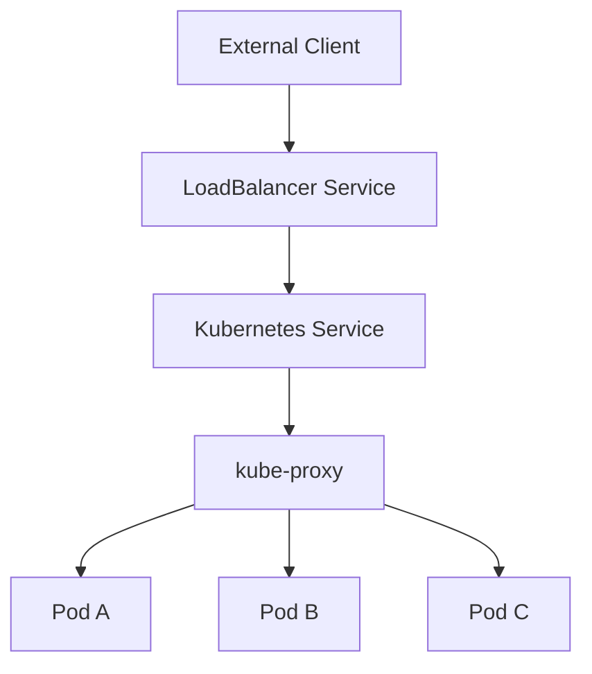
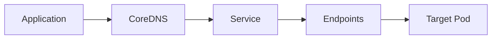
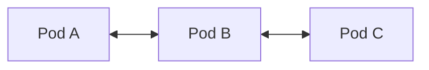
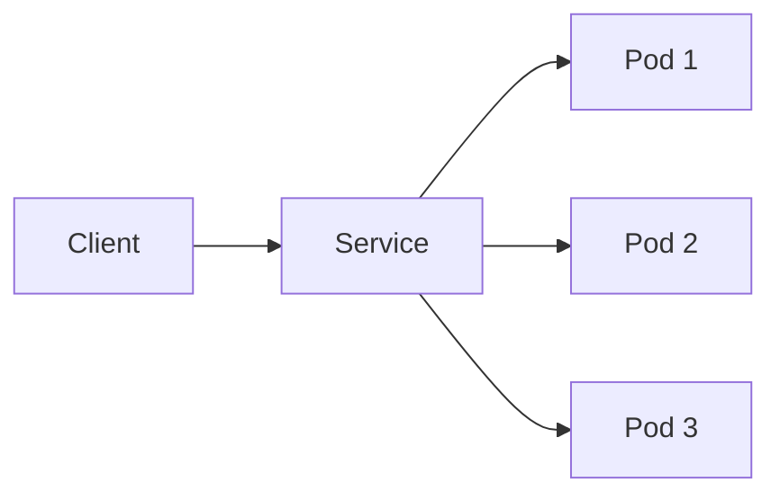
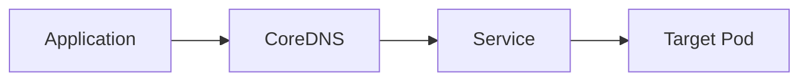
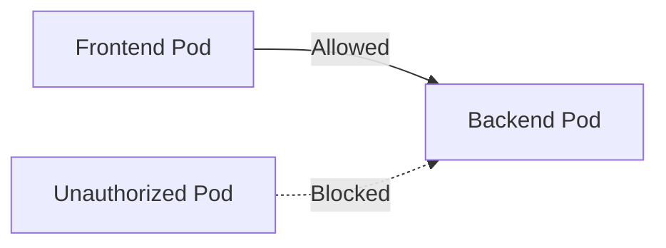

# Networking

## Overview

Kubernetes Networking enables communication between Pods, Services, Nodes, and external clients. Kubernetes follows a **flat networking model**, where every Pod receives its own IP address and can communicate with every other Pod without Network Address Translation (NAT).

Unlike Docker networking, Kubernetes networking is **implemented by a Container Network Interface (CNI) plugin**, while Kubernetes itself defines the networking model.

The four major networking concepts are:

- Pod Networking
- Service Networking
- DNS
- Network Policies

> **Interview Tip**
>
> Kubernetes **does not implement networking**. It relies on CNI plugins such as:
>
> - Calico
> - Flannel
> - Cilium
> - Azure CNI
> - AWS VPC CNI

---

## Why It Is Used

Kubernetes Networking provides:

- Communication between Pods
- Service discovery
- Internal load balancing
- External access to applications
- Secure communication
- High availability
- Traffic routing
- Network isolation

---

## Architecture / Working



Internal Communication



---

## Key Components

| Component | Purpose |
|------------|---------|
| Pod Network | Communication between Pods |
| Service | Stable endpoint |
| CoreDNS | Service discovery |
| kube-proxy | Routes Service traffic |
| CNI Plugin | Implements networking |
| Endpoints | Backend Pod IPs |
| Network Policy | Controls network traffic |

---

## Types (if applicable)

Kubernetes Networking consists of:

- Pod Networking
- Service Networking
- DNS
- Network Policies

---

## Lifecycle / Workflow


---

## Configuration / Syntax (if applicable)

Example Service

```yaml
apiVersion: v1
kind: Service

metadata:
  name: nginx-service

spec:
  selector:
    app: nginx

  ports:
    - port: 80
      targetPort: 80
```

---

## Important Commands (if applicable)

View Pod IPs

```bash
kubectl get pods -o wide
```

View Services

```bash
kubectl get svc
```

View Endpoints

```bash
kubectl get endpoints
```

Describe Service

```bash
kubectl describe svc nginx-service
```

View Network Policies

```bash
kubectl get networkpolicy
```

Check DNS

```bash
kubectl exec -it <pod-name> -- nslookup kubernetes.default
```

---

## Important Files (if applicable)

| File | Purpose |
|------|---------|
| deployment.yaml | Creates Pods |
| service.yaml | Defines Service |
| networkpolicy.yaml | Defines network rules |
| coredns ConfigMap | DNS configuration |

---

## Real-World Use Cases

- Microservices communication
- Backend APIs
- Database connectivity
- Internal application communication
- Secure production workloads
- Multi-tier applications

---

## Advantages

- Flat networking model
- Built-in service discovery
- Automatic load balancing
- Platform independent
- Highly scalable
- Supports secure communication

---

## Limitations

- Requires CNI plugin
- Pod IPs are temporary
- Network Policies require supported CNI
- Large clusters require networking expertise

---

## Common Interview Questions (Concept Only)

- Explain Kubernetes networking.
- What is a CNI plugin?
- Does every Pod receive an IP address?
- How do Pods communicate across Nodes?
- What is kube-proxy?
- What is Service Discovery?
- Why shouldn't applications use Pod IPs?
- How does DNS work?
- What are Network Policies?

---

## Common Mistakes

- Using Pod IPs instead of Services
- Assuming Kubernetes implements networking
- Forgetting DNS
- Incorrect Service selectors
- Assuming Network Policies work without supported CNI

---

## Troubleshooting

| Problem | Cause | Solution |
|----------|--------|----------|
| Pod communication fails | CNI issue | Verify CNI plugin |
| Service not reachable | Wrong selector | Verify labels |
| DNS resolution fails | CoreDNS issue | Check CoreDNS |
| Traffic blocked | Network Policy | Review ingress/egress rules |
| External access fails | Wrong Service type | Verify Service configuration |

Useful Commands

```bash
kubectl get pods -o wide

kubectl get svc

kubectl get endpoints

kubectl get networkpolicy

kubectl exec -it <pod-name> -- nslookup kubernetes.default
```

---

## Summary

Kubernetes Networking enables communication between Pods, Services, and external clients using Pod Networking, Service Networking, DNS, and Network Policies. Kubernetes defines the networking model, while CNI plugins implement it.

---

# Pod Networking

## Overview

Pod Networking allows Pods to communicate across the Kubernetes cluster.

Every Pod receives:

- One unique IP address
- Direct connectivity with every other Pod
- Shared IP for all containers inside the Pod

Unlike Docker bridge networking, Kubernetes Pods communicate **without NAT**.

> **Interview Tip**
>
> Pod IPs are **ephemeral** and change whenever a Pod is recreated.

---

## Why It Is Used

Pod Networking enables:

- Pod-to-Pod communication
- Microservices architecture
- Cross-node communication
- Internal application networking

---

## Architecture / Working



---

## Key Components

| Component | Purpose |
|------------|---------|
| Pod IP | Unique address |
| Node Network | Connects Pods |
| CNI Plugin | Assigns networking |

---

## Types (if applicable)

Popular CNI Plugins

| Plugin | Usage |
|----------|-------|
| Calico | Networking + Security |
| Flannel | Basic networking |
| Cilium | eBPF networking |
| Azure CNI | AKS |
| AWS VPC CNI | EKS |

---

## Lifecycle / Workflow


---

## Configuration / Syntax (if applicable)

No additional YAML is required.

Networking is automatically configured by the CNI plugin.

---

## Important Commands (if applicable)

```bash
kubectl get pods -o wide

kubectl exec -it <pod-name> -- ip addr

kubectl exec -it <pod-name> -- ping <pod-ip>
```

---

## Important Files (if applicable)

| File | Purpose |
|------|---------|
| deployment.yaml | Pod configuration |

---

## Real-World Use Cases

- Backend APIs
- Database communication
- Microservices
- Internal cluster communication

---

## Advantages

- Direct communication
- No NAT
- Simple networking
- Cross-node connectivity

---

## Limitations

- Pod IP changes
- Applications should never depend on Pod IPs

---

## Common Interview Questions (Concept Only)

- Does every Pod receive an IP?
- Can Pods communicate across Nodes?
- Who assigns Pod IPs?
- Why are Pod IPs temporary?

---

## Common Mistakes

- Using Pod IPs permanently
- Assuming every container gets its own IP

---

## Troubleshooting

```bash
kubectl get pods -o wide

kubectl exec -it <pod-name> -- ip addr
```

---

## Summary

Pod Networking assigns a unique IP address to every Pod, enabling direct communication throughout the Kubernetes cluster.

---

# Service Networking

## Overview

Pods are temporary and frequently recreated.

A **Service** provides:

- Stable IP address
- Stable DNS name
- Load balancing
- Service discovery

Applications communicate with Services instead of Pod IPs.

---

## Why It Is Used

Service Networking provides:

- Stable endpoints
- Internal load balancing
- Service discovery
- High availability

---

## Architecture / Working



---

## Key Components

| Component | Purpose |
|------------|---------|
| Service | Stable endpoint |
| Selector | Finds Pods |
| Endpoints | Backend Pods |
| kube-proxy | Routes traffic |

---

## Types (if applicable)

- ClusterIP
- NodePort
- LoadBalancer
- ExternalName

---

## Lifecycle / Workflow


---

## Configuration / Syntax (if applicable)

```yaml
selector:
  app: nginx
```

---

## Important Commands (if applicable)

```bash
kubectl get svc

kubectl get endpoints

kubectl describe svc nginx-service
```

---

## Important Files (if applicable)

| File | Purpose |
|------|---------|
| service.yaml | Service definition |

---

## Real-World Use Cases

- Web applications
- Backend APIs
- Database access
- Internal Services

---

## Advantages

- Stable IP
- Load balancing
- Service discovery

---

## Limitations

- Incorrect selectors prevent routing
- Pod IPs still change

---

## Common Interview Questions (Concept Only)

- Why are Services needed?
- How does kube-proxy work?
- What are Endpoints?

---

## Common Mistakes

- Wrong selectors
- Accessing Pods directly

---

## Troubleshooting

```bash
kubectl get endpoints

kubectl describe svc nginx-service
```

---

## Summary

Service Networking provides stable communication and load balancing for dynamic Pods.

---

# DNS

## Overview

CoreDNS automatically creates DNS records for Kubernetes Services.

Applications communicate using Service names instead of IP addresses.

Example:

```
mysql.default.svc.cluster.local
```

Short name:

```
mysql
```

---

## Why It Is Used

DNS provides:

- Automatic service discovery
- Stable communication
- Simplified configuration

---

## Architecture / Working



---

## Key Components

| Component | Purpose |
|------------|---------|
| CoreDNS | DNS Server |
| Service DNS | Hostname |
| Cluster Domain | cluster.local |

---

## Types (if applicable)

DNS Records

- Service DNS
- Headless Service DNS
- Pod DNS (limited)

---

## Lifecycle / Workflow


---

## Configuration / Syntax (if applicable)

```
nginx.default.svc.cluster.local
```

---

## Important Commands (if applicable)

```bash
kubectl exec -it <pod-name> -- nslookup kubernetes.default

kubectl get pods -n kube-system
```

---

## Important Files (if applicable)

| File | Purpose |
|------|---------|
| CoreDNS ConfigMap | DNS configuration |

---

## Real-World Use Cases

- Internal APIs
- Database communication
- Service discovery

---

## Advantages

- Automatic discovery
- Stable names
- No hardcoded IPs

---

## Limitations

- Depends on CoreDNS
- DNS failures impact applications

---

## Common Interview Questions (Concept Only)

- What is CoreDNS?
- What is cluster.local?
- How does Service Discovery work?

---

## Common Mistakes

- Hardcoding IPs
- Ignoring DNS issues

---

## Troubleshooting

```bash
kubectl exec -it <pod-name> -- nslookup kubernetes.default

kubectl get pods -n kube-system
```

---

## Summary

CoreDNS enables automatic Service discovery by providing DNS records for Kubernetes Services.

---

# Network Policies

## Overview

Network Policies control which Pods can communicate with other Pods or external systems.

By default, Kubernetes allows unrestricted Pod-to-Pod communication.

Network Policies enforce **Layer 3 (IP)** and **Layer 4 (Port/Protocol)** traffic filtering.

> **Interview Tip**
>
> Network Policies only work if the CNI plugin supports them.

---

## Why It Is Used

Network Policies provide:

- Pod isolation
- Application security
- Zero Trust networking
- Compliance
- Database protection

---

## Architecture / Working



---

## Key Components

| Component | Purpose |
|------------|---------|
| Pod Selector | Select Pods |
| Namespace Selector | Select namespaces |
| Ingress Rules | Incoming traffic |
| Egress Rules | Outgoing traffic |
| IPBlock | External IP filtering |

---

## Types (if applicable)

| Type | Purpose |
|------|---------|
| Ingress | Controls incoming traffic |
| Egress | Controls outgoing traffic |
| Both | Bidirectional control |

---

## Lifecycle / Workflow


---

## Configuration / Syntax (if applicable)

```yaml
apiVersion: networking.k8s.io/v1
kind: NetworkPolicy
```

---

## Important Commands (if applicable)

```bash
kubectl get networkpolicy

kubectl describe networkpolicy
```

---

## Important Files (if applicable)

| File | Purpose |
|------|---------|
| networkpolicy.yaml | Network policy definition |

---

## Real-World Use Cases

- Secure databases
- Namespace isolation
- PCI-DSS
- Healthcare
- Banking
- Zero Trust

---

## Advantages

- Fine-grained security
- Reduces attack surface
- Pod isolation
- Supports compliance

---

## Limitations

- Requires compatible CNI
- Misconfiguration can block traffic
- Does not encrypt traffic

---

## Common Interview Questions (Concept Only)

- What is a Network Policy?
- Difference between Ingress and Egress?
- Are Pods isolated by default?
- Do Network Policies work without CNI support?
- How are Pods selected?

---

## Common Mistakes

- Blocking DNS
- Incorrect Pod selectors
- Assuming every CNI supports Network Policies
- Forgetting Egress rules

---

## Troubleshooting

| Problem | Cause | Solution |
|----------|--------|----------|
| Pod communication blocked | Network Policy | Verify rules |
| Policy has no effect | Unsupported CNI | Verify CNI |
| DNS failure | DNS traffic blocked | Allow CoreDNS |
| Unexpected deny | Wrong selector | Verify labels |

Useful Commands

```bash
kubectl get networkpolicy

kubectl describe networkpolicy

kubectl get pods --show-labels

kubectl exec -it <pod-name> -- nslookup kubernetes.default
```

---

## Summary

Network Policies secure Kubernetes networking by controlling ingress and egress traffic between Pods, namespaces, and external networks. They are essential for implementing Zero Trust networking and securing production Kubernetes clusters.
