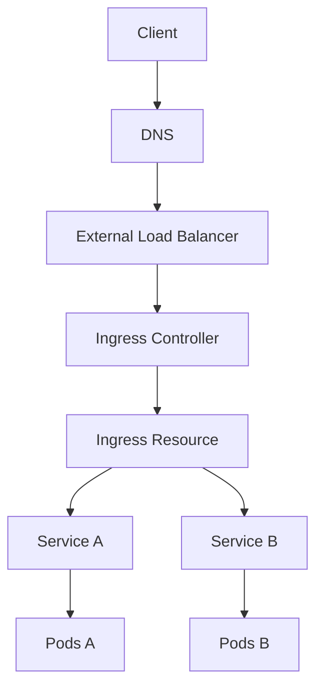
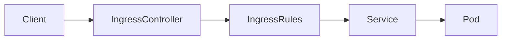
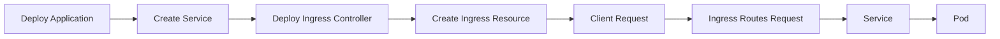
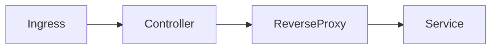
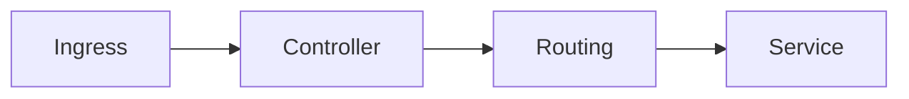
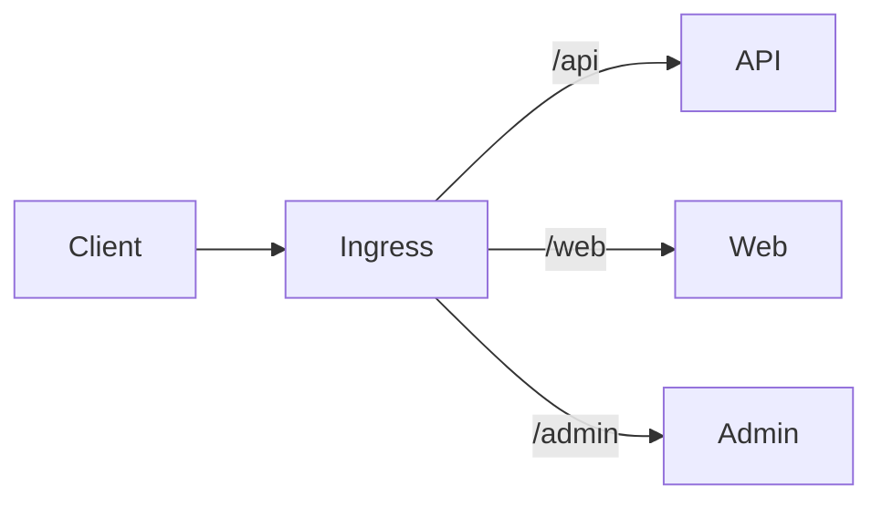
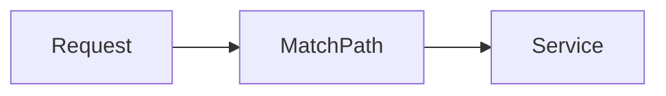
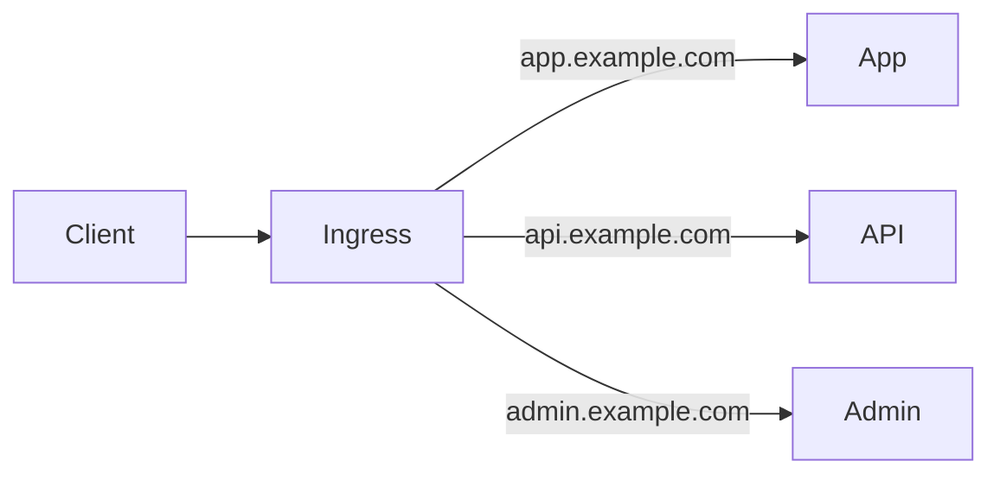
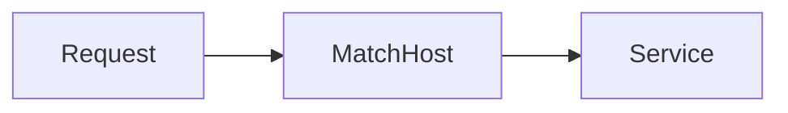

# Ingress

## Overview

**Ingress** is a Kubernetes API object that manages **external HTTP and HTTPS access** to applications running inside a Kubernetes cluster.

Instead of exposing every application using a separate **LoadBalancer** or **NodePort** Service, Ingress provides a centralized entry point that routes incoming requests to the appropriate Service based on rules.

Ingress typically supports:

- HTTP routing
- HTTPS/TLS termination
- Host-based routing
- Path-based routing
- URL redirection
- Load balancing

> **Interview Tip**
>
> **Ingress does not route traffic by itself.**
>
> It requires an **Ingress Controller** (such as NGINX Ingress Controller) to implement the routing rules.

---

## Why It Is Used

Ingress is used to:

- Expose applications externally
- Reduce cloud LoadBalancer costs
- Centralize traffic management
- Enable SSL/TLS termination
- Route traffic to multiple applications
- Support virtual hosting
- Simplify application access

---

## Architecture / Working



Traffic Flow



---

## Key Components

| Component | Purpose |
|-----------|---------|
| Ingress | Routing rules |
| Ingress Controller | Processes Ingress resources |
| Service | Backend application |
| Pod | Application container |
| TLS Certificate | HTTPS encryption |

---

## Types (if applicable)

Ingress Routing Types

- Host-Based Routing
- Path-Based Routing

Ingress Controllers

- NGINX Ingress Controller
- Traefik
- HAProxy
- AWS Load Balancer Controller
- Azure Application Gateway Ingress Controller (AGIC)

---

## Lifecycle / Workflow



---

## Configuration / Syntax (if applicable)

Basic Ingress

```yaml
apiVersion: networking.k8s.io/v1
kind: Ingress

metadata:
  name: app-ingress

spec:
  rules:
  - host: app.example.com

    http:
      paths:
      - path: /
        pathType: Prefix

        backend:
          service:
            name: app-service

            port:
              number: 80
```

---

## Important Commands (if applicable)

View Ingress

```bash
kubectl get ingress
```

Describe Ingress

```bash
kubectl describe ingress <ingress-name>
```

View Ingress Controller

```bash
kubectl get pods -n ingress-nginx
```

View Services

```bash
kubectl get svc
```

Delete Ingress

```bash
kubectl delete ingress <ingress-name>
```

---

## Important Files (if applicable)

| File | Purpose |
|------|---------|
| ingress.yaml | Ingress definition |
| service.yaml | Backend service |
| deployment.yaml | Application deployment |

---

## Real-World Use Cases

- Hosting multiple websites
- Microservices routing
- API Gateway
- HTTPS termination
- Kubernetes web applications
- Multi-domain hosting

---

## Advantages

- Single entry point
- Reduces LoadBalancer cost
- Supports TLS
- Centralized routing
- Easy traffic management
- Supports multiple applications

---

## Limitations

- Works only for HTTP/HTTPS traffic
- Requires an Ingress Controller
- Controller configuration differs across providers
- More complex than NodePort

---

## Common Interview Questions (Concept Only)

- What is Ingress?
- Why is Ingress required?
- Difference between Ingress and LoadBalancer?
- Can Ingress work without an Ingress Controller?
- What protocols does Ingress support?
- What is TLS termination?
- Explain Host-Based Routing.
- Explain Path-Based Routing.

---

## Common Mistakes

- Creating Ingress without installing an Ingress Controller
- Incorrect backend Service name
- Wrong port configuration
- Missing DNS records
- Invalid TLS certificate

---

## Troubleshooting

| Problem | Cause | Solution |
|----------|--------|----------|
| Ingress not working | No Ingress Controller | Install Controller |
| 404 Not Found | Incorrect routing rules | Verify Ingress paths |
| Backend unavailable | Wrong Service name | Check backend Service |
| HTTPS not working | TLS misconfiguration | Verify Secret |
| DNS not resolving | Incorrect DNS | Update DNS records |

Useful Commands

```bash
kubectl get ingress

kubectl describe ingress <ingress-name>

kubectl get svc

kubectl get pods -n ingress-nginx

kubectl logs -n ingress-nginx <controller-pod>
```

---

## Summary

Ingress provides a centralized mechanism for exposing HTTP and HTTPS applications outside a Kubernetes cluster. It routes incoming requests to backend Services based on hostnames and URL paths, while relying on an Ingress Controller to implement the routing logic.

---

# Ingress Resource

## Overview

An **Ingress Resource** is a Kubernetes object that defines routing rules for external traffic.

It specifies:

- Host names
- URL paths
- Backend Services
- TLS configuration

The Ingress Resource itself does **not** process traffic—it simply defines the desired routing rules.

> **Interview Tip**
>
> Think of the Ingress Resource as a **configuration file**, while the Ingress Controller acts as the **engine** that enforces those rules.

---

## Why It Is Used

Ingress Resources are used to:

- Define routing rules
- Expose applications externally
- Configure HTTPS
- Centralize routing configuration

---

## Architecture / Working


---

## Key Components

| Component | Purpose |
|-----------|---------|
| Rules | Define routing |
| Host | Domain name |
| Path | URL matching |
| Backend | Destination Service |
| TLS | HTTPS configuration |

---

## Types (if applicable)

Ingress Rules

- Host Rules
- Path Rules
- TLS Rules

---

## Lifecycle / Workflow


---

## Configuration / Syntax (if applicable)

```yaml
spec:
  rules:
  - host: app.example.com
```

---

## Important Commands (if applicable)

```bash
kubectl get ingress

kubectl describe ingress
```

---

## Important Files (if applicable)

| File | Purpose |
|------|---------|
| ingress.yaml | Routing configuration |

---

## Real-World Use Cases

- Multiple websites
- API routing
- HTTPS websites

---

## Advantages

- Declarative routing
- Easy maintenance
- Supports multiple rules

---

## Limitations

- Requires Controller

---

## Common Interview Questions (Concept Only)

- What is an Ingress Resource?
- What does an Ingress Resource contain?

---

## Common Mistakes

- Wrong backend Service
- Invalid paths

---

## Troubleshooting

```bash
kubectl describe ingress
```

---

## Summary

An Ingress Resource defines how external traffic should be routed to Kubernetes Services.

---

# Ingress Controller

## Overview

An **Ingress Controller** is the component that watches Ingress Resources and configures a reverse proxy or load balancer to route traffic accordingly.

Without an Ingress Controller, Ingress Resources have no effect.

Popular controllers include:

- NGINX Ingress Controller
- Traefik
- HAProxy
- Azure AGIC
- AWS Load Balancer Controller

> **Interview Tip**
>
> **Ingress = Rules**
>
> **Ingress Controller = Executes the rules**

---

## Why It Is Used

Ingress Controllers:

- Process Ingress Resources
- Configure routing
- Manage TLS
- Load balance traffic

---

## Architecture / Working



---

## Key Components

| Component | Purpose |
|-----------|---------|
| Controller | Watches Ingress |
| Reverse Proxy | Routes traffic |
| Service | Backend |

---

## Types (if applicable)

Common Controllers

- NGINX
- Traefik
- HAProxy
- AGIC
- AWS ALB

---

## Lifecycle / Workflow



---

## Configuration / Syntax (if applicable)

Install NGINX Controller

```bash
kubectl apply -f https://raw.githubusercontent.com/kubernetes/ingress-nginx/main/deploy/static/provider/cloud/deploy.yaml
```

---

## Important Commands (if applicable)

```bash
kubectl get pods -n ingress-nginx

kubectl logs -n ingress-nginx <pod-name>
```

---

## Important Files (if applicable)

ingress.yaml

---

## Real-World Use Cases

- Reverse Proxy
- HTTPS
- API Gateway

---

## Advantages

- Automatic routing
- Centralized traffic management

---

## Limitations

- Extra component to manage

---

## Common Interview Questions (Concept Only)

- What is an Ingress Controller?
- Can Ingress work without it?

---

## Common Mistakes

- Forgetting to install Controller

---

## Troubleshooting

```bash
kubectl get pods -n ingress-nginx
```

---

## Summary

The Ingress Controller is responsible for implementing Ingress rules and routing external traffic to Kubernetes Services.

---

# Path-Based Routing

## Overview

Path-Based Routing directs traffic based on the URL path.

Example:

| URL | Backend Service |
|------|-----------------|
| /api | API Service |
| /web | Web Service |
| /admin | Admin Service |

---

## Why It Is Used

- Microservices
- API Gateways
- Multiple applications on one domain

---

## Architecture / Working



---

## Key Components

- URL Path
- Backend Service

---

## Types (if applicable)

- Prefix
- Exact

---

## Lifecycle / Workflow



---

## Configuration / Syntax (if applicable)

```yaml
path: /api
pathType: Prefix
```

---

## Important Commands (if applicable)

```bash
kubectl describe ingress
```

---

## Important Files (if applicable)

ingress.yaml

---

## Real-World Use Cases

- API Gateway
- Microservices

---

## Advantages

- Efficient routing
- Single domain

---

## Limitations

- HTTP/HTTPS only

---

## Common Interview Questions (Concept Only)

- What is Path-Based Routing?
- Prefix vs Exact path?

---

## Common Mistakes

- Incorrect path matching

---

## Troubleshooting

```bash
kubectl describe ingress
```

---

## Summary

Path-Based Routing sends requests to different backend Services based on the request URL path.

---

# Host-Based Routing

## Overview

Host-Based Routing routes requests based on the requested domain name.

Example:

| Domain | Backend Service |
|---------|-----------------|
| app.example.com | App Service |
| api.example.com | API Service |
| admin.example.com | Admin Service |

---

## Why It Is Used

- Multi-domain hosting
- SaaS platforms
- Multiple applications

---

## Architecture / Working



---

## Key Components

- Host Name
- Backend Service

---

## Types (if applicable)

- Single Host
- Multiple Hosts
- Wildcard Hosts (controller support dependent)

---

## Lifecycle / Workflow



---

## Configuration / Syntax (if applicable)

```yaml
host: app.example.com
```

---

## Important Commands (if applicable)

```bash
kubectl describe ingress
```

---

## Important Files (if applicable)

ingress.yaml

---

## Real-World Use Cases

- Company websites
- SaaS applications
- Enterprise portals

---

## Advantages

- Clean domain management
- Supports multiple websites

---

## Limitations

- Requires DNS configuration

---

## Common Interview Questions (Concept Only)

- What is Host-Based Routing?
- Host-Based vs Path-Based Routing?

---

## Common Mistakes

- Missing DNS records
- Incorrect host names

---

## Troubleshooting

```bash
kubectl describe ingress

kubectl get ingress
```

---

## Summary

Host-Based Routing directs incoming traffic to different backend Services based on the requested hostname, allowing multiple applications to be hosted behind a single Ingress Controller.
