# Troubleshooting

## Overview

Troubleshooting in Kubernetes involves identifying, diagnosing, and resolving issues affecting applications, Pods, nodes, networking, storage, and cluster components.

Most production issues can be identified using a small set of commands:

- `kubectl get`
- `kubectl describe`
- `kubectl logs`
- `kubectl exec`
- `kubectl get events`

> **Interview Tip**
>
> Kubernetes troubleshooting typically follows this order:
>
> **Status → Describe → Events → Logs → Exec**

---

## Why It Is Used

Troubleshooting helps to:

- Identify failed deployments
- Diagnose Pod startup issues
- Investigate scheduling failures
- Debug application crashes
- Resolve image pull errors
- Analyze cluster events
- Restore production workloads

---

## Architecture / Working

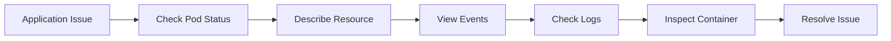

Troubleshooting Workflow

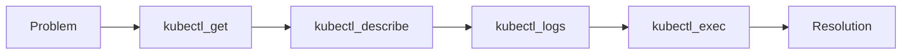

---

## Key Components

| Component | Purpose |
|-----------|---------|
| Pod Status | Shows current Pod state |
| Describe | Displays resource details and events |
| Logs | Shows application output |
| Events | Shows Kubernetes events |
| Exec | Access running container |
| Node Status | Verifies worker node health |

---

## Types (if applicable)

Common Kubernetes Problems

- CrashLoopBackOff
- ImagePullBackOff
- ErrImagePull
- Pending Pods
- OOMKilled
- ContainerCreating
- Completed
- Terminating

---

## Lifecycle / Workflow

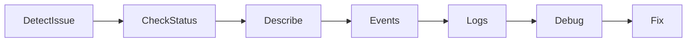

---

## Configuration / Syntax (if applicable)

View Pod Status

```bash
kubectl get pods
```

Describe Pod

```bash
kubectl describe pod <pod-name>
```

View Logs

```bash
kubectl logs <pod-name>
```

Execute Command

```bash
kubectl exec -it <pod-name> -- /bin/sh
```

View Events

```bash
kubectl get events
```

---

## Important Commands (if applicable)

View All Resources

```bash
kubectl get all
```

Describe Deployment

```bash
kubectl describe deployment nginx
```

View Previous Logs

```bash
kubectl logs --previous <pod-name>
```

View Node Status

```bash
kubectl get nodes
```

View Events Sorted by Time

```bash
kubectl get events --sort-by=.metadata.creationTimestamp
```

---

## Important Files (if applicable)

| File | Purpose |
|------|---------|
| deployment.yaml | Deployment configuration |
| pod.yaml | Pod definition |
| service.yaml | Service configuration |
| ~/.kube/config | Kubernetes configuration |

---

## Real-World Use Cases

- Debug failed deployments
- Investigate production incidents
- Resolve scheduling failures
- Diagnose application crashes
- Verify image deployments
- Troubleshoot networking issues

---

## Advantages

- Rich debugging commands
- Detailed event history
- Container log access
- Live container inspection
- Declarative troubleshooting

---

## Limitations

- Requires RBAC permissions
- Logs may be lost after Pod deletion
- Events are retained for a limited time
- Some failures require node-level access

---

## Common Interview Questions (Concept Only)

- How do you troubleshoot a failed Pod?
- Which command shows Kubernetes events?
- Difference between `logs` and `describe`?
- How do you access a running container?
- How do you troubleshoot a Pending Pod?
- What command shows previous container logs?

---

## Common Mistakes

- Checking logs before reviewing Pod status
- Ignoring Kubernetes events
- Troubleshooting the wrong namespace
- Forgetting to inspect previous logs after container restarts
- Editing production resources without backups

---

## Troubleshooting

| Problem | Cause | Solution |
|----------|--------|----------|
| Pod not starting | Scheduling or configuration issue | Check Pod status and events |
| Container crash | Application failure | Review logs |
| Image pull error | Invalid image or registry authentication | Verify image name and credentials |
| Pending Pod | Insufficient resources or scheduling constraints | Check describe output |
| CrashLoopBackOff | Repeated container crashes | Inspect logs and application configuration |

---

## Summary

Kubernetes troubleshooting follows a structured approach:

1. Check resource status.
2. Describe the resource.
3. Review events.
4. Inspect logs.
5. Access the container if necessary.

Mastering this workflow is essential for production support and is one of the most frequently tested areas in Kubernetes interviews.

---

# Pod Status

## Overview

Pod Status indicates the current lifecycle state of a Pod.

It helps determine whether the application is:

- Starting
- Running
- Failing
- Restarting
- Waiting for resources

Pod status is the first thing to check during troubleshooting.

> **Interview Tip**
>
> `kubectl get pods` is almost always the first troubleshooting command.

---

## Why It Is Used

Pod status helps identify:

- Startup failures
- Scheduling issues
- Image problems
- Application crashes
- Completed workloads

---

## Architecture / Working

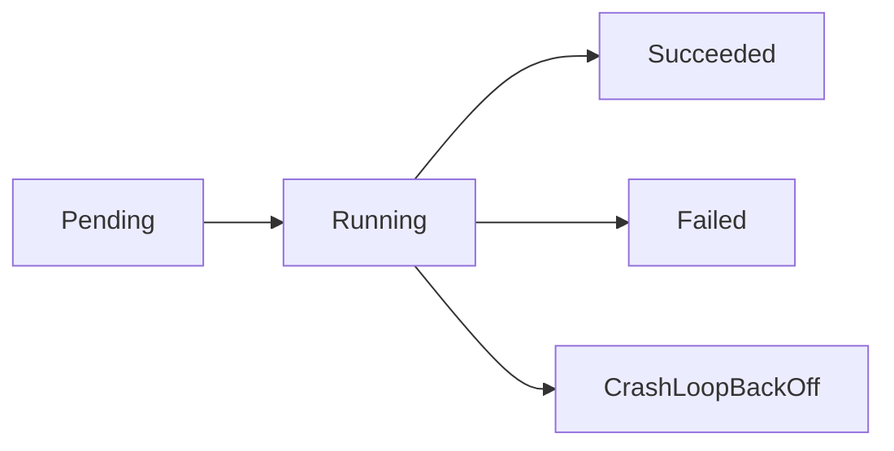

---

## Key Components

| Status | Meaning |
|---------|---------|
| Pending | Waiting to start |
| Running | Pod is operational |
| Succeeded | Completed successfully |
| Failed | Execution failed |
| Unknown | Node communication lost |
| CrashLoopBackOff | Continuous container restart |
| ImagePullBackOff | Unable to download image |

---

## Types (if applicable)

Common Pod States

- Pending
- Running
- Succeeded
- Failed
- Unknown

Common Container Waiting States

- CrashLoopBackOff
- ImagePullBackOff
- ErrImagePull
- ContainerCreating

---

## Lifecycle / Workflow

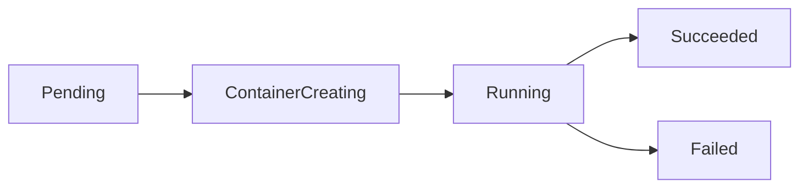

---

## Configuration / Syntax (if applicable)

```bash
kubectl get pods
```

Wide Output

```bash
kubectl get pods -o wide
```

---

## Important Commands (if applicable)

```bash
kubectl get pods

kubectl describe pod <pod-name>
```

---

## Important Files (if applicable)

deployment.yaml

---

## Real-World Use Cases

- Monitor deployments
- Verify application startup
- Detect failed Pods

---

## Advantages

- Quick health overview
- Easy monitoring

---

## Limitations

- Limited diagnostic information

---

## Common Interview Questions (Concept Only)

- What are the different Pod statuses?
- Which status indicates scheduling failure?
- Which status indicates application crash?

---

## Common Mistakes

- Assuming Running means the application is healthy

---

## Troubleshooting

```bash
kubectl get pods

kubectl describe pod <pod-name>

kubectl logs <pod-name>
```

---

## Summary

Pod Status provides the first indication of an application's health and guides the next troubleshooting steps.

---

# CrashLoopBackOff

## Overview

`CrashLoopBackOff` occurs when a container repeatedly starts, crashes, and Kubernetes delays subsequent restart attempts using an exponential backoff mechanism.

It indicates that Kubernetes can start the container, but the application inside the container fails repeatedly.

> **Interview Tip**
>
> `CrashLoopBackOff` is usually an **application issue**, not a Kubernetes issue.

---

## Why It Is Used

This status helps identify:

- Application startup failures
- Invalid configuration
- Missing dependencies
- Runtime errors

---

## Architecture / Working

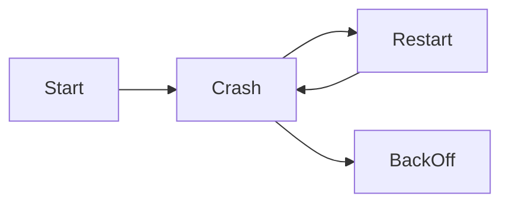

---

## Key Components

Possible Causes

- Application crash
- Missing environment variables
- Invalid configuration
- Database unavailable
- Failed startup script
- Incorrect command or entrypoint
- OOMKilled

---

## Types (if applicable)

Common Causes

- Configuration errors
- Application exceptions
- Dependency failures
- Resource exhaustion

---

## Lifecycle / Workflow

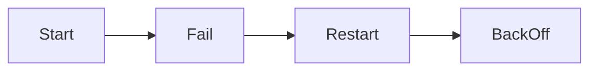

---

## Configuration / Syntax (if applicable)

View Pod

```bash
kubectl get pods
```

Describe Pod

```bash
kubectl describe pod <pod-name>
```

View Logs

```bash
kubectl logs <pod-name>

kubectl logs --previous <pod-name>
```

---

## Important Commands (if applicable)

```bash
kubectl describe pod <pod-name>

kubectl logs --previous <pod-name>
```

---

## Important Files (if applicable)

deployment.yaml

---

## Real-World Use Cases

- Debug application crashes
- Verify startup configuration

---

## Advantages

- Clearly indicates repeated failures

---

## Limitations

- Does not reveal the root cause by itself

---

## Common Interview Questions (Concept Only)

- What is CrashLoopBackOff?
- How do you troubleshoot it?
- Does Kubernetes or the application cause CrashLoopBackOff?

---

## Common Mistakes

- Restarting the Deployment without checking logs
- Ignoring previous container logs

---

## Troubleshooting

```bash
kubectl logs --previous <pod-name>

kubectl describe pod <pod-name>

kubectl get events
```

---

## Summary

CrashLoopBackOff means the container repeatedly crashes after startup. Investigate logs, events, and application configuration to determine the root cause.

---

# ImagePullBackOff

## Overview

`ImagePullBackOff` occurs when Kubernetes cannot download the specified container image.

This typically happens due to incorrect image references or authentication issues with the image registry.

---

## Why It Is Used

It indicates image retrieval failures.

---

## Architecture / Working

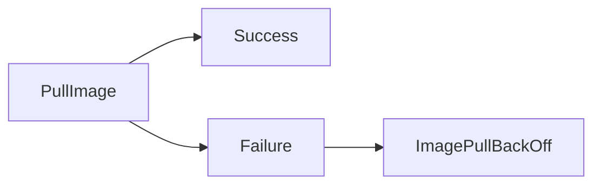

---

## Key Components

Common Causes

- Incorrect image name
- Invalid image tag
- Private registry authentication failure
- Registry unavailable
- Network connectivity issues

---

## Types (if applicable)

Related Statuses

- ErrImagePull
- ImagePullBackOff

---

## Lifecycle / Workflow

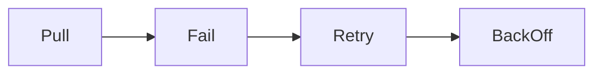

---

## Configuration / Syntax (if applicable)

```bash
kubectl describe pod <pod-name>
```

---

## Important Commands (if applicable)

```bash
kubectl describe pod <pod-name>

kubectl get events
```

---

## Important Files (if applicable)

deployment.yaml

---

## Real-World Use Cases

- Private registry authentication
- Docker Hub deployments
- Container image verification

---

## Advantages

- Clearly identifies image retrieval problems

---

## Limitations

- Requires further investigation to determine the exact cause

---

## Common Interview Questions (Concept Only)

- What causes ImagePullBackOff?
- How do you resolve image pull failures?

---

## Common Mistakes

- Incorrect image tag
- Missing imagePullSecrets
- Typographical errors in image names

---

## Troubleshooting

```bash
kubectl describe pod <pod-name>

kubectl get events
```

---

## Summary

ImagePullBackOff indicates Kubernetes cannot retrieve the container image due to image name, registry, authentication, or network issues.

---

# Pending Pods

## Overview

A Pod remains in the `Pending` state when Kubernetes cannot schedule it onto a worker node.

The Pod has been accepted by the cluster but has not yet started running.

---

## Why It Is Used

Pending status helps identify scheduling issues.

---

## Architecture / Working

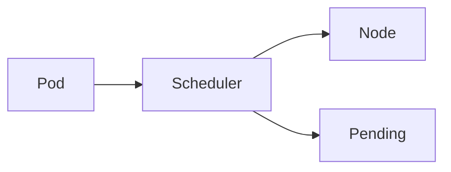

---

## Key Components

Common Causes

- Insufficient CPU
- Insufficient memory
- Missing Persistent Volume
- Node selector mismatch
- Taints and tolerations
- Resource quotas

---

## Types (if applicable)

Scheduling Problems

- Resource shortage
- Storage unavailable
- Node constraints

---

## Lifecycle / Workflow

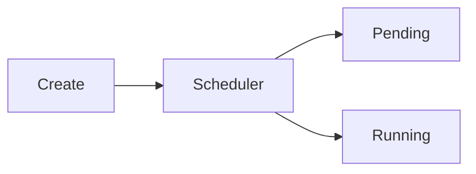

---

## Configuration / Syntax (if applicable)

```bash
kubectl get pods
```

---

## Important Commands (if applicable)

```bash
kubectl describe pod <pod-name>

kubectl get nodes
```

---

## Important Files (if applicable)

deployment.yaml

---

## Real-World Use Cases

- Capacity planning
- Cluster scaling

---

## Advantages

- Indicates scheduling problems early

---

## Limitations

- Multiple possible root causes

---

## Common Interview Questions (Concept Only)

- Why does a Pod remain Pending?
- How do you troubleshoot Pending Pods?

---

## Common Mistakes

- Checking logs before scheduling events
- Ignoring node resource availability

---

## Troubleshooting

```bash
kubectl describe pod <pod-name>

kubectl get nodes

kubectl top nodes
```

---

## Summary

Pending Pods indicate that Kubernetes cannot schedule the workload due to resource, storage, or scheduling constraints.

---

# Logs

## Overview

Container logs provide application output written to standard output (stdout) and standard error (stderr).

Logs are the primary source for diagnosing runtime issues.

---

## Why It Is Used

Logs help identify:

- Application crashes
- Exceptions
- Startup failures
- Runtime errors

---

## Architecture / Working

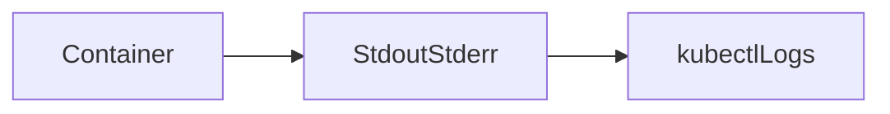

---

## Key Components

- Current logs
- Previous logs
- Container-specific logs

---

## Types (if applicable)

- Current logs
- Previous logs
- Streaming logs

---

## Lifecycle / Workflow

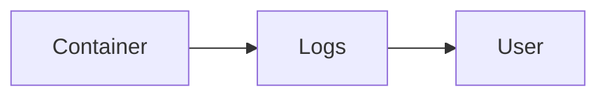

---

## Configuration / Syntax (if applicable)

```bash
kubectl logs <pod-name>
```

Follow logs

```bash
kubectl logs -f <pod-name>
```

Previous logs

```bash
kubectl logs --previous <pod-name>
```

---

## Important Commands (if applicable)

```bash
kubectl logs -f <pod-name>

kubectl logs <pod-name> -c <container-name>
```

---

## Important Files (if applicable)

Not applicable

---

## Real-World Use Cases

- Debug application failures
- Monitor application behavior

---

## Advantages

- Immediate visibility into application output

---

## Limitations

- Limited to container stdout/stderr

---

## Common Interview Questions (Concept Only)

- How do you view Pod logs?
- What does `--previous` do?

---

## Common Mistakes

- Viewing logs from the wrong container in multi-container Pods

---

## Troubleshooting

```bash
kubectl logs --previous <pod-name>
```

---

## Summary

Container logs provide essential information for diagnosing runtime application issues.

---

# Events

## Overview

Events record significant actions performed by Kubernetes, such as scheduling, image pulling, container creation, and failures.

They are one of the most valuable sources of troubleshooting information.

---

## Why It Is Used

Events explain **why** Kubernetes performed or failed to perform an action.

---

## Architecture / Working

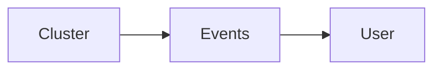

---

## Key Components

- Scheduling
- Image pull
- Volume mount
- Container restart

---

## Types (if applicable)

- Normal
- Warning

---

## Lifecycle / Workflow

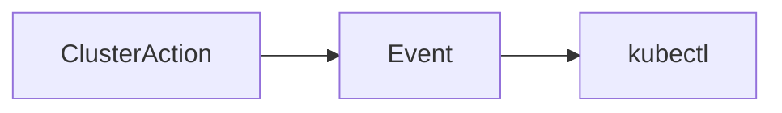

---

## Configuration / Syntax (if applicable)

```bash
kubectl get events
```

---

## Important Commands (if applicable)

```bash
kubectl get events --sort-by=.metadata.creationTimestamp
```

---

## Important Files (if applicable)

Not applicable

---

## Real-World Use Cases

- Scheduling diagnostics
- Image pull failures
- Storage troubleshooting

---

## Advantages

- Explains cluster actions

---

## Limitations

- Events expire after a period of time

---

## Common Interview Questions (Concept Only)

- How do you view Kubernetes events?
- Why are events useful?

---

## Common Mistakes

- Ignoring events during troubleshooting

---

## Troubleshooting

```bash
kubectl get events
```

---

## Summary

Events explain Kubernetes actions and are often the quickest way to identify scheduling and infrastructure issues.

---

# Describe Output

## Overview

`kubectl describe` displays detailed information about Kubernetes resources.

It combines:

- Configuration
- Current status
- Conditions
- Events

into a single view.

---

## Why It Is Used

Describe output helps diagnose:

- Scheduling issues
- Probe failures
- Resource limits
- Restart causes
- Image pull failures

---

## Architecture / Working

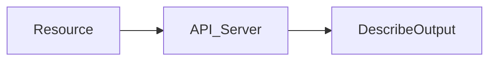

---

## Key Components

| Section | Purpose |
|----------|---------|
| Metadata | Resource information |
| Status | Current state |
| Containers | Container details |
| Conditions | Health indicators |
| Events | Recent cluster actions |

---

## Types (if applicable)

Common Resources

- Pod
- Deployment
- Node
- Service
- PVC

---

## Lifecycle / Workflow

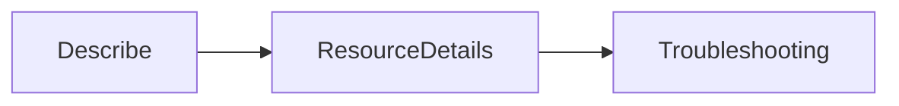

---

## Configuration / Syntax (if applicable)

```bash
kubectl describe pod <pod-name>
```

---

## Important Commands (if applicable)

```bash
kubectl describe deployment nginx

kubectl describe node worker-1
```

---

## Important Files (if applicable)

Not applicable

---

## Real-World Use Cases

- Pod troubleshooting
- Deployment debugging
- Node diagnostics

---

## Advantages

- Comprehensive resource information
- Includes recent events

---

## Limitations

- Output can be lengthy

---

## Common Interview Questions (Concept Only)

- What information does `kubectl describe` provide?
- Difference between `kubectl get` and `kubectl describe`?

---

## Common Mistakes

- Using `kubectl get` when detailed diagnostics are required

---

## Troubleshooting

```bash
kubectl describe pod <pod-name>

kubectl describe deployment <deployment-name>

kubectl describe node <node-name>
```

---

## Summary

`kubectl describe` is one of the most important Kubernetes troubleshooting commands. It provides detailed resource information, health status, conditions, and events, making it indispensable for diagnosing production issues.
