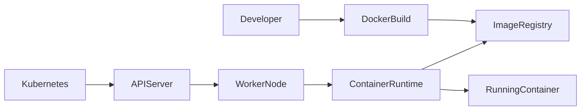
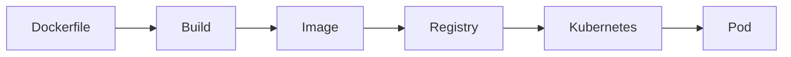
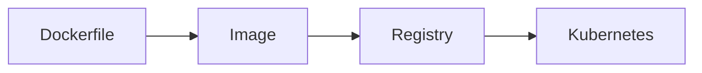
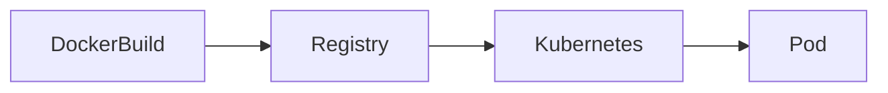
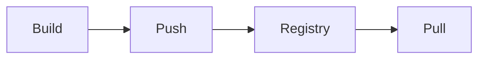
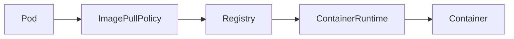

# Kubernetes & Docker

## Overview

Kubernetes and Docker work together to deploy and run containerized applications.

- **Docker** (or another container image builder) is commonly used to **build container images**.
- **Kubernetes** is used to **orchestrate and manage containers** at scale.

Although Kubernetes originally integrated directly with Docker, modern Kubernetes versions no longer use the Docker Engine as the container runtime. Instead, Kubernetes communicates with **Container Runtime Interface (CRI)** compatible runtimes such as:

- containerd
- CRI-O

However, Docker remains one of the most popular tools for **building container images**, and Kubernetes runs Docker-compatible images using OCI-compliant runtimes.

> **Interview Tip**
>
> Kubernetes **does not build Docker images**.
>
> Docker (or another build tool) builds the image.
>
> Kubernetes only **pulls and runs** the image.

---

## Why It Is Used

Kubernetes and Docker are used together to:

- Package applications into containers
- Deploy applications consistently
- Scale workloads
- Simplify application deployment
- Enable CI/CD pipelines
- Improve portability across environments

---

## Architecture / Working



Deployment Workflow


---

## Key Components

| Component | Purpose |
|-----------|---------|
| Docker | Builds container images |
| Container Image | Packaged application |
| Image Registry | Stores container images |
| Kubernetes | Orchestrates containers |
| Pod | Runs one or more containers |
| Container Runtime | Pulls and executes images |

---

## Types (if applicable)

Container Image Builders

- Docker
- Buildah
- Podman

Container Runtimes

- containerd
- CRI-O

---

## Lifecycle / Workflow


---

## Configuration / Syntax (if applicable)

Deployment Example

```yaml
containers:
- name: nginx
  image: nginx:latest
```

---

## Important Commands (if applicable)

View Images Used

```bash
kubectl describe pod <pod-name>
```

View Running Pods

```bash
kubectl get pods
```

Check Image

```bash
kubectl get pod <pod-name> -o yaml
```

---

## Important Files (if applicable)

| File | Purpose |
|------|---------|
| Dockerfile | Builds Docker image |
| deployment.yaml | Deploys application |
| pod.yaml | Pod configuration |

---

## Real-World Use Cases

- Deploy web applications
- CI/CD pipelines
- Microservices
- Containerized APIs
- Enterprise application hosting

---

## Advantages

- Portable applications
- Consistent deployments
- Easy scaling
- Faster releases
- Simplified management

---

## Limitations

- Kubernetes does not build images
- Requires image registry
- Additional orchestration complexity

---

## Common Interview Questions (Concept Only)

- Does Kubernetes require Docker?
- Does Kubernetes build Docker images?
- What runtime does Kubernetes use?
- Difference between Docker and Kubernetes?
- What is OCI?
- Can Kubernetes run images built by Docker?

---

## Common Mistakes

- Assuming Kubernetes builds images
- Confusing Docker with Kubernetes
- Believing Docker is mandatory for Kubernetes

---

## Troubleshooting

| Problem | Cause | Solution |
|----------|--------|----------|
| Pod won't start | Image unavailable | Verify image exists |
| Image pull failure | Registry issue | Check image registry |
| Wrong image version | Incorrect tag | Verify image tag |

Useful Commands

```bash
kubectl describe pod <pod-name>

kubectl get pods

kubectl logs <pod-name>
```

---

## Summary

Docker is commonly used to build container images, while Kubernetes deploys, manages, and scales those images across a cluster. Kubernetes does not build images—it retrieves them from image registries and runs them using a CRI-compatible container runtime.

---

# Container Images

## Overview

A **Container Image** is a portable, immutable package that contains everything required to run an application.

It includes:

- Application code
- Runtime
- Libraries
- Dependencies
- Configuration
- Startup command

Container images are built once and deployed consistently across environments.

> **Interview Tip**
>
> **Image = Template**
>
> **Container = Running Instance of the Image**

---

## Why It Is Used

Container images provide:

- Consistent deployments
- Portability
- Version control
- Immutable infrastructure
- Simplified application distribution

---

## Architecture / Working



---

## Key Components

| Component | Purpose |
|-----------|---------|
| Base Image | Operating system/runtime |
| Application Code | Business logic |
| Dependencies | Required libraries |
| Metadata | Image configuration |
| Tag | Image version |

---

## Types (if applicable)

Common Base Images

- Ubuntu
- Alpine
- NGINX
- Node.js
- Python
- Java

---

## Lifecycle / Workflow



---

## Configuration / Syntax (if applicable)

```yaml
containers:
- image: nginx:1.27
```

---

## Important Commands (if applicable)

View Image

```bash
kubectl describe pod <pod-name>
```

View YAML

```bash
kubectl get pod <pod-name> -o yaml
```

---

## Important Files (if applicable)

| File | Purpose |
|------|---------|
| Dockerfile | Builds image |

---

## Real-World Use Cases

- Microservices
- APIs
- Databases
- CI/CD deployments

---

## Advantages

- Immutable
- Portable
- Versioned
- Lightweight

---

## Limitations

- Large images increase deployment time
- Images must be rebuilt for application changes

---

## Common Interview Questions (Concept Only)

- What is a container image?
- Difference between image and container?
- Why are images immutable?

---

## Common Mistakes

- Using the `latest` tag in production
- Creating unnecessarily large images

---

## Troubleshooting

```bash
kubectl describe pod <pod-name>
```

---

## Summary

Container images package applications and their dependencies into portable, immutable artifacts that Kubernetes deploys consistently across environments.

---

# Image Registries

## Overview

An **Image Registry** stores and distributes container images.

Kubernetes pulls images from registries whenever Pods are created.

Registries can be:

- Public
- Private

> **Interview Tip**
>
> Kubernetes **does not store images**.
>
> Images are always downloaded from a registry.

---

## Why It Is Used

Registries provide:

- Central image storage
- Version management
- Image sharing
- Secure distribution

---

## Architecture / Working



---

## Key Components

| Component | Purpose |
|-----------|---------|
| Registry | Stores images |
| Repository | Groups related images |
| Tag | Version identifier |
| Authentication | Secures private registries |

---

## Types (if applicable)

Public Registries

- Docker Hub
- GitHub Container Registry
- Quay.io

Private Registries

- Azure Container Registry (ACR)
- Amazon Elastic Container Registry (ECR)
- Google Artifact Registry
- Harbor

---

## Lifecycle / Workflow



---

## Configuration / Syntax (if applicable)

```yaml
image: nginx:latest
```

Private Registry

```yaml
imagePullSecrets:
- name: acr-secret
```

---

## Important Commands (if applicable)

Create Registry Secret

```bash
kubectl create secret docker-registry registry-secret
```

---

## Important Files (if applicable)

deployment.yaml

---

## Real-World Use Cases

- Enterprise image storage
- Secure deployments
- CI/CD pipelines

---

## Advantages

- Central repository
- Version control
- Secure access
- Easy sharing

---

## Limitations

- Private registries require authentication
- Registry outages affect deployments

---

## Common Interview Questions (Concept Only)

- What is an image registry?
- Difference between Docker Hub and ACR?
- Why use private registries?
- What is imagePullSecrets?

---

## Common Mistakes

- Missing registry credentials
- Incorrect repository path
- Invalid image tag

---

## Troubleshooting

```bash
kubectl describe pod <pod-name>

kubectl get secrets
```

---

## Summary

Image registries provide centralized storage and distribution of container images. Kubernetes retrieves images from these registries whenever Pods are created.

---

# Image Pull Policy

## Overview

`imagePullPolicy` controls when Kubernetes downloads a container image from an image registry.

It determines whether Kubernetes:

- Always downloads the image
- Downloads only if missing
- Never downloads the image

> **Interview Tip**
>
> This is one of the most frequently asked Kubernetes interview topics.

---

## Why It Is Used

It helps:

- Control image updates
- Reduce unnecessary downloads
- Improve deployment speed
- Ensure version consistency

---

## Architecture / Working



---

## Key Components

| Policy | Behavior |
|---------|----------|
| Always | Pull image every time |
| IfNotPresent | Pull only if image is not available locally |
| Never | Never pull the image |

---

## Types (if applicable)

### Always

- Downloads image every Pod start
- Common with `latest`

### IfNotPresent

- Default for most tagged images
- Downloads only when necessary

### Never

- Uses only locally available images
- Mainly used for testing or offline environments

---

## Lifecycle / Workflow


---

## Configuration / Syntax (if applicable)

Always

```yaml
imagePullPolicy: Always
```

IfNotPresent

```yaml
imagePullPolicy: IfNotPresent
```

Never

```yaml
imagePullPolicy: Never
```

---

## Important Commands (if applicable)

View Current Policy

```bash
kubectl get pod <pod-name> -o yaml
```

Describe Pod

```bash
kubectl describe pod <pod-name>
```

---

## Important Files (if applicable)

deployment.yaml

---

## Real-World Use Cases

- Development
- Production deployments
- CI/CD pipelines
- Air-gapped environments

---

## Advantages

- Controls image download behavior
- Reduces unnecessary registry traffic
- Improves deployment efficiency

---

## Limitations

- Incorrect policy can result in outdated images or image pull failures

---

## Common Interview Questions (Concept Only)

- What are the three image pull policies?
- Which policy is the default?
- When should `Always` be used?
- What happens if `Never` is configured and the image is not present locally?
- Why should `latest` be avoided in production?

---

## Common Mistakes

- Using `latest` in production
- Forgetting to update image tags
- Setting `Never` without local images
- Assuming `IfNotPresent` always retrieves the newest image

---

## Troubleshooting

| Problem | Cause | Solution |
|----------|--------|----------|
| Old image deployed | Cached local image | Update tag or use `Always` |
| Image not found | `Never` policy | Ensure image exists locally |
| Image pull failure | Registry issue | Verify registry access and credentials |

Useful Commands

```bash
kubectl describe pod <pod-name>

kubectl get pod <pod-name> -o yaml

kubectl get events
```

---

## Summary

`imagePullPolicy` determines when Kubernetes downloads container images from a registry.

- **Always** – Pull the image every time the Pod starts.
- **IfNotPresent** – Pull the image only if it is not already available on the node.
- **Never** – Use only locally available images and never contact the registry.

Selecting the appropriate pull policy is important for balancing deployment speed, image freshness, and operational reliability.
