# Essential Kubernetes Concepts

## Overview

Kubernetes is a container orchestration platform that continuously works to ensure the **actual state** of the cluster matches the **desired state** defined by users.

The core concepts that make Kubernetes powerful are:

- Desired State
- Reconciliation
- Self-Healing
- Scaling
- High Availability
- Service Discovery

These concepts are the foundation of Kubernetes and are among the **most frequently asked interview topics**.

> **Interview Tip**
>
> Kubernetes is built around the idea of **declarative infrastructure**. You declare **what** you want, and Kubernetes continuously works to achieve and maintain that state.

---

# Desired State

## Overview

Desired State is the target configuration you define in Kubernetes manifests (YAML files).

Instead of telling Kubernetes **how** to perform tasks, you specify **what** the final state should be.

For example:

- Run 3 Pods
- Use image `nginx:1.27`
- Expose application using a Service
- Restart failed Pods automatically

Kubernetes continuously attempts to maintain this declared state.

---

## Why It Is Used

Desired State provides:

- Declarative infrastructure
- Consistent deployments
- Automatic recovery
- Simplified cluster management
- Repeatable deployments

---

## Architecture / Working

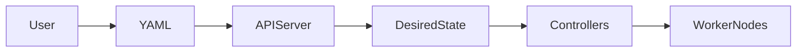

---

## Key Components

| Component | Purpose |
|-----------|---------|
| YAML Manifest | Defines desired state |
| API Server | Stores configuration |
| etcd | Saves desired state |
| Controller | Ensures desired state |
| Worker Node | Runs workloads |

---

## Types (if applicable)

Desired state can define:

- Deployments
- Services
- ConfigMaps
- Secrets
- Ingress
- Persistent Volumes

---

## Lifecycle / Workflow

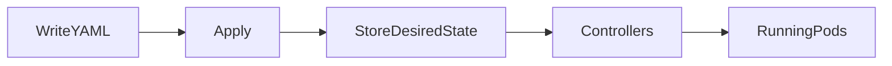

---

## Configuration / Syntax (if applicable)

Example

```yaml
spec:
  replicas: 3
```

This tells Kubernetes that exactly **3 replicas** should always exist.

---

## Important Commands (if applicable)

Apply Desired State

```bash
kubectl apply -f deployment.yaml
```

View Deployment

```bash
kubectl get deployment
```

---

## Important Files (if applicable)

| File | Purpose |
|------|---------|
| deployment.yaml | Defines desired application state |
| service.yaml | Defines service state |

---

## Real-World Use Cases

- Application deployment
- Infrastructure automation
- GitOps
- CI/CD pipelines

---

## Advantages

- Declarative management
- Easy automation
- Consistent deployments
- Supports version control

---

## Limitations

- Incorrect manifests create incorrect desired state
- Requires Kubernetes controllers to enforce state

---

## Common Interview Questions (Concept Only)

- What is Desired State?
- Who stores Desired State?
- Where is Desired State stored?
- Difference between desired state and actual state?

---

## Common Mistakes

- Editing live resources manually instead of updating manifests
- Assuming desired state changes automatically update manifests

---

## Troubleshooting

| Problem | Cause | Solution |
|----------|--------|----------|
| Desired state not applied | Invalid manifest | Validate YAML |
| Resources missing | Apply failed | Check deployment events |

Useful Commands

```bash
kubectl apply -f deployment.yaml

kubectl describe deployment web
```

---

## Summary

Desired State is the target configuration declared by users. Kubernetes continuously works to ensure the cluster matches this declared state.

---

# Reconciliation

## Overview

Reconciliation is the continuous process where Kubernetes compares:

- Desired State
- Actual State

If differences exist, Kubernetes automatically corrects them.

This process runs continuously through Kubernetes Controllers.

> **Interview Tip**
>
> Controllers are responsible for reconciliation.

---

## Why It Is Used

Reconciliation enables:

- Automatic recovery
- Continuous monitoring
- Configuration enforcement
- Reliable deployments

---

## Architecture / Working

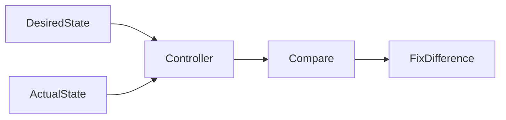

---

## Key Components

| Component | Purpose |
|-----------|---------|
| Controller | Performs reconciliation |
| API Server | Stores desired state |
| etcd | Cluster database |
| Worker Node | Actual running workloads |

---

## Types (if applicable)

Controllers include:

- Deployment Controller
- ReplicaSet Controller
- StatefulSet Controller
- Node Controller

---

## Lifecycle / Workflow

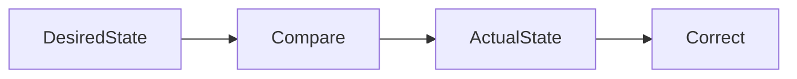

---

## Configuration / Syntax (if applicable)

No user configuration required.

Reconciliation happens automatically.

---

## Important Commands (if applicable)

```bash
kubectl get deployment

kubectl get pods
```

---

## Important Files (if applicable)

deployment.yaml

---

## Real-World Use Cases

- Restart failed Pods
- Maintain replica count
- Recover deleted Pods

---

## Advantages

- Automatic correction
- Self-managing cluster
- Reduced manual work

---

## Limitations

- Depends on healthy controllers

---

## Common Interview Questions (Concept Only)

- What is reconciliation?
- Who performs reconciliation?
- How often does reconciliation occur?

---

## Common Mistakes

- Thinking reconciliation is manual

---

## Troubleshooting

```bash
kubectl describe deployment web
```

---

## Summary

Reconciliation continuously compares desired and actual state, automatically correcting any differences to keep the cluster consistent.

---

# Self-Healing

## Overview

Self-Healing is Kubernetes' ability to automatically recover failed workloads without manual intervention.

Examples:

- Restart crashed containers
- Replace failed Pods
- Reschedule Pods from failed Nodes

---

## Why It Is Used

Self-healing improves:

- Reliability
- Availability
- Fault tolerance
- Operational efficiency

---

## Architecture / Working

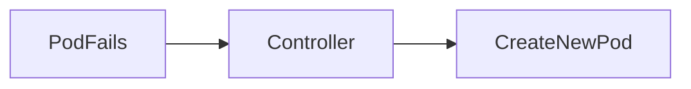

---

## Key Components

| Component | Purpose |
|-----------|---------|
| Kubelet | Restarts containers |
| Deployment | Maintains replicas |
| ReplicaSet | Creates replacement Pods |
| Controller | Detects failures |

---

## Types (if applicable)

Self-healing actions

- Restart container
- Replace Pod
- Reschedule Pod

---

## Lifecycle / Workflow

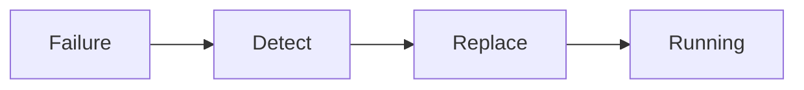

---

## Configuration / Syntax (if applicable)

Example

```yaml
replicas: 3
```

---

## Important Commands (if applicable)

```bash
kubectl get pods

kubectl describe pod <pod-name>
```

---

## Important Files (if applicable)

deployment.yaml

---

## Real-World Use Cases

- Recover crashed applications
- Replace failed containers
- Recover from node failures

---

## Advantages

- Automatic recovery
- Reduced downtime
- Improved reliability

---

## Limitations

- Cannot fix application bugs
- Requires healthy cluster infrastructure

---

## Common Interview Questions (Concept Only)

- What is self-healing?
- How does Kubernetes replace failed Pods?
- What happens if a Node fails?

---

## Common Mistakes

- Expecting Kubernetes to fix application logic errors

---

## Troubleshooting

```bash
kubectl describe pod <pod-name>

kubectl get events
```

---

## Summary

Self-healing enables Kubernetes to automatically recover failed workloads by restarting containers, replacing Pods, or rescheduling them to healthy nodes.

---

# Scaling

## Overview

Scaling is the process of increasing or decreasing application instances based on demand.

Kubernetes supports:

- Manual Scaling
- Automatic Scaling

---

## Why It Is Used

Scaling provides:

- Better performance
- Higher availability
- Efficient resource utilization
- Support for varying workloads

---

## Architecture / Working

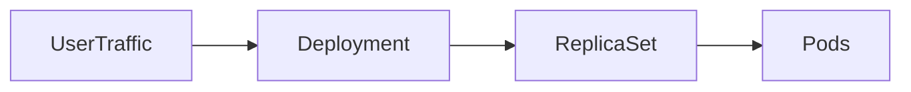

---

## Key Components

| Component | Purpose |
|-----------|---------|
| Deployment | Controls replicas |
| ReplicaSet | Creates Pods |
| HPA | Automatic scaling |

---

## Types (if applicable)

Manual Scaling

```bash
kubectl scale
```

Automatic Scaling

- Horizontal Pod Autoscaler (HPA)

---

## Lifecycle / Workflow

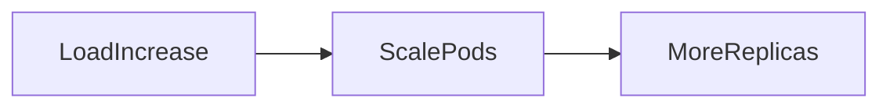

---

## Configuration / Syntax (if applicable)

```yaml
replicas: 5
```

---

## Important Commands (if applicable)

Manual Scale

```bash
kubectl scale deployment web --replicas=5
```

---

## Important Files (if applicable)

deployment.yaml

---

## Real-World Use Cases

- Peak traffic
- Holiday sales
- API scaling

---

## Advantages

- High performance
- Efficient resource usage
- Easy scaling

---

## Limitations

- Automatic scaling requires metrics collection
- More replicas increase resource consumption

---

## Common Interview Questions (Concept Only)

- Difference between manual and automatic scaling?
- What is HPA?
- What is scaling in Kubernetes?

---

## Common Mistakes

- Scaling Pods without sufficient cluster resources

---

## Troubleshooting

```bash
kubectl get deployment

kubectl get pods
```

---

## Summary

Scaling allows Kubernetes to adjust the number of application instances to match workload demands, either manually or automatically.

---

# High Availability

## Overview

High Availability (HA) ensures that applications remain accessible even when components fail.

Kubernetes achieves HA by:

- Running multiple Pod replicas
- Distributing Pods across nodes
- Automatically replacing failed Pods
- Performing rolling updates

---

## Why It Is Used

High availability provides:

- Reduced downtime
- Fault tolerance
- Reliable services
- Improved user experience

---

## Architecture / Working

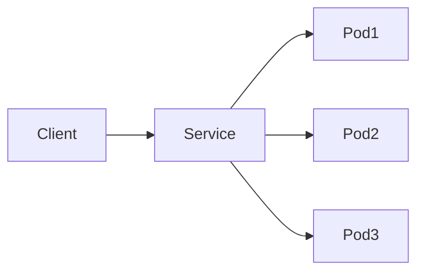

---

## Key Components

| Component | Purpose |
|-----------|---------|
| Deployment | Multiple replicas |
| ReplicaSet | Maintains replicas |
| Service | Load balancing |
| Node | Runs Pods |

---

## Types (if applicable)

HA Techniques

- ReplicaSets
- Multiple worker nodes
- Multiple control plane nodes

---

## Lifecycle / Workflow

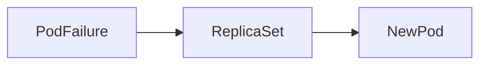

---

## Configuration / Syntax (if applicable)

```yaml
replicas: 3
```

---

## Important Commands (if applicable)

```bash
kubectl get deployment

kubectl get pods
```

---

## Important Files (if applicable)

deployment.yaml

---

## Real-World Use Cases

- Banking applications
- E-commerce
- Healthcare
- Enterprise APIs

---

## Advantages

- Reduced downtime
- Improved reliability
- Fault tolerance

---

## Limitations

- Requires multiple nodes
- Higher infrastructure cost

---

## Common Interview Questions (Concept Only)

- How does Kubernetes provide high availability?
- Why are multiple replicas required?

---

## Common Mistakes

- Running production applications with only one replica

---

## Troubleshooting

```bash
kubectl get pods -o wide
```

---

## Summary

High Availability ensures applications remain operational by distributing workloads across multiple replicas and automatically recovering from failures.

---

# Service Discovery

## Overview

Service Discovery enables applications inside Kubernetes to communicate without knowing Pod IP addresses.

Pods receive dynamic IP addresses that change when they are recreated.

Instead of accessing Pods directly, applications communicate through **Services**, which provide stable networking and built-in DNS.

> **Interview Tip**
>
> Applications should communicate using **Service names**, not Pod IP addresses.

---

## Why It Is Used

Service Discovery provides:

- Stable communication
- Automatic load balancing
- Built-in DNS
- Decoupled application networking

---

## Architecture / Working


DNS Resolution

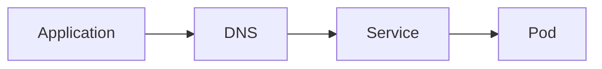

---

## Key Components

| Component | Purpose |
|-----------|---------|
| Service | Stable endpoint |
| DNS | Resolves service names |
| kube-proxy | Routes traffic |
| Pods | Backend applications |

---

## Types (if applicable)

Common Service Types

- ClusterIP
- NodePort
- LoadBalancer
- ExternalName

---

## Lifecycle / Workflow

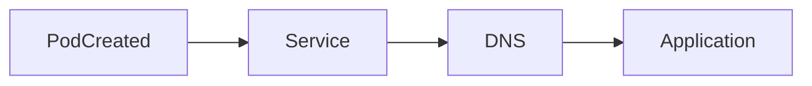

---

## Configuration / Syntax (if applicable)

```yaml
spec:
  selector:
    app: web
```

---

## Important Commands (if applicable)

View Services

```bash
kubectl get svc
```

Describe Service

```bash
kubectl describe svc web
```

---

## Important Files (if applicable)

| File | Purpose |
|------|---------|
| service.yaml | Defines Kubernetes Service |

---

## Real-World Use Cases

- Microservices communication
- API discovery
- Internal application networking
- Database access from applications

---

## Advantages

- Stable networking
- Automatic DNS resolution
- Built-in load balancing
- Simplified service communication

---

## Limitations

- Depends on correctly configured Services and selectors
- Misconfigured selectors prevent traffic from reaching Pods

---

## Common Interview Questions (Concept Only)

- What is Service Discovery?
- Why should Pods not communicate using Pod IPs?
- How does Kubernetes DNS work?
- What is the purpose of a Service?

---

## Common Mistakes

- Accessing Pods directly instead of Services
- Incorrect Service selectors
- Assuming Pod IPs are permanent

---

## Troubleshooting

| Problem | Cause | Solution |
|----------|--------|----------|
| Service unavailable | Selector mismatch | Verify labels and selectors |
| DNS lookup failed | DNS issue | Verify CoreDNS Pods |
| No backend Pods | Labels do not match | Check Service selectors |

Useful Commands

```bash
kubectl get svc

kubectl describe svc web

kubectl get endpoints

kubectl get pods --show-labels
```

---

## Summary

Service Discovery allows Kubernetes applications to communicate reliably using stable Service names instead of dynamic Pod IP addresses. Kubernetes DNS and Services work together to provide automatic service discovery and load balancing, making application communication resilient and production-ready.
