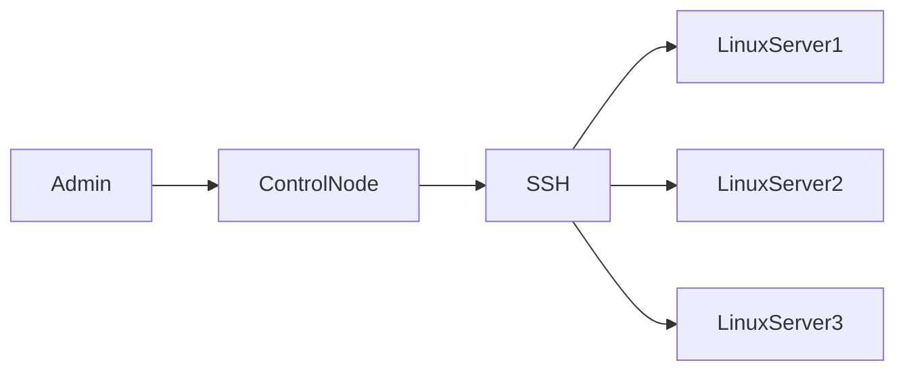
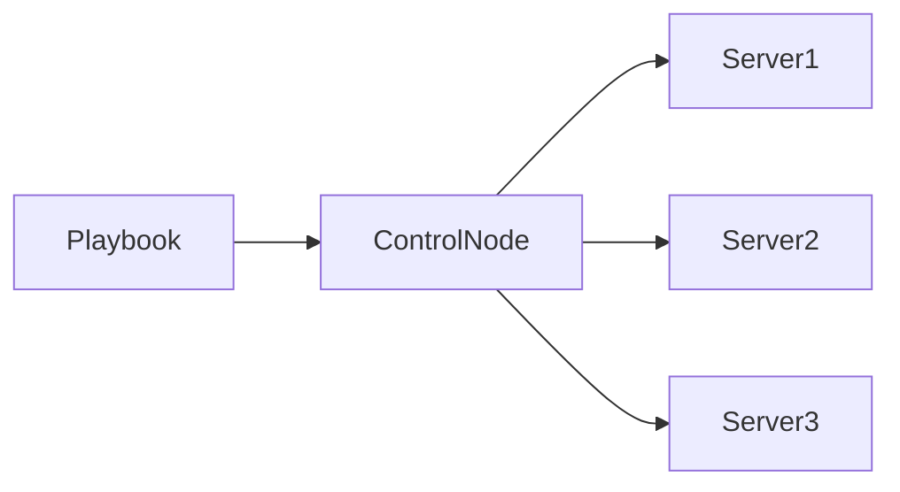
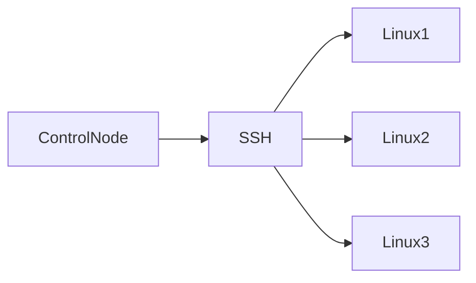
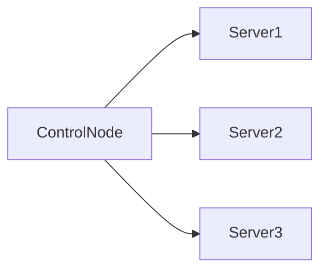
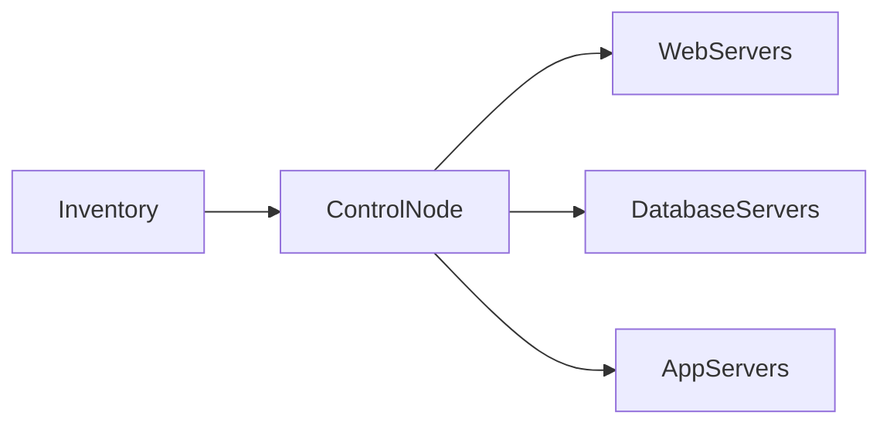

# Ansible Fundamentals

## Overview

Ansible is an **open-source IT automation and configuration management tool** used to automate infrastructure provisioning, software installation, configuration management, application deployment, and orchestration.

Unlike many automation tools, Ansible uses an **agentless architecture**, meaning no software needs to be installed on the target machines. It communicates with Linux systems using **SSH** and Windows systems using **WinRM**.

Ansible follows a **push-based automation model**, where commands and playbooks are executed from a central machine called the **Control Node** and pushed to the target systems (Managed Nodes).

Ansible is widely used in DevOps, Cloud, Platform Engineering, and SRE environments because it is simple, human-readable, and highly scalable.

> **Interview Tip**
>
> Ansible is primarily used for:
>
> - Configuration Management
> - Application Deployment
> - Infrastructure Provisioning
> - Orchestration
> - Automation

---

# What is Ansible

## Overview

Ansible is an automation tool developed to simplify infrastructure management.

It automates repetitive administrative tasks such as:

- Software installation
- Server configuration
- User management
- Patch management
- Service management
- Application deployment
- Cloud resource automation

Ansible uses **YAML-based Playbooks**, making automation easy to read and maintain.

---

## Why It Is Used

Ansible helps organizations:

- Reduce manual work
- Eliminate configuration drift
- Standardize server configurations
- Automate deployments
- Improve operational efficiency
- Increase consistency across environments

---

## Architecture / Working



Automation Workflow


---

## Key Components

| Component | Purpose |
|-----------|---------|
| Control Node | Executes playbooks |
| Managed Nodes | Target systems |
| Inventory | List of managed hosts |
| Playbook | Automation instructions |
| Modules | Perform specific tasks |
| SSH / WinRM | Communication protocol |

---

## Types (if applicable)

Ansible can automate:

- Configuration Management
- Application Deployment
- Infrastructure Provisioning
- Orchestration
- Cloud Automation

---

## Lifecycle / Workflow


---

## Configuration / Syntax (if applicable)

Example Command

```bash
ansible all -m ping
```

---

## Important Commands (if applicable)

Check Version

```bash
ansible --version
```

Ping Hosts

```bash
ansible all -m ping
```

Run Shell Command

```bash
ansible all -m shell -a "uptime"
```

---

## Important Files (if applicable)

| File | Purpose |
|------|---------|
| ansible.cfg | Main configuration file |
| inventory | List of managed hosts |
| playbook.yml | Automation playbook |

---

## Real-World Use Cases

- Configure Linux servers
- Install Apache/Nginx
- Deploy applications
- Patch operating systems
- Configure cloud resources
- Manage Kubernetes clusters

---

## Advantages

- Agentless
- Easy to learn
- YAML-based
- Idempotent
- Scalable
- Cross-platform
- Large module ecosystem

---

## Limitations

- Slower than agent-based tools for very large environments
- SSH connectivity is required for Linux
- Less suitable for event-driven automation compared to some specialized tools

---

## Common Interview Questions (Concept Only)

- What is Ansible?
- Why is Ansible popular?
- What problems does Ansible solve?
- Why is YAML used in Ansible?

---

## Common Mistakes

- Using Ansible for tasks better suited to specialized orchestration platforms
- Not organizing playbooks properly
- Hardcoding values instead of using variables

---

## Troubleshooting

| Problem | Cause | Solution |
|----------|--------|----------|
| Host unreachable | SSH issue | Verify SSH connectivity |
| Permission denied | Incorrect user or key | Verify credentials |
| Module failed | Invalid syntax | Check playbook and module parameters |

Useful Commands

```bash
ansible --version

ansible all -m ping
```

---

## Summary

Ansible is an agentless automation tool used for configuration management, application deployment, infrastructure provisioning, and orchestration. It simplifies infrastructure management using YAML playbooks and SSH/WinRM communication.

---

# Configuration Management

## Overview

Configuration Management is the process of maintaining servers and systems in a **desired, consistent, and predictable state**.

Instead of manually configuring each server, administrators define the required configuration in Ansible Playbooks. Ansible then ensures every managed system matches that configuration.

Examples include:

- Installing packages
- Configuring services
- Managing users
- Updating configuration files
- Enabling services

> **Interview Tip**
>
> Configuration Management ensures that every server is configured identically, reducing manual errors and configuration drift.

---

## Why It Is Used

Configuration Management provides:

- Consistency
- Automation
- Repeatability
- Reduced human errors
- Faster deployments
- Easier compliance

---

## Architecture / Working



---

## Key Components

| Component | Purpose |
|-----------|---------|
| Playbook | Defines desired configuration |
| Modules | Perform configuration tasks |
| Inventory | Target hosts |
| Managed Nodes | Apply configuration |

---

## Types (if applicable)

Common configuration tasks

- Package installation
- User management
- Service management
- File management
- Configuration updates

---

## Lifecycle / Workflow


---

## Configuration / Syntax (if applicable)

Example

```yaml
- name: Install Apache
  apt:
    name: apache2
    state: present
```

---

## Important Commands (if applicable)

Run Playbook

```bash
ansible-playbook web.yml
```

---

## Important Files (if applicable)

| File | Purpose |
|------|---------|
| playbook.yml | Desired configuration |

---

## Real-World Use Cases

- Standardize web servers
- Configure databases
- Install monitoring agents
- Configure firewall rules

---

## Advantages

- Consistent infrastructure
- Easy automation
- Idempotent execution
- Reduced configuration drift

---

## Limitations

- Requires maintained playbooks
- Poorly written playbooks can introduce inconsistent configurations

---

## Common Interview Questions (Concept Only)

- What is Configuration Management?
- Why is Configuration Management important?
- How does Ansible maintain desired configuration?

---

## Common Mistakes

- Making manual changes on managed servers
- Not storing playbooks in version control

---

## Troubleshooting

```bash
ansible-playbook web.yml --check
```

---

## Summary

Configuration Management ensures that servers remain in a predefined desired state by automatically applying and maintaining consistent configurations across all managed systems.

---

# Agentless Architecture

## Overview

Ansible uses an **agentless architecture**, meaning no Ansible software or daemon needs to be installed on managed nodes.

The Control Node connects directly to target systems using:

- SSH (Linux/Unix)
- WinRM (Windows)

Commands are executed remotely, and no persistent agent runs on the managed systems.

> **Interview Tip**
>
> This is one of Ansible's biggest advantages over tools that require agents on every managed host.

---

## Why It Is Used

Agentless architecture provides:

- Simplified deployment
- Reduced maintenance
- Lower resource usage
- Improved security
- Easier scaling

---

## Architecture / Working



---

## Key Components

| Component | Purpose |
|-----------|---------|
| Control Node | Executes automation |
| SSH | Linux communication |
| WinRM | Windows communication |
| Managed Nodes | Execute tasks |

---

## Types (if applicable)

Communication methods

- SSH
- WinRM

---

## Lifecycle /Workflow


---

## Configuration / Syntax (if applicable)

No agent installation required.

---

## Important Commands (if applicable)

```bash
ansible all -m ping
```

---

## Important Files (if applicable)

inventory

---

## Real-World Use Cases

- Linux server management
- Windows administration
- Cloud automation

---

## Advantages

- No agents
- Easy deployment
- Lower maintenance
- Improved security

---

## Limitations

- Requires SSH or WinRM connectivity
- Initial authentication must be configured

---

## Common Interview Questions (Concept Only)

- What is agentless architecture?
- Why is Ansible agentless?
- How does Ansible communicate with Linux?

---

## Common Mistakes

- Assuming Ansible requires an installed agent
- Misconfiguring SSH authentication

---

## Troubleshooting

```bash
ssh user@server

ansible all -m ping
```

---

## Summary

Ansible's agentless architecture simplifies automation by using SSH or WinRM for remote execution, eliminating the need to install and maintain agents on managed systems.

---

# Push-Based Automation

## Overview

Ansible follows a **push-based automation model**, where the Control Node initiates connections and pushes automation tasks to managed systems.

The managed nodes do not request configuration changes; they simply execute the instructions received.

> **Interview Tip**
>
> **Ansible = Push Model**
>
> **Puppet/Chef = Primarily Pull Model**

---

## Why It Is Used

Push-based automation provides:

- Immediate execution
- Administrator-controlled automation
- Simplified management
- Fast deployments

---

## Architecture / Working



---

## Key Components

| Component | Purpose |
|-----------|---------|
| Control Node | Pushes automation |
| SSH | Communication |
| Managed Nodes | Execute tasks |

---

## Types (if applicable)

Automation execution

- Manual
- Scheduled
- CI/CD triggered

---

## Lifecycle / Workflow


---

## Configuration / Syntax (if applicable)

```bash
ansible-playbook site.yml
```

---

## Important Commands (if applicable)

```bash
ansible-playbook deploy.yml
```

---

## Important Files (if applicable)

playbook.yml

---

## Real-World Use Cases

- Software deployment
- Infrastructure updates
- Configuration changes
- Emergency fixes

---

## Advantages

- Immediate execution
- Administrator control
- Easy troubleshooting

---

## Limitations

- Requires network connectivity at execution time
- Not continuously enforcing state unless scheduled or triggered

---

## Common Interview Questions (Concept Only)

- What is push-based automation?
- Why is Ansible called a push-based tool?
- Difference between push and pull automation?

---

## Common Mistakes

- Confusing push and pull models

---

## Troubleshooting

```bash
ansible-playbook deploy.yml
```

---

## Summary

Ansible pushes automation tasks directly from the Control Node to managed systems, allowing immediate execution without requiring agents on target hosts.

---

# Control Node

## Overview

The **Control Node** is the machine where Ansible is installed and from which automation tasks are executed.

It is responsible for:

- Running playbooks
- Reading the inventory
- Connecting to managed nodes
- Executing modules
- Collecting results

---

## Why It Is Used

The Control Node centralizes automation, making infrastructure management simpler and more efficient.

---

## Architecture / Working


---

## Key Components

| Component | Purpose |
|-----------|---------|
| Ansible | Automation engine |
| Inventory | Hosts list |
| Playbooks | Automation instructions |
| SSH Keys | Authentication |

---

## Types (if applicable)

Typical Control Nodes

- Linux Server
- Virtual Machine
- Developer Workstation
- CI/CD Server (e.g., Jenkins)

---

## Lifecycle / Workflow


---

## Configuration / Syntax (if applicable)

Inventory Example

```ini
[web]
server1
server2
```

---

## Important Commands (if applicable)

```bash
ansible --version

ansible-playbook site.yml
```

---

## Important Files (if applicable)

| File | Purpose |
|------|---------|
| ansible.cfg | Configuration |
| inventory | Host definitions |
| playbook.yml | Automation tasks |

---

## Real-World Use Cases

- Deploy applications
- Configure infrastructure
- Cloud automation
- Patch management

---

## Advantages

- Centralized automation
- Easy management
- Supports large environments

---

## Limitations

- Single Control Node can become a dependency unless designed for high availability

---

## Common Interview Questions (Concept Only)

- What is a Control Node?
- Can multiple Control Nodes exist?
- What is installed on the Control Node?

---

## Common Mistakes

- Installing Ansible on every managed host
- Storing sensitive data insecurely on the Control Node

---

## Troubleshooting

```bash
ansible --version

ansible all -m ping
```

---

## Summary

The Control Node is the central system that executes playbooks, manages inventories, connects to managed nodes, and coordinates automation across the infrastructure.

---

# Managed Nodes

## Overview

Managed Nodes are the target systems that Ansible automates.

These systems do not require Ansible to be installed. They only need:

- SSH access (Linux)
- WinRM access (Windows)
- Python (for most Linux modules)

---

## Why It Is Used

Managed Nodes receive and execute automation tasks sent by the Control Node.

---

## Architecture / Working


---

## Key Components

| Component | Purpose |
|-----------|---------|
| SSH/WinRM | Remote communication |
| Python | Executes most modules on Linux |
| Operating System | Target environment |

---

## Types (if applicable)

Managed Nodes can include:

- Linux Servers
- Windows Servers
- Cloud Virtual Machines
- Containers

---

## Lifecycle / Workflow


---

## Configuration / Syntax (if applicable)

Inventory Entry

```ini
web1 ansible_host=192.168.1.10
```

---

## Important Commands (if applicable)

```bash
ansible all -m ping
```

---

## Important Files (if applicable)

inventory

---

## Real-World Use Cases

- Web servers
- Database servers
- Application servers
- Cloud instances

---

## Advantages

- No Ansible installation required
- Easy to manage
- Supports heterogeneous environments

---

## Limitations

- Requires proper connectivity and authentication
- Some modules require Python on Linux

---

## Common Interview Questions (Concept Only)

- What is a Managed Node?
- Does Ansible need to be installed on Managed Nodes?
- What is required on a Linux Managed Node?

---

## Common Mistakes

- Assuming Ansible must be installed on every server
- Ignoring SSH key configuration

---

## Troubleshooting

```bash
ansible all -m ping

ssh user@server
```

---

## Summary

Managed Nodes are the target systems where Ansible executes automation tasks. They do not require an Ansible agent, relying instead on SSH or WinRM for communication.

---

# Inventory

## Overview

An **Inventory** is a file that tells Ansible which systems to manage.

It contains:

- Hostnames
- IP addresses
- Host groups
- Connection variables
- Authentication details

Ansible uses the inventory to determine where playbooks and ad-hoc commands should be executed.

> **Interview Tip**
>
> Without an inventory, Ansible does not know which systems to manage.

---

## Why It Is Used

Inventory provides:

- Centralized host management
- Logical grouping of servers
- Environment separation
- Simplified automation

---

## Architecture / Working



---

## Key Components

| Component | Purpose |
|-----------|---------|
| Hosts | Individual managed systems |
| Groups | Organize hosts logically |
| Variables | Host-specific configuration |
| Inventory File | Defines managed infrastructure |

---

## Types (if applicable)

Inventory Types

- Static Inventory
- Dynamic Inventory

> **Interview Note**
>
> Static inventory is commonly used for labs and small environments, while dynamic inventory is preferred in cloud environments where infrastructure changes frequently.

---

## Lifecycle / Workflow


---

## Configuration / Syntax (if applicable)

Static Inventory

```ini
[web]
web1 ansible_host=192.168.1.10
web2 ansible_host=192.168.1.11

[db]
db1 ansible_host=192.168.1.20
```

---

## Important Commands (if applicable)

List Inventory

```bash
ansible-inventory --list
```

Graph Inventory

```bash
ansible-inventory --graph
```

Ping All Hosts

```bash
ansible all -m ping
```

---

## Important Files (if applicable)

| File | Purpose |
|------|---------|
| inventory | Host definitions |
| ansible.cfg | References default inventory |

---

## Real-World Use Cases

- Organize production servers
- Separate development, testing, and production environments
- Group web, database, and application servers
- Cloud infrastructure management

---

## Advantages

- Centralized host management
- Easy grouping
- Simplifies large-scale automation
- Supports both static and dynamic environments

---

## Limitations

- Static inventories require manual updates
- Incorrect inventory entries can prevent automation from reaching target systems

---

## Common Interview Questions (Concept Only)

- What is an Ansible Inventory?
- Difference between static and dynamic inventory?
- Why are host groups used?
- How does Ansible know which servers to manage?

---

## Common Mistakes

- Incorrect IP addresses or hostnames
- Misconfigured groups
- Forgetting to update static inventories after infrastructure changes

---

## Troubleshooting

| Problem | Cause | Solution |
|----------|--------|----------|
| Host unreachable | Incorrect inventory entry | Verify hostname or IP |
| Authentication failure | Wrong credentials | Verify SSH key or username |
| Group not found | Invalid group name | Check inventory syntax |

Useful Commands

```bash
ansible-inventory --list

ansible-inventory --graph

ansible all -m ping
```

---

## Summary

The Inventory is the foundation of Ansible automation. It defines the managed infrastructure, organizes hosts into logical groups, and enables the Control Node to execute automation tasks on the correct systems. Static inventories are suitable for smaller environments, while dynamic inventories are preferred for cloud-based and rapidly changing infrastructures.
