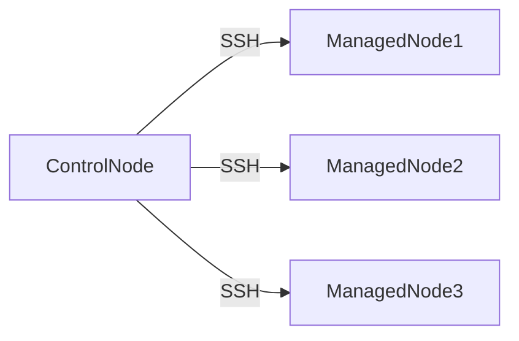

# SSH & Authentication

## Overview

SSH & Authentication is the mechanism Ansible uses to securely connect from the **Control Node** to **Managed Nodes**.

For Linux systems, Ansible primarily uses **SSH** for communication. Authentication can be done using:

- SSH Keys (Recommended)
- Username & Password
- Become (Privilege Escalation)
- Sudo

> **Interview Tip**
>
> SSH Key-based authentication is the preferred and most commonly used method in production because it is more secure and supports password-less automation.

---

# SSH Connectivity

## Overview

SSH Connectivity is the communication channel between the Ansible Control Node and Managed Nodes.

Ansible connects to remote servers over SSH, executes modules, retrieves results, and disconnects. No persistent agent runs on the managed host.

---

## Why It Is Used

SSH Connectivity enables Ansible to:

- Execute remote commands
- Run playbooks
- Transfer files
- Install software
- Configure servers securely

---

## Architecture / Working



---

## Key Components

| Component | Purpose |
|-----------|---------|
| Control Node | Executes automation |
| Managed Node | Remote system |
| SSH | Secure communication protocol |
| SSH Client | Connects to remote hosts |
| SSH Server | Accepts incoming connections |

---

## Types (if applicable)

SSH Connection Methods

- SSH Key Authentication
- Username & Password Authentication

---

## Lifecycle / Workflow


---

## Configuration / Syntax (if applicable)

Inventory Example

```ini
web1 ansible_host=192.168.1.10 ansible_user=ubuntu
```

Specify SSH Port

```ini
web1 ansible_port=2222
```

---

## Important Commands (if applicable)

Ping Hosts

```bash
ansible all -m ping
```

Test SSH

```bash
ssh ubuntu@192.168.1.10
```

Verbose Output

```bash
ansible all -m ping -vvv
```

---

## Important Files (if applicable)

| File | Purpose |
|------|---------|
| inventory | Host connection information |
| ~/.ssh/config | SSH client configuration |
| ~/.ssh/known_hosts | Known SSH hosts |

---

## Real-World Use Cases

- Server configuration
- Application deployment
- Software installation
- Infrastructure automation

---

## Advantages

- Secure communication
- Agentless
- Industry standard
- Supports encryption

---

## Limitations

- SSH service must be running
- Firewall must allow SSH access
- Incorrect permissions prevent authentication

---

## Common Interview Questions (Concept Only)

- How does Ansible communicate with Linux servers?
- Why is SSH used?
- Does Ansible require an agent?
- What port does SSH use by default?

---

## Common Mistakes

- SSH service not running
- Firewall blocking port 22
- Incorrect inventory IP
- Wrong SSH user

---

## Troubleshooting

| Problem | Cause | Solution |
|----------|--------|----------|
| Host unreachable | SSH service down | Start SSH service |
| Connection refused | Firewall or SSH disabled | Verify port 22 |
| Permission denied | Wrong credentials | Verify SSH user and authentication |

Useful Commands

```bash
ssh user@server

ansible all -m ping -vvv
```

---

## Summary

SSH Connectivity enables secure, agentless communication between the Control Node and Managed Nodes. It is the foundation of Ansible automation for Linux environments.

---

# SSH Keys

## Overview

SSH Keys provide secure, password-less authentication between the Control Node and Managed Nodes.

An SSH key pair consists of:

- Private Key (stored on Control Node)
- Public Key (stored on Managed Node)

> **Interview Tip**
>
> Production environments almost always use SSH Keys instead of passwords because they improve security and enable fully automated execution.

---

## Why It Is Used

SSH Keys provide:

- Password-less login
- Strong authentication
- Improved security
- Automation without user interaction

---

## Architecture / Working


---

## Key Components

| Component | Purpose |
|-----------|---------|
| Private Key | Authentication credential |
| Public Key | Stored on remote host |
| authorized_keys | Stores trusted public keys |

---

## Types (if applicable)

Common Key Types

- RSA
- ED25519 (Recommended)
- ECDSA

---

## Lifecycle / Workflow


---

## Configuration / Syntax (if applicable)

Generate SSH Key

```bash
ssh-keygen
```

Copy Public Key

```bash
ssh-copy-id ubuntu@192.168.1.10
```

Specify Key

```ini
ansible_ssh_private_key_file=~/.ssh/id_rsa
```

---

## Important Commands (if applicable)

```bash
ssh-keygen

ssh-copy-id user@server

ssh -i ~/.ssh/id_rsa user@server
```

---

## Important Files (if applicable)

| File | Purpose |
|------|---------|
| ~/.ssh/id_rsa | Private key |
| ~/.ssh/id_rsa.pub | Public key |
| ~/.ssh/authorized_keys | Trusted public keys |

---

## Real-World Use Cases

- CI/CD pipelines
- Jenkins automation
- Cloud VM management
- Infrastructure provisioning

---

## Advantages

- Highly secure
- Password-less automation
- Faster authentication
- Ideal for production

---

## Limitations

- Private key must be protected
- Lost private key requires regeneration

---

## Common Interview Questions (Concept Only)

- Why are SSH Keys preferred?
- What is the difference between public and private keys?
- Where is the public key stored?
- Where is the private key stored?

---

## Common Mistakes

- Incorrect file permissions
- Private key shared with others
- Public key not copied to server

---

## Troubleshooting

| Problem | Cause | Solution |
|----------|--------|----------|
| Permission denied | Missing public key | Copy public key |
| Authentication failed | Wrong private key | Verify key path |
| Bad permissions | Incorrect key permissions | Set proper permissions |

Useful Commands

```bash
chmod 600 ~/.ssh/id_rsa

ssh -i ~/.ssh/id_rsa user@server
```

---

## Summary

SSH Keys provide secure, password-less authentication and are the preferred authentication mechanism for Ansible in production environments.

---

# Password Authentication

## Overview

Password Authentication allows Ansible to authenticate using a username and password instead of SSH Keys.

Although simple to configure, it is generally used only in:

- Lab environments
- Testing
- Temporary automation

> **Interview Tip**
>
> Password authentication is rarely used in production because it requires interactive credentials and is less secure than SSH Keys.

---

## Why It Is Used

Password Authentication helps when:

- SSH Keys are unavailable
- Legacy servers are being managed
- Temporary access is required

---

## Architecture / Working


---

## Key Components

| Component | Purpose |
|-----------|---------|
| Username | Login account |
| Password | Authentication credential |
| SSH | Secure transport |

---

## Types (if applicable)

- Manual password entry
- Vault-protected password

---

## Lifecycle / Workflow


---

## Configuration / Syntax (if applicable)

Inventory

```ini
web1 ansible_user=ubuntu
```

Prompt for Password

```bash
ansible all -m ping -k
```

---

## Important Commands (if applicable)

```bash
ansible all -m ping -k
```

---

## Important Files (if applicable)

Inventory

---

## Real-World Use Cases

- Test labs
- Legacy servers
- Initial server setup

---

## Advantages

- Easy to configure
- No key generation required

---

## Limitations

- Less secure
- Requires password entry
- Not suitable for CI/CD automation

---

## Common Interview Questions (Concept Only)

- Can Ansible use passwords?
- Why are passwords discouraged in production?
- Which option prompts for SSH passwords?

---

## Common Mistakes

- Hardcoding passwords
- Using passwords instead of SSH Keys
- Storing passwords in plain text

---

## Troubleshooting

```bash
ansible all -m ping -k
```

Verify SSH login manually.

---

## Summary

Password Authentication is supported by Ansible but is generally limited to development or legacy environments. SSH Key authentication remains the preferred production approach.

---

# Become (Privilege Escalation)

## Overview

Become allows Ansible to execute tasks with elevated privileges after connecting as a normal user.

Instead of logging in directly as `root`, Ansible connects using a regular account and temporarily escalates privileges.

> **Interview Tip**
>
> `become` is preferred over logging in as the `root` user because it follows the principle of least privilege and improves security.

---

## Why It Is Used

Become enables:

- Package installation
- Service management
- System configuration
- File permission changes

---

## Architecture / Working


---

## Key Components

| Component | Purpose |
|-----------|---------|
| become | Enables privilege escalation |
| become_user | Target user |
| sudo | Default escalation method |

---

## Types (if applicable)

Common Methods

- sudo
- su

---

## Lifecycle / Workflow


---

## Configuration / Syntax (if applicable)

Playbook Example

```yaml
---
- hosts: web
  become: true

  tasks:
    - name: Install Apache
      apt:
        name: apache2
        state: present
```

Run with Become Password

```bash
ansible-playbook playbook.yml -K
```

---

## Important Commands (if applicable)

```bash
ansible-playbook playbook.yml -K
```

---

## Important Files (if applicable)

sudoers

---

## Real-World Use Cases

- Install packages
- Restart services
- Modify system files
- Deploy applications

---

## Advantages

- Improved security
- Least privilege
- Avoids root login

---

## Limitations

- Requires sudo permissions
- Misconfigured sudo prevents execution

---

## Common Interview Questions (Concept Only)

- What is `become`?
- Why use `become` instead of root?
- Difference between `become` and `sudo`?

---

## Common Mistakes

- Forgetting `become: true`
- Connecting directly as root
- Missing sudo permissions

---

## Troubleshooting

```bash
ansible-playbook playbook.yml -K
```

Verify sudo access manually.

---

## Summary

Become provides secure privilege escalation, allowing Ansible to perform administrative tasks while connecting with a non-root account.

---

# Sudo

## Overview

`sudo` is the default privilege escalation method used by Ansible's `become` feature.

It temporarily grants administrative privileges to execute commands requiring root access.

---

## Why It Is Used

Sudo allows administrators to:

- Install packages
- Restart services
- Modify system configuration
- Maintain security without direct root login

---

## Architecture / Working


---

## Key Components

| Component | Purpose |
|-----------|---------|
| sudo | Privilege escalation command |
| sudoers | Permission configuration |
| Root | Elevated privileges |

---

## Types (if applicable)

- Password-based sudo
- Password-less sudo

---

## Lifecycle / Workflow


---

## Configuration / Syntax (if applicable)

Playbook

```yaml
become: true
become_method: sudo
```

Inventory

```ini
ansible_become=true
ansible_become_method=sudo
```

---

## Important Commands (if applicable)

Test Sudo

```bash
sudo whoami
```

Run Playbook

```bash
ansible-playbook playbook.yml -K
```

---

## Important Files (if applicable)

| File | Purpose |
|------|---------|
| /etc/sudoers | Sudo configuration |

---

## Real-World Use Cases

- Server administration
- Package installation
- Configuration management
- CI/CD automation

---

## Advantages

- Secure privilege escalation
- Avoids direct root login
- Fine-grained access control

---

## Limitations

- Incorrect sudo configuration prevents automation
- Requires appropriate user permissions

---

## Common Interview Questions (Concept Only)

- What is sudo?
- How does Ansible use sudo?
- What is the difference between `become` and `sudo`?
- Which file controls sudo permissions?

---

## Common Mistakes

- Missing sudo privileges
- Editing the `sudoers` file incorrectly
- Assuming all users have sudo access

---

## Troubleshooting

| Problem | Cause | Solution |
|----------|--------|----------|
| "sudo: permission denied" | User lacks sudo privileges | Grant sudo access |
| Become failed | Incorrect sudo configuration | Verify `/etc/sudoers` |
| Password prompt failure | Incorrect sudo password | Use `-K` and verify credentials |

Useful Commands

```bash
sudo whoami

sudo -l

ansible-playbook playbook.yml -K
```

---

## Summary

Sudo is the default privilege escalation mechanism used by Ansible. Combined with `become`, it allows secure execution of administrative tasks while avoiding direct root logins, making it the standard approach for production automation.
