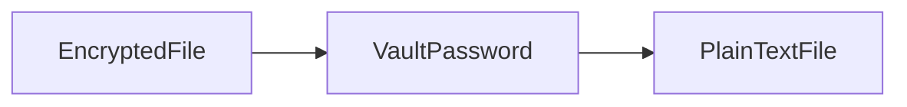
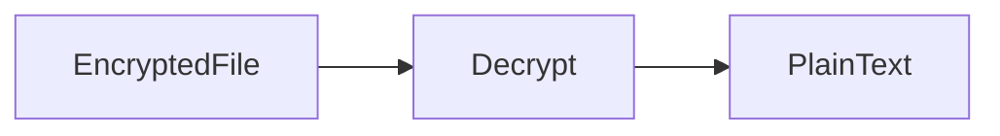

# Vault

## Overview

Ansible Vault is a built-in security feature that encrypts sensitive data such as passwords, API keys, SSH keys, certificates, and other confidential information used in Ansible Playbooks.

Instead of storing secrets in plain text, Ansible Vault encrypts them using AES-256 encryption. During Playbook execution, Ansible decrypts the data only when the correct Vault password or password file is provided.

> **Interview Tip**
>
> Ansible Vault is the standard method for protecting sensitive information in Playbooks. In production, it is commonly used to secure passwords, cloud credentials, database credentials, and API tokens.

---

## Why It Is Used

Ansible Vault helps to:

- Protect sensitive information
- Prevent credentials from being stored in plain text
- Secure Playbooks in Git repositories
- Meet security and compliance requirements
- Share automation safely across teams

---

## Architecture / Working


---

## Key Components

| Component | Purpose |
|-----------|---------|
| Ansible Vault | Encrypts sensitive data |
| Vault Password | Used to decrypt encrypted data |
| Vault File | Stores encrypted content |
| Playbook | Reads encrypted variables |

---

## Types (if applicable)

Vault can encrypt:

- Entire files
- Variable files
- Individual variables
- Strings
- Inventory variables

---

## Lifecycle / Workflow


---

## Configuration / Syntax (if applicable)

Encrypt a File

```bash
ansible-vault encrypt secrets.yml
```

View Encrypted File

```yaml
$ANSIBLE_VAULT;1.1;AES256
643637633739...
```

Use Vault File

```yaml
vars_files:
  - secrets.yml
```

---

## Important Commands (if applicable)

Create Encrypted File

```bash
ansible-vault create secrets.yml
```

Encrypt Existing File

```bash
ansible-vault encrypt secrets.yml
```

Decrypt File

```bash
ansible-vault decrypt secrets.yml
```

Edit Encrypted File

```bash
ansible-vault edit secrets.yml
```

View File

```bash
ansible-vault view secrets.yml
```

Change Vault Password

```bash
ansible-vault rekey secrets.yml
```

Encrypt String

```bash
ansible-vault encrypt_string 'MyPassword123'
```

---

## Important Files (if applicable)

| File | Purpose |
|------|---------|
| secrets.yml | Encrypted variables |
| vault_password.txt | Vault password file (should never be committed to Git) |
| ansible.cfg | Vault configuration (optional) |

---

## Real-World Use Cases

- Store SSH passwords
- Store Azure Service Principal credentials
- Store AWS Access Keys
- Store Kubernetes Secrets
- Store Database passwords
- Store API tokens
- Secure CI/CD credentials

---

## Advantages

- Built into Ansible
- Strong AES-256 encryption
- Git-friendly
- Easy integration with Playbooks
- Protects sensitive information

---

## Limitations

- Vault password must be managed securely
- Losing the Vault password means encrypted data cannot be recovered
- Entire encrypted files cannot be partially viewed without decryption

---

## Common Interview Questions (Concept Only)

- What is Ansible Vault?
- Why is Vault used?
- What encryption algorithm does Vault use?
- Can Vault encrypt an entire file?
- Can Vault encrypt a single variable?

---

## Common Mistakes

- Storing Vault passwords in Git repositories
- Losing the Vault password
- Mixing encrypted and unencrypted sensitive data
- Using plain-text credentials instead of Vault

---

## Troubleshooting

| Problem | Cause | Solution |
|----------|--------|----------|
| Decryption failed | Incorrect Vault password | Verify password |
| File cannot be opened | File not encrypted | Encrypt using `ansible-vault encrypt` |
| Playbook fails | Vault password not supplied | Use `--ask-vault-pass` or `--vault-password-file` |

Useful Commands

```bash
ansible-vault view secrets.yml

ansible-vault edit secrets.yml

ansible-vault rekey secrets.yml
```

---

## Summary

Ansible Vault secures sensitive information by encrypting files and variables using AES-256. It is widely used in production environments to protect passwords, credentials, API keys, and other confidential data.

---

# Create Vault

## Overview

A Vault file is an encrypted file created using the `ansible-vault create` command.

The file is encrypted immediately after it is saved.

---

## Why It Is Used

Creating Vault files allows teams to:

- Secure secrets from the beginning
- Store encrypted credentials
- Safely commit secret files to version control

---

## Architecture / Working


---

## Key Components

| Component | Purpose |
|-----------|---------|
| ansible-vault create | Creates encrypted file |
| Vault Password | Protects file |
| Encrypted File | Stores secrets |

---

## Types (if applicable)

Vault File Types

- Variable files
- Secret configuration files

---

## Lifecycle / Workflow


---

## Configuration / Syntax (if applicable)

Create Vault File

```bash
ansible-vault create secrets.yml
```

Example

```yaml
db_password: MyPassword123
api_key: ABC123XYZ
```

After saving, the file becomes encrypted automatically.

---

## Important Commands (if applicable)

Create File

```bash
ansible-vault create secrets.yml
```

Edit File

```bash
ansible-vault edit secrets.yml
```

---

## Important Files (if applicable)

| File | Purpose |
|------|---------|
| secrets.yml | Encrypted secret file |

---

## Real-World Use Cases

- Database credentials
- Cloud credentials
- API tokens
- SSH passwords

---

## Advantages

- Secure from creation
- Easy to use
- Built into Ansible

---

## Limitations

- Password required for access

---

## Common Interview Questions (Concept Only)

- How do you create a Vault file?
- What happens after saving the file?

---

## Common Mistakes

- Creating plain-text files instead of Vault files
- Forgetting the Vault password

---

## Troubleshooting

```bash
ansible-vault view secrets.yml
```

---

## Summary

`ansible-vault create` creates encrypted files from the start, ensuring secrets are never stored in plain text.

---

# Encrypt Variables

## Overview

Instead of encrypting an entire file, Ansible Vault can encrypt individual variables or strings.

This allows sensitive values to remain encrypted while keeping the rest of the file readable.

> **Interview Tip**
>
> Encrypting individual variables is useful when only a few values are confidential.

---

## Why It Is Used

Variable encryption helps to:

- Protect passwords
- Protect API keys
- Keep configuration files readable
- Minimize encrypted content

---

## Architecture / Working


---

## Key Components

| Component | Purpose |
|-----------|---------|
| encrypt_string | Encrypts individual values |
| Vault Password | Encrypts and decrypts |

---

## Types (if applicable)

- Passwords
- Tokens
- Secrets
- Keys

---

## Lifecycle / Workflow


---

## Configuration / Syntax (if applicable)

Encrypt String

```bash
ansible-vault encrypt_string 'MyPassword123'
```

Named Variable

```bash
ansible-vault encrypt_string 'MyPassword123' --name db_password
```

Generated Output

```yaml
db_password: !vault |
          $ANSIBLE_VAULT;1.1;AES256
          65376261...
```

---

## Important Commands (if applicable)

```bash
ansible-vault encrypt_string
```

---

## Important Files (if applicable)

Variable files

---

## Real-World Use Cases

- Database passwords
- Cloud credentials
- API keys
- OAuth tokens

---

## Advantages

- Only sensitive values are encrypted
- Easier to read configuration files
- Better maintainability

---

## Limitations

- Managing many encrypted variables can become difficult

---

## Common Interview Questions (Concept Only)

- Can Vault encrypt individual variables?
- Which command encrypts a string?

---

## Common Mistakes

- Forgetting `--name`
- Mixing encrypted and plain-text secrets inconsistently

---

## Troubleshooting

```bash
ansible-vault encrypt_string --help
```

---

## Summary

Individual variable encryption keeps configuration files readable while protecting only sensitive values.

---

# Decrypt Files

## Overview

Encrypted Vault files can be permanently decrypted using the `ansible-vault decrypt` command.

Normally, production Playbooks do **not** require manual decryption because Ansible decrypts Vault files automatically during execution.

> **Interview Tip**
>
> Manual decryption is generally used for maintenance or migration tasks. During normal Playbook execution, automatic decryption is preferred.

---

## Why It Is Used

Decrypt files to:

- Edit outside Ansible
- Migrate secrets
- Recover readable content
- Debug encrypted files

---

## Architecture / Working



---

## Key Components

| Component | Purpose |
|-----------|---------|
| decrypt | Removes encryption |
| Vault Password | Required for decryption |

---

## Types (if applicable)

- Permanent decryption
- Temporary automatic decryption during execution

---

## Lifecycle / Workflow



---

## Configuration / Syntax (if applicable)

Decrypt File

```bash
ansible-vault decrypt secrets.yml
```

View Without Decrypting

```bash
ansible-vault view secrets.yml
```

---

## Important Commands (if applicable)

```bash
ansible-vault decrypt secrets.yml

ansible-vault view secrets.yml
```

---

## Important Files (if applicable)

Encrypted Vault files

---

## Real-World Use Cases

- Maintenance
- Debugging
- Migration

---

## Advantages

- Easy recovery of readable content
- Useful for maintenance

---

## Limitations

- Produces plain-text files
- Requires careful handling after decryption

---

## Common Interview Questions (Concept Only)

- How do you decrypt a Vault file?
- Is manual decryption required during Playbook execution?

---

## Common Mistakes

- Leaving decrypted files on disk
- Forgetting to re-encrypt files after editing

---

## Troubleshooting

| Problem | Cause | Solution |
|----------|--------|----------|
| Wrong password | Incorrect Vault password | Retry with the correct password |
| File not encrypted | Invalid input file | Verify the file is a Vault file |

---

## Summary

Vault files can be decrypted permanently when needed, but production Playbooks typically rely on automatic decryption during execution.

---

# Use Vault Password

## Overview

During Playbook execution, Ansible needs the Vault password to decrypt encrypted files.

The password can be supplied interactively or through a password file.

> **Interview Tip**
>
> In CI/CD pipelines, using a **Vault password file** or a secure secret-management mechanism is preferred over interactive prompts.

---

## Why It Is Used

The Vault password enables:

- Secure Playbook execution
- Automatic decryption
- Non-interactive automation

---

## Architecture / Working


---

## Key Components

| Component | Purpose |
|-----------|---------|
| Vault Password | Unlocks encrypted data |
| Password File | Stores Vault password securely |
| Playbook | Uses decrypted secrets |

---

## Types (if applicable)

### Interactive Password

User enters the password during execution.

### Password File

Password is read from a secure file.

---

## Lifecycle / Workflow


---

## Configuration / Syntax (if applicable)

Interactive Password

```bash
ansible-playbook site.yml --ask-vault-pass
```

Password File

```bash
ansible-playbook site.yml --vault-password-file vault_password.txt
```

Example Password File

```text
MySecureVaultPassword
```

---

## Important Commands (if applicable)

Interactive

```bash
ansible-playbook site.yml --ask-vault-pass
```

Password File

```bash
ansible-playbook site.yml --vault-password-file vault_password.txt
```

---

## Important Files (if applicable)

| File | Purpose |
|------|---------|
| vault_password.txt | Stores Vault password securely |
| secrets.yml | Encrypted variables |

---

## Real-World Use Cases

- CI/CD pipelines
- Automated infrastructure deployment
- Secure production automation
- Scheduled Ansible jobs

---

## Advantages

- Supports interactive and automated execution
- Easy integration with pipelines
- Improves security

---

## Limitations

- Password files must be protected
- Poor password management weakens security

---

## Common Interview Questions (Concept Only)

- How do you provide a Vault password during execution?
- What is the difference between `--ask-vault-pass` and `--vault-password-file`?
- Which approach is preferred in CI/CD pipelines?

---

## Common Mistakes

- Committing the password file to Git
- Using weak Vault passwords
- Incorrect file permissions on the password file

---

## Troubleshooting

| Problem | Cause | Solution |
|----------|--------|----------|
| Invalid Vault password | Wrong password | Verify the password |
| Password file not found | Incorrect path | Check file location |
| Permission denied | Restricted file permissions | Update file permissions |

Useful Commands

```bash
ansible-playbook site.yml --ask-vault-pass

ansible-playbook site.yml --vault-password-file vault_password.txt
```

---

## Summary

The Vault password is required to decrypt encrypted data during Playbook execution. Interactive prompts are suitable for manual execution, while password files or secure secret-management solutions are preferred for automated CI/CD environments.
