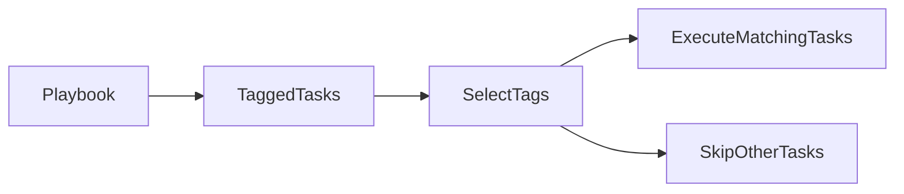
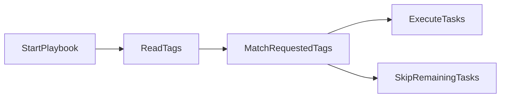
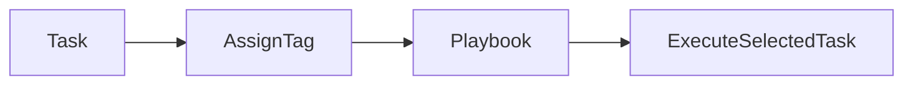
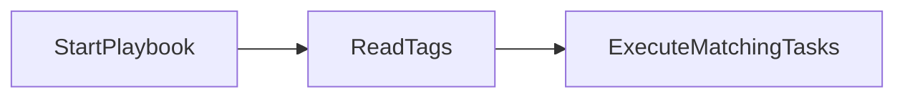
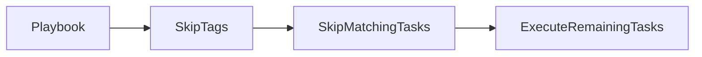
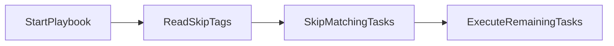

# Tags

## Overview

Ansible Tags allow you to label tasks, plays, roles, or blocks with one or more identifiers. During Playbook execution, you can choose to execute only specific tagged tasks or skip selected tags.

Instead of running the entire Playbook, Tags let you execute only the required portions, making automation faster and more flexible.

> **Interview Tip**
>
> Tags are widely used in production for partial deployments, configuration changes, patching, and troubleshooting without executing the entire Playbook.

---

## Why It Is Used

Tags help to:

- Execute only required tasks
- Reduce Playbook execution time
- Simplify testing
- Perform partial deployments
- Troubleshoot specific tasks
- Support CI/CD pipelines

---

## Architecture / Working



---

## Key Components

| Component | Purpose |
|-----------|---------|
| tag | Label assigned to a task |
| --tags | Runs selected tags |
| --skip-tags | Skips selected tags |
| Task | Individual automation step |
| Playbook | Contains tagged tasks |

---

## Types (if applicable)

Common Tag Types

- Task Tags
- Play Tags
- Block Tags
- Role Tags

---

## Lifecycle / Workflow



---

## Configuration / Syntax (if applicable)

Assign a Tag

```yaml
- name: Install Nginx
  apt:
    name: nginx
    state: present
  tags:
    - install
```

Multiple Tags

```yaml
- name: Start Nginx
  service:
    name: nginx
    state: started
  tags:
    - install
    - service
```

Tag an Entire Play

```yaml
- hosts: web

  tags:
    - deployment

  tasks:

    - name: Install Package
      apt:
        name: nginx
        state: present
```

---

## Important Commands (if applicable)

Run Entire Playbook

```bash
ansible-playbook site.yml
```

List Available Tags

```bash
ansible-playbook site.yml --list-tags
```

List Tagged Tasks

```bash
ansible-playbook site.yml --list-tasks
```

---

## Important Files (if applicable)

| File | Purpose |
|------|---------|
| playbook.yml | Contains tagged tasks |
| roles/ | Roles may contain tagged tasks |

---

## Real-World Use Cases

- Install packages only
- Restart services
- Configure applications
- Deploy applications
- Patch servers
- Run database migrations
- Execute maintenance tasks

---

## Advantages

- Faster Playbook execution
- Better modularity
- Easier debugging
- Flexible deployments
- Supports partial automation

---

## Limitations

- Excessive tags reduce readability
- Poor naming conventions can create confusion
- Incorrect tag selection may skip required tasks

---

## Common Interview Questions (Concept Only)

- What are Ansible Tags?
- Why are Tags used?
- Can multiple Tags be assigned to one task?
- Can Tags be applied to an entire Play?

---

## Common Mistakes

- Inconsistent tag naming
- Forgetting to tag important tasks
- Creating too many unnecessary tags
- Assuming untagged tasks execute when specific tags are requested

---

## Troubleshooting

| Problem | Cause | Solution |
|----------|--------|----------|
| Task not executed | Tag mismatch | Verify tag name |
| No tasks executed | Wrong tag specified | Use `--list-tags` |
| Unexpected task execution | Multiple matching tags | Review assigned tags |

Useful Commands

```bash
ansible-playbook site.yml --list-tags

ansible-playbook site.yml --list-tasks
```

---

## Summary

Tags allow selective execution of Playbook tasks, improving flexibility, reducing execution time, and simplifying production deployments and troubleshooting.

---

# Task Tags

## Overview

Task Tags are labels assigned directly to individual tasks.

Each task can have:

- One tag
- Multiple tags
- No tags

During execution, Ansible matches the requested tags and runs only the corresponding tasks.

---

## Why It Is Used

Task Tags enable:

- Fine-grained execution
- Faster testing
- Easier maintenance
- Controlled deployments

---

## Architecture / Working



---

## Key Components

| Component | Purpose |
|-----------|---------|
| Task | Individual automation step |
| Tag | Task label |
| Playbook | Executes tagged tasks |

---

## Types (if applicable)

Task Tags

- Single tag
- Multiple tags

---

## Lifecycle / Workflow


---

## Configuration / Syntax (if applicable)

Single Tag

```yaml
- name: Install Apache
  apt:
    name: apache2
    state: present
  tags:
    - install
```

Multiple Tags

```yaml
- name: Restart Apache
  service:
    name: apache2
    state: restarted
  tags:
    - service
    - restart
```

---

## Important Commands (if applicable)

List Tasks

```bash
ansible-playbook site.yml --list-tasks
```

---

## Important Files (if applicable)

Playbook

---

## Real-World Use Cases

- Restart services
- Install packages
- Deploy applications
- Configure firewalls
- Update configuration files

---

## Advantages

- Fine-grained execution
- Better organization
- Faster debugging

---

## Limitations

- Requires consistent tag management
- Excessive tagging increases complexity

---

## Common Interview Questions (Concept Only)

- What are Task Tags?
- Can one task have multiple Tags?
- Where are Tags defined?

---

## Common Mistakes

- Duplicate tag names
- Forgetting to tag critical tasks
- Inconsistent naming conventions

---

## Troubleshooting

```bash
ansible-playbook site.yml --list-tags
```

---

## Summary

Task Tags label individual tasks, allowing engineers to execute only the automation relevant to the current operation.

---

# Run Tagged Tasks

## Overview

The `--tags` option allows execution of only the tasks that match the specified tag.

All other tasks are skipped.

> **Interview Tip**
>
> Running tagged tasks is common during production deployments when only a specific component needs to be updated.

---

## Why It Is Used

Running tagged tasks helps to:

- Reduce execution time
- Perform targeted deployments
- Test specific automation
- Execute maintenance tasks

---

## Architecture / Working


---

## Key Components

| Component | Purpose |
|-----------|---------|
| --tags | Executes matching tasks |
| Tag | Task identifier |
| Playbook | Contains tagged tasks |

---

## Types (if applicable)

Execution Options

- Single tag
- Multiple tags
- Special tags (`always`, `never`)

---

## Lifecycle / Workflow



---

## Configuration / Syntax (if applicable)

Run Single Tag

```bash
ansible-playbook site.yml --tags install
```

Run Multiple Tags

```bash
ansible-playbook site.yml --tags "install,service"
```

Run a Role with Tagged Tasks

```bash
ansible-playbook site.yml --tags deployment
```

---

## Important Commands (if applicable)

Execute Tagged Tasks

```bash
ansible-playbook site.yml --tags install
```

List Tags

```bash
ansible-playbook site.yml --list-tags
```

---

## Important Files (if applicable)

Playbook

---

## Real-World Use Cases

- Deploy application only
- Restart services only
- Install packages only
- Patch production servers
- Update configuration files

---

## Advantages

- Faster execution
- Reduced downtime
- Selective deployment
- Easier troubleshooting

---

## Limitations

- Untagged dependent tasks may not execute
- Incorrect tag selection can lead to incomplete automation

---

## Common Interview Questions (Concept Only)

- How do you run only tagged tasks?
- Can multiple Tags be executed together?
- What happens to untagged tasks?

---

## Common Mistakes

- Misspelled tag names
- Forgetting dependent tasks
- Assuming all tasks execute automatically

---

## Troubleshooting

| Problem | Cause | Solution |
|----------|--------|----------|
| No tasks executed | Invalid tag | Verify using `--list-tags` |
| Missing configuration | Dependency not tagged | Review task dependencies |

Useful Commands

```bash
ansible-playbook site.yml --tags install

ansible-playbook site.yml --list-tags
```

---

## Summary

The `--tags` option executes only tasks with matching tags, making Playbook execution faster and more targeted.

---

# Skip Tags

## Overview

The `--skip-tags` option executes the Playbook while excluding tasks with specified tags.

This is useful when certain operations should not run during a deployment.

> **Interview Tip**
>
> `--skip-tags` is commonly used to avoid service restarts, lengthy maintenance tasks, or disruptive operations during production deployments.

---

## Why It Is Used

Skipping tags helps to:

- Avoid unnecessary operations
- Prevent service interruptions
- Execute safe deployments
- Exclude maintenance tasks

---

## Architecture / Working



---

## Key Components

| Component | Purpose |
|-----------|---------|
| --skip-tags | Excludes tagged tasks |
| Tag | Identifier for skipped tasks |
| Playbook | Contains tagged tasks |

---

## Types (if applicable)

Skip Options

- Single tag
- Multiple tags

---

## Lifecycle / Workflow



---

## Configuration / Syntax (if applicable)

Skip One Tag

```bash
ansible-playbook site.yml --skip-tags restart
```

Skip Multiple Tags

```bash
ansible-playbook site.yml --skip-tags "restart,cleanup"
```

---

## Important Commands (if applicable)

Skip Tags

```bash
ansible-playbook site.yml --skip-tags restart
```

List Tags

```bash
ansible-playbook site.yml --list-tags
```

---

## Important Files (if applicable)

Playbook

---

## Real-World Use Cases

- Skip server reboot
- Skip service restart
- Skip cleanup tasks
- Skip database migrations
- Skip maintenance operations during business hours

---

## Advantages

- Safer deployments
- Reduced downtime
- Flexible execution
- Better operational control

---

## Limitations

- Skipping required tasks can leave systems in an inconsistent state
- Requires understanding of task dependencies

---

## Common Interview Questions (Concept Only)

- What is `--skip-tags`?
- When would you skip tagged tasks?
- Can multiple Tags be skipped?
- What happens to tasks without matching skip tags?

---

## Common Mistakes

- Skipping required configuration tasks
- Misspelled tag names
- Ignoring task dependencies

---

## Troubleshooting

| Problem | Cause | Solution |
|----------|--------|----------|
| Incorrect tasks skipped | Wrong tag specified | Verify tag names |
| Deployment incomplete | Required task skipped | Review skipped tags and dependencies |

Useful Commands

```bash
ansible-playbook site.yml --skip-tags restart

ansible-playbook site.yml --list-tags
```

---

## Summary

The `--skip-tags` option excludes specified tagged tasks while executing the remainder of the Playbook. It is commonly used to avoid disruptive operations such as service restarts or maintenance tasks during production deployments.
