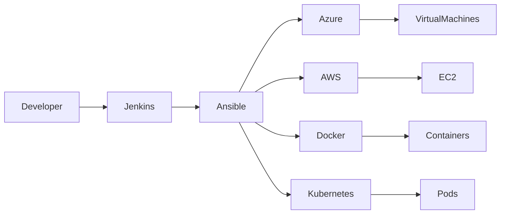
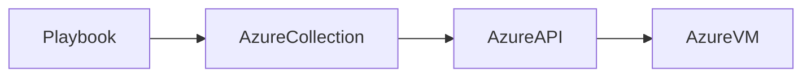
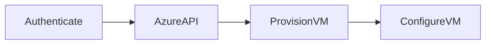
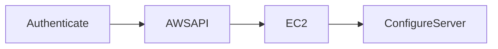

# Ansible with Cloud & DevOps

## Overview

Ansible integrates with cloud platforms, container platforms, and CI/CD tools to automate infrastructure provisioning, configuration management, application deployment, and operational tasks.

Instead of manually managing cloud resources or containers, Ansible communicates with cloud APIs, Docker daemons, Kubernetes clusters, and CI/CD servers using dedicated modules and collections.

The most common integrations are:

- Microsoft Azure
- Amazon Web Services (AWS)
- Docker
- Kubernetes
- Jenkins

> **Interview Tip**
>
> Interviewers commonly ask how Ansible fits into a DevOps pipeline. Remember:
>
> - **Terraform provisions infrastructure.**
> - **Ansible configures infrastructure and deploys applications.**
> - **Jenkins orchestrates the CI/CD pipeline.**
> - **Docker packages applications.**
> - **Kubernetes runs containerized applications.**

---

## Why It Is Used

Ansible integration helps to:

- Automate cloud provisioning
- Configure virtual machines
- Deploy applications
- Manage containers
- Automate Kubernetes deployments
- Build complete CI/CD pipelines
- Reduce manual operations

---

## Architecture / Working



---

## Key Components

| Component | Purpose |
|-----------|---------|
| Playbook | Automation workflow |
| Inventory | Target systems |
| Modules | Cloud and DevOps automation |
| Collections | Cloud-specific modules |
| SSH/API | Communication mechanism |

---

## Types (if applicable)

Common Integrations

- Cloud Automation
- Container Automation
- Kubernetes Automation
- CI/CD Automation

---

## Lifecycle / Workflow


---

## Configuration / Syntax (if applicable)

Install Collection

```bash
ansible-galaxy collection install azure.azcollection

ansible-galaxy collection install amazon.aws

ansible-galaxy collection install kubernetes.core

ansible-galaxy collection install community.docker
```

---

## Important Commands (if applicable)

Run Playbook

```bash
ansible-playbook deploy.yml
```

Install Collection

```bash
ansible-galaxy collection install amazon.aws
```

---

## Important Files (if applicable)

| File | Purpose |
|------|---------|
| playbook.yml | Automation tasks |
| inventory | Target hosts |
| ansible.cfg | Ansible configuration |
| requirements.yml | Required collections |

---

## Real-World Use Cases

- Configure Azure VMs
- Configure AWS EC2 instances
- Deploy Docker containers
- Deploy Kubernetes applications
- Jenkins-based CI/CD automation
- Cloud server patching

---

## Advantages

- Unified automation platform
- Multi-cloud support
- Agentless architecture
- Easy CI/CD integration
- Large ecosystem of modules

---

## Limitations

- Cloud credentials must be managed securely
- API rate limits may affect large deployments
- Requires cloud-specific collections

---

## Common Interview Questions (Concept Only)

- How does Ansible integrate with cloud platforms?
- Can Ansible provision cloud resources?
- How is Ansible used in CI/CD?
- Can Ansible manage Kubernetes?
- Which collections are required for cloud automation?

---

## Common Mistakes

- Hardcoding cloud credentials
- Forgetting required collections
- Using outdated modules
- Ignoring idempotency

---

## Troubleshooting

| Problem | Cause | Solution |
|----------|--------|----------|
| Module not found | Collection missing | Install required collection |
| Authentication failure | Invalid credentials | Verify cloud authentication |
| API errors | Insufficient permissions | Review IAM/RBAC roles |

Useful Commands

```bash
ansible-galaxy collection list

ansible-playbook deploy.yml -v
```

---

## Summary

Ansible integrates seamlessly with cloud providers, containers, Kubernetes, and CI/CD tools, making it a core automation platform in modern DevOps environments.

---

# Azure Virtual Machines

## Overview

Ansible automates the provisioning, configuration, and management of Azure Virtual Machines using the **Azure Collection** and Azure Resource Manager (ARM) APIs.

It can create, configure, update, and delete Azure resources without manually using the Azure Portal.

> **Interview Tip**
>
> Terraform is generally used to provision Azure infrastructure, while Ansible is commonly used to configure Azure VMs after they are created.

---

## Why It Is Used

Azure VM automation helps to:

- Provision virtual machines
- Configure operating systems
- Install software
- Deploy applications
- Manage Azure infrastructure

---

## Architecture / Working



---

## Key Components

| Component | Purpose |
|-----------|---------|
| azure.azcollection | Azure modules |
| Azure Resource Manager | Azure API |
| Service Principal | Authentication |
| Azure VM | Managed resource |

---

## Types (if applicable)

Azure Resources

- Virtual Machine
- Resource Group
- Virtual Network
- Storage Account

---

## Lifecycle / Workflow



---

## Configuration / Syntax (if applicable)

Example

```yaml
- name: Create Azure VM
  azure.azcollection.azure_rm_virtualmachine:
```

---

## Important Commands (if applicable)

Install Azure Collection

```bash
ansible-galaxy collection install azure.azcollection
```

---

## Important Files (if applicable)

| File | Purpose |
|------|---------|
| requirements.yml | Azure collections |
| playbook.yml | Azure automation |

---

## Real-World Use Cases

- Provision Azure VMs
- Configure IIS/Nginx
- Install monitoring agents
- Deploy applications
- Patch virtual machines

---

## Advantages

- Native Azure support
- Infrastructure automation
- API-based management

---

## Limitations

- Requires Azure credentials
- Azure collection installation required

---

## Common Interview Questions (Concept Only)

- Which collection manages Azure resources?
- How does Ansible authenticate with Azure?
- Can Ansible create Azure VMs?

---

## Common Mistakes

- Incorrect Service Principal credentials
- Missing Azure collection
- Insufficient RBAC permissions

---

## Troubleshooting

```bash
ansible-galaxy collection list
```

---

## Summary

Ansible automates Azure VM provisioning and configuration using Azure Resource Manager APIs and the Azure collection.

---

# AWS EC2

## Overview

Ansible manages AWS infrastructure through the **amazon.aws** collection and AWS APIs.

It can provision, configure, and manage EC2 instances and other AWS services.

---

## Why It Is Used

- Create EC2 instances
- Configure EC2 servers
- Deploy applications
- Manage AWS infrastructure

---

## Architecture / Working


---

## Key Components

| Component | Purpose |
|-----------|---------|
| amazon.aws | AWS modules |
| IAM | Authentication |
| EC2 | Compute resource |

---

## Types (if applicable)

AWS Resources

- EC2
- VPC
- Security Groups
- EBS

---

## Lifecycle / Workflow



---

## Configuration / Syntax (if applicable)

Example

```yaml
- name: Launch EC2
  amazon.aws.ec2_instance:
```

---

## Important Commands (if applicable)

```bash
ansible-galaxy collection install amazon.aws
```

---

## Important Files (if applicable)

requirements.yml

---

## Real-World Use Cases

- Provision EC2
- Configure Linux servers
- Deploy applications
- Install monitoring agents

---

## Advantages

- Native AWS integration
- API-based automation
- Multi-region support

---

## Limitations

- IAM permissions required
- AWS credentials required

---

## Common Interview Questions (Concept Only)

- Which collection manages AWS resources?
- How does Ansible authenticate with AWS?
- Can Ansible launch EC2 instances?

---

## Common Mistakes

- Incorrect IAM permissions
- Invalid AWS credentials

---

## Troubleshooting

```bash
ansible-galaxy collection list
```

---

## Summary

Ansible automates AWS infrastructure management using AWS APIs and the amazon.aws collection.

---

# Docker

## Overview

Ansible automates Docker installation, image management, container deployment, and container lifecycle operations.

Instead of manually executing Docker CLI commands, Ansible uses Docker modules to manage containers declaratively.

---

## Why It Is Used

- Install Docker
- Pull images
- Run containers
- Remove containers
- Update applications

---

## Architecture / Working


---

## Key Components

| Component | Purpose |
|-----------|---------|
| community.docker | Docker modules |
| Docker Engine | Container runtime |
| Docker Image | Application image |
| Container | Running application |

---

## Types (if applicable)

Docker Operations

- Install
- Pull
- Run
- Stop
- Remove

---

## Lifecycle / Workflow


---

## Configuration / Syntax (if applicable)

Example

```yaml
- name: Run Nginx Container
  community.docker.docker_container:
```

---

## Important Commands (if applicable)

```bash
ansible-galaxy collection install community.docker
```

---

## Important Files (if applicable)

requirements.yml

---

## Real-World Use Cases

- Deploy web applications
- Deploy databases
- Container management
- CI/CD deployments

---

## Advantages

- Declarative deployments
- Repeatable automation
- Easy container lifecycle management

---

## Limitations

- Docker Engine must be installed
- Collection installation required

---

## Common Interview Questions (Concept Only)

- Can Ansible manage Docker containers?
- Which collection is used for Docker?
- Difference between Docker CLI and Ansible modules?

---

## Common Mistakes

- Docker daemon not running
- Missing Docker collection

---

## Troubleshooting

```bash
docker ps

ansible-playbook docker.yml
```

---

## Summary

Ansible automates Docker container management using dedicated Docker modules and collections.

---

# Kubernetes

## Overview

Ansible automates Kubernetes deployments, configuration updates, namespace management, and application lifecycle using Kubernetes APIs.

It complements Kubernetes by automating cluster operations and application deployment.

---

## Why It Is Used

- Deploy applications
- Update Deployments
- Manage namespaces
- Apply manifests
- Automate Kubernetes administration

---

## Architecture / Working


---

## Key Components

| Component | Purpose |
|-----------|---------|
| kubernetes.core | Kubernetes modules |
| API Server | Cluster communication |
| kubeconfig | Authentication |
| Manifest | Resource definition |

---

## Types (if applicable)

Managed Resources

- Pods
- Deployments
- Services
- ConfigMaps
- Secrets

---

## Lifecycle / Workflow


---

## Configuration / Syntax (if applicable)

Example

```yaml
- name: Deploy Application
  kubernetes.core.k8s:
```

---

## Important Commands (if applicable)

```bash
ansible-galaxy collection install kubernetes.core
```

---

## Important Files (if applicable)

| File | Purpose |
|------|---------|
| kubeconfig | Cluster authentication |
| deployment.yml | Kubernetes manifest |

---

## Real-World Use Cases

- Deploy applications
- Update images
- Configure namespaces
- Manage services

---

## Advantages

- Kubernetes API integration
- Declarative deployments
- CI/CD friendly

---

## Limitations

- Kubernetes cluster required
- RBAC permissions required

---

## Common Interview Questions (Concept Only)

- Can Ansible deploy Kubernetes applications?
- Which collection manages Kubernetes?
- How does Ansible authenticate with Kubernetes?

---

## Common Mistakes

- Incorrect kubeconfig
- Missing RBAC permissions
- Invalid manifests

---

## Troubleshooting

```bash
kubectl get nodes

ansible-playbook deploy.yml
```

---

## Summary

Ansible automates Kubernetes operations through Kubernetes APIs, enabling repeatable and reliable application deployments.

---

# Jenkins Integration

## Overview

Jenkins integrates with Ansible to automate infrastructure provisioning, server configuration, and application deployment as part of CI/CD pipelines.

In a typical workflow, Jenkins builds the application, then invokes an Ansible Playbook to deploy it to target servers or Kubernetes clusters.

> **Interview Tip**
>
> Jenkins is the orchestrator, while Ansible performs the actual configuration and deployment tasks.

---

## Why It Is Used

Jenkins integration helps to:

- Automate deployments
- Reduce manual intervention
- Support continuous delivery
- Standardize deployment pipelines
- Improve release reliability

---

## Architecture / Working


---

## Key Components

| Component | Purpose |
|-----------|---------|
| Jenkins | CI/CD automation server |
| Git | Source code repository |
| Ansible Plugin | Executes Playbooks |
| Playbook | Deployment automation |
| Inventory | Deployment targets |

---

## Types (if applicable)

Pipeline Types

- Freestyle Project
- Declarative Pipeline
- Scripted Pipeline

---

## Lifecycle / Workflow


---

## Configuration / Syntax (if applicable)

Pipeline Example

```groovy
stage('Deploy') {
    steps {
        sh 'ansible-playbook deploy.yml'
    }
}
```

---

## Important Commands (if applicable)

Run Deployment

```bash
ansible-playbook deploy.yml
```

Test Connectivity

```bash
ansible all -m ping
```

---

## Important Files (if applicable)

| File | Purpose |
|------|---------|
| Jenkinsfile | CI/CD pipeline definition |
| deploy.yml | Deployment Playbook |
| inventory | Deployment targets |

---

## Real-World Use Cases

- Deploy Java applications
- Deploy Docker containers
- Configure Linux servers
- Deploy Kubernetes workloads
- Multi-environment deployments
- Blue-Green and Rolling deployments

---

## Advantages

- Fully automated deployments
- Repeatable release process
- Easy CI/CD integration
- Supports approval workflows
- Reduces deployment errors

---

## Limitations

- Jenkins must have access to target systems
- Secure credential management is required
- Pipeline failures stop deployment until resolved

---

## Common Interview Questions (Concept Only)

- How does Jenkins integrate with Ansible?
- What role does Ansible play in a CI/CD pipeline?
- How are Ansible Playbooks executed from Jenkins?
- Why is Jenkins commonly used with Ansible?

---

## Common Mistakes

- Hardcoding SSH credentials
- Running Playbooks without testing
- Not validating inventories before deployment
- Skipping post-deployment verification

---

## Troubleshooting

| Problem | Cause | Solution |
|----------|--------|----------|
| Playbook execution fails | Incorrect inventory or syntax | Validate inventory and Playbook |
| SSH authentication fails | Missing keys or credentials | Configure Jenkins credentials correctly |
| Pipeline deployment fails | Playbook or environment issue | Review Jenkins console logs and Ansible output |

Useful Commands

```bash
ansible-playbook deploy.yml --syntax-check

ansible-playbook deploy.yml -v

ansible all -m ping
```

---

## Summary

Jenkins and Ansible work together to create automated CI/CD pipelines. Jenkins triggers the pipeline, while Ansible provisions infrastructure, configures servers, and deploys applications in a repeatable, production-ready manner.
