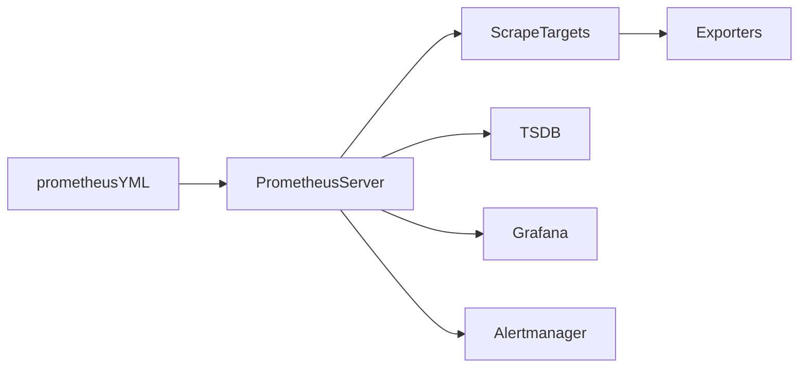

# Installation & Configuration

## Overview

Installing and configuring Prometheus involves downloading the Prometheus server, configuring it through the **`prometheus.yml`** file, defining scrape targets, and starting the monitoring service.

The **`prometheus.yml`** file is the heart of Prometheus configuration. It defines:

- Global settings
- Scrape jobs
- Target endpoints
- Rule files
- Alertmanager configuration

> **Interview Tip**
>
> Nearly every Prometheus interview includes questions about **`prometheus.yml`**, especially **global** and **scrape_configs** sections.

---

## Why It Is Used

Installation and configuration allow you to:

- Deploy Prometheus
- Configure monitoring targets
- Define scrape intervals
- Configure alerting
- Manage monitoring centrally

---

## Architecture / Working



### Working Process

1. Install Prometheus.
2. Configure `prometheus.yml`.
3. Start the Prometheus server.
4. Prometheus reads the configuration.
5. Targets are discovered.
6. Metrics are scraped.
7. Metrics are stored in TSDB.
8. Grafana and Alertmanager consume the collected data.

---

## Key Components

| Component | Purpose |
|-----------|---------|
| Prometheus Server | Monitoring engine |
| prometheus.yml | Main configuration |
| Global Configuration | Default settings |
| Scrape Configuration | Defines monitored targets |
| Rule Files | Alert rules |
| Alertmanager | Alert routing |

---

## Types (if applicable)

Configuration Sections

- Global
- Scrape Configurations
- Rule Files
- Alertmanager
- Remote Storage (optional)

---

## Lifecycle / Workflow


---

## Configuration / Syntax (if applicable)

Basic Configuration

```yaml
global:
  scrape_interval: 15s

scrape_configs:
  - job_name: "prometheus"

    static_configs:
      - targets:
          - localhost:9090
```

---

## Important Commands (if applicable)

Start Prometheus

```bash
prometheus
```

Validate Configuration

```bash
promtool check config prometheus.yml
```

Reload Configuration

```bash
curl -X POST http://localhost:9090/-/reload
```

Check Targets

```
http://localhost:9090/targets
```

---

## Important Files (if applicable)

| File | Purpose |
|------|----------|
| prometheus.yml | Main configuration |
| alert.rules.yml | Alert rules |
| alertmanager.yml | Alertmanager configuration |
| console_libraries/ | Console templates |
| consoles/ | Built-in consoles |

---

## Real-World Use Cases

- Configure Linux monitoring
- Configure Kubernetes monitoring
- Configure cloud monitoring
- Configure application monitoring
- Configure database monitoring

---

## Advantages

- Simple YAML configuration
- Easy to extend
- Dynamic target management
- Flexible scrape intervals

---

## Limitations

- YAML indentation errors are common
- Configuration reload required after changes
- Incorrect scrape intervals can increase server load

---

## Common Interview Questions (Concept Only)

- How is Prometheus installed?
- What is `prometheus.yml`?
- What are global settings?
- What are scrape configurations?
- How do you reload Prometheus configuration?
- How do you validate configuration files?

---

## Common Mistakes

- Incorrect YAML indentation
- Wrong target IP or port
- Forgetting to reload configuration
- Missing exporters
- Incorrect scrape intervals

---

## Troubleshooting

| Problem | Cause | Solution |
|----------|--------|----------|
| Prometheus won't start | Invalid configuration | Validate using `promtool` |
| Target Down | Exporter unavailable | Verify exporter service |
| No metrics | Incorrect scrape target | Verify endpoint |
| Configuration ignored | Reload not performed | Reload Prometheus |
| YAML error | Invalid syntax | Check indentation |

Useful Commands

```bash
promtool check config prometheus.yml

curl http://localhost:9090/api/v1/targets

curl -X POST http://localhost:9090/-/reload
```

---

## Summary

Installing Prometheus involves deploying the server, configuring `prometheus.yml`, defining scrape jobs, validating the configuration, and starting the monitoring service. Proper configuration ensures reliable metric collection and alerting.

---

# Install Prometheus

## Overview

Prometheus can be installed on Linux, Windows, macOS, Docker, or Kubernetes.

In production environments, it is commonly deployed on Linux servers, as a Docker container, or within Kubernetes.

> **Interview Tip**
>
> For interviews, understand **binary installation** and **Docker-based installation**. These are the most frequently discussed deployment methods.

---

## Why It Is Used

Installing Prometheus enables:

- Metric collection
- Monitoring infrastructure
- Alert generation
- Dashboard integration

---

## Architecture / Working


---

## Key Components

| Component | Purpose |
|-----------|---------|
| Prometheus Binary | Monitoring server |
| Configuration | Server settings |
| TSDB | Metric storage |

---

## Types (if applicable)

Installation Methods

- Binary Installation
- Docker
- Kubernetes
- Package Manager

---

## Lifecycle / Workflow


---

## Configuration / Syntax (if applicable)

Download

```bash
wget https://github.com/prometheus/prometheus/releases/latest/download/prometheus-linux-amd64.tar.gz
```

Extract

```bash
tar -xvf prometheus-linux-amd64.tar.gz
```

Run

```bash
./prometheus
```

Docker

```bash
docker run -p 9090:9090 prom/prometheus
```

---

## Important Commands (if applicable)

Check Version

```bash
prometheus --version
```

Start Server

```bash
prometheus
```

---

## Important Files (if applicable)

- prometheus
- prometheus.yml

---

## Real-World Use Cases

- Linux monitoring server
- Docker deployment
- Kubernetes monitoring

---

## Advantages

- Easy installation
- Cross-platform
- Lightweight

---

## Limitations

- Requires configuration after installation

---

## Common Interview Questions (Concept Only)

- How do you install Prometheus?
- Can Prometheus run in Docker?
- Which operating systems support Prometheus?

---

## Common Mistakes

- Wrong binary architecture
- Missing configuration file
- Incorrect working directory

---

## Troubleshooting

| Problem | Cause | Solution |
|----------|--------|----------|
| Command not found | Binary missing from PATH | Add binary to PATH |
| Port already in use | Port 9090 occupied | Use another port |
| Startup failure | Invalid configuration | Validate configuration |

Useful Commands

```bash
prometheus --version

promtool check config prometheus.yml
```

---

## Summary

Prometheus installation is straightforward and supports multiple deployment methods, including binaries, Docker, and Kubernetes.

---

# Configuration File (prometheus.yml)

## Overview

The **`prometheus.yml`** file is the primary configuration file for Prometheus.

It defines how Prometheus behaves, which targets it monitors, and how frequently metrics are collected.

> **Interview Tip**
>
> The **`scrape_configs`** section is the most important part of the configuration file and is asked frequently in interviews.

---

## Why It Is Used

The configuration file is used to:

- Configure scrape jobs
- Define targets
- Configure alerting
- Configure global settings
- Load rule files

---

## Architecture / Working


---

## Key Components

| Section | Purpose |
|----------|---------|
| global | Default settings |
| scrape_configs | Monitoring jobs |
| rule_files | Alert rules |
| alerting | Alertmanager configuration |

---

## Types (if applicable)

Main Sections

- Global
- Scrape Configs
- Rule Files
- Alerting

---

## Lifecycle / Workflow


---

## Configuration / Syntax (if applicable)

```yaml
global:
  scrape_interval: 15s

scrape_configs:
  - job_name: node

    static_configs:
      - targets:
          - localhost:9100
```

---

## Important Commands (if applicable)

```bash
promtool check config prometheus.yml
```

---

## Important Files (if applicable)

- prometheus.yml

---

## Real-World Use Cases

- Configure exporters
- Configure cloud monitoring
- Configure Kubernetes monitoring

---

## Advantages

- Simple YAML format
- Easy maintenance
- Flexible

---

## Limitations

- YAML syntax sensitive
- Manual edits required

---

## Common Interview Questions (Concept Only)

- What is `prometheus.yml`?
- What are its major sections?
- Which section defines targets?

---

## Common Mistakes

- Incorrect indentation
- Wrong target addresses
- Duplicate jobs

---

## Troubleshooting

- Validate configuration
- Check Prometheus logs

---

## Summary

`prometheus.yml` is the central configuration file that controls Prometheus behavior, monitoring jobs, and alerting.

---

# Global Configuration

## Overview

The **Global Configuration** section defines default settings that apply to all scrape jobs unless overridden.

Common settings include:

- Scrape interval
- Evaluation interval
- External labels

---

## Why It Is Used

Global configuration provides consistent defaults across all monitoring jobs.

---

## Architecture / Working


---

## Key Components

| Setting | Purpose |
|----------|---------|
| scrape_interval | Metric collection frequency |
| evaluation_interval | Alert rule evaluation frequency |
| external_labels | Labels added to all metrics |

---

## Types (if applicable)

Common Global Settings

- scrape_interval
- evaluation_interval
- external_labels

---

## Lifecycle / Workflow


---

## Configuration / Syntax (if applicable)

```yaml
global:
  scrape_interval: 15s
  evaluation_interval: 15s
```

---

## Important Commands (if applicable)

```bash
promtool check config prometheus.yml
```

---

## Important Files (if applicable)

prometheus.yml

---

## Real-World Use Cases

- Standardize monitoring intervals
- Multi-cluster labeling
- Centralized configuration

---

## Advantages

- Consistent defaults
- Simplifies configuration

---

## Limitations

- May not suit every scrape job

---

## Common Interview Questions (Concept Only)

- What is `scrape_interval`?
- What is `evaluation_interval`?
- What are external labels?

---

## Common Mistakes

- Extremely short scrape intervals
- Incorrect evaluation intervals

---

## Troubleshooting

- Verify interval values
- Reload configuration

---

## Summary

Global configuration defines default monitoring behavior for all Prometheus jobs.

---

# Scrape Configuration

## Overview

The **`scrape_configs`** section defines **what Prometheus monitors**.

Each monitoring job contains:

- Job name
- Targets
- Scrape interval (optional)
- Labels
- Authentication (optional)

This is the **most important configuration section** in Prometheus.

> **Interview Tip**
>
> Every monitored endpoint is configured through **`scrape_configs`**.

---

## Why It Is Used

Scrape configurations tell Prometheus:

- Which systems to monitor
- Where metrics are located
- How often to collect metrics

---

## Architecture / Working


---

## Key Components

| Component | Purpose |
|-----------|---------|
| job_name | Monitoring job |
| targets | Endpoints |
| static_configs | Static target list |
| scrape_interval | Collection frequency |

---

## Types (if applicable)

Target Discovery

- Static
- Service Discovery
- Kubernetes Discovery

---

## Lifecycle / Workflow


---

## Configuration / Syntax (if applicable)

```yaml
scrape_configs:

  - job_name: "node-exporter"

    static_configs:

      - targets:

          - localhost:9100
```

---

## Important Commands (if applicable)

View Targets

```
http://localhost:9090/targets
```

---

## Important Files (if applicable)

prometheus.yml

---

## Real-World Use Cases

- Linux monitoring
- Docker monitoring
- Kubernetes monitoring
- Database monitoring

---

## Advantages

- Flexible
- Supports multiple discovery methods
- Easy to extend

---

## Limitations

- Incorrect targets result in missing metrics

---

## Common Interview Questions (Concept Only)

- What is `scrape_configs`?
- What is `job_name`?
- What is a scrape target?
- How are multiple targets configured?

---

## Common Mistakes

- Wrong port
- Wrong metrics path
- Duplicate jobs
- Missing exporters

---

## Troubleshooting

| Problem | Cause | Solution |
|----------|--------|----------|
| Target Down | Exporter unavailable | Verify exporter |
| Scrape Failed | Wrong endpoint | Check `/metrics` |
| Missing metrics | Wrong IP or port | Verify targets |

Useful Commands

```bash
curl http://localhost:9090/api/v1/targets
```

---

## Summary

The `scrape_configs` section defines all monitoring jobs, target endpoints, and metric collection settings. It is the most critical part of Prometheus configuration.

---

# Reload Configuration

## Overview

Prometheus supports **hot reloading**, allowing configuration changes to be applied **without restarting the server**.

Reloading causes Prometheus to re-read:

- `prometheus.yml`
- Rule files
- Alerting configuration

This minimizes monitoring downtime when configuration changes are made.

---

## Why It Is Used

Reloading is used to:

- Apply configuration changes
- Load new targets
- Update scrape jobs
- Refresh alert rules

---

## Architecture / Working


---

## Key Components

| Component | Purpose |
|-----------|---------|
| Configuration File | Updated settings |
| Reload API | Applies configuration |
| Prometheus Server | Reloads without restart |

---

## Types (if applicable)

Reload Methods

- HTTP Reload API
- SIGHUP Signal

---

## Lifecycle / Workflow


---

## Configuration / Syntax (if applicable)

Reload Using HTTP API

```bash
curl -X POST http://localhost:9090/-/reload
```

Reload Using Signal

```bash
kill -HUP <prometheus_pid>
```

---

## Important Commands (if applicable)

Validate Configuration

```bash
promtool check config prometheus.yml
```

Reload Configuration

```bash
curl -X POST http://localhost:9090/-/reload
```

Verify Targets

```
http://localhost:9090/targets
```

---

## Important Files (if applicable)

- prometheus.yml
- alert.rules.yml

---

## Real-World Use Cases

- Add new monitoring targets
- Update scrape intervals
- Modify alert rules
- Deploy monitoring changes during production without downtime

---

## Advantages

- No service restart required
- Minimal monitoring interruption
- Faster deployment of configuration changes

---

## Limitations

- Invalid configurations are rejected
- Reload must be triggered after configuration changes

---

## Common Interview Questions (Concept Only)

- How do you reload Prometheus configuration?
- Is a server restart required after editing `prometheus.yml`?
- How do you validate configuration before reloading?

---

## Common Mistakes

- Forgetting to reload after editing configuration
- Reloading an invalid configuration
- Skipping configuration validation

---

## Troubleshooting

| Problem | Cause | Solution |
|----------|--------|----------|
| Reload failed | Invalid YAML | Validate using `promtool` |
| Changes not applied | Reload not triggered | Execute reload command |
| Targets missing | Configuration error | Verify `scrape_configs` |

Useful Commands

```bash
promtool check config prometheus.yml

curl -X POST http://localhost:9090/-/reload

curl http://localhost:9090/api/v1/targets
```

---

## Summary

Prometheus supports hot configuration reloads, allowing administrators to apply changes to monitoring jobs and alert rules without restarting the server. Always validate configuration with `promtool` before performing a reload.
