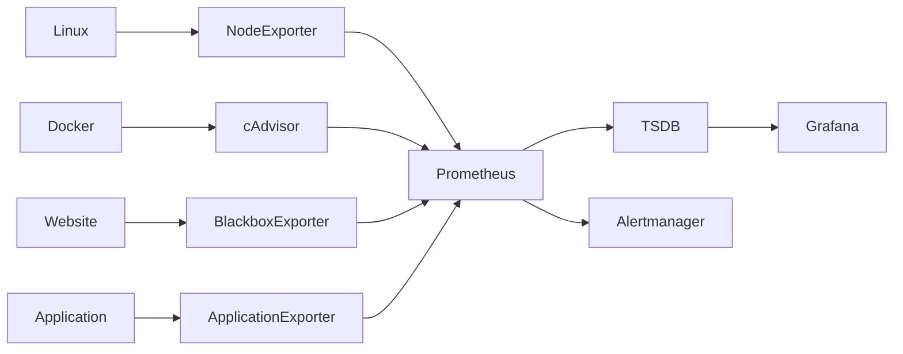
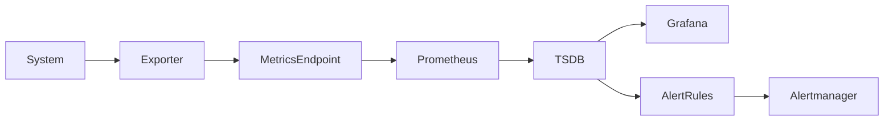
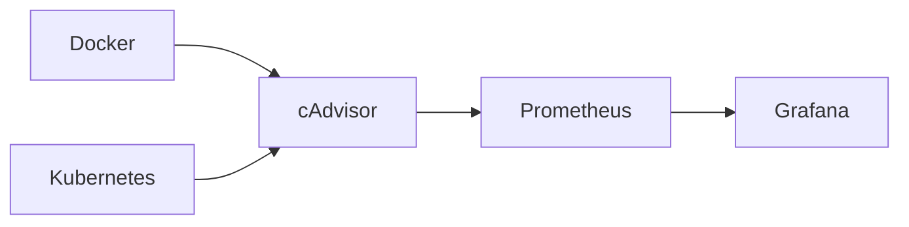
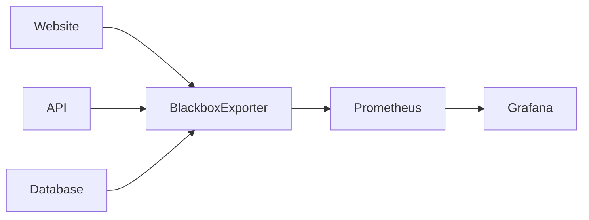
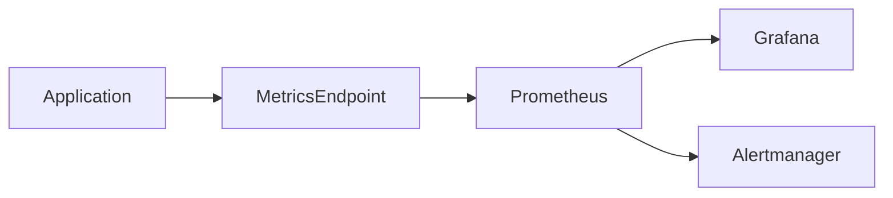

# Exporters

## Overview

Exporters are lightweight applications that collect metrics from systems, applications, or services and expose them in a **Prometheus-compatible format** through an HTTP endpoint (typically `/metrics`).

Prometheus periodically scrapes these endpoints to collect metrics.

Since most operating systems, databases, and applications do not natively expose metrics in Prometheus format, exporters act as a bridge between the monitored system and Prometheus.

> **Interview Tip**
>
> Prometheus generally **does not collect metrics directly** from Linux, Windows, MySQL, or Docker. It scrapes **exporters** running alongside these systems.

---

## Why It Is Used

Exporters are used to:

- Collect infrastructure metrics
- Monitor operating systems
- Monitor containers
- Monitor databases
- Monitor cloud services
- Expose application metrics
- Convert metrics into Prometheus format

---

## Architecture / Working



### Working Process

1. System generates metrics.
2. Exporter collects metrics.
3. Exporter exposes `/metrics`.
4. Prometheus scrapes the exporter.
5. Metrics are stored in TSDB.
6. Grafana visualizes the metrics.
7. Alertmanager generates alerts when required.

---

## Key Components

| Component | Purpose |
|-----------|---------|
| Exporter | Collects and exposes metrics |
| Metrics Endpoint | `/metrics` HTTP endpoint |
| Prometheus Server | Scrapes exporters |
| TSDB | Stores metrics |
| Grafana | Visualizes metrics |
| Alertmanager | Sends alerts |

---

## Types (if applicable)

| Exporter | Monitors |
|----------|-----------|
| Node Exporter | Linux Server |
| Windows Exporter | Windows Server |
| cAdvisor | Containers |
| Blackbox Exporter | HTTP, HTTPS, TCP, ICMP, DNS |
| MySQL Exporter | MySQL |
| PostgreSQL Exporter | PostgreSQL |
| Redis Exporter | Redis |
| MongoDB Exporter | MongoDB |
| Kafka Exporter | Kafka |
| NGINX Exporter | NGINX |
| Apache Exporter | Apache |
| kube-state-metrics | Kubernetes Objects |

---

## Lifecycle / Workflow



---

## Configuration / Syntax (if applicable)

Example Scrape Configuration

```yaml
scrape_configs:
  - job_name: "node-exporter"

    static_configs:
      - targets:
          - localhost:9100
```

---

## Important Commands (if applicable)

Check Exporter Metrics

```bash
curl http://localhost:9100/metrics
```

View Targets

```
http://localhost:9090/targets
```

Validate Configuration

```bash
promtool check config prometheus.yml
```

---

## Important Files (if applicable)

| File | Purpose |
|------|----------|
| prometheus.yml | Configure exporters |
| exporter configuration | Exporter-specific settings |

---

## Real-World Use Cases

- Linux monitoring
- Kubernetes monitoring
- Docker monitoring
- Website availability monitoring
- Database monitoring
- Cloud infrastructure monitoring

---

## Advantages

- Lightweight
- Easy to deploy
- Standard metric format
- Supports hundreds of technologies
- Simple Prometheus integration

---

## Limitations

- Separate exporter required for most systems
- Additional resource consumption
- Incorrect exporter configuration results in missing metrics

---

## Common Interview Questions (Concept Only)

- What is an exporter?
- Why are exporters required?
- Does Prometheus directly monitor Linux?
- Which exporter is used for Docker?
- Which exporter monitors websites?
- Name commonly used Prometheus exporters.

---

## Common Mistakes

- Forgetting to install the exporter
- Wrong scrape port
- Exporter service not running
- Firewall blocking exporter port
- Incorrect scrape configuration

---

## Troubleshooting

| Problem | Cause | Solution |
|----------|--------|----------|
| Target DOWN | Exporter stopped | Restart exporter |
| Connection Refused | Wrong port | Verify exporter port |
| No Metrics | Exporter unavailable | Check exporter service |
| Scrape Failed | Incorrect target | Verify `prometheus.yml` |
| 404 Error | Wrong metrics path | Verify `/metrics` endpoint |

Useful Commands

```bash
curl http://localhost:9100/metrics

systemctl status node_exporter

promtool check config prometheus.yml
```

---

## Summary

Exporters collect metrics from operating systems, applications, containers, and databases, exposing them in a format that Prometheus can scrape. They are the foundation of Prometheus monitoring for most production environments.

---

# Node Exporter

## Overview

Node Exporter is the most widely used Prometheus exporter for monitoring Linux systems.

It exposes hardware and operating system metrics through an HTTP endpoint, usually on port **9100**.

> **Interview Tip**
>
> If asked how to monitor a Linux server with Prometheus, the answer is **Node Exporter**.

---

## Why It Is Used

Node Exporter monitors:

- CPU usage
- Memory usage
- Disk usage
- Disk I/O
- Network traffic
- Filesystem usage
- Load average
- System uptime

---

## Architecture / Working


---

## Key Components

| Component | Purpose |
|-----------|---------|
| Collectors | Gather Linux metrics |
| HTTP Server | Exposes `/metrics` |
| Prometheus | Scrapes metrics |

---

## Types (if applicable)

Common Collectors

- CPU
- Memory
- Filesystem
- Disk
- Network
- System
- Load

---

## Lifecycle / Workflow


---

## Configuration / Syntax (if applicable)

Scrape Configuration

```yaml
scrape_configs:
  - job_name: "node"

    static_configs:
      - targets:
          - server1:9100
```

---

## Important Commands (if applicable)

Start Exporter

```bash
./node_exporter
```

Verify Metrics

```bash
curl http://localhost:9100/metrics
```

---

## Important Files (if applicable)

| File | Purpose |
|------|----------|
| node_exporter | Exporter binary |

---

## Real-World Use Cases

- Linux server monitoring
- Azure VM monitoring
- AWS EC2 monitoring
- Physical server monitoring

---

## Advantages

- Lightweight
- Easy deployment
- Rich Linux metrics

---

## Limitations

- Linux only
- Does not collect application metrics

---

## Common Interview Questions (Concept Only)

- What is Node Exporter?
- Which metrics does it expose?
- Which port does it use?
- Can it monitor Windows?

---

## Common Mistakes

- Firewall blocking port 9100
- Exporter not running
- Wrong scrape target

---

## Troubleshooting

| Problem | Cause | Solution |
|----------|--------|----------|
| No Metrics | Exporter stopped | Start Node Exporter |
| Connection Refused | Port blocked | Open port 9100 |
| Target DOWN | Wrong IP | Verify target configuration |

Useful Commands

```bash
systemctl status node_exporter

curl http://localhost:9100/metrics
```

---

## Summary

Node Exporter exposes Linux operating system metrics and is the standard exporter used for infrastructure monitoring with Prometheus.

---

# cAdvisor

## Overview

cAdvisor (Container Advisor) collects resource usage and performance metrics from running containers.

It is commonly used with Docker and is integrated into Kubernetes through the kubelet.

> **Interview Tip**
>
> Node Exporter monitors the **host**, while cAdvisor monitors **containers**.

---

## Why It Is Used

cAdvisor monitors:

- Container CPU usage
- Memory usage
- Network usage
- Filesystem usage
- Container lifecycle
- Container resource limits

---

## Architecture / Working



---

## Key Components

| Component | Purpose |
|-----------|---------|
| Container Runtime | Provides container information |
| cAdvisor | Collects metrics |
| Prometheus | Scrapes metrics |

---

## Types (if applicable)

Supported Platforms

- Docker
- Kubernetes
- containerd
- CRI-O

---

## Lifecycle / Workflow


---

## Configuration / Syntax (if applicable)

```yaml
scrape_configs:
  - job_name: cadvisor

    static_configs:
      - targets:
          - localhost:8080
```

---

## Important Commands (if applicable)

Docker

```bash
docker run \
  --volume=/:/rootfs:ro \
  --volume=/var/run:/var/run:ro \
  --publish=8080:8080 \
  gcr.io/cadvisor/cadvisor
```

---

## Important Files (if applicable)

No mandatory configuration file for basic deployment.

---

## Real-World Use Cases

- Docker monitoring
- Kubernetes container monitoring
- Resource optimization
- Capacity planning

---

## Advantages

- Container-level metrics
- Kubernetes integration
- Lightweight

---

## Limitations

- Focused only on containers
- Does not replace Node Exporter

---

## Common Interview Questions (Concept Only)

- What is cAdvisor?
- What does it monitor?
- Difference between Node Exporter and cAdvisor?

---

## Common Mistakes

- Assuming cAdvisor monitors the entire OS
- Forgetting to scrape cAdvisor endpoint

---

## Troubleshooting

- Verify cAdvisor container
- Verify port 8080
- Check Prometheus targets

---

## Summary

cAdvisor provides detailed container metrics and complements Node Exporter by monitoring container resource utilization.

---

# Blackbox Exporter

## Overview

Blackbox Exporter monitors services **from the outside**, similar to how an end user experiences them.

Unlike Node Exporter, it does not collect internal system metrics. Instead, it checks availability and response characteristics.

Supported protocols include:

- HTTP
- HTTPS
- TCP
- ICMP (Ping)
- DNS

> **Interview Tip**
>
> Blackbox Exporter is used for **availability monitoring**, not infrastructure monitoring.

---

## Why It Is Used

Blackbox Exporter helps monitor:

- Website availability
- API uptime
- SSL certificate expiry
- TCP services
- DNS resolution
- Ping latency

---

## Architecture / Working



---

## Key Components

| Component | Purpose |
|-----------|---------|
| Probe | Performs health check |
| Module | Defines probe type |
| Metrics Endpoint | Exposes probe results |

---

## Types (if applicable)

Supported Probes

- HTTP
- HTTPS
- TCP
- ICMP
- DNS

---

## Lifecycle / Workflow


---

## Configuration / Syntax (if applicable)

Example Module

```yaml
modules:

  http_2xx:

    prober: http
```

---

## Important Commands (if applicable)

Check Probe

```bash
curl http://localhost:9115/probe?target=https://example.com&module=http_2xx
```

---

## Important Files (if applicable)

| File | Purpose |
|------|----------|
| blackbox.yml | Probe configuration |

---

## Real-World Use Cases

- Website uptime monitoring
- API monitoring
- SSL monitoring
- DNS monitoring

---

## Advantages

- External monitoring
- Multiple protocol support
- Lightweight

---

## Limitations

- Does not provide host-level metrics
- Requires probe configuration

---

## Common Interview Questions (Concept Only)

- What is Blackbox Exporter?
- What protocols does it support?
- Difference between Blackbox Exporter and Node Exporter?

---

## Common Mistakes

- Confusing availability monitoring with system monitoring
- Incorrect probe module configuration

---

## Troubleshooting

- Verify target URL
- Verify probe module
- Check exporter logs

---

## Summary

Blackbox Exporter performs external health checks on websites, APIs, and network services, making it ideal for uptime and availability monitoring.

---

# Application Exporters

## Overview

Application Exporters expose application-specific metrics directly to Prometheus.

Many modern frameworks include Prometheus client libraries that allow applications to publish metrics without requiring a separate exporter.

Examples include:

- Java (Micrometer)
- Spring Boot
- Go
- Python
- Node.js
- .NET

> **Interview Tip**
>
> Applications can expose Prometheus metrics **natively** using client libraries, eliminating the need for an external exporter.

---

## Why It Is Used

Application exporters expose metrics such as:

- Request count
- Request duration
- Error rate
- Active users
- Queue length
- Cache hits
- Database query latency

---

## Architecture / Working



---

## Key Components

| Component | Purpose |
|-----------|---------|
| Client Library | Generates metrics |
| Metrics Endpoint | Exposes `/metrics` |
| Prometheus | Scrapes metrics |

---

## Types (if applicable)

Common Client Libraries

| Language | Library |
|-----------|---------|
| Go | Prometheus Go Client |
| Java | Micrometer / Prometheus Client |
| Python | prometheus_client |
| Node.js | prom-client |
| .NET | prometheus-net |

---

## Lifecycle / Workflow


---

## Configuration / Syntax (if applicable)

Spring Boot Example

```properties
management.endpoints.web.exposure.include=prometheus
```

---

## Important Commands (if applicable)

Verify Metrics

```bash
curl http://localhost:8080/metrics
```

---

## Important Files (if applicable)

Depends on the application framework and Prometheus client library.

---

## Real-World Use Cases

- API monitoring
- Microservice monitoring
- E-commerce applications
- Banking applications
- Cloud-native applications

---

## Advantages

- Business-specific metrics
- Detailed application visibility
- Native Prometheus integration
- Fine-grained monitoring

---

## Limitations

- Requires instrumentation
- Additional development effort
- Poor metric design can increase cardinality

---

## Common Interview Questions (Concept Only)

- What are application exporters?
- How do applications expose Prometheus metrics?
- What metrics are commonly collected from applications?
- Do all applications require a separate exporter?

---

## Common Mistakes

- Exposing too many metrics
- High-cardinality labels
- Missing business metrics
- Not securing metrics endpoints

---

## Troubleshooting

| Problem | Cause | Solution |
|----------|--------|----------|
| No Metrics | Instrumentation missing | Add Prometheus client library |
| Scrape Failure | Wrong endpoint | Verify metrics URL |
| Missing Data | Endpoint unavailable | Check application status |
| Slow Scrapes | Too many metrics | Reduce metric cardinality |

Useful Commands

```bash
curl http://localhost:8080/metrics

curl http://localhost:9090/api/v1/targets
```

---

## Summary

Application Exporters expose application-specific metrics such as request rates, response times, and error counts. By using Prometheus client libraries, applications provide deep operational visibility beyond infrastructure metrics, making them essential for monitoring modern microservices and cloud-native workloads.
