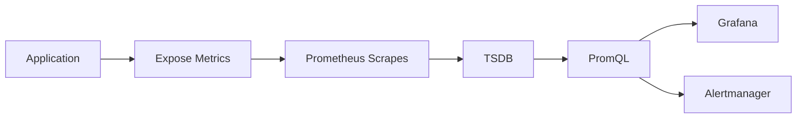

# Application Monitoring

## Overview

Application Monitoring is the process of collecting, storing, analyzing, and visualizing metrics from applications to measure their health, performance, availability, and resource utilization.

Unlike infrastructure monitoring, which focuses on servers and containers, application monitoring focuses on **how the application behaves**.

Prometheus collects application metrics by scraping the application's **`/metrics`** endpoint exposed using Prometheus client libraries.

> **Interview Tip**
>
> Infrastructure monitoring tells you **whether the server is healthy**.
>
> Application monitoring tells you **whether the application is healthy**.

---

## Why It Is Used

Application monitoring helps to:

- Measure application performance
- Detect failures quickly
- Monitor request traffic
- Identify bottlenecks
- Analyze latency
- Track error rates
- Support SRE and DevOps practices
- Improve application reliability

---

## Architecture / Working

```mermaid
flowchart LR

    A[Application]

    B[/metrics Endpoint]

    C[Prometheus]

    D[TSDB]

    E[Grafana]

    F[Alertmanager]

    A --> B
    B --> C
    C --> D
    D --> E
    D --> F
```

### Working Process

1. Application exposes metrics through the `/metrics` endpoint.
2. Prometheus scrapes the metrics at regular intervals.
3. Metrics are stored in the Time-Series Database (TSDB).
4. Grafana visualizes the collected metrics.
5. Alertmanager sends notifications when alert conditions are met.

---

## Key Components

| Component | Purpose |
|-----------|---------|
| Application | Generates metrics |
| Prometheus Client Library | Exposes metrics |
| `/metrics` Endpoint | Metric endpoint |
| Prometheus | Collects metrics |
| Grafana | Visualization |
| Alertmanager | Alerting |

---

## Types (if applicable)

Common Application Metrics

| Category | Examples |
|-----------|-----------|
| HTTP | Requests, Errors, Latency |
| CPU | CPU utilization |
| Memory | Heap usage |
| Disk | Read/Write operations |
| Network | Bytes sent/received |
| Custom Metrics | Business metrics |

---

## Lifecycle / Workflow



---

## Configuration / Syntax (if applicable)

Example Metrics

```text
http_requests_total
```

```text
process_cpu_seconds_total
```

```text
process_resident_memory_bytes
```

Example PromQL

```promql
rate(http_requests_total[5m])
```

---

## Important Commands (if applicable)

Check Metrics Endpoint

```bash
curl http://localhost:8080/metrics
```

Check Prometheus Targets

```
http://localhost:9090/targets
```

Test PromQL

```
http://localhost:9090/graph
```

---

## Important Files (if applicable)

| File | Purpose |
|------|----------|
| prometheus.yml | Scrape configuration |
| alert.rules.yml | Alert rules |

---

## Real-World Use Cases

- Monitor microservices
- API monitoring
- Web application monitoring
- Performance optimization
- SLA/SLO monitoring
- Capacity planning

---

## Advantages

- Real-time monitoring
- Detailed application insights
- Supports custom metrics
- Excellent Grafana integration
- Native Prometheus support

---

## Limitations

- Applications must expose metrics
- Poor metric design increases storage usage
- High-cardinality labels reduce performance

---

## Common Interview Questions (Concept Only)

- What is application monitoring?
- How does Prometheus monitor applications?
- What is the `/metrics` endpoint?
- What types of metrics should applications expose?
- How are custom metrics collected?

---

## Common Mistakes

- Exposing too many metrics
- Using high-cardinality labels
- Ignoring latency metrics
- Not monitoring error rates
- Missing business-specific metrics

---

## Troubleshooting

| Problem | Cause | Solution |
|----------|--------|----------|
| Metrics missing | `/metrics` endpoint unavailable | Verify application |
| Target Down | Scrape configuration incorrect | Check `prometheus.yml` |
| Empty dashboard | Incorrect PromQL | Validate queries |
| Missing alerts | Alert rules not loaded | Reload Prometheus |

Useful Commands

```bash
curl http://localhost:8080/metrics

curl http://localhost:9090/api/v1/targets
```

---

## Summary

Application monitoring provides deep visibility into application performance, availability, and behavior by exposing metrics through the `/metrics` endpoint. Prometheus collects these metrics, Grafana visualizes them, and Alertmanager generates notifications.

---

# Application Metrics

## Overview

Application Metrics are numerical measurements that describe the performance, health, and behavior of an application.

These metrics help engineers understand how an application performs under different workloads.

> **Interview Tip**
>
> Good application monitoring includes both **system metrics** (CPU, Memory) and **business metrics** (orders processed, users logged in).

---

## Why It Is Used

Application metrics help measure:

- Application availability
- Request volume
- Error rate
- Latency
- Throughput
- Resource usage
- Business transactions

---

## Architecture / Working


---

## Key Components

| Component | Purpose |
|-----------|---------|
| Counter | Increasing values |
| Gauge | Current values |
| Histogram | Latency distribution |
| Summary | Quantiles |

---

## Types (if applicable)

Common Metrics

- HTTP requests
- Error count
- Active users
- Database queries
- Queue length
- Custom business metrics

---

## Lifecycle / Workflow


---

## Configuration / Syntax (if applicable)

Example

```promql
http_requests_total
```

---

## Important Commands (if applicable)

```bash
curl http://localhost:8080/metrics
```

---

## Important Files (if applicable)

prometheus.yml

---

## Real-World Use Cases

- API monitoring
- Business KPI monitoring
- User activity monitoring

---

## Advantages

- Detailed application visibility
- Custom monitoring

---

## Limitations

- Requires instrumentation

---

## Common Interview Questions (Concept Only)

- What are application metrics?
- Which metrics should every application expose?

---

## Common Mistakes

- Monitoring infrastructure only
- Ignoring business metrics

---

## Troubleshooting

- Verify instrumentation
- Validate `/metrics`

---

## Summary

Application metrics provide measurable insights into application performance, availability, and business operations.

---

# HTTP Metrics

## Overview

HTTP metrics measure the performance and behavior of web applications and REST APIs.

These metrics are among the most commonly monitored application metrics.

> **Interview Tip**
>
> The four most important HTTP metrics are:
>
> - Request Rate
> - Error Rate
> - Response Time (Latency)
> - Throughput

---

## Why It Is Used

HTTP metrics help identify:

- Slow APIs
- High traffic
- Failed requests
- Performance degradation
- Availability issues

---

## Architecture / Working

```mermaid
flowchart LR

    Client --> Application --> HTTP Metrics --> Prometheus --> Grafana
```

---

## Key Components

| Metric | Purpose |
|---------|----------|
| Requests | Total traffic |
| Errors | Failed requests |
| Latency | Response time |
| Status Codes | HTTP response distribution |

---

## Types (if applicable)

Common HTTP Metrics

- Request count
- Request rate
- Response latency
- 2xx responses
- 4xx responses
- 5xx responses

---

## Lifecycle / Workflow


---

## Configuration / Syntax (if applicable)

Request Rate

```promql
rate(http_requests_total[5m])
```

5xx Errors

```promql
rate(http_requests_total{status=~"5.."}[5m])
```

Latency

```promql
histogram_quantile(
0.95,
sum(rate(http_request_duration_seconds_bucket[5m])) by (le)
)
```

---

## Important Commands (if applicable)

```bash
curl http://localhost:8080/metrics
```

---

## Important Files (if applicable)

prometheus.yml

---

## Real-World Use Cases

- API monitoring
- Microservices monitoring
- Web application monitoring

---

## Advantages

- Measures user experience
- Detects failures quickly

---

## Limitations

- Requires application instrumentation

---

## Common Interview Questions (Concept Only)

- Which HTTP metrics are most important?
- What is request rate?
- How is latency measured?

---

## Common Mistakes

- Monitoring request count only
- Ignoring latency percentiles

---

## Troubleshooting

- Verify metrics endpoint
- Check HTTP instrumentation

---

## Summary

HTTP metrics provide visibility into API performance, availability, and user experience.

---

# CPU Metrics

## Overview

CPU metrics measure processor utilization by an application or process.

They help identify CPU-intensive workloads and performance bottlenecks.

---

## Why It Is Used

CPU monitoring helps:

- Detect high CPU usage
- Identify inefficient code
- Optimize application performance
- Prevent resource exhaustion

---

## Architecture / Working

```mermaid
flowchart LR

    Application --> CPU Metrics --> Prometheus --> Grafana
```

---

## Key Components

| Metric | Purpose |
|---------|----------|
| CPU Time | Processor usage |
| CPU Utilization | Percentage of CPU used |

---

## Types (if applicable)

Common Metrics

- CPU seconds
- CPU utilization
- CPU load

---

## Lifecycle / Workflow

```mermaid
flowchart LR

    Process --> CPU Metric --> Prometheus
```

---

## Configuration / Syntax (if applicable)

```promql
process_cpu_seconds_total
```

```promql
rate(process_cpu_seconds_total[5m])
```

---

## Important Commands (if applicable)

```bash
top

htop
```

---

## Important Files (if applicable)

None

---

## Real-World Use Cases

- Performance tuning
- Capacity planning

---

## Advantages

- Detects bottlenecks
- Supports scaling decisions

---

## Limitations

- High CPU does not always indicate application issues

---

## Common Interview Questions (Concept Only)

- Which metric measures CPU usage?
- How do you monitor CPU with Prometheus?

---

## Common Mistakes

- Confusing CPU time with CPU percentage

---

## Troubleshooting

- Verify exporter
- Validate PromQL

---

## Summary

CPU metrics help monitor application processor usage and identify performance bottlenecks.

---

# Memory Metrics

## Overview

Memory metrics measure RAM usage by an application.

They help detect memory leaks and excessive memory consumption.

---

## Why It Is Used

Memory monitoring helps:

- Detect leaks
- Prevent Out Of Memory (OOM) errors
- Optimize resource usage

---

## Architecture / Working

```mermaid
flowchart LR

    Application --> Memory Metrics --> Prometheus --> Grafana
```

---

## Key Components

| Metric | Purpose |
|---------|----------|
| Heap Memory | Application heap |
| Resident Memory | Physical RAM |
| Virtual Memory | Allocated memory |

---

## Types (if applicable)

- Heap
- Resident
- Virtual

---

## Lifecycle / Workflow

```mermaid
flowchart LR

    Process --> Memory Metric --> Prometheus
```

---

## Configuration / Syntax (if applicable)

```promql
process_resident_memory_bytes
```

---

## Important Commands (if applicable)

```bash
free -h

top
```

---

## Important Files (if applicable)

None

---

## Real-World Use Cases

- Memory leak detection
- Capacity planning

---

## Advantages

- Prevents OOM crashes

---

## Limitations

- Memory spikes may be temporary

---

## Common Interview Questions (Concept Only)

- Which metric measures memory usage?
- How do you detect memory leaks?

---

## Common Mistakes

- Ignoring increasing memory trends

---

## Troubleshooting

- Compare memory usage over time
- Verify application limits

---

## Summary

Memory metrics help ensure applications use memory efficiently and remain stable under load.

---

# Disk Metrics

## Overview

Disk metrics measure filesystem usage and disk I/O performed by applications.

---

## Why It Is Used

Disk monitoring helps detect:

- Full disks
- High disk usage
- Slow storage
- Heavy I/O workloads

---

## Architecture / Working

```mermaid
flowchart LR

    Application --> Disk Metrics --> Prometheus --> Grafana
```

---

## Key Components

| Metric | Purpose |
|---------|----------|
| Disk Usage | Storage consumed |
| Read Operations | Disk reads |
| Write Operations | Disk writes |

---

## Types (if applicable)

- Disk space
- Read IOPS
- Write IOPS
- Filesystem utilization

---

## Lifecycle / Workflow


---

## Configuration / Syntax (if applicable)

```promql
process_open_fds
```

Node-level disk usage (via Node Exporter):

```promql
node_filesystem_avail_bytes
```

---

## Important Commands (if applicable)

```bash
df -h

du -sh *
```

---

## Important Files (if applicable)

None

---

## Real-World Use Cases

- Disk capacity monitoring
- Storage planning

---

## Advantages

- Prevents storage failures

---

## Limitations

- Application metrics alone may not expose all disk information

---

## Common Interview Questions (Concept Only)

- Which metrics monitor disk usage?
- How do you detect full filesystems?

---

## Common Mistakes

- Ignoring filesystem utilization

---

## Troubleshooting

- Check disk usage
- Verify Node Exporter metrics

---

## Summary

Disk metrics help monitor storage utilization and detect filesystem issues before they impact applications.

---

# Network Metrics

## Overview

Network metrics measure data transferred between applications, services, and external systems.

These metrics help identify networking bottlenecks, connectivity issues, and traffic patterns.

---

## Why It Is Used

Network monitoring helps:

- Detect packet loss
- Measure bandwidth usage
- Analyze network latency
- Identify traffic spikes
- Troubleshoot connectivity problems

---

## Architecture / Working

```mermaid
flowchart LR

    Application --> Network Metrics --> Prometheus --> Grafana
```

---

## Key Components

| Metric | Purpose |
|---------|----------|
| Bytes Sent | Outgoing traffic |
| Bytes Received | Incoming traffic |
| Connections | Active sessions |
| Errors | Network failures |

---

## Types (if applicable)

Common Network Metrics

- Network throughput
- Bytes transmitted
- Bytes received
- Active connections
- Packet errors
- Connection failures

---

## Lifecycle / Workflow


---

## Configuration / Syntax (if applicable)

Application network metrics vary by client library.

Node-level metrics (Node Exporter):

```promql
rate(node_network_receive_bytes_total[5m])
```

```promql
rate(node_network_transmit_bytes_total[5m])
```

Container-level metrics (cAdvisor):

```promql
rate(container_network_receive_bytes_total[5m])
```

```promql
rate(container_network_transmit_bytes_total[5m])
```

---

## Important Commands (if applicable)

```bash
ss -tuln

netstat -tuln

ip addr
```

---

## Important Files (if applicable)

None

---

## Real-World Use Cases

- API traffic monitoring
- Microservices communication
- Network capacity planning
- Detecting abnormal traffic spikes

---

## Advantages

- Improves network visibility
- Helps troubleshoot communication issues
- Supports capacity planning

---

## Limitations

- Application metrics may not expose all network details
- Requires Node Exporter or cAdvisor for infrastructure-level network metrics

---

## Common Interview Questions (Concept Only)

- Which metrics measure network traffic?
- How do you monitor network throughput?
- What is the difference between application and infrastructure network metrics?

---

## Common Mistakes

- Monitoring only bandwidth
- Ignoring connection failures
- Not monitoring packet errors

---

## Troubleshooting

| Problem | Cause | Solution |
|----------|--------|----------|
| No network metrics | Exporter unavailable | Verify Node Exporter or cAdvisor |
| Unexpected traffic | Traffic spike | Analyze PromQL and application logs |
| Missing dashboard data | Incorrect query | Validate PromQL in Prometheus |

Useful Commands

```bash
ss -tuln

ip addr

curl http://localhost:9100/metrics
```

---

## Summary

Network metrics provide visibility into application communication, bandwidth usage, and connectivity. Combined with HTTP, CPU, memory, and disk metrics, they offer a complete view of application performance and health.
