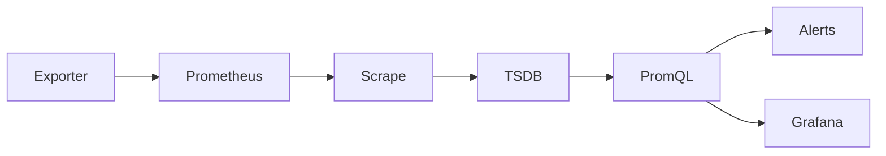
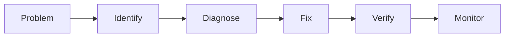
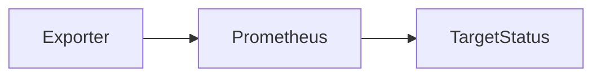
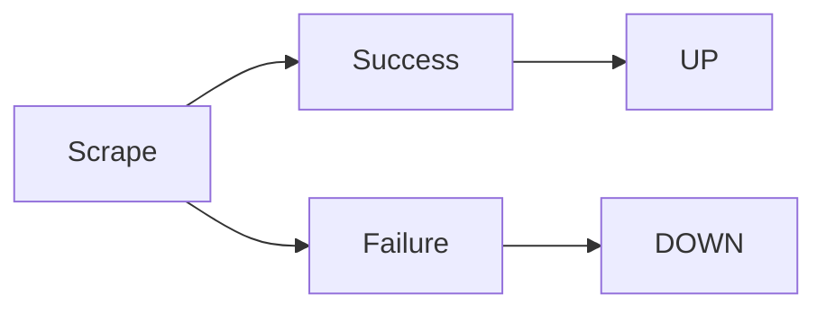
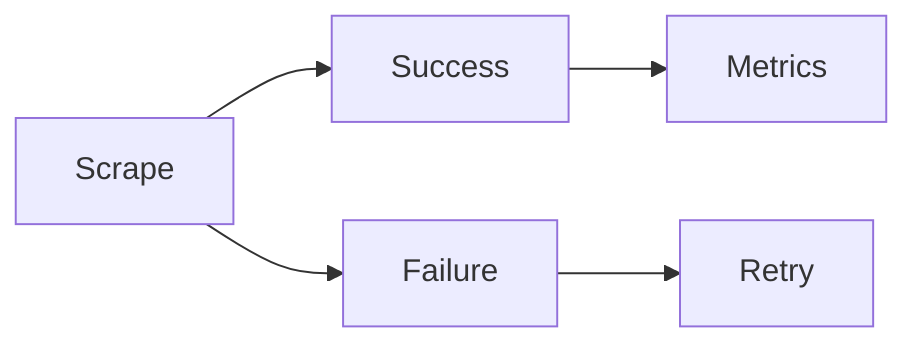
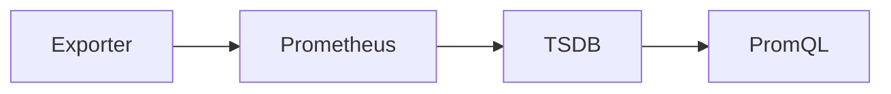

# Troubleshooting

## Overview

Troubleshooting in Prometheus involves identifying and resolving issues that prevent metrics from being collected, stored, queried, or used for alerting.

The most common production issues include:

- Target Down
- Scrape Failures
- Missing Metrics
- Configuration Errors
- Alert Rule Issues
- Exporter Failures

> **Interview Tip**
>
> When Prometheus monitoring stops working, troubleshoot in this order:
>
> **Target → Exporter → Network → Configuration → Metrics → Rules → Alerts**

---

## Why It Is Used

Troubleshooting helps to:

- Restore monitoring
- Identify infrastructure issues
- Fix alerting problems
- Verify exporter health
- Ensure accurate dashboards
- Reduce monitoring downtime

---

## Architecture / Working



### Troubleshooting Flow

1. Verify the exporter is running.
2. Check target status in Prometheus.
3. Verify scraping is successful.
4. Confirm metrics exist in TSDB.
5. Test PromQL queries.
6. Validate alert rules.
7. Verify Alertmanager delivery.

---

## Key Components

| Component | Purpose |
|-----------|---------|
| Targets | Scrape endpoints |
| Exporters | Expose metrics |
| Prometheus | Collects metrics |
| TSDB | Stores metrics |
| PromQL | Queries metrics |
| Alert Rules | Generate alerts |
| Alertmanager | Sends notifications |

---

## Types (if applicable)

Common Production Issues

| Issue | Description |
|--------|-------------|
| Target Down | Endpoint unreachable |
| Scrape Failure | Prometheus cannot scrape metrics |
| Missing Metrics | Metrics unavailable in TSDB |
| Configuration Error | Invalid configuration |
| Alert Rule Issue | Alert not firing correctly |
| Exporter Issue | Exporter unavailable or misconfigured |

---

## Lifecycle / Workflow



---

## Configuration / Syntax (if applicable)

Validate Configuration

```bash
promtool check config prometheus.yml
```

Validate Rules

```bash
promtool check rules rules.yml
```

Reload Configuration

```bash
curl -X POST http://localhost:9090/-/reload
```

---

## Important Commands (if applicable)

| Command | Purpose |
|----------|---------|
| `promtool check config prometheus.yml` | Validate configuration |
| `promtool check rules rules.yml` | Validate rule files |
| `curl http://localhost:9090/api/v1/targets` | Check targets |
| `curl http://localhost:9090/api/v1/query?query=up` | Verify metrics |
| `curl -X POST http://localhost:9090/-/reload` | Reload configuration |

---

## Important Files (if applicable)

| File | Purpose |
|------|----------|
| prometheus.yml | Main configuration |
| rules.yml | Recording and alert rules |
| alertmanager.yml | Alertmanager configuration |

---

## Real-World Use Cases

- Exporter unavailable
- Kubernetes node not monitored
- Missing application metrics
- Alert not firing
- Incorrect scrape configuration
- Grafana showing "No Data"

---

## Advantages

- Faster root cause analysis
- Reduced monitoring downtime
- Reliable alerting
- Improved observability

---

## Limitations

- Requires understanding of Prometheus architecture
- Multiple components may contribute to failures

---

## Common Interview Questions (Concept Only)

- How do you troubleshoot Prometheus?
- What is the first thing to check when metrics are missing?
- How do you validate Prometheus configuration?
- Which tool validates alert rules?
- How do you verify scrape targets?

---

## Common Mistakes

- Ignoring the Targets page
- Reloading invalid configurations
- Not validating rule files
- Forgetting to verify exporters
- Troubleshooting dashboards before checking metrics

---

## Troubleshooting

| Issue | Cause | Solution |
|--------|--------|----------|
| No metrics | Exporter unavailable | Verify exporter |
| Dashboard empty | Query issue | Test PromQL |
| Alerts missing | Rule issue | Validate rules |
| Scrape failed | Network or exporter | Check endpoint |
| Configuration error | Invalid YAML | Validate with `promtool` |

---

## Summary

Prometheus troubleshooting should follow a structured approach: verify exporters, confirm targets are UP, validate scraping, check metrics, test PromQL queries, and finally verify alert rules and notifications.

---

# Target Down

## Overview

A **Target Down** status indicates that Prometheus cannot successfully scrape a configured target.

The target appears as **DOWN** on the **Status → Targets** page.

> **Interview Tip**
>
> The `up` metric is the quickest way to verify target health:
>
> - `1` → Target is UP
> - `0` → Target is DOWN

---

## Why It Is Used

Checking target status helps identify:

- Exporter failures
- Network connectivity issues
- Incorrect target configuration
- Firewall problems
- Service outages

---

## Architecture / Working



---

## Key Components

| Component | Purpose |
|-----------|---------|
| Exporter | Exposes metrics |
| Target | Scrape endpoint |
| Job | Scrape configuration |
| up Metric | Indicates scrape success |

---

## Types (if applicable)

Target States

| State | Meaning |
|--------|---------|
| UP | Scrape successful |
| DOWN | Scrape failed |

---

## Lifecycle / Workflow



---

## Configuration / Syntax (if applicable)

PromQL

```promql
up
```

View Targets

```
http://localhost:9090/targets
```

---

## Important Commands (if applicable)

```bash
curl http://localhost:9090/api/v1/targets

curl http://localhost:9090/api/v1/query?query=up
```

---

## Important Files (if applicable)

prometheus.yml

---

## Real-World Use Cases

- Node Exporter stopped
- Kubernetes Pod unavailable
- Firewall blocking metrics port

---

## Advantages

- Immediate health visibility
- Easy troubleshooting

---

## Limitations

- Indicates scrape status only
- Does not explain the root cause

---

## Common Interview Questions (Concept Only)

- What does Target Down mean?
- Which metric indicates target health?
- Where can you view targets?

---

## Common Mistakes

- Assuming Prometheus is down instead of checking the exporter
- Ignoring scrape error messages

---

## Troubleshooting

| Problem | Cause | Solution |
|----------|--------|----------|
| DOWN | Exporter stopped | Restart exporter |
| DOWN | Firewall | Open scrape port |
| DOWN | Incorrect endpoint | Verify target address |
| DOWN | DNS issue | Check hostname resolution |

Useful Commands

```bash
curl http://localhost:9090/api/v1/targets

curl http://localhost:9100/metrics
```

---

## Summary

A Target Down status indicates that Prometheus cannot successfully scrape a configured endpoint. Always verify the exporter, network connectivity, and target configuration first.

---

# Scrape Failures

## Overview

A scrape failure occurs when Prometheus cannot retrieve metrics from a target during a scrape interval.

The target may remain DOWN or experience intermittent failures.

---

## Why It Is Used

Troubleshooting scrape failures ensures:

- Continuous monitoring
- Accurate metrics
- Reliable alerting

---

## Architecture / Working


---

## Key Components

| Component | Purpose |
|-----------|---------|
| Scrape Job | Collect metrics |
| Scrape Interval | Frequency |
| Scrape Timeout | Maximum wait time |

---

## Types (if applicable)

Common Causes

- Network timeout
- Exporter unavailable
- Invalid endpoint
- Authentication failure

---

## Lifecycle / Workflow



---

## Configuration / Syntax (if applicable)

```yaml
scrape_interval: 15s

scrape_timeout: 10s
```

---

## Important Commands (if applicable)

```bash
curl http://localhost:9100/metrics
```

---

## Important Files (if applicable)

prometheus.yml

---

## Real-World Use Cases

- Node Exporter timeout
- Kubernetes service unavailable
- Slow application endpoint

---

## Advantages

- Early failure detection

---

## Limitations

- Network latency may cause intermittent failures

---

## Common Interview Questions (Concept Only)

- What causes scrape failures?
- What is scrape timeout?

---

## Common Mistakes

- Timeout shorter than exporter response time

---

## Troubleshooting

- Verify endpoint accessibility
- Increase scrape timeout if appropriate
- Check exporter logs
- Verify firewall rules

---

## Summary

Scrape failures occur when Prometheus cannot retrieve metrics. The most common causes are exporter, network, timeout, and configuration issues.

---

# Missing Metrics

## Overview

Missing metrics occur when expected metrics are absent from Prometheus, dashboards, or queries.

---

## Why It Is Used

Troubleshooting missing metrics ensures accurate monitoring and alerting.

---

## Architecture / Working



---

## Key Components

| Component | Purpose |
|-----------|---------|
| Exporter | Generates metrics |
| TSDB | Stores metrics |
| PromQL | Retrieves metrics |

---

## Types (if applicable)

Common Causes

- Exporter not running
- Target DOWN
- Incorrect metric name
- Incorrect PromQL
- Scrape failure

---

## Lifecycle / Workflow


---

## Configuration / Syntax (if applicable)

Verify

```promql
up
```

Search Metric

```promql
node_cpu_seconds_total
```

---

## Important Commands (if applicable)

```bash
curl http://localhost:9100/metrics
```

---

## Important Files (if applicable)

prometheus.yml

---

## Real-World Use Cases

- New exporter
- Kubernetes metrics missing
- Application instrumentation issue

---

## Advantages

- Quick verification

---

## Limitations

- Depends on exporter health

---

## Common Interview Questions (Concept Only)

- Why are metrics missing?
- How do you verify metrics?

---

## Common Mistakes

- Querying incorrect metric names

---

## Troubleshooting

- Verify exporter
- Check Targets page
- Test metric endpoint
- Verify PromQL

---

## Summary

Missing metrics are typically caused by exporter, scraping, configuration, or query issues.

---

# Configuration Errors

## Overview

Configuration errors occur when `prometheus.yml` or rule files contain invalid syntax or unsupported settings.

These errors may prevent Prometheus from starting or reloading successfully.

---

## Why It Is Used

Configuration validation prevents monitoring outages.

---

## Architecture / Working


---

## Key Components

| Component | Purpose |
|-----------|---------|
| YAML | Configuration format |
| Promtool | Validation tool |
| Prometheus | Loads configuration |

---

## Types (if applicable)

Common Errors

- YAML syntax
- Invalid PromQL
- Missing fields
- Incorrect indentation

---

## Lifecycle / Workflow


---

## Configuration / Syntax (if applicable)

```bash
promtool check config prometheus.yml
```

---

## Important Commands (if applicable)

```bash
promtool check config prometheus.yml
```

---

## Important Files (if applicable)

- prometheus.yml
- rules.yml

---

## Real-World Use Cases

- Adding scrape jobs
- Updating exporters
- Configuring alerts

---

## Advantages

- Prevents runtime failures

---

## Limitations

- Validation cannot detect every logical error

---

## Common Interview Questions (Concept Only)

- How do you validate Prometheus configuration?
- Which tool validates configuration?

---

## Common Mistakes

- Incorrect YAML indentation
- Invalid PromQL

---

## Troubleshooting

- Run `promtool`
- Check logs
- Review YAML syntax

---

## Summary

Always validate Prometheus configuration before reloading or restarting the server.

---

# Alert Rule Issues

## Overview

Alert Rule issues occur when alerts fail to fire, remain pending, or trigger unexpectedly due to incorrect PromQL expressions, thresholds, labels, or configuration.

---

## Why It Is Used

Troubleshooting alert rules ensures reliable alert generation.

---

## Architecture / Working


---

## Key Components

| Component | Purpose |
|-----------|---------|
| Alert Rule | Defines alert |
| PromQL | Alert condition |
| Alertmanager | Sends notifications |

---

## Types (if applicable)

Common Issues

- Invalid PromQL
- Incorrect thresholds
- Missing metrics
- Rule not loaded

---

## Lifecycle /Workflow


---

## Configuration / Syntax (if applicable)

Validate Rules

```bash
promtool check rules rules.yml
```

---

## Important Commands (if applicable)

```bash
promtool check rules rules.yml
```

---

## Important Files (if applicable)

rules.yml

---

## Real-World Use Cases

- CPU alerts
- Memory alerts
- Application health alerts

---

## Advantages

- Reliable incident detection

---

## Limitations

- Depends on valid metrics and queries

---

## Common Interview Questions (Concept Only)

- Why is an alert not firing?
- How do you validate alert rules?

---

## Common Mistakes

- Incorrect thresholds
- Invalid PromQL
- Forgetting to reload rules

---

## Troubleshooting

- Validate rules
- Test PromQL manually
- Verify metrics
- Check Alertmanager connectivity

---

## Summary

Most alert issues are caused by invalid PromQL, incorrect thresholds, missing metrics, or configuration errors.

---

# Exporter Issues

## Overview

Exporter issues occur when exporters fail to expose metrics or cannot be reached by Prometheus.

Examples include:

- Node Exporter
- cAdvisor
- Blackbox Exporter
- Application Exporters

---

## Why It Is Used

Exporter troubleshooting ensures metrics are available for monitoring.

---

## Architecture / Working

```mermaid
flowchart LR

    Exporter --> Metrics Endpoint --> Prometheus
```

---

## Key Components

| Component | Purpose |
|-----------|---------|
| Exporter | Exposes metrics |
| Metrics Endpoint | `/metrics` endpoint |
| Prometheus | Scrapes metrics |

---

## Types (if applicable)

Common Problems

- Exporter stopped
- Wrong port
- Firewall
- Permission issue
- High resource usage

---

## Lifecycle / Workflow


---

## Configuration / Syntax (if applicable)

Verify Endpoint

```bash
curl http://localhost:9100/metrics
```

---

## Important Commands (if applicable)

```bash
curl http://localhost:9100/metrics

systemctl status node_exporter
```

---

## Important Files (if applicable)

Exporter service configuration files

---

## Real-World Use Cases

- Node Exporter unavailable
- Kubernetes exporter failure
- Application exporter crash

---

## Advantages

- Easy verification through `/metrics`
- Independent troubleshooting

---

## Limitations

- Exporter failure results in missing metrics

---

## Common Interview Questions (Concept Only)

- How do you troubleshoot exporter issues?
- How do you verify an exporter is working?
- Which endpoint exposes metrics?

---

## Common Mistakes

- Wrong exporter port
- Firewall blocking access
- Exporter not started
- Incorrect scrape target

---

## Troubleshooting

| Problem | Cause | Solution |
|----------|--------|----------|
| No metrics | Exporter stopped | Start exporter |
| Connection refused | Wrong port or service down | Verify service and port |
| Target DOWN | Network issue | Check connectivity |
| Empty metrics | Exporter misconfigured | Review exporter configuration |

Useful Commands

```bash
curl http://localhost:9100/metrics

systemctl status node_exporter

journalctl -u node_exporter
```

---

## Summary

Exporter issues are among the most common Prometheus problems. Verify that the exporter is running, the `/metrics` endpoint is reachable, the correct port is configured, and Prometheus can successfully scrape the target.
