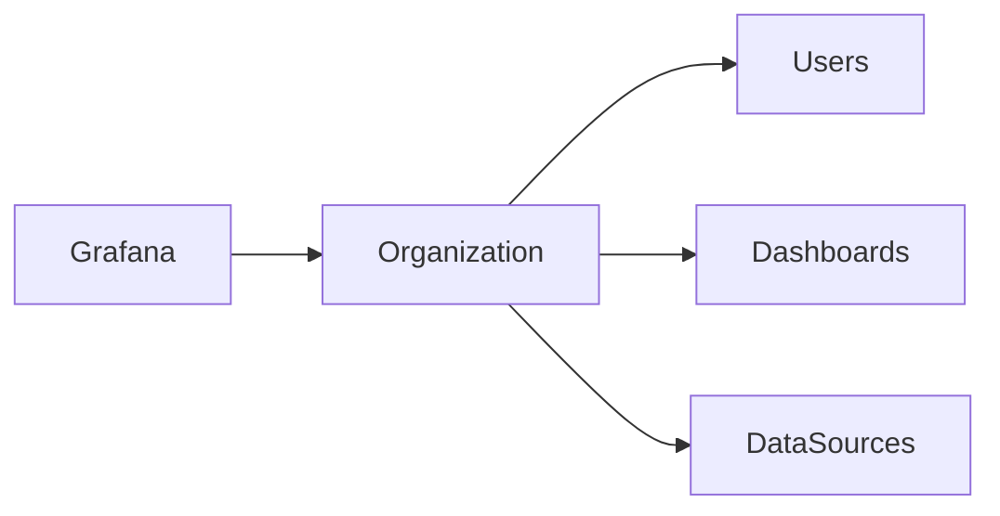

# Installation & Configuration

## Overview

Grafana installation and configuration involve deploying the Grafana server, performing the initial setup, configuring user authentication, creating organizations, and connecting data sources.

Grafana is lightweight and can be installed on Linux, Windows, Docker, Kubernetes, and major cloud platforms.

> **Interview Tip**
>
> - Default Grafana Port: **3000**
> - Default Username: **admin**
> - Default Password: **admin** (must be changed after first login)

---

## Why It Is Used

Installing and configuring Grafana allows you to:

- Visualize monitoring data
- Create dashboards
- Connect multiple data sources
- Manage users and organizations
- Configure authentication
- Enable monitoring for production environments

---

## Architecture / Working


### Working Process

1. Install Grafana.
2. Start the Grafana service.
3. Log in using the default administrator account.
4. Change the default password.
5. Configure organizations and users.
6. Add data sources.
7. Create dashboards.

---

## Key Components

| Component | Purpose |
|-----------|---------|
| Grafana Server | Visualization platform |
| grafana.ini | Main configuration file |
| Organization | Logical separation of users and dashboards |
| User | Authenticated Grafana user |
| Data Source | Provides monitoring data |
| Dashboard | Displays visualizations |

---

## Types (if applicable)

Common Installation Methods

| Method | Usage |
|----------|------|
| Linux Package | Production servers |
| Docker | Containers |
| Kubernetes | Cloud-native deployments |
| Windows Installer | Development |
| Grafana Cloud | Managed service |

---

## Lifecycle / Workflow


---

## Configuration / Syntax (if applicable)

Default URL

```
http://localhost:3000
```

Configuration File

```
/etc/grafana/grafana.ini
```

Change Listening Port

```ini
[server]

http_port = 3000
```

Change Admin User

```ini
[security]

admin_user = admin
```

---

## Important Commands (if applicable)

Ubuntu Installation

```bash
sudo apt update

sudo apt install grafana
```

Start Grafana

```bash
sudo systemctl start grafana-server
```

Enable at Boot

```bash
sudo systemctl enable grafana-server
```

Restart Grafana

```bash
sudo systemctl restart grafana-server
```

Check Status

```bash
sudo systemctl status grafana-server
```

Check Version

```bash
grafana-server -v
```

---

## Important Files (if applicable)

| File | Purpose |
|------|----------|
| /etc/grafana/grafana.ini | Main configuration |
| /var/log/grafana/ | Grafana logs |
| /var/lib/grafana/ | Grafana database and plugins |
| provisioning/ | Automated configuration |

---

## Real-World Use Cases

- Installing Grafana on monitoring servers
- Connecting Prometheus as a data source
- Setting up production dashboards
- Multi-team monitoring
- Cloud monitoring

---

## Advantages

- Quick installation
- Simple configuration
- Multiple deployment options
- Easy integration with monitoring tools

---

## Limitations

- Requires external data sources
- Default credentials must be changed
- Incorrect configuration may prevent startup

---

## Common Interview Questions (Concept Only)

- Which port does Grafana use by default?
- Where is the Grafana configuration file located?
- How do you start Grafana?
- Which command checks Grafana service status?
- Does Grafana require a database?

---

## Common Mistakes

- Leaving default administrator password unchanged
- Forgetting to enable the Grafana service
- Incorrect data source configuration
- Editing configuration without restarting Grafana

---

## Troubleshooting

| Problem | Cause | Solution |
|----------|--------|----------|
| Grafana not accessible | Service stopped | Start Grafana service |
| Login failed | Incorrect password | Reset admin password |
| Configuration ignored | Service not restarted | Restart Grafana |
| Port already in use | Port conflict | Change `http_port` |

Useful Commands

```bash
sudo systemctl status grafana-server

sudo journalctl -u grafana-server

sudo systemctl restart grafana-server
```

---

## Summary

Grafana installation involves deploying the server, configuring the service, securing the administrator account, adding data sources, and creating dashboards for monitoring infrastructure and applications.

---

# Install Grafana

## Overview

Grafana can be installed using operating system packages, Docker containers, Kubernetes manifests, or Grafana Cloud.

Linux package installation is the most common method used in production.

---

## Why It Is Used

Installation provides the Grafana server that hosts dashboards, users, alerts, and visualization services.

---

## Architecture / Working


---

## Key Components

| Component | Purpose |
|-----------|---------|
| Package | Installation files |
| Service | Runs Grafana |
| Web UI | User interface |

---

## Types (if applicable)

Installation Methods

- APT
- YUM
- Docker
- Kubernetes
- Grafana Cloud

---

## Lifecycle / Workflow


---

## Configuration / Syntax (if applicable)

Ubuntu

```bash
sudo apt update

sudo apt install grafana
```

---

## Important Commands (if applicable)

```bash
sudo systemctl start grafana-server

sudo systemctl enable grafana-server

grafana-server -v
```

---

## Important Files (if applicable)

```
/etc/grafana/grafana.ini
```

---

## Real-World Use Cases

- Monitoring servers
- Kubernetes monitoring
- Production monitoring

---

## Advantages

- Easy installation
- Cross-platform support

---

## Limitations

- Requires administrator privileges

---

## Common Interview Questions (Concept Only)

- How do you install Grafana?
- Which operating systems support Grafana?

---

## Common Mistakes

- Forgetting to start the service

---

## Troubleshooting

```bash
systemctl status grafana-server
```

---

## Summary

Grafana supports multiple installation methods and is commonly installed as a Linux service in production environments.

---

# Initial Setup

## Overview

Initial setup is performed after the first login and includes securing the administrator account, configuring organizations, adding data sources, and preparing dashboards.

---

## Why It Is Used

The initial setup prepares Grafana for production use.

---

## Architecture / Working


---

## Key Components

| Component | Purpose |
|-----------|---------|
| Admin Account | Initial administrator |
| Password | Authentication |
| Data Source | Monitoring backend |

---

## Types (if applicable)

Typical Setup Tasks

- Change password
- Configure organization
- Add users
- Add data sources

---

## Lifecycle / Workflow


---

## Configuration / Syntax (if applicable)

Default Credentials

```
Username: admin

Password: admin
```

---

## Important Commands (if applicable)

None

---

## Important Files (if applicable)

grafana.ini

---

## Real-World Use Cases

- Production deployment
- Team onboarding

---

## Advantages

- Quick configuration

---

## Limitations

- Requires administrator access

---

## Common Interview Questions (Concept Only)

- What happens after the first login?

---

## Common Mistakes

- Not changing the default password

---

## Troubleshooting

- Reset administrator password if required

---

## Summary

Initial setup secures and prepares Grafana for production monitoring.

---

# User Login

## Overview

Grafana provides user authentication to control access to dashboards, data sources, and administrative features.

Authentication can be local or integrated with enterprise identity providers.

---

## Why It Is Used

User login enables:

- Secure access
- User management
- Role-based permissions

---

## Architecture / Working


---

## Key Components

| Component | Purpose |
|-----------|---------|
| User | Login account |
| Password | Authentication |
| Role | Access control |

---

## Types (if applicable)

Authentication Methods

- Local login
- LDAP
- OAuth
- Azure AD
- GitHub
- Google

---

## Lifecycle / Workflow


---

## Configuration / Syntax (if applicable)

Default Login

```
admin

admin
```

---

## Important Commands (if applicable)

Reset Password

```bash
grafana-cli admin reset-admin-password <new_password>
```

---

## Important Files (if applicable)

grafana.ini

---

## Real-World Use Cases

- Team authentication
- Enterprise SSO

---

## Advantages

- Secure authentication
- Role-based access

---

## Limitations

- Incorrect configuration may prevent login

---

## Common Interview Questions (Concept Only)

- Which authentication methods are supported?
- How do you reset the administrator password?

---

## Common Mistakes

- Weak administrator password

---

## Troubleshooting

- Verify credentials
- Reset password if required

---

## Summary

Grafana supports secure authentication using local accounts and enterprise identity providers.

---

# Organization

## Overview

An Organization is a logical container that separates dashboards, users, folders, and data sources.

Organizations enable multiple teams to use the same Grafana instance independently.

---

## Why It Is Used

Organizations provide:

- Multi-tenancy
- Resource isolation
- User separation

---

## Architecture / Working



---

## Key Components

| Component | Purpose |
|-----------|---------|
| Organization | Logical separation |
| Users | Members |
| Dashboards | Organization resources |

---

## Types (if applicable)

Common Organizations

- Development
- QA
- Production

---

## Lifecycle / Workflow


---

## Configuration / Syntax (if applicable)

Organizations are managed through the Grafana UI.

---

## Important Commands (if applicable)

None

---

## Important Files (if applicable)

Stored internally in the Grafana database.

---

## Real-World Use Cases

- Multiple business units
- Multi-team environments

---

## Advantages

- Resource isolation
- Easy administration

---

## Limitations

- Resources are isolated between organizations

---

## Common Interview Questions (Concept Only)

- What is an Organization?
- Why are Organizations used?

---

## Common Mistakes

- Creating unnecessary organizations

---

## Troubleshooting

- Verify user membership
- Check organization permissions

---

## Summary

Organizations provide logical separation between teams and their monitoring resources.

---

# Configuration Basics

## Overview

Grafana configuration controls networking, authentication, security, logging, storage, plugins, and server behavior.

Most settings are managed through the `grafana.ini` file.

---

## Why It Is Used

Configuration allows administrators to customize Grafana for production environments.

---

## Architecture / Working

```mermaid
flowchart LR

    grafana.ini --> Grafana Server --> Services
```

---

## Key Components

| Component | Purpose |
|-----------|---------|
| Server | Network settings |
| Security | Authentication |
| Database | Storage |
| Logging | Diagnostics |

---

## Types (if applicable)

Common Configuration Areas

- Server
- Authentication
- Security
- Database
- Logging

---

## Lifecycle / Workflow


---

## Configuration / Syntax (if applicable)

Example

```ini
[server]

http_port = 3000

[security]

admin_user = admin
```

---

## Important Commands (if applicable)

Restart Service

```bash
sudo systemctl restart grafana-server
```

---

## Important Files (if applicable)

| File | Purpose |
|------|----------|
| grafana.ini | Main configuration |
| provisioning/ | Automated configuration |

---

## Real-World Use Cases

- Change server port
- Enable authentication
- Configure logging

---

## Advantages

- Flexible configuration
- Production-ready

---

## Limitations

- Requires service restart for most changes

---

## Common Interview Questions (Concept Only)

- Where is Grafana configured?
- Which file stores Grafana settings?
- Is a restart required after configuration changes?

---

## Common Mistakes

- Incorrect INI syntax
- Forgetting to restart Grafana

---

## Troubleshooting

| Problem | Cause | Solution |
|----------|--------|----------|
| Changes not applied | Service not restarted | Restart Grafana |
| Startup failure | Invalid configuration | Review `grafana.ini` |
| Login issues | Authentication settings | Verify security configuration |

---

## Summary

Grafana configuration is primarily managed through the `grafana.ini` file, allowing administrators to customize networking, security, authentication, logging, and server behavior for production deployments.
