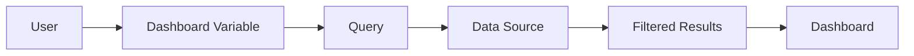
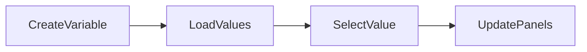
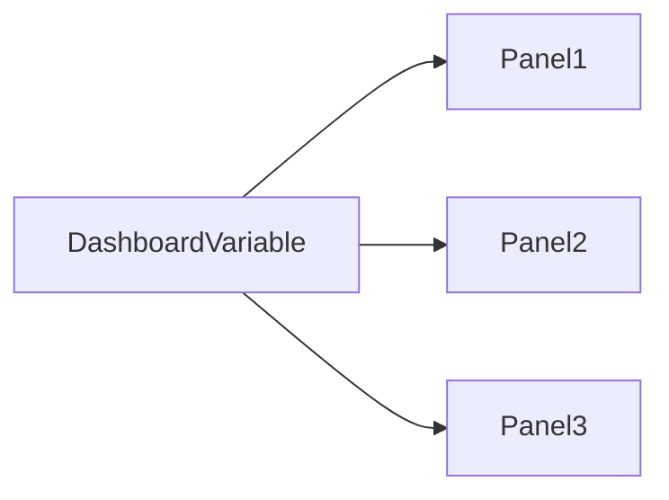
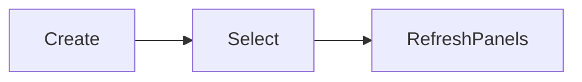
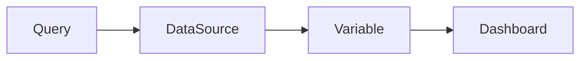
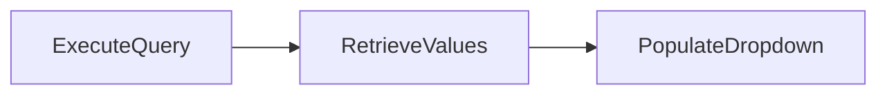
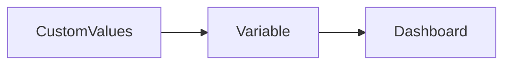
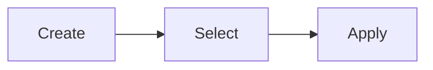
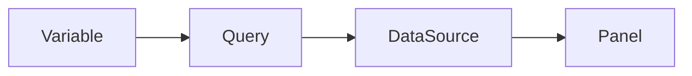

# Variables

## Overview

**Variables** in Grafana are dynamic placeholders that allow users to filter and customize dashboard data without modifying queries.

Variables make dashboards reusable by enabling users to switch between servers, applications, namespaces, clusters, environments, and other resources using drop-down menus.

> **Interview Tip**
>
> Variables eliminate the need to create multiple dashboards for similar resources. One dashboard can monitor hundreds of servers using variables.

---

## Why It Is Used

Variables help to:

- Build reusable dashboards
- Filter monitoring data
- Switch environments
- Select servers or applications
- Reduce dashboard duplication
- Improve user experience
- Simplify dashboard maintenance

---

## Architecture / Working



### Working Process

1. Create a variable.
2. Populate the variable with values.
3. User selects a value.
4. Grafana substitutes the variable into the query.
5. The data source returns filtered results.
6. Panels update automatically.

---

## Key Components

| Component | Purpose |
|-----------|---------|
| Variable | Dynamic placeholder |
| Variable Type | Determines how values are generated |
| Query | Retrieves variable values |
| Dropdown | User selection |
| Panel Query | Uses selected variable |

---

## Types (if applicable)

Common Variable Types

| Variable Type | Purpose |
|---------------|---------|
| Query | Retrieves values dynamically |
| Custom | Manually defined values |
| Constant | Fixed value |
| Text Box | User input |
| Data Source | Switch between data sources |
| Interval | Dynamic time intervals |

---

## Lifecycle / Workflow



---

## Configuration / Syntax (if applicable)

Variable Reference

```text
$variable
```

Alternative Syntax

```text
${variable}
```

Example

```promql
node_cpu_seconds_total{instance="$instance"}
```

---

## Important Commands (if applicable)

Not applicable.

---

## Important Files (if applicable)

| File | Purpose |
|------|----------|
| Dashboard JSON | Stores variable definitions |

---

## Real-World Use Cases

- Switch between production and development environments
- Select Kubernetes namespaces
- Monitor multiple servers
- Choose applications dynamically
- Filter Docker containers
- Monitor Azure Virtual Machines

---

## Advantages

- Reusable dashboards
- Dynamic filtering
- Reduced dashboard maintenance
- Improved user experience
- Supports multiple environments

---

## Limitations

- Incorrect variable configuration may produce empty dashboards
- Complex variable queries can slow dashboard loading

---

## Common Interview Questions (Concept Only)

- What are Grafana variables?
- Why are variables used?
- Can one dashboard support multiple servers using variables?
- Where are variables used inside queries?
- Which variable type is most commonly used?

---

## Common Mistakes

- Incorrect variable names
- Using variables before creating them
- Incorrect query syntax
- Forgetting to refresh variable values

---

## Troubleshooting

| Problem | Cause | Solution |
|----------|--------|----------|
| Variable dropdown empty | Query returned no values | Verify query |
| Panels show no data | Incorrect variable reference | Check query syntax |
| Wrong values displayed | Incorrect filter | Review variable query |
| Variable missing | Variable deleted | Recreate variable |

---

## Summary

Variables make Grafana dashboards dynamic and reusable by allowing users to filter data using drop-down selections without modifying dashboard queries.

---

# Dashboard Variables

## Overview

Dashboard Variables are variables that apply to an entire dashboard. Every panel within the dashboard can use these variables.

Changing a dashboard variable automatically updates all panels that reference it.

> **Interview Tip**
>
> Dashboard Variables are defined once but can be reused across multiple panels within the same dashboard.

---

## Why It Is Used

Dashboard Variables allow users to:

- Filter all panels simultaneously
- Switch monitored resources
- Build reusable dashboards
- Simplify dashboard management

---

## Architecture / Working



---

## Key Components

| Component | Purpose |
|-----------|---------|
| Variable | Shared filter |
| Panels | Use the selected value |
| Dashboard | Hosts variables |

---

## Types (if applicable)

Common Dashboard Variables

- Server
- Namespace
- Cluster
- Environment
- Application

---

## Lifecycle / Workflow



---

## Configuration / Syntax (if applicable)

Example

```promql
node_memory_MemAvailable_bytes{instance="$instance"}
```

---

## Important Commands (if applicable)

Not applicable.

---

## Important Files (if applicable)

Stored in Dashboard JSON.

---

## Real-World Use Cases

- Select Kubernetes cluster
- Switch between Azure regions
- Monitor multiple servers
- Choose Docker hosts

---

## Advantages

- Centralized filtering
- Easier dashboard management
- Consistent filtering across panels

---

## Limitations

- All panels refresh when the variable changes

---

## Common Interview Questions (Concept Only)

- What is a Dashboard Variable?
- Can multiple panels use the same variable?

---

## Common Mistakes

- Forgetting to reference the variable in panel queries

---

## Troubleshooting

- Verify variable exists
- Refresh dashboard

---

## Summary

Dashboard Variables provide centralized filtering for all panels within a dashboard, improving usability and reducing duplication.

---

# Query Variables

## Overview

A **Query Variable** retrieves its values dynamically by executing a query against a data source.

It is the most commonly used variable type in production environments.

> **Interview Tip**
>
> Query Variables automatically update as infrastructure changes, making them ideal for dynamic environments like Kubernetes.

---

## Why It Is Used

Query Variables allow users to:

- Automatically discover servers
- List Kubernetes namespaces
- Display applications
- Retrieve cluster names
- Avoid manual updates

---

## Architecture / Working



---

## Key Components

| Component | Purpose |
|-----------|---------|
| Query | Retrieves values |
| Data Source | Executes query |
| Dropdown | Displays values |

---

## Types (if applicable)

Examples

- Prometheus Query
- SQL Query
- Azure Monitor Query

---

## Lifecycle / Workflow



---

## Configuration / Syntax (if applicable)

Example

```promql
label_values(instance)
```

Namespace Example

```promql
label_values(kube_namespace_labels, namespace)
```

---

## Important Commands (if applicable)

Not applicable.

---

## Important Files (if applicable)

Dashboard JSON

---

## Real-World Use Cases

- Dynamic Kubernetes namespaces
- Server selection
- Pod filtering
- Cluster monitoring

---

## Advantages

- Automatically updated
- Dynamic dashboards
- No manual maintenance

---

## Limitations

- Slow queries can delay dashboard loading

---

## Common Interview Questions (Concept Only)

- What is a Query Variable?
- Why are Query Variables preferred over Custom Variables?

---

## Common Mistakes

- Incorrect query syntax
- Wrong label name

---

## Troubleshooting

- Test the query independently
- Verify data source connectivity

---

## Summary

Query Variables dynamically retrieve values from data sources, making dashboards adaptable to changing infrastructure.

---

# Custom Variables

## Overview

A **Custom Variable** contains manually defined values entered by the dashboard creator.

Unlike Query Variables, Custom Variables do not retrieve data from external sources.

---

## Why It Is Used

Custom Variables are useful for:

- Fixed environments
- Static application names
- Deployment stages
- Regions

---

## Architecture / Working



---

## Key Components

| Component | Purpose |
|-----------|---------|
| Manual Values | Static options |
| Dropdown | User selection |

---

## Types (if applicable)

Example Values

```
Development

Testing

Production
```

---

## Lifecycle / Workflow



---

## Configuration / Syntax (if applicable)

Example

```
dev,qa,stage,prod
```

Usage

```promql
up{environment="$environment"}
```

---

## Important Commands (if applicable)

Not applicable.

---

## Important Files (if applicable)

Dashboard JSON

---

## Real-World Use Cases

- Environment selection
- Region selection
- Application type

---

## Advantages

- Simple
- No backend query
- Fast loading

---

## Limitations

- Manual maintenance
- Does not update automatically

---

## Common Interview Questions (Concept Only)

- What is a Custom Variable?
- When should you use a Custom Variable instead of a Query Variable?

---

## Common Mistakes

- Forgetting to update values manually

---

## Troubleshooting

- Verify configured values
- Check variable spelling

---

## Summary

Custom Variables are manually maintained variables suitable for fixed values that rarely change.

---

# Variable Usage

## Overview

Variables are referenced inside panel queries using the variable name. During query execution, Grafana replaces the variable with the selected value.

This allows the same query to work for multiple resources.

---

## Why It Is Used

Variable usage enables:

- Dynamic filtering
- Reusable queries
- Environment switching
- Resource selection
- Reduced dashboard duplication

---

## Architecture / Working



---

## Key Components

| Component | Purpose |
|-----------|---------|
| Variable | User selection |
| Query | Uses variable |
| Panel | Displays filtered results |

---

## Types (if applicable)

Common Usage

- Instance selection
- Namespace selection
- Environment selection
- Cluster selection

---

## Lifecycle / Workflow


---

## Configuration / Syntax (if applicable)

Reference Variable

```text
$instance
```

Alternative Syntax

```text
${instance}
```

Example

```promql
node_cpu_seconds_total{instance="$instance"}
```

Multiple Variables

```promql
node_cpu_seconds_total{
instance="$instance",
job="$job"
}
```

---

## Important Commands (if applicable)

Not applicable.

---

## Important Files (if applicable)

Dashboard JSON

---

## Real-World Use Cases

- Switch monitored servers
- Filter Kubernetes namespaces
- Select Docker containers
- Choose Azure subscriptions
- Monitor different applications

---

## Advantages

- Dynamic dashboards
- Reduced maintenance
- Better scalability
- Easier monitoring

---

## Limitations

- Incorrect variable references return empty results
- Variable dependencies can increase dashboard complexity

---

## Common Interview Questions (Concept Only)

- How are variables referenced inside Grafana queries?
- What is the difference between `$variable` and `${variable}`?
- Can multiple variables be used in the same query?
- What happens when a variable value changes?

---

## Common Mistakes

- Typographical errors in variable names
- Referencing undefined variables
- Forgetting quotation marks where required
- Using variables unsupported by the selected query language

---

## Troubleshooting

| Problem | Cause | Solution |
|----------|--------|----------|
| No results | Incorrect variable reference | Verify variable name |
| Empty dropdown | Variable query failed | Test query |
| Incorrect filtering | Wrong label mapping | Review query |
| Panels not updating | Variable not referenced | Add variable to panel query |

---

## Summary

Variables are referenced within Grafana queries to dynamically filter data based on user selections. Proper variable usage enables highly reusable, scalable, and production-ready dashboards capable of monitoring multiple environments and resources from a single dashboard.
