# Alerts

## Overview

Grafana **Alerts** continuously monitor metrics from connected data sources and notify users when predefined conditions are met.

Grafana Alerting (Unified Alerting) allows you to create centralized alerts across multiple data sources such as Prometheus, Loki, Azure Monitor, Elasticsearch, and more.

> **Interview Tip**
>
> Grafana visualizes data, but it can also evaluate alert rules and send notifications. In many production environments, Grafana Alerting is used alongside Prometheus and Alertmanager.

---

## Why It Is Used

Grafana Alerts help to:

- Detect infrastructure failures
- Monitor application health
- Notify engineers automatically
- Reduce downtime
- Improve incident response
- Monitor SLAs and SLOs
- Support proactive monitoring

---

## Architecture / Working

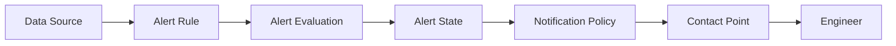

### Working Process

1. Metrics are collected by the data source.
2. Grafana evaluates alert rules.
3. Alert conditions are checked.
4. Alert state is updated.
5. Notification policy determines routing.
6. Notifications are sent to configured contact points.

---

## Key Components

| Component | Purpose |
|-----------|---------|
| Alert Rule | Defines alert logic |
| Query | Retrieves monitoring data |
| Alert Condition | Determines when alert triggers |
| Evaluation | Periodically checks conditions |
| Notification Policy | Routes alerts |
| Contact Point | Sends notifications |

---

## Types (if applicable)

Grafana Alert States

| State | Meaning |
|--------|---------|
| Normal | Condition not met |
| Pending | Condition met but waiting |
| Alerting | Alert triggered |
| No Data | No metric returned |
| Error | Evaluation failed |

---

## Lifecycle / Workflow

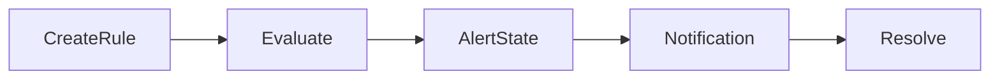

---

## Configuration / Syntax (if applicable)

Typical Alert Configuration

```
Query

↓

Condition

↓

Evaluation Interval

↓

Notification Policy

↓

Contact Point
```

---

## Important Commands (if applicable)

Not applicable.

---

## Important Files (if applicable)

| File | Purpose |
|------|----------|
| Grafana Database | Stores alert configurations |
| Dashboard JSON | Stores panel-based alerts (legacy) |

---

## Real-World Use Cases

- High CPU usage
- High memory utilization
- Pod failures
- Kubernetes node failures
- Website downtime
- High response time
- Disk usage alerts

---

## Advantages

- Real-time monitoring
- Automated notifications
- Centralized alert management
- Supports multiple data sources
- Flexible routing

---

## Limitations

- Incorrect thresholds generate false alerts
- Large numbers of alerts can create alert fatigue
- Requires reliable data sources

---

## Common Interview Questions (Concept Only)

- What is Grafana Alerting?
- Can Grafana send notifications?
- What are alert states?
- How often are alerts evaluated?
- What happens when an alert condition is met?

---

## Common Mistakes

- Incorrect thresholds
- Long evaluation intervals
- Duplicate alerts
- Ignoring No Data state

---

## Troubleshooting

| Problem | Cause | Solution |
|----------|--------|----------|
| Alert never fires | Wrong query | Verify query |
| Too many alerts | Threshold too low | Adjust threshold |
| No notifications | Contact point issue | Verify notification settings |
| Alert stuck in Pending | Pending duration too long | Review evaluation settings |

---

## Summary

Grafana Alerts continuously evaluate monitoring data and automatically notify teams when predefined conditions are satisfied, enabling proactive monitoring and faster incident response.

---

# Alert Rules

## Overview

An **Alert Rule** defines the logic that Grafana uses to determine whether an alert should be triggered.

An alert rule consists of:

- Query
- Condition
- Evaluation interval
- Alert state
- Notification configuration

> **Interview Tip**
>
> An Alert Rule does **not** send notifications directly. It determines when an alert enters the **Alerting** state.

---

## Why It Is Used

Alert Rules help to:

- Detect failures automatically
- Monitor system health
- Trigger notifications
- Reduce manual monitoring

---

## Architecture / Working

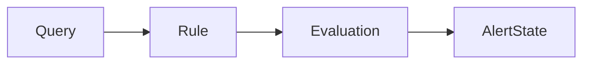

---

## Key Components

| Component | Purpose |
|-----------|---------|
| Query | Retrieves metrics |
| Condition | Trigger logic |
| Threshold | Alert limit |
| Evaluation Interval | Check frequency |

---

## Types (if applicable)

Common Rule Types

- Threshold Rules
- No Data Rules
- Error Rules

---

## Lifecycle / Workflow

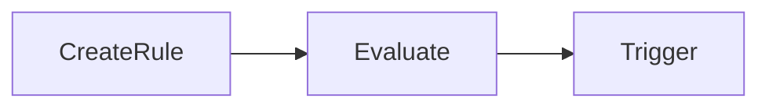

---

## Configuration / Syntax (if applicable)

Typical Rule

```
CPU Usage > 80%

Evaluate Every 1 Minute

For 5 Minutes
```

---

## Important Commands (if applicable)

Not applicable.

---

## Important Files (if applicable)

Stored in Grafana.

---

## Real-World Use Cases

- CPU > 80%
- Disk > 90%
- Pod Restart Count
- Memory Usage

---

## Advantages

- Automated monitoring
- Easy configuration

---

## Limitations

- Poor thresholds create false positives

---

## Common Interview Questions (Concept Only)

- What is an Alert Rule?
- What components make up an Alert Rule?

---

## Common Mistakes

- Incorrect thresholds
- Wrong metric

---

## Troubleshooting

- Verify query
- Test alert manually

---

## Summary

Alert Rules define the conditions under which Grafana generates alerts.

---

# Alert Conditions

## Overview

An **Alert Condition** specifies the logical expression that determines whether an alert should fire.

It compares metric values against predefined thresholds.

---

## Why It Is Used

Conditions determine:

- When alerts start
- When alerts recover
- Which metric values are abnormal

---

## Architecture / Working

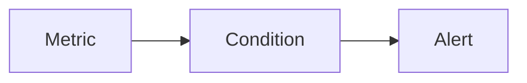

---

## Key Components

| Component | Purpose |
|-----------|---------|
| Metric | Input |
| Operator | Comparison |
| Threshold | Limit |

---

## Types (if applicable)

Common Operators

- Greater Than (>)
- Less Than (<)
- Equal (=)
- Not Equal (!=)

---

## Lifecycle / Workflow

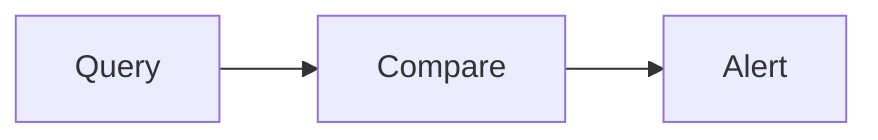

---

## Configuration / Syntax (if applicable)

Examples

```
CPU > 80%

Memory > 90%

Response Time > 500 ms
```

---

## Important Commands (if applicable)

None

---

## Important Files (if applicable)

Stored in alert configuration.

---

## Real-World Use Cases

- High CPU
- High latency
- Disk full

---

## Advantages

- Simple
- Flexible

---

## Limitations

- Incorrect thresholds

---

## Common Interview Questions (Concept Only)

- What is an Alert Condition?
- How do alert thresholds work?

---

## Common Mistakes

- Unrealistic thresholds

---

## Troubleshooting

- Test query
- Verify metric values

---

## Summary

Alert Conditions define the logical comparison used to determine whether an alert should enter the Alerting state.

---

# Alert Evaluation

## Overview

Alert Evaluation is the process where Grafana periodically executes alert queries and checks whether alert conditions are satisfied.

---

## Why It Is Used

Evaluation allows Grafana to:

- Continuously monitor metrics
- Detect failures quickly
- Prevent false alarms using evaluation intervals

---

## Architecture / Working

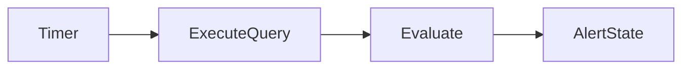

---

## Key Components

| Component | Purpose |
|-----------|---------|
| Evaluation Interval | Frequency |
| Pending Duration | Stability check |
| Alert State | Final status |

---

## Types (if applicable)

Evaluation Settings

- Every 30 seconds
- Every 1 minute
- Every 5 minutes

---

## Lifecycle / Workflow

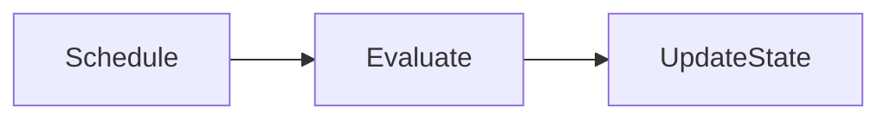

---

## Configuration / Syntax (if applicable)

Example

```
Evaluate Every:

1 Minute

For:

5 Minutes
```

---

## Important Commands (if applicable)

Not applicable.

---

## Important Files (if applicable)

Stored in alert rule configuration.

---

## Real-World Use Cases

- Continuous monitoring
- SLA monitoring

---

## Advantages

- Automated checks
- Reduces manual monitoring

---

## Limitations

- Very short intervals increase system load

---

## Common Interview Questions (Concept Only)

- What is alert evaluation?
- What is an evaluation interval?

---

## Common Mistakes

- Extremely short intervals

---

## Troubleshooting

- Increase evaluation interval
- Verify query execution time

---

## Summary

Alert Evaluation periodically checks monitoring data to determine whether alert conditions are met.

---

# Notification Policies

## Overview

A **Notification Policy** determines how alerts are routed after they enter the Alerting state.

Policies define:

- Who receives alerts
- Which alerts are routed
- Grouping behavior
- Timing

> **Interview Tip**
>
> Notification Policies **route** alerts. Contact Points **deliver** alerts.

---

## Why It Is Used

Notification Policies help:

- Organize alerts
- Route alerts by team
- Reduce alert noise
- Group related alerts

---

## Architecture / Working

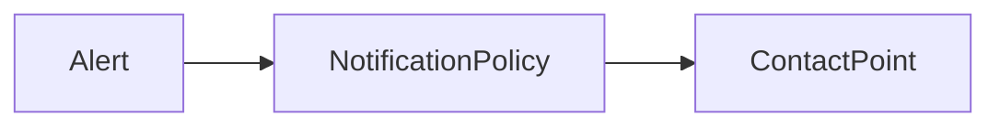

---

## Key Components

| Component | Purpose |
|-----------|---------|
| Routing | Select destination |
| Grouping | Combine alerts |
| Timing | Control frequency |

---

## Types (if applicable)

Policy Features

- Grouping
- Routing
- Mute timings
- Matching rules

---

## Lifecycle / Workflow

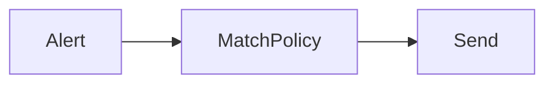

---

## Configuration / Syntax (if applicable)

Typical Workflow

```
Alert

↓

Policy Match

↓

Contact Point
```

---

## Important Commands (if applicable)

None

---

## Important Files (if applicable)

Stored in Grafana.

---

## Real-World Use Cases

- Route production alerts to DevOps
- Send database alerts to DBA team

---

## Advantages

- Flexible routing
- Reduced alert fatigue

---

## Limitations

- Incorrect routing rules may hide important alerts

---

## Common Interview Questions (Concept Only)

- What is a Notification Policy?
- How is alert routing configured?

---

## Common Mistakes

- Incorrect routing

---

## Troubleshooting

- Verify matching rules
- Test routing

---

## Summary

Notification Policies determine how Grafana routes alerts to the appropriate recipients.

---

# Contact Points

## Overview

A **Contact Point** defines the destination where Grafana sends notifications after an alert has been routed by a Notification Policy.

Common contact points include email, Slack, Microsoft Teams, PagerDuty, and webhooks.

---

## Why It Is Used

Contact Points enable:

- Email notifications
- Slack messages
- Teams notifications
- Incident management integration
- Webhook integration

---

## Architecture / Working

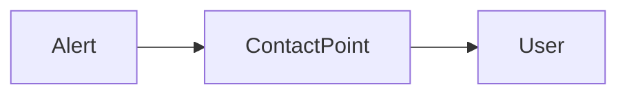

---

## Key Components

| Component | Purpose |
|-----------|---------|
| Receiver | Notification destination |
| Authentication | Access credentials |
| Message Template | Notification format |

---

## Types (if applicable)

Common Contact Points

| Type | Example |
|------|---------|
| Email | SMTP |
| Slack | Slack Channel |
| Microsoft Teams | Teams Channel |
| PagerDuty | Incident Platform |
| Webhook | REST Endpoint |
| Discord | Discord Channel |

---

## Lifecycle /Workflow

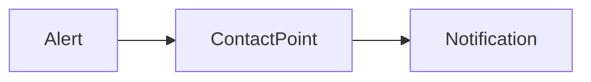

---

## Configuration / Syntax (if applicable)

Typical Configuration

```
Contact Point

↓

Receiver

↓

Authentication

↓

Message
```

---

## Important Commands (if applicable)

Not applicable.

---

## Important Files (if applicable)

Stored in Grafana configuration.

---

## Real-World Use Cases

- Notify DevOps team
- Send Slack alerts
- Open PagerDuty incidents
- Trigger automation through webhooks

---

## Advantages

- Multiple notification channels
- Centralized alert delivery
- Easy integration

---

## Limitations

- Incorrect credentials prevent notification delivery
- External services may introduce delivery delays

---

## Common Interview Questions (Concept Only)

- What is a Contact Point?
- What is the difference between a Notification Policy and a Contact Point?
- Which notification channels does Grafana support?
- Can multiple Contact Points be configured?

---

## Common Mistakes

- Invalid SMTP configuration
- Incorrect webhook URL
- Forgetting to test notifications
- Missing authentication details

---

## Troubleshooting

| Problem | Cause | Solution |
|----------|--------|----------|
| No email received | SMTP issue | Verify SMTP configuration |
| Slack notification failed | Invalid webhook | Check webhook URL |
| Alert not delivered | Notification Policy mismatch | Verify routing |
| Authentication failed | Invalid credentials | Update authentication |

---

## Summary

Contact Points define where Grafana sends alert notifications after Notification Policies determine the appropriate routing. Together, they enable reliable and flexible alert delivery across multiple communication platforms.
