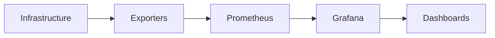
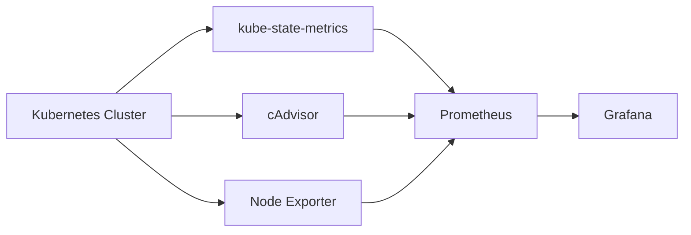
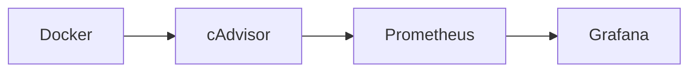

# Monitoring Integrations

## Overview

Monitoring Integrations allow Grafana to connect with monitoring tools and infrastructure platforms to visualize metrics, logs, and operational data.

Grafana itself does **not** collect monitoring data. Instead, it retrieves data from external monitoring systems such as **Prometheus**, **Node Exporter**, **cAdvisor**, Kubernetes monitoring components, and Docker monitoring tools.

> **Interview Tip**
>
> **Grafana = Visualization**
>
> **Prometheus = Metrics Collection**
>
> **Exporters = Metrics Providers**

---

## Why It Is Used

Monitoring Integrations help to:

- Build centralized dashboards
- Monitor infrastructure
- Monitor applications
- Detect failures
- Analyze performance
- Troubleshoot production issues
- Correlate metrics across multiple platforms

---

## Architecture / Working



### Working Process

1. Infrastructure generates metrics.
2. Exporters expose metrics.
3. Prometheus scrapes metrics.
4. Grafana queries Prometheus.
5. Dashboards visualize the collected data.

---

## Key Components

| Component | Purpose |
|-----------|---------|
| Grafana | Visualization |
| Prometheus | Metrics collection |
| Exporters | Expose metrics |
| Dashboards | Monitoring interface |
| Panels | Display metrics |

---

## Types (if applicable)

Common Monitoring Integrations

| Integration | Purpose |
|-------------|----------|
| Prometheus | Metrics |
| Node Exporter | Linux server metrics |
| cAdvisor | Container metrics |
| Kubernetes | Cluster monitoring |
| Docker | Container monitoring |

---

## Lifecycle / Workflow


---

## Configuration / Syntax (if applicable)

Typical Monitoring Flow

```
Infrastructure

↓

Exporter

↓

Prometheus

↓

Grafana
```

---

## Important Commands (if applicable)

Not applicable.

---

## Important Files (if applicable)

| File | Purpose |
|------|----------|
| prometheus.yml | Prometheus scrape configuration |
| dashboard.json | Dashboard configuration |

---

## Real-World Use Cases

- Infrastructure monitoring
- Kubernetes monitoring
- Docker monitoring
- Cloud monitoring
- Application monitoring
- Capacity planning

---

## Advantages

- Centralized monitoring
- Multiple integrations
- Real-time dashboards
- Easy troubleshooting
- Scalable architecture

---

## Limitations

- Requires external monitoring systems
- Dashboard quality depends on collected metrics
- Poor exporter configuration affects visibility

---

## Common Interview Questions (Concept Only)

- What is a monitoring integration?
- Does Grafana collect metrics?
- Why are exporters required?
- Which monitoring stack is commonly used with Grafana?
- How does Grafana retrieve monitoring data?

---

## Common Mistakes

- Assuming Grafana stores metrics
- Missing exporters
- Incorrect scrape configuration
- Using the wrong data source

---

## Troubleshooting

| Problem | Cause | Solution |
|----------|--------|----------|
| No metrics | Exporter unavailable | Verify exporter |
| Empty dashboards | Prometheus issue | Check scrape targets |
| Missing data | Wrong query | Verify PromQL |
| Slow dashboards | Heavy queries | Optimize queries |

---

## Summary

Monitoring Integrations connect Grafana with external monitoring systems to provide centralized, real-time visualization of infrastructure and application metrics.

---

# Prometheus

## Overview

Prometheus is the most common monitoring backend integrated with Grafana.

It collects metrics from exporters using the **pull model** and stores them as time-series data.

Grafana queries Prometheus using **PromQL** to build dashboards.

> **Interview Tip**
>
> Prometheus collects metrics, while Grafana visualizes them.

---

## Why It Is Used

Prometheus helps to:

- Collect metrics
- Store time-series data
- Monitor infrastructure
- Monitor Kubernetes
- Generate alerts

---

## Architecture / Working


---

## Key Components

| Component | Purpose |
|-----------|---------|
| Prometheus Server | Collect metrics |
| TSDB | Store metrics |
| PromQL | Query language |
| Alertmanager | Alerting |

---

## Types (if applicable)

Prometheus Components

- Server
- TSDB
- PromQL
- Alertmanager

---

## Lifecycle / Workflow


---

## Configuration / Syntax (if applicable)

Typical Configuration

```
Exporter

↓

Prometheus

↓

Grafana
```

---

## Important Commands (if applicable)

None

---

## Important Files (if applicable)

| File | Purpose |
|------|----------|
| prometheus.yml | Main configuration |

---

## Real-World Use Cases

- Server monitoring
- Kubernetes monitoring
- Docker monitoring
- Cloud monitoring

---

## Advantages

- Powerful querying
- Native Grafana integration
- Lightweight

---

## Limitations

- Metrics only
- Local storage requires management

---

## Common Interview Questions (Concept Only)

- Why is Prometheus used with Grafana?
- What query language does Prometheus use?
- How does Prometheus collect metrics?

---

## Common Mistakes

- Incorrect scrape configuration
- Missing exporters

---

## Troubleshooting

- Verify targets
- Check PromQL
- Review scrape status

---

## Summary

Prometheus is the primary monitoring backend used with Grafana for collecting and storing infrastructure metrics.

---

# Node Exporter

## Overview

Node Exporter is a Prometheus exporter that exposes operating system and hardware metrics from Linux and Unix-based servers.

It is the most commonly used exporter for infrastructure monitoring.

> **Interview Tip**
>
> Node Exporter does **not** collect application metrics. It provides **host-level metrics**.

---

## Why It Is Used

Node Exporter helps monitor:

- CPU
- Memory
- Disk
- Filesystems
- Network
- Load Average

---

## Architecture / Working


---

## Key Components

| Component | Purpose |
|-----------|---------|
| Collector | Reads OS metrics |
| HTTP Endpoint | Exposes metrics |
| Prometheus | Scrapes metrics |

---

## Types (if applicable)

Common Metrics

- CPU
- Memory
- Disk
- Network
- Filesystem

---

## Lifecycle / Workflow


---

## Configuration / Syntax (if applicable)

Metrics Endpoint

```
http://server:9100/metrics
```

---

## Important Commands (if applicable)

None

---

## Important Files (if applicable)

None

---

## Real-World Use Cases

- Linux monitoring
- Cloud VM monitoring
- Bare-metal monitoring

---

## Advantages

- Lightweight
- Easy installation
- Production-ready

---

## Limitations

- No application metrics

---

## Common Interview Questions (Concept Only)

- What metrics does Node Exporter expose?
- Which port does Node Exporter use?
- Does Node Exporter monitor applications?

---

## Common Mistakes

- Forgetting to add scrape targets
- Firewall blocking port 9100

---

## Troubleshooting

| Problem | Cause | Solution |
|----------|--------|----------|
| Target Down | Exporter stopped | Restart service |
| No metrics | Firewall | Open port 9100 |
| Missing dashboards | Scrape issue | Verify Prometheus |

---

## Summary

Node Exporter provides host-level infrastructure metrics for Linux systems and is the standard exporter used with Prometheus and Grafana.

---

# cAdvisor

## Overview

cAdvisor (Container Advisor) collects resource usage and performance metrics for running containers.

It is widely used for Docker and Kubernetes container monitoring.

> **Interview Tip**
>
> cAdvisor focuses on **container-level metrics**, whereas Node Exporter focuses on **host-level metrics**.

---

## Why It Is Used

cAdvisor monitors:

- Container CPU
- Container Memory
- Network
- Filesystem
- Container lifecycle

---

## Architecture / Working


---

## Key Components

| Component | Purpose |
|-----------|---------|
| Container Metrics | Resource usage |
| Prometheus Endpoint | Exposes metrics |
| Grafana | Visualization |

---

## Types (if applicable)

Common Metrics

- CPU Usage
- Memory Usage
- Network Traffic
- Filesystem Usage

---

## Lifecycle / Workflow


---

## Configuration / Syntax (if applicable)

Typical Endpoint

```
http://server:8080/metrics
```

---

## Important Commands (if applicable)

None

---

## Important Files (if applicable)

None

---

## Real-World Use Cases

- Docker monitoring
- Kubernetes container monitoring
- Resource optimization

---

## Advantages

- Detailed container metrics
- Native Kubernetes support

---

## Limitations

- Container metrics only

---

## Common Interview Questions (Concept Only)

- What is cAdvisor?
- What metrics does cAdvisor expose?
- How is cAdvisor different from Node Exporter?

---

## Common Mistakes

- Confusing host metrics with container metrics

---

## Troubleshooting

- Verify cAdvisor endpoint
- Check Prometheus target

---

## Summary

cAdvisor provides detailed container-level resource metrics for Docker and Kubernetes environments.

---

# Kubernetes

## Overview

Grafana integrates with Kubernetes through Prometheus, kube-state-metrics, Node Exporter, and cAdvisor to provide comprehensive cluster monitoring.

It enables monitoring of cluster infrastructure, workloads, and resource utilization.

---

## Why It Is Used

Kubernetes monitoring helps:

- Monitor nodes
- Monitor pods
- Monitor deployments
- Monitor namespaces
- Detect failures
- Optimize resources

---

## Architecture / Working



---

## Key Components

| Component | Purpose |
|-----------|---------|
| kube-state-metrics | Kubernetes objects |
| cAdvisor | Container metrics |
| Node Exporter | Node metrics |
| Prometheus | Metrics storage |

---

## Types (if applicable)

Common Kubernetes Metrics

- Node Metrics
- Pod Metrics
- Deployment Metrics
- Namespace Metrics

---

## Lifecycle / Workflow


---

## Configuration / Syntax (if applicable)

Typical Monitoring Stack

```
Kubernetes

↓

Exporters

↓

Prometheus

↓

Grafana
```

---

## Important Commands (if applicable)

None

---

## Important Files (if applicable)

| File | Purpose |
|------|----------|
| prometheus.yml | Scrape configuration |

---

## Real-World Use Cases

- Cluster monitoring
- Capacity planning
- Production troubleshooting
- Resource optimization

---

## Advantages

- Full cluster visibility
- Centralized dashboards
- Real-time monitoring

---

## Limitations

- Requires multiple exporters
- High metric volume in large clusters

---

## Common Interview Questions (Concept Only)

- Which exporters are used for Kubernetes monitoring?
- What is kube-state-metrics?
- What metrics does cAdvisor provide?

---

## Common Mistakes

- Monitoring only nodes
- Ignoring pod metrics

---

## Troubleshooting

- Verify exporters
- Check Prometheus targets

---

## Summary

Grafana provides complete Kubernetes monitoring through integrations with Prometheus and Kubernetes-specific exporters.

---

# Docker

## Overview

Grafana monitors Docker environments by visualizing container metrics collected from cAdvisor and Prometheus.

This integration provides visibility into container resource utilization and performance.

---

## Why It Is Used

Docker monitoring helps:

- Monitor containers
- Detect resource bottlenecks
- Track container health
- Analyze performance

---

## Architecture / Working



---

## Key Components

| Component | Purpose |
|-----------|---------|
| Docker Engine | Runs containers |
| cAdvisor | Container metrics |
| Prometheus | Metrics collection |
| Grafana | Visualization |

---

## Types (if applicable)

Common Docker Metrics

- CPU Usage
- Memory Usage
- Network Traffic
- Filesystem Usage
- Container Count

---

## Lifecycle / Workflow


---

## Configuration / Syntax (if applicable)

Typical Flow

```
Docker

↓

cAdvisor

↓

Prometheus

↓

Grafana
```

---

## Important Commands (if applicable)

Not applicable.

---

## Important Files (if applicable)

None

---

## Real-World Use Cases

- Container monitoring
- Production Docker environments
- CI/CD infrastructure monitoring
- Resource optimization

---

## Advantages

- Real-time monitoring
- Container-level visibility
- Easy Grafana integration

---

## Limitations

- Requires cAdvisor
- Does not monitor application logic directly

---

## Common Interview Questions (Concept Only)

- How is Docker monitored in Grafana?
- Which exporter is commonly used for Docker metrics?
- What Docker metrics are commonly visualized?

---

## Common Mistakes

- Assuming Docker exposes Prometheus metrics by default
- Ignoring container restart metrics
- Not monitoring resource limits

---

## Troubleshooting

| Problem | Cause | Solution |
|----------|--------|----------|
| Missing container metrics | cAdvisor unavailable | Verify cAdvisor |
| Empty dashboard | Prometheus scrape issue | Check targets |
| High resource usage not shown | Wrong query | Validate PromQL |
| Containers missing | Label mismatch | Review labels |

---

## Summary

Grafana integrates with Docker using cAdvisor and Prometheus to provide detailed container monitoring, enabling visibility into resource usage, container health, and overall Docker infrastructure performance.
