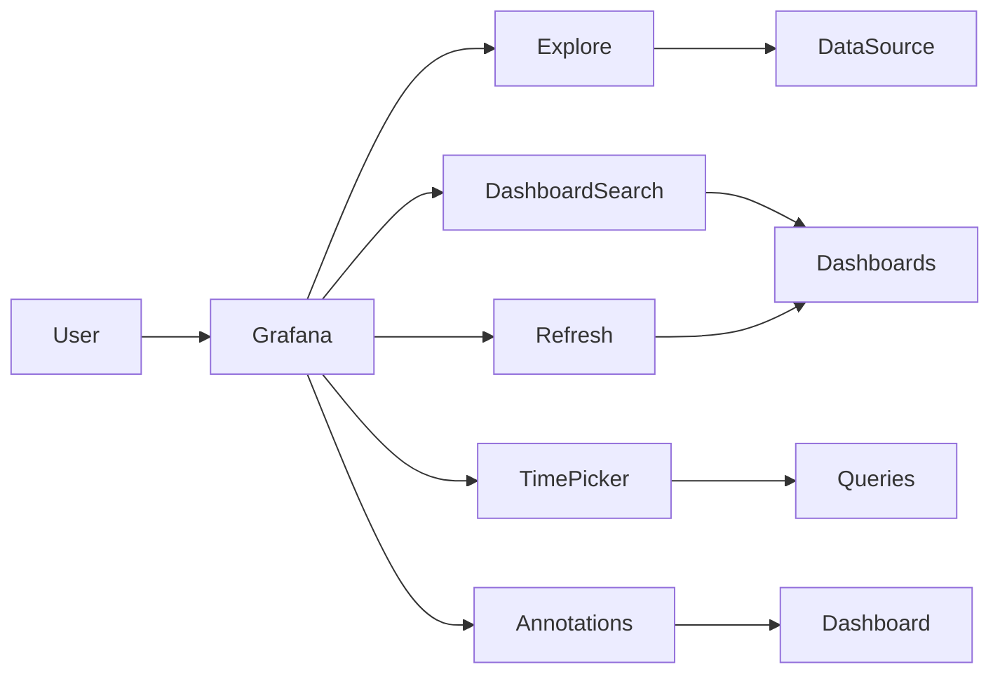
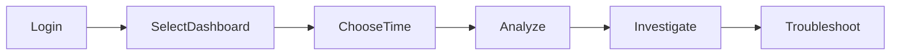
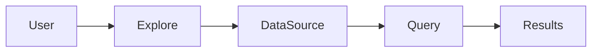
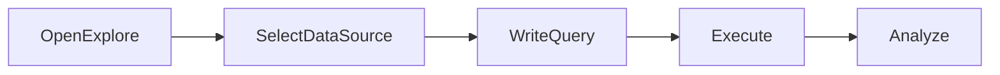
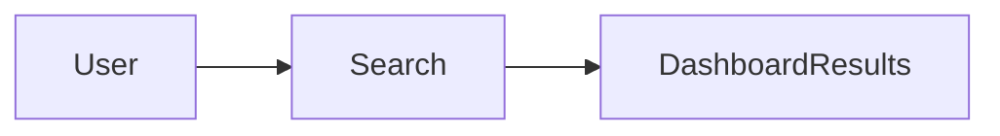
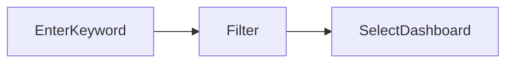
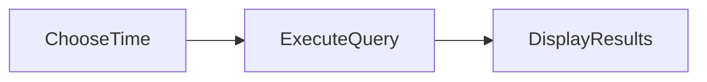
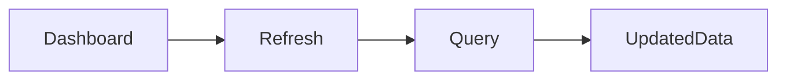
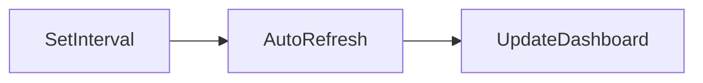
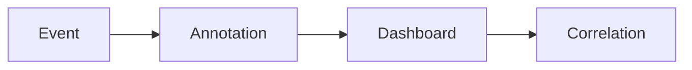

# Essential Grafana Features

## Overview

Grafana provides several built-in features that simplify monitoring, troubleshooting, and data analysis. Among the most frequently used features in production are **Explore**, **Dashboard Search**, **Time Picker**, **Refresh Intervals**, and **Annotations**.

These features help engineers quickly investigate incidents, analyze historical data, monitor real-time systems, and improve operational visibility.

> **Interview Tip**
>
> Dashboards are primarily used for continuous monitoring, while **Explore** is designed for interactive troubleshooting and root cause analysis.

---

## Why It Is Used

Essential Grafana features help to:

- Troubleshoot production issues quickly
- Search dashboards efficiently
- Analyze historical metrics
- Monitor live systems
- Correlate events with metrics
- Improve incident investigations

---

## Architecture / Working



---

## Key Components

| Component | Purpose |
|-----------|---------|
| Explore | Interactive metric and log analysis |
| Dashboard Search | Locate dashboards quickly |
| Time Picker | Select time ranges |
| Refresh Interval | Automatically refresh dashboards |
| Annotations | Display important events on graphs |

---

## Types (if applicable)

Common Grafana Features

- Explore
- Dashboard Search
- Time Picker
- Auto Refresh
- Annotations

---

## Lifecycle / Workflow



---

## Configuration / Syntax (if applicable)

Typical Monitoring Workflow

```
Login

↓

Dashboard

↓

Time Picker

↓

Explore

↓

Annotations

↓

Troubleshoot
```

---

## Important Commands (if applicable)

Not applicable.

---

## Important Files (if applicable)

| File | Purpose |
|------|----------|
| grafana.ini | General Grafana configuration |
| dashboard.json | Dashboard definition |

---

## Real-World Use Cases

- Investigating production outages
- Searching dashboards across multiple teams
- Monitoring live infrastructure
- Viewing deployment events
- Correlating alerts with application behavior

---

## Advantages

- Improves troubleshooting
- Simplifies dashboard navigation
- Supports real-time monitoring
- Easy historical analysis
- Better incident correlation

---

## Limitations

- Large environments require proper dashboard organization.
- Very frequent dashboard refreshes increase backend load.
- Annotations depend on accurate event generation.

---

## Common Interview Questions (Concept Only)

- What are the most commonly used Grafana features?
- What is Explore used for?
- Why is Dashboard Search important?
- What is the purpose of Time Picker?
- Why are Annotations useful?

---

## Common Mistakes

- Using dashboards instead of Explore for debugging.
- Selecting an incorrect time range.
- Setting overly aggressive refresh intervals.
- Ignoring deployment annotations.
- Creating duplicate dashboards with poor naming.

---

## Troubleshooting

| Problem | Cause | Solution |
|----------|--------|----------|
| No recent data | Wrong time range | Adjust Time Picker |
| Dashboard not found | Incorrect name/folder | Use Dashboard Search |
| Dashboard not updating | Auto Refresh disabled | Configure Refresh Interval |
| Missing deployment markers | Annotation source unavailable | Verify annotation configuration |
| Slow dashboard | Frequent refresh or heavy queries | Increase refresh interval and optimize queries |

---

## Summary

Grafana's essential features help engineers efficiently monitor systems, investigate issues, analyze historical data, and improve operational visibility. Mastering these features is essential for DevOps, SRE, Cloud, and Platform Engineer roles.

---

# Explore

## Overview

**Explore** is Grafana's interactive troubleshooting workspace used to investigate metrics, logs, and traces without modifying dashboards.

Unlike dashboards, Explore is designed for ad hoc analysis during incidents.

> **Interview Tip**
>
> **Dashboard = Monitoring**
>
> **Explore = Troubleshooting**

---

## Why It Is Used

Explore helps to:

- Debug production issues
- Search logs
- Test PromQL queries
- Analyze metrics
- Correlate logs and metrics
- Perform root cause analysis

---

## Architecture / Working



---

## Key Components

| Component | Purpose |
|-----------|---------|
| Query Editor | Write queries |
| Data Source | Prometheus, Loki, etc. |
| Results | Metrics or logs |
| Time Range | Investigation period |

---

## Types (if applicable)

Explore supports:

- Metrics
- Logs
- Traces

---

## Lifecycle / Workflow



---

## Configuration / Syntax (if applicable)

Typical Workflow

```
Explore

↓

Select Prometheus/Loki

↓

Write Query

↓

Analyze Results
```

---

## Important Commands (if applicable)

Not applicable.

---

## Important Files (if applicable)

None

---

## Real-World Use Cases

- Investigating high CPU usage
- Searching application errors
- Debugging Kubernetes pods
- Root cause analysis

---

## Advantages

- Interactive
- No dashboard modification
- Fast troubleshooting
- Supports multiple data sources

---

## Limitations

- Not intended for permanent monitoring
- Requires correctly configured data sources

---

## Common Interview Questions (Concept Only)

- What is Grafana Explore?
- When should Explore be used instead of dashboards?
- Can Explore query logs and metrics together?

---

## Common Mistakes

- Editing dashboards for one-time troubleshooting
- Forgetting to adjust the time range

---

## Troubleshooting

- Verify the selected data source.
- Confirm the query syntax.
- Check the selected time range.

---

## Summary

Explore is Grafana's primary tool for interactive troubleshooting and root cause analysis.

---

# Dashboard Search

## Overview

Dashboard Search enables users to quickly locate dashboards across folders and organizations using keywords, tags, or filters.

---

## Why It Is Used

Dashboard Search helps:

- Find dashboards quickly
- Navigate large environments
- Reduce duplicate dashboards
- Improve productivity

---

## Architecture / Working



---

## Key Components

| Component | Purpose |
|-----------|---------|
| Search Box | Keyword search |
| Tags | Dashboard categorization |
| Folder Filter | Limit search scope |

---

## Types (if applicable)

Search Options

- Dashboard Name
- Folder
- Tags
- Recently Viewed

---

## Lifecycle / Workflow



---

## Configuration / Syntax (if applicable)

Typical Search

```
Search

↓

Keyword

↓

Results
```

---

## Important Commands (if applicable)

Not applicable.

---

## Important Files (if applicable)

None

---

## Real-World Use Cases

- Finding Kubernetes dashboards
- Searching production dashboards
- Locating team dashboards

---

## Advantages

- Fast navigation
- Easy dashboard discovery
- Supports filters and tags

---

## Limitations

- Poor naming conventions reduce search effectiveness

---

## Common Interview Questions (Concept Only)

- How do you search dashboards in Grafana?
- Why should dashboards be tagged?

---

## Common Mistakes

- Using inconsistent dashboard names
- Ignoring dashboard tags

---

## Troubleshooting

- Verify dashboard permissions.
- Confirm search keywords.
- Check folder filters.

---

## Summary

Dashboard Search simplifies dashboard discovery in environments with large numbers of dashboards.

---

# Time Picker

## Overview

Time Picker allows users to select the time range used for dashboard queries.

It is one of the most frequently used Grafana features.

---

## Why It Is Used

Time Picker enables users to:

- View recent metrics
- Analyze historical trends
- Investigate incidents
- Compare time periods

---

## Architecture / Working


---

## Key Components

| Component | Purpose |
|-----------|---------|
| Relative Time | Last 5m, 1h, 24h |
| Absolute Time | Specific dates |
| Custom Range | User-defined period |

---

## Types (if applicable)

- Relative Time
- Absolute Time
- Custom Time Range

---

## Lifecycle / Workflow



---

## Configuration / Syntax (if applicable)

Examples

```
Last 5 minutes

Last 1 hour

Last 24 hours

Last 7 days
```

---

## Important Commands (if applicable)

Not applicable.

---

## Important Files (if applicable)

None

---

## Real-World Use Cases

- Investigating outages
- Capacity planning
- Performance analysis

---

## Advantages

- Flexible time selection
- Historical analysis
- Easy comparison

---

## Limitations

- Incorrect time ranges may hide relevant data

---

## Common Interview Questions (Concept Only)

- What is Time Picker?
- Difference between relative and absolute time?

---

## Common Mistakes

- Choosing an incorrect time window
- Forgetting dashboard timezone settings

---

## Troubleshooting

- Verify time range.
- Check timezone configuration.
- Confirm metric availability.

---

## Summary

Time Picker controls the period over which Grafana retrieves and displays monitoring data.

---

# Refresh Intervals

## Overview

Refresh Intervals automatically reload dashboard data at specified intervals to keep monitoring information current.

---

## Why It Is Used

Refresh Intervals help:

- Monitor live systems
- Track production metrics
- Display updated dashboards
- Reduce manual refreshes

---

## Architecture / Working



---

## Key Components

| Component | Purpose |
|-----------|---------|
| Auto Refresh | Periodic updates |
| Manual Refresh | Immediate reload |

---

## Types (if applicable)

Common Intervals

- 5 seconds
- 10 seconds
- 30 seconds
- 1 minute
- 5 minutes

---

## Lifecycle / Workflow



---

## Configuration / Syntax (if applicable)

Examples

```
5s

10s

30s

1m

5m
```

---

## Important Commands (if applicable)

Not applicable.

---

## Important Files (if applicable)

None

---

## Real-World Use Cases

- NOC dashboards
- Live production monitoring
- Operations centers

---

## Advantages

- Real-time monitoring
- Automatic updates
- No manual intervention

---

## Limitations

- Very short intervals increase backend load

---

## Common Interview Questions (Concept Only)

- What are Refresh Intervals?
- Why shouldn't refresh intervals be set too low?

---

## Common Mistakes

- Using 1-second refresh intervals unnecessarily
- Refreshing dashboards faster than scrape intervals

---

## Troubleshooting

- Verify refresh settings.
- Compare refresh interval with Prometheus scrape interval.
- Check query performance.

---

## Summary

Refresh Intervals keep dashboards updated automatically and should be configured based on monitoring requirements and backend performance.

---

# Annotations

## Overview

Annotations are visual markers displayed on Grafana graphs that indicate important events such as deployments, incidents, restarts, maintenance windows, or alerts.

They help correlate operational events with changes in metrics.

> **Interview Tip**
>
> If CPU usage spikes immediately after a deployment, an annotation makes that relationship immediately visible.

---

## Why It Is Used

Annotations help to:

- Correlate deployments with metrics
- Track incidents
- Mark maintenance windows
- Display alert events
- Improve root cause analysis

---

## Architecture / Working



---

## Key Components

| Component | Purpose |
|-----------|---------|
| Event | Deployment or incident |
| Annotation | Visual marker |
| Dashboard | Displays annotations |

---

## Types (if applicable)

- Manual Annotations
- Alert Annotations
- Deployment Annotations
- API-Based Annotations

---

## Lifecycle / Workflow


---

## Configuration / Syntax (if applicable)

Typical Workflow

```
Deployment

↓

Annotation

↓

Dashboard Timeline
```

---

## Important Commands (if applicable)

Not applicable.

---

## Important Files (if applicable)

None

---

## Real-World Use Cases

- Deployment tracking
- Incident timelines
- Server restart visualization
- Maintenance scheduling

---

## Advantages

- Better incident correlation
- Easier troubleshooting
- Improved historical context

---

## Limitations

- Requires event generation
- Too many annotations can clutter dashboards

---

## Common Interview Questions (Concept Only)

- What are Grafana Annotations?
- Why are annotations useful during troubleshooting?
- Can deployment events be displayed on dashboards?

---

## Common Mistakes

- Not recording deployment events
- Creating excessive annotations
- Ignoring annotation timestamps

---

## Troubleshooting

| Problem | Cause | Solution |
|----------|--------|----------|
| Missing annotations | Event source unavailable | Verify annotation source |
| Wrong event time | Timezone mismatch | Check Grafana timezone |
| Too many markers | Excessive annotation creation | Filter or reduce annotations |

---

## Summary

Annotations provide valuable operational context by displaying important events directly on Grafana dashboards, making it easier to correlate incidents, deployments, and system behavior during monitoring and troubleshooting.
