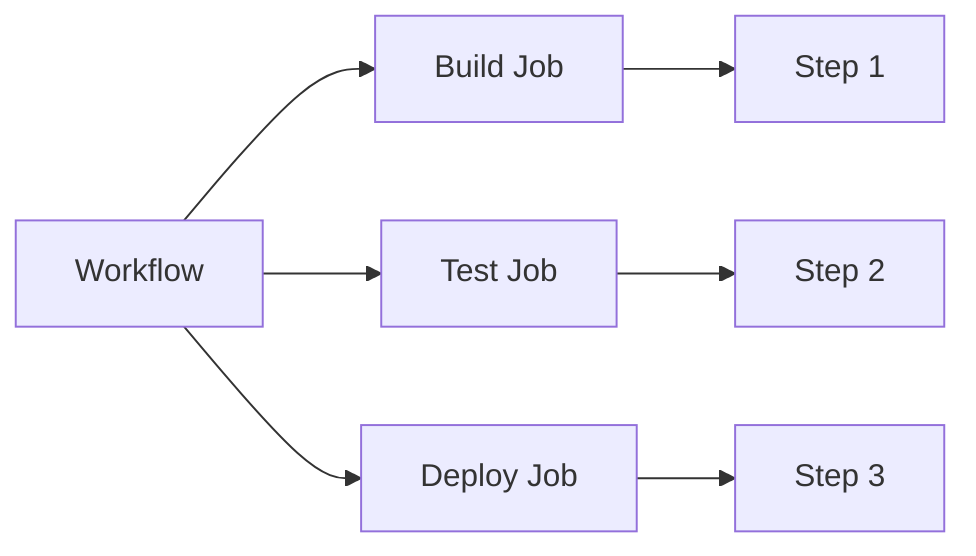
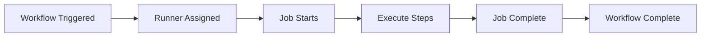
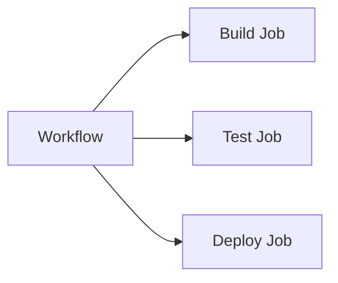
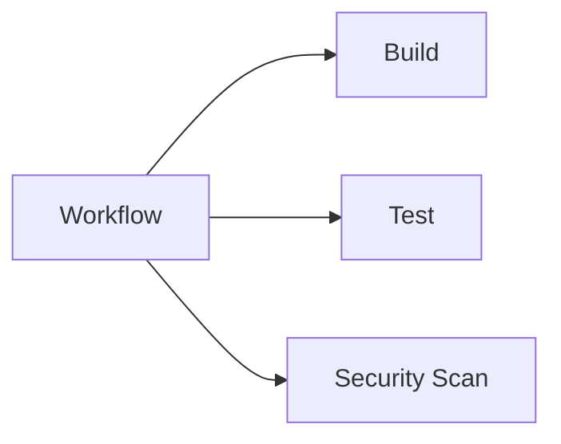
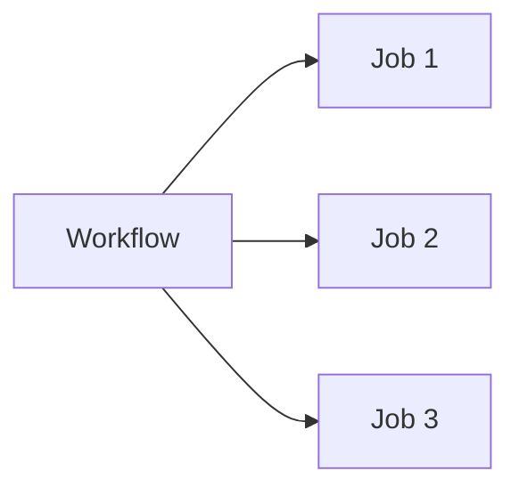
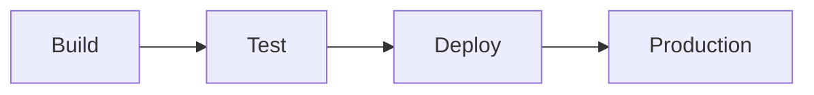

# Jobs & Steps

## Overview

A GitHub Actions **workflow** consists of one or more **jobs**, and each job contains one or more **steps**.

- **Workflow** → Complete automation pipeline
- **Job** → A group of related tasks executed on a runner
- **Step** → An individual task within a job

Jobs can run:

- Independently
- In parallel
- Sequentially (using dependencies)

> **Interview Tip**
>
> One workflow can contain multiple jobs, and each job runs on its own runner unless dependencies are defined.

---

## Why It Is Used

Jobs and Steps help:

- Organize CI/CD pipelines
- Separate build, test, and deployment stages
- Execute tasks in parallel for faster pipelines
- Define execution order
- Improve workflow readability and maintainability

Common examples:

- Build Job
- Test Job
- Security Scan Job
- Docker Build Job
- Deployment Job

---

## Architecture / Working



---

## Key Components

| Component | Purpose |
|------------|----------|
| Workflow | Complete automation pipeline |
| Job | Logical unit of work |
| Step | Individual task |
| Runner | Executes a job |
| Action | Reusable automation |
| Command | Shell command executed by a step |

---

## Types (if applicable)

### Job Types

- Independent Jobs
- Parallel Jobs
- Sequential Jobs
- Dependent Jobs

### Step Types

- `run` step
- `uses` step

---

## Lifecycle / Workflow (if applicable)



---

## Configuration / Syntax (if applicable)

Basic workflow

```yaml
name: CI

on:
  push:

jobs:

  build:

    runs-on: ubuntu-latest

    steps:

      - uses: actions/checkout@v4

      - name: Install

        run: npm install

      - name: Test

        run: npm test
```

Workflow hierarchy

```text
Workflow
│
├── Job
│     ├── Step
│     ├── Step
│     └── Step
│
├── Job
│     ├── Step
│     └── Step
│
└── Job
      └── Step
```

---

## Important Commands (if applicable)

Run workflow manually

```bash
gh workflow run ci.yml
```

View workflow runs

```bash
gh run list
```

View workflow logs

```bash
gh run view
```

---

## Important Files (if applicable)

```
.github/workflows/ci.yml
```

---

## Real-World Use Cases

- Build Java application
- Execute unit tests
- Build Docker image
- Push image to Docker Hub
- Deploy Kubernetes application
- Execute Terraform
- Run Ansible playbook

---

## Advantages

- Modular pipeline
- Better organization
- Supports dependencies
- Faster execution with parallel jobs
- Easy debugging

---

## Limitations

- Complex dependency chains become difficult to maintain.
- Parallel jobs consume more runners.
- Large workflows require careful planning.

---

## Common Interview Questions (Concept Only)

- What is a Job?
- What is a Step?
- What is the difference between a Job and a Step?
- Can one workflow contain multiple jobs?
- Can jobs run in parallel?
- How do jobs depend on one another?
- Can steps run in parallel?
- Does every job run on the same runner?

---

## Common Mistakes

- Putting unrelated tasks in one job
- Forgetting job dependencies
- Assuming steps execute in parallel
- Using multiple jobs when steps are sufficient
- Hardcoding repeated commands instead of reusable actions

---

## Troubleshooting

| Problem | Possible Cause | Solution |
|----------|----------------|----------|
| Job skipped | Dependency failed | Check `needs` configuration |
| Job failed | Step failed | Review step logs |
| Unexpected execution order | Missing dependency | Configure `needs` |
| Slow workflow | Sequential jobs | Use parallel jobs where appropriate |
| Runner unavailable | Invalid `runs-on` | Verify runner label |

---

## Summary

Jobs divide a workflow into logical execution units, while steps define the individual tasks within each job.

Key interview points:

- Workflow → Jobs → Steps
- Jobs execute on runners.
- Steps execute sequentially inside a job.
- Jobs can execute in parallel or sequentially.
- Use dependencies to control execution order.

---

# Jobs

## Overview

A **Job** is a collection of related steps executed on the same runner.

Every workflow contains at least one job.

Each job:

- Has a unique name
- Runs on a runner
- Contains multiple steps
- Produces an independent execution result

> **Interview Tip**
>
> Every job starts with a **fresh runner environment** unless using a self-hosted runner with persistent state.

---

## Why It Is Used

Jobs separate pipeline stages.

Typical jobs include:

- Build
- Test
- Package
- Security Scan
- Deploy

---

## Architecture / Working



---

## Key Components

| Component | Purpose |
|-----------|----------|
| Job Name | Unique identifier |
| Runner | Execution environment |
| Steps | Tasks performed |
| Outputs | Share data with other jobs |
| Dependencies | Execution order |

---

## Types (if applicable)

- Independent Job
- Parallel Job
- Sequential Job

---

## Lifecycle / Workflow


---

## Configuration / Syntax (if applicable)

```yaml
jobs:

  build:

    runs-on: ubuntu-latest

    steps:

      - run: echo "Build Started"
```

---

## Important Commands (if applicable)

```bash
gh run list
```

---

## Important Files (if applicable)

```
.github/workflows/*.yml
```

---

## Real-World Use Cases

- Build application
- Test application
- Deploy infrastructure

---

## Advantages

- Modular execution
- Independent status
- Better organization

---

## Limitations

- Each job starts with a fresh environment
- Sharing data requires artifacts or outputs

---

## Common Interview Questions (Concept Only)

- What is a Job?
- Can jobs share files?
- Does every job run on a separate runner?

---

## Common Mistakes

- Combining all work into one job
- Forgetting dependencies

---

## Troubleshooting

| Problem | Cause | Solution |
|----------|--------|----------|
| Job skipped | Dependency failed | Review previous jobs |
| Job failed | Runner issue | Verify runner |

---

## Summary

A Job groups related steps and runs independently on a runner.

---

# Steps

## Overview

A **Step** is the smallest execution unit within a job.

Each step performs one task.

Steps execute **sequentially** inside a job.

---

## Why It Is Used

Steps divide a job into manageable tasks.

Examples:

- Checkout code
- Install packages
- Build application
- Run tests
- Deploy

---

## Architecture / Working


---

## Key Components

- Name
- Action
- Command

---

## Types (if applicable)

- `run`
- `uses`

---

## Lifecycle / Workflow


---

## Configuration / Syntax (if applicable)

Run command

```yaml
- name: Build

  run: npm run build
```

Reusable Action

```yaml
- uses: actions/checkout@v4
```

---

## Important Commands (if applicable)

None

---

## Important Files (if applicable)

Workflow YAML

---

## Real-World Use Cases

- Install dependencies
- Build Docker image
- Execute Terraform

---

## Advantages

- Small reusable tasks
- Easy debugging

---

## Limitations

- Cannot run simultaneously inside the same job

---

## Common Interview Questions (Concept Only)

- What is a Step?
- What is the difference between `run` and `uses`?

---

## Common Mistakes

- Long shell scripts inside one step
- Combining unrelated tasks

---

## Troubleshooting

| Problem | Cause | Solution |
|----------|--------|----------|
| Step failed | Command error | Review logs |
| Action failed | Invalid version | Update action |

---

## Summary

Steps perform individual tasks and always execute sequentially within a job.

---

# Job Dependencies

## Overview

Job dependencies define the execution order between jobs.

Dependencies are configured using the **`needs`** keyword.

---

## Why It Is Used

Dependencies ensure:

- Build completes before testing
- Tests pass before deployment
- Security scans complete before release

---

## Architecture / Working


---

## Key Components

- `needs`
- Job outputs

---

## Types (if applicable)

Single dependency

Multiple dependencies

---

## Lifecycle / Workflow


---

## Configuration / Syntax (if applicable)

```yaml
jobs:

  build:

    runs-on: ubuntu-latest

  test:

    needs: build

    runs-on: ubuntu-latest
```

Multiple dependencies

```yaml
needs:
  - build
  - security
```

---

## Important Commands (if applicable)

None

---

## Important Files (if applicable)

Workflow YAML

---

## Real-World Use Cases

- Build before test
- Test before deployment
- Security scan before production

---

## Advantages

- Controlled execution
- Reliable deployments

---

## Limitations

- Failed dependency skips downstream jobs

---

## Common Interview Questions (Concept Only)

- What is `needs`?
- Why use dependencies?

---

## Common Mistakes

- Missing dependencies
- Circular dependencies

---

## Troubleshooting

| Problem | Cause | Solution |
|----------|--------|----------|
| Job skipped | Dependency failed | Review previous job |
| Wrong order | Missing `needs` | Add dependency |

---

## Summary

The `needs` keyword controls job execution order and creates sequential workflows.

---

# Parallel Jobs

## Overview

Parallel jobs execute simultaneously when they have **no dependencies**.

---

## Why It Is Used

Parallel execution:

- Reduces pipeline time
- Improves efficiency
- Utilizes multiple runners

---

## Architecture / Working



---

## Key Components

- Independent jobs
- Multiple runners

---

## Types (if applicable)

- Two parallel jobs
- Multiple parallel jobs

---

## Lifecycle / Workflow



---

## Configuration / Syntax (if applicable)

Jobs without `needs` automatically execute in parallel.

---

## Important Commands (if applicable)

None

---

## Important Files (if applicable)

Workflow YAML

---

## Real-World Use Cases

- Build Windows
- Build Linux
- Build macOS

---

## Advantages

- Faster execution
- Better resource utilization

---

## Limitations

- Uses multiple runners
- Increased CI resource consumption

---

## Common Interview Questions (Concept Only)

- How do jobs run in parallel?

---

## Common Mistakes

- Adding unnecessary dependencies

---

## Troubleshooting

| Problem | Cause | Solution |
|----------|--------|----------|
| Jobs not parallel | `needs` configured | Remove dependency |

---

## Summary

Jobs without dependencies execute in parallel by default.

---

# Sequential Jobs

## Overview

Sequential jobs execute one after another based on dependencies.

---

## Why It Is Used

Sequential execution ensures:

- Build succeeds before testing
- Testing succeeds before deployment
- Deployment occurs only after validation

---

## Architecture / Working


---

## Key Components

- `needs`
- Dependency chain

---

## Types (if applicable)

- Linear pipeline
- Multi-stage deployment

---

## Lifecycle / Workflow



---

## Configuration / Syntax (if applicable)

```yaml
test:

  needs: build

deploy:

  needs: test
```

---

## Important Commands (if applicable)

None

---

## Important Files (if applicable)

Workflow YAML

---

## Real-World Use Cases

- CI/CD pipeline
- Production deployment
- Infrastructure automation

---

## Advantages

- Reliable execution
- Controlled deployments

---

## Limitations

- Longer pipeline execution time
- Dependent jobs wait for previous jobs to finish

---

## Common Interview Questions (Concept Only)

- How do sequential jobs work?
- Which keyword creates job dependencies?

---

## Common Mistakes

- Missing dependencies
- Incorrect dependency order

---

## Troubleshooting

| Problem | Cause | Solution |
|----------|--------|----------|
| Deployment skipped | Build failed | Fix upstream job |
| Wrong order | Missing `needs` | Configure dependencies |

---

## Summary

Sequential jobs execute in a controlled order using the `needs` keyword.

> **Interview Tip**
>
> Remember the execution behavior:
>
> - **Steps** within a job always execute **sequentially**.
> - **Jobs** execute **in parallel by default**.
> - Use the **`needs`** keyword to make jobs execute **sequentially**.
> - Each job runs on its own runner unless configured otherwise.
