# Common Workflow Commands

## Overview

GitHub Actions provides reusable actions that simplify common CI/CD tasks. Instead of writing shell scripts for every operation, official and community actions can be used to perform tasks such as:

- Checking out source code
- Setting up programming languages
- Caching dependencies
- Uploading build artifacts
- Downloading artifacts

These actions are reusable, maintained, and optimized for GitHub Actions workflows.

> **Interview Tip**
>
> The most frequently used GitHub Actions in real-world CI/CD pipelines are:
>
> - `actions/checkout`
> - `actions/setup-node`
> - `actions/setup-java`
> - `actions/cache`
> - `actions/upload-artifact`
> - `actions/download-artifact`

---

## Why It Is Used

Workflow commands help to:

- Reduce workflow complexity
- Reuse common tasks
- Improve workflow readability
- Speed up CI/CD pipelines
- Standardize automation
- Simplify maintenance

---

## Architecture / Working

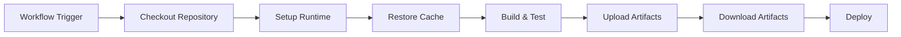

---

## Key Components

| Action | Purpose |
|----------|----------|
| actions/checkout | Downloads repository |
| actions/setup-node | Installs Node.js |
| actions/setup-java | Installs Java |
| actions/cache | Restores/Saves dependency cache |
| upload-artifact | Uploads workflow files |
| download-artifact | Downloads uploaded files |

---

## Types (if applicable)

Official GitHub Actions

- Checkout Actions
- Runtime Setup Actions
- Cache Actions
- Artifact Actions

---

## Lifecycle / Workflow (if applicable)

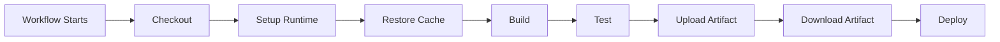

---

## Configuration / Syntax (if applicable)

Example

```yaml
steps:

- uses: actions/checkout@v4

- uses: actions/setup-node@v4
  with:
    node-version: 20

- run: npm install

- run: npm test
```

---

## Important Commands (if applicable)

None

These are GitHub Actions rather than shell commands.

---

## Important Files (if applicable)

```
.github/
└── workflows/
      build.yml
```

---

## Real-World Use Cases

- CI pipelines
- Build automation
- Dependency management
- Test execution
- Artifact storage
- Deployment pipelines

---

## Advantages

- Officially maintained
- Easy to configure
- Reusable
- Faster workflows
- Reduced scripting

---

## Limitations

- Version compatibility must be managed.
- Third-party actions should be reviewed before use.
- Incorrect configuration can break workflows.

---

## Common Interview Questions (Concept Only)

- What are GitHub Actions?
- Which actions are commonly used?
- Why use official actions instead of shell scripts?
- How are actions versioned?

---

## Common Mistakes

- Using outdated action versions
- Forgetting to checkout repository
- Missing runtime setup
- Incorrect artifact paths
- Not using dependency caching

---

## Troubleshooting

| Problem | Possible Cause | Solution |
|----------|----------------|----------|
| Repository files missing | Checkout skipped | Add `actions/checkout` |
| Runtime unavailable | Setup action missing | Configure setup action |
| Cache not restored | Incorrect cache key | Verify cache configuration |
| Artifact missing | Wrong upload path | Check upload path |

---

## Summary

Official workflow actions simplify CI/CD pipelines by automating common tasks such as checking out code, configuring runtimes, caching dependencies, and transferring build artifacts.

> **Interview Tip**
>
> A typical workflow sequence is:
>
> **Checkout → Setup Runtime → Restore Cache → Build → Test → Upload Artifacts → Deploy**

---

# actions/checkout

## Overview

`actions/checkout` downloads the repository source code to the GitHub Actions runner.

Without this action, the workflow cannot access project files.

---

## Why It Is Used

- Download repository
- Access source code
- Build applications
- Run tests
- Package software

---

## Architecture / Working

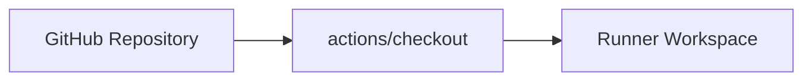

---

## Key Components

| Component | Purpose |
|----------|----------|
| Repository | Source code |
| Runner | Executes workflow |
| Workspace | Local copy |

---

## Types (if applicable)

- Default checkout
- Specific branch checkout
- Different repository checkout

---

## Lifecycle / Workflow (if applicable)

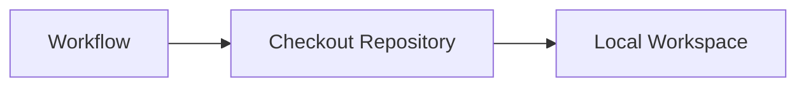

---

## Configuration / Syntax (if applicable)

```yaml
- uses: actions/checkout@v4
```

Checkout a specific branch

```yaml
- uses: actions/checkout@v4
  with:
    ref: main
```

---

## Important Commands (if applicable)

None

---

## Important Files (if applicable)

Repository source code

---

## Real-World Use Cases

- CI builds
- Docker builds
- Terraform deployments
- Kubernetes deployments

---

## Advantages

- Fast
- Official action
- Required by most workflows

---

## Limitations

- Large repositories increase checkout time

---

## Common Interview Questions (Concept Only)

- Why is checkout required?
- What happens if checkout is skipped?

---

## Common Mistakes

- Forgetting checkout
- Wrong branch reference

---

## Troubleshooting

| Problem | Cause | Solution |
|----------|--------|----------|
| Files not found | Checkout missing | Add checkout step |

---

## Summary

`actions/checkout` is typically the first step in almost every GitHub Actions workflow.

---

# actions/setup-node

## Overview

`actions/setup-node` installs a specified version of Node.js on the runner.

---

## Why It Is Used

- Install Node.js
- Configure npm
- Build JavaScript applications
- Run Node.js tests

---

## Architecture / Working

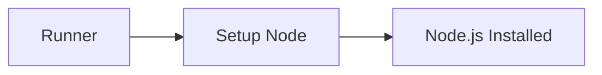

---

## Key Components

| Component | Purpose |
|----------|----------|
| Node Version | Runtime version |
| npm | Package manager |

---

## Types (if applicable)

Supported versions

- 18
- 20
- 22

---

## Lifecycle / Workflow (if applicable)


---

## Configuration / Syntax (if applicable)

```yaml
- uses: actions/setup-node@v4
  with:
    node-version: 20
```

---

## Important Commands (if applicable)

```bash
npm install

npm run build

npm test
```

---

## Important Files (if applicable)

```
package.json
package-lock.json
```

---

## Real-World Use Cases

- React
- Angular
- Node.js APIs
- Next.js

---

## Advantages

- Easy runtime installation
- Supports version selection
- Official action

---

## Limitations

- Incorrect version causes build failures

---

## Common Interview Questions (Concept Only)

- What is setup-node?
- Why specify Node version?

---

## Common Mistakes

- Wrong Node version
- Missing package installation

---

## Troubleshooting

| Problem | Cause | Solution |
|----------|--------|----------|
| Node not found | Setup skipped | Add setup-node |

---

## Summary

`actions/setup-node` installs Node.js before running JavaScript or Node.js applications.

---

# actions/setup-java

## Overview

`actions/setup-java` installs Java and configures Maven or Gradle.

---

## Why It Is Used

- Install Java
- Configure Maven
- Configure Gradle
- Build Java projects

---

## Architecture / Working

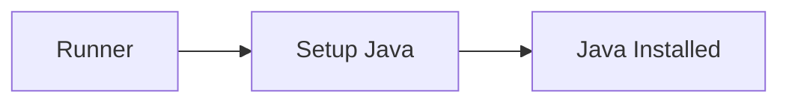

---

## Key Components

| Component | Purpose |
|----------|----------|
| JDK | Java runtime |
| Maven | Build tool |
| Gradle | Build tool |

---

## Types (if applicable)

Common JDK versions

- 17
- 21

---

## Lifecycle / Workflow (if applicable)

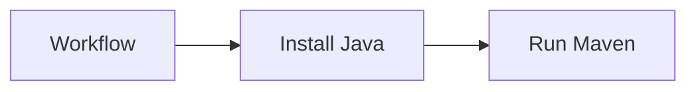

---

## Configuration / Syntax (if applicable)

```yaml
- uses: actions/setup-java@v4
  with:
    distribution: temurin
    java-version: 21
```

---

## Important Commands (if applicable)

```bash
mvn test

mvn package
```

---

## Important Files (if applicable)

```
pom.xml
build.gradle
```

---

## Real-World Use Cases

- Spring Boot
- Java APIs
- Enterprise applications

---

## Advantages

- Official
- Supports multiple JDKs
- Maven integration

---

## Limitations

- Wrong Java version breaks builds

---

## Common Interview Questions (Concept Only)

- What is setup-java?
- Which JDK versions are supported?

---

## Common Mistakes

- Wrong Java version

---

## Troubleshooting

| Problem | Cause | Solution |
|----------|--------|----------|
| Java missing | Setup skipped | Configure setup-java |

---

## Summary

`actions/setup-java` installs Java for Maven and Gradle projects.

---

# actions/cache

## Overview

`actions/cache` stores dependencies between workflow runs, reducing download time and improving build performance.

---

## Why It Is Used

- Speed up workflows
- Reuse dependencies
- Reduce build time
- Lower network usage

---

## Architecture / Working

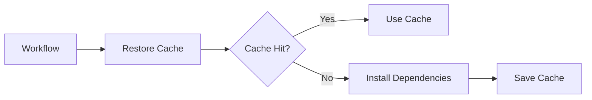

---

## Key Components

| Component | Purpose |
|----------|----------|
| Cache Key | Unique identifier |
| Cache Path | Cached files |
| Restore Key | Fallback key |

---

## Types (if applicable)

- npm cache
- Maven cache
- Gradle cache
- pip cache

---

## Lifecycle / Workflow (if applicable)


---

## Configuration / Syntax (if applicable)

```yaml
- uses: actions/cache@v4
```

---

## Important Commands (if applicable)

None

---

## Important Files (if applicable)

Dependency cache folders

---

## Real-World Use Cases

- npm caching
- Maven caching
- Python dependency caching

---

## Advantages

- Faster builds
- Reduced downloads

---

## Limitations

- Poor cache keys reduce effectiveness
- Large caches increase storage usage

---

## Common Interview Questions (Concept Only)

- What is dependency caching?
- What is a cache key?

---

## Common Mistakes

- Using non-unique cache keys

---

## Troubleshooting

| Problem | Cause | Solution |
|----------|--------|----------|
| Cache miss | Wrong key | Verify cache key |

---

## Summary

`actions/cache` significantly improves workflow performance by reusing dependencies.

---

# upload-artifact

## Overview

`actions/upload-artifact` uploads files generated during a workflow.

Artifacts remain available after workflow completion.

---

## Why It Is Used

- Store build outputs
- Save logs
- Preserve reports
- Share files between jobs

---

## Architecture / Working

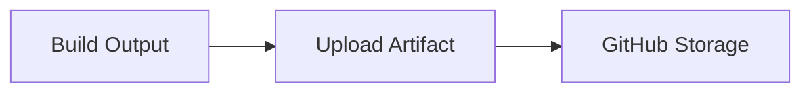

---

## Key Components

| Component | Purpose |
|----------|----------|
| Artifact | Stored file |
| Upload Action | Uploads files |

---

## Types (if applicable)

- Build packages
- Logs
- Reports

---

## Lifecycle / Workflow (if applicable)


---

## Configuration / Syntax (if applicable)

```yaml
- uses: actions/upload-artifact@v4
  with:
    name: build
    path: dist/
```

---

## Important Commands (if applicable)

None

---

## Important Files (if applicable)

Generated files

---

## Real-World Use Cases

- Publish binaries
- Store reports
- Share deployment packages

---

## Advantages

- Persistent storage
- Multi-job sharing

---

## Limitations

- Storage limits
- Upload time increases with artifact size

---

## Common Interview Questions (Concept Only)

- What is an artifact?
- Why upload artifacts?

---

## Common Mistakes

- Wrong artifact path

---

## Troubleshooting

| Problem | Cause | Solution |
|----------|--------|----------|
| Empty artifact | Wrong path | Verify upload path |

---

## Summary

`upload-artifact` stores generated workflow files for later use.

---

# download-artifact

## Overview

`actions/download-artifact` retrieves artifacts uploaded earlier in the same workflow.

It is commonly used in deployment jobs.

---

## Why It Is Used

- Retrieve build packages
- Share files across jobs
- Deploy applications

---

## Architecture / Working

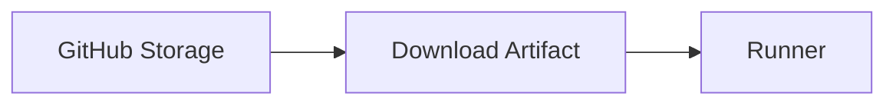

---

## Key Components

| Component | Purpose |
|----------|----------|
| Artifact | Stored file |
| Download Action | Retrieves artifact |

---

## Types (if applicable)

- Build package
- Test reports
- Deployment package

---

## Lifecycle / Workflow (if applicable)

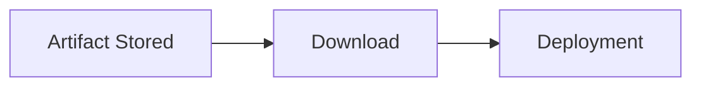

---

## Configuration / Syntax (if applicable)

```yaml
- uses: actions/download-artifact@v4
  with:
    name: build
```

---

## Important Commands (if applicable)

None

---

## Important Files (if applicable)

Downloaded artifact directory

---

## Real-World Use Cases

- Deploy build outputs
- Share files across jobs
- Release automation

---

## Advantages

- Simplifies multi-job workflows
- Reuses generated files

---

## Limitations

- Artifact must exist before download
- Retention period applies

---

## Common Interview Questions (Concept Only)

- What is download-artifact?
- Can artifacts be shared between jobs?

---

## Common Mistakes

- Wrong artifact name
- Download before upload

---

## Troubleshooting

| Problem | Cause | Solution |
|----------|--------|----------|
| Artifact not found | Wrong name | Verify artifact name |
| Download failed | Artifact expired | Increase retention period |

---

## Summary

`download-artifact` retrieves previously uploaded workflow artifacts, enabling build and deployment jobs to share files efficiently.

> **Interview Tip**
>
> Remember these commonly used GitHub Actions:
>
> | Action | Purpose |
> |--------|---------|
> | `actions/checkout` | Download repository |
> | `actions/setup-node` | Install Node.js |
> | `actions/setup-java` | Install Java |
> | `actions/cache` | Cache dependencies |
> | `actions/upload-artifact` | Upload workflow outputs |
> | `actions/download-artifact` | Download workflow outputs |
