# Application Sync

## Overview

Application Sync is the core process in Argo CD that ensures the **live state** of resources in a Kubernetes cluster matches the **desired state** stored in a Git repository.

Whenever Argo CD detects a difference between Git and the cluster, it can either:

- Wait for a manual synchronization
- Automatically synchronize the changes

> **Interview Tip**
>
> **Synchronization (Sync)** is the process of applying the manifests stored in Git to the Kubernetes cluster.

---

## Why It Is Used

Application Sync helps to:

- Keep Kubernetes clusters consistent with Git
- Automatically deploy new changes
- Prevent configuration drift
- Support GitOps workflows
- Recover deleted or modified resources
- Simplify rollbacks

---

## Architecture / Working

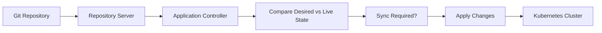

---

## Key Components

| Component | Purpose |
|-----------|----------|
| Git Repository | Desired state |
| Repository Server | Reads manifests |
| Application Controller | Detects differences |
| Sync Engine | Applies changes |
| Kubernetes API | Creates or updates resources |
| Application Status | Displays synchronization state |

---

## Types (if applicable)

| Sync Mode | Description |
|-----------|-------------|
| Manual Sync | User initiates synchronization |
| Automatic Sync | Argo CD synchronizes automatically |

---

## Lifecycle / Workflow (if applicable)

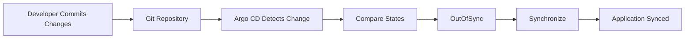

---

## Configuration / Syntax (if applicable)

Manual Sync

```yaml
spec:
  syncPolicy: {}
```

Automatic Sync

```yaml
spec:
  syncPolicy:
    automated: {}
```

Automatic Sync with Prune and Self-Heal

```yaml
spec:
  syncPolicy:
    automated:
      prune: true
      selfHeal: true
```

---

## Important Commands (if applicable)

```bash
argocd app sync <application>

argocd app get <application>

argocd app diff <application>

argocd app list

argocd app wait <application>

argocd app refresh <application>
```

---

## Important Files (if applicable)

```
application.yaml
```

---

## Real-World Use Cases

- Production deployments
- Continuous Delivery
- Kubernetes configuration management
- Disaster recovery
- Automatic drift correction
- Multi-cluster deployments

---

## Advantages

- Fully automated deployments
- Prevents configuration drift
- Git remains the source of truth
- Supports rollback
- Improves deployment consistency

---

## Limitations

- Invalid manifests prevent synchronization
- Automatic sync may deploy unintended changes if Git is updated incorrectly
- Repository availability is required

---

## Common Interview Questions (Concept Only)

- What is Application Sync?
- What happens during synchronization?
- What is the difference between Manual Sync and Automatic Sync?
- What does Self-Heal do?
- What is Prune?

---

## Common Mistakes

- Forgetting to enable automatic sync
- Using automatic sync without reviewing Git changes
- Ignoring OutOfSync applications
- Deploying incorrect manifests

---

## Troubleshooting

| Problem | Possible Cause | Solution |
|----------|----------------|----------|
| Sync failed | Invalid YAML | Validate manifests |
| Application remains OutOfSync | Live cluster differs | Perform synchronization |
| Resources missing | Prune disabled | Enable pruning if appropriate |
| Continuous OutOfSync | Manual cluster changes | Enable Self-Heal |
| Sync timeout | Kubernetes API unavailable | Verify cluster connectivity |

---

## Summary

Application Sync is the mechanism that applies Git changes to Kubernetes. It continuously compares the desired state stored in Git with the live cluster state and synchronizes differences either manually or automatically.

> **Interview Tip**
>
> **Git → Compare → Sync → Kubernetes**

---

# Manual Sync

## Overview

Manual Sync requires a user to explicitly trigger synchronization after Argo CD detects changes.

No deployment occurs automatically.

---

## Why It Is Used

Manual Sync provides:

- Deployment approval
- Change validation
- Controlled production releases
- Reduced deployment risk

---

## Architecture / Working

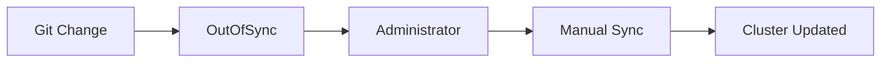

---

## Key Components

| Component | Purpose |
|-----------|----------|
| Git Repository | Desired state |
| Administrator | Initiates sync |
| Application Controller | Executes deployment |

---

## Types (if applicable)

- UI Sync
- CLI Sync
- API Sync

---

## Lifecycle / Workflow (if applicable)


---

## Configuration / Syntax (if applicable)

No automated policy

```yaml
syncPolicy: {}
```

---

## Important Commands (if applicable)

```bash
argocd app sync myapp
```

---

## Important Files (if applicable)

```
application.yaml
```

---

## Real-World Use Cases

- Production deployments
- Change approval process
- Financial applications
- Healthcare systems

---

## Advantages

- Full deployment control
- Safer production releases

---

## Limitations

- Requires manual intervention
- Slower deployments

---

## Common Interview Questions (Concept Only)

- When should Manual Sync be used?
- How do you manually synchronize an application?

---

## Common Mistakes

- Forgetting to sync after Git changes

---

## Troubleshooting

- Verify application status before syncing

---

## Summary

Manual Sync is ideal when deployments require human approval before applying changes.

---

# Automatic Sync

## Overview

Automatic Sync allows Argo CD to deploy changes automatically whenever the desired state in Git changes.

No administrator interaction is required.

---

## Why It Is Used

Automatic Sync enables:

- Continuous Delivery
- GitOps automation
- Faster deployments
- Drift correction

---

## Architecture / Working

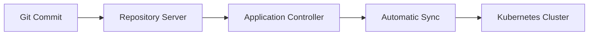

---

## Key Components

| Component | Purpose |
|-----------|----------|
| Automated Sync | Deploy changes automatically |
| Self-Heal | Correct manual drift |
| Prune | Delete obsolete resources |

---

## Types (if applicable)

Automatic Sync options

- Automated
- Automated + Self-Heal
- Automated + Prune
- Automated + Self-Heal + Prune

---

## Lifecycle / Workflow (if applicable)

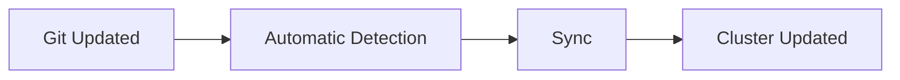

---

## Configuration / Syntax (if applicable)

```yaml
syncPolicy:
  automated:
    prune: true
    selfHeal: true
```

---

## Important Commands (if applicable)

```bash
argocd app get
```

---

## Important Files (if applicable)

```
application.yaml
```

---

## Real-World Use Cases

- CI/CD pipelines
- Kubernetes GitOps
- Infrastructure automation

---

## Advantages

- Fully automated
- Continuous deployment
- Reduces manual work

---

## Limitations

- Incorrect Git commits deploy automatically

---

## Common Interview Questions (Concept Only)

- What is Automatic Sync?
- What is Self-Heal?
- What is Prune?

---

## Common Mistakes

- Enabling automatic sync without code review

---

## Troubleshooting

- Verify automated policy configuration

---

## Summary

Automatic Sync continuously keeps Kubernetes synchronized with Git.

---

# Sync Status

## Overview

Sync Status indicates whether the Kubernetes cluster matches the desired configuration stored in Git.

---

## Why It Is Used

It helps administrators identify:

- Configuration drift
- Deployment status
- Pending synchronization

---

## Architecture / Working

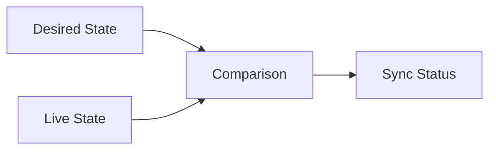

---

## Key Components

| Status | Meaning |
|---------|----------|
| Synced | Cluster matches Git |
| OutOfSync | Differences detected |
| Unknown | Unable to determine status |

---

## Types (if applicable)

- Synced
- OutOfSync
- Unknown

---

## Lifecycle / Workflow (if applicable)

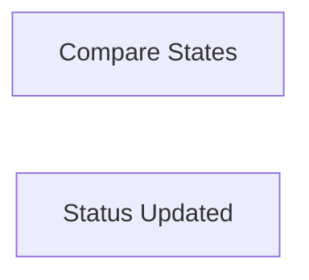

---

## Configuration / Syntax (if applicable)

None

---

## Important Commands (if applicable)

```bash
argocd app get myapp
```

---

## Important Files (if applicable)

None

---

## Real-World Use Cases

- Deployment monitoring
- Drift detection

---

## Advantages

- Immediate visibility
- Easy troubleshooting

---

## Limitations

- Requires successful comparison

---

## Common Interview Questions (Concept Only)

- What does OutOfSync mean?
- What is Synced status?

---

## Common Mistakes

- Ignoring OutOfSync applications

---

## Troubleshooting

- Compare Git and cluster resources

---

## Summary

Sync Status indicates whether Kubernetes matches the desired state stored in Git.

---

# Sync Options

## Overview

Sync Options customize how Argo CD performs synchronization.

They control deployment behavior beyond the default settings.

---

## Why It Is Used

Sync Options help:

- Improve deployment flexibility
- Enable namespace creation
- Optimize resource replacement
- Customize synchronization behavior

---

## Architecture / Working

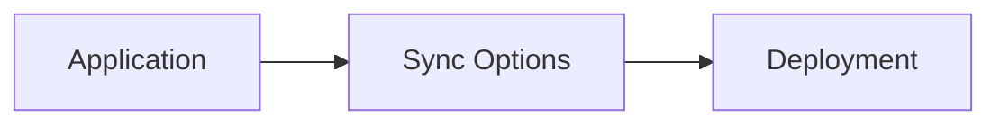

---

## Key Components

Common options

| Option | Purpose |
|---------|----------|
| CreateNamespace | Automatically create namespace |
| Replace | Replace existing resources |
| Validate | Enable or disable validation |
| Prune | Remove obsolete resources |

---

## Types (if applicable)

Frequently used options

- CreateNamespace
- Replace
- Validate
- ApplyOutOfSyncOnly

---

## Lifecycle / Workflow (if applicable)

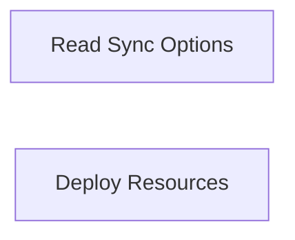

---

## Configuration / Syntax (if applicable)

```yaml
syncPolicy:
  syncOptions:
    - CreateNamespace=true
```

---

## Important Commands (if applicable)

```bash
argocd app sync
```

---

## Important Files (if applicable)

```
application.yaml
```

---

## Real-World Use Cases

- Namespace automation
- Production deployments
- GitOps optimization

---

## Advantages

- Flexible deployments
- Reduced manual configuration

---

## Limitations

- Incorrect options may affect deployments

---

## Common Interview Questions (Concept Only)

- What are Sync Options?
- What does CreateNamespace do?

---

## Common Mistakes

- Using unsupported sync options

---

## Troubleshooting

- Verify application YAML

---

## Summary

Sync Options provide fine-grained control over how Argo CD synchronizes applications.

---

# Refresh Application

## Overview

Refreshing an application forces Argo CD to immediately re-evaluate the application's state instead of waiting for the next reconciliation cycle.

Refreshing **does not deploy changes**. It only updates Argo CD's view of the application's status.

> **Interview Tip**
>
> **Refresh = Re-check**
>
> **Sync = Deploy**

---

## Why It Is Used

Refresh helps to:

- Detect recent Git commits
- Update application status
- Recalculate Sync Status
- Troubleshoot synchronization issues

---

## Architecture / Working

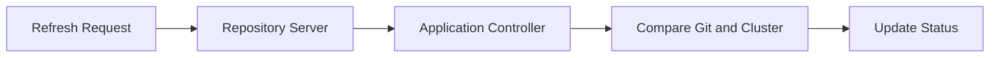

---

## Key Components

| Component | Purpose |
|-----------|----------|
| Refresh | Updates application state |
| Repository Server | Fetches latest Git data |
| Controller | Re-evaluates application |

---

## Types (if applicable)

| Refresh Type | Description |
|--------------|-------------|
| Normal Refresh | Uses cached repository data |
| Hard Refresh | Fetches the latest repository data from Git |

---

## Lifecycle / Workflow (if applicable)

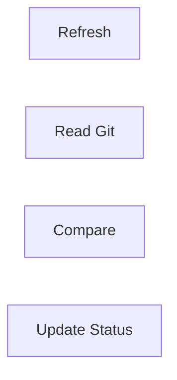

---

## Configuration / Syntax (if applicable)

No YAML configuration is required.

---

## Important Commands (if applicable)

```bash
argocd app refresh myapp

argocd app get myapp
```

---

## Important Files (if applicable)

None

---

## Real-World Use Cases

- Verify recent Git changes
- Update application health
- Troubleshoot stale status
- Confirm synchronization state

---

## Advantages

- Fast status updates
- Useful for troubleshooting
- Does not modify cluster resources

---

## Limitations

- Does not deploy changes
- Requires repository connectivity

---

## Common Interview Questions (Concept Only)

- What is the difference between Refresh and Sync?
- When should you refresh an application?
- Does Refresh deploy resources?

---

## Common Mistakes

- Assuming Refresh applies changes
- Forgetting to Sync after Refresh when the application is OutOfSync

---

## Troubleshooting

| Problem | Solution |
|----------|----------|
| Status not updating | Refresh the application |
| Repository cache outdated | Perform a hard refresh |
| OutOfSync remains | Run a synchronization |

---

## Summary

Refreshing an application forces Argo CD to re-evaluate the latest Git and cluster states without modifying Kubernetes resources. It is commonly used to update application status and verify synchronization before performing a deployment.

> **Interview Tip**
>
> Remember the difference:
>
> | Operation | Purpose |
> |-----------|---------|
> | **Refresh** | Re-read Git and update application status |
> | **Sync** | Apply Git changes to the Kubernetes cluster |
>
> **One-line Interview Answer:**  
> **Application Sync is the GitOps mechanism that keeps Kubernetes synchronized with Git, while Refresh simply updates Argo CD's understanding of the application's current state without deploying any changes.**
