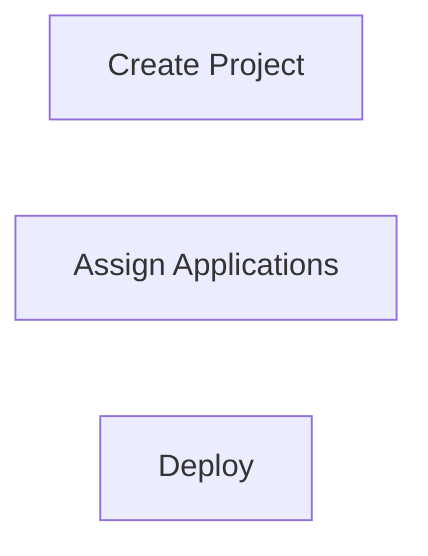
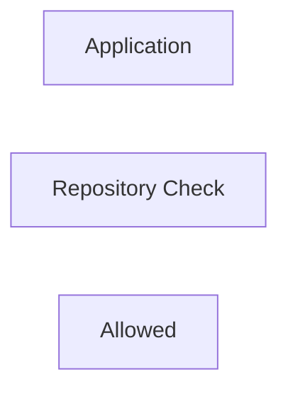
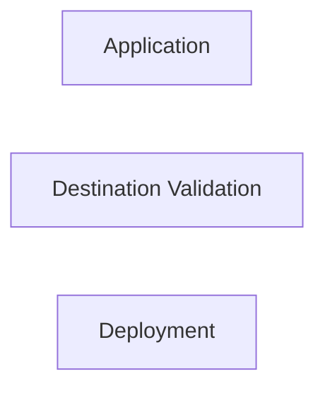
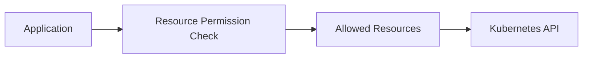
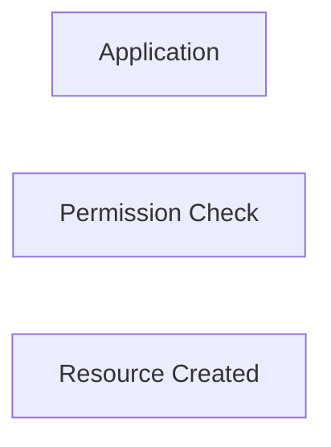

# Projects

## Overview

An **AppProject** in Argo CD is a logical grouping of applications that defines **security boundaries, access control, and deployment policies**.

Projects determine:

- Which Git repositories applications can use
- Which Kubernetes clusters applications can deploy to
- Which namespaces are allowed
- Which Kubernetes resources can be managed
- Which users or groups can access the applications

> **Interview Tip**
>
> Think of an AppProject as a **security policy** for Argo CD applications.

---

## Why It Is Used

Projects help organizations to:

- Implement Role-Based Access Control (RBAC)
- Restrict deployments to approved environments
- Limit Git repositories
- Prevent accidental deployments
- Separate Development, Testing, and Production
- Support multi-team Kubernetes environments

---

## Architecture / Working


---

## Key Components

| Component | Purpose |
|-----------|----------|
| AppProject | Defines deployment policies |
| Source Repositories | Allowed Git repositories |
| Destinations | Allowed clusters and namespaces |
| Resource Permissions | Allowed Kubernetes resources |
| Roles | RBAC permissions |
| Applications | Must belong to one project |

---

## Types (if applicable)

Common Project Types

| Project | Purpose |
|----------|---------|
| default | Default project |
| development | Development workloads |
| staging | Staging applications |
| production | Production applications |
| shared-services | Shared infrastructure |

---

## Lifecycle / Workflow (if applicable)


---

## Configuration / Syntax (if applicable)

Example AppProject

```yaml
apiVersion: argoproj.io/v1alpha1
kind: AppProject

metadata:
  name: production

spec:

  sourceRepos:
    - https://github.com/company/*

  destinations:
    - namespace: production
      server: https://kubernetes.default.svc

  clusterResourceWhitelist:
    - group: '*'
      kind: '*'
```

---

## Important Commands (if applicable)

```bash
argocd proj list

argocd proj get

argocd proj create

argocd proj delete

argocd app list
```

---

## Important Files (if applicable)

```
appproject.yaml

application.yaml
```

---

## Real-World Use Cases

- Multi-team Kubernetes environments
- Development and Production isolation
- Enterprise RBAC
- Git repository restrictions
- Namespace restrictions
- Compliance and governance

---

## Advantages

- Improved security
- Easier application organization
- Supports RBAC
- Prevents unauthorized deployments
- Simplifies multi-team management

---

## Limitations

- Requires proper planning
- Incorrect policies may block deployments
- More configuration for large environments

---

## Common Interview Questions (Concept Only)

- What is an AppProject?
- Why are Projects used?
- Can one project manage multiple applications?
- What policies can an AppProject enforce?
- Is the Project mandatory for every application?

---

## Common Mistakes

- Using the default project for every application
- Allowing unrestricted repositories
- Allowing deployments to every namespace
- Not implementing RBAC

---

## Troubleshooting

| Problem | Possible Cause | Solution |
|----------|----------------|----------|
| Application creation denied | Project restrictions | Verify AppProject configuration |
| Repository blocked | Repository not allowed | Update `sourceRepos` |
| Namespace denied | Namespace restriction | Update destinations |
| Cluster rejected | Destination restriction | Verify cluster configuration |
| Resource creation denied | Resource permission restriction | Update resource whitelist |

---

## Summary

Projects provide security, organization, and governance for Argo CD applications. Every application belongs to a project, and the project determines where it can deploy and what resources it can manage.

> **Interview Tip**
>
> AppProject = Security Policy + Deployment Policy + RBAC

---

# AppProject

## Overview

An **AppProject** is a Kubernetes Custom Resource Definition (CRD) that defines deployment rules for one or more Argo CD applications.

It is the primary mechanism used to implement access control and deployment restrictions.

---

## Why It Is Used

AppProjects provide:

- Security boundaries
- Namespace restrictions
- Repository restrictions
- Resource restrictions
- RBAC integration

---

## Architecture / Working


---

## Key Components

| Field | Purpose |
|--------|----------|
| sourceRepos | Allowed Git repositories |
| destinations | Allowed clusters and namespaces |
| roles | User permissions |
| clusterResourceWhitelist | Allowed cluster resources |
| namespaceResourceWhitelist | Allowed namespace resources |

---

## Types (if applicable)

- Default Project
- Custom Project

---

## Lifecycle / Workflow (if applicable)



---

## Configuration / Syntax (if applicable)

```yaml
kind: AppProject
```

---

## Important Commands (if applicable)

```bash
argocd proj create

argocd proj get
```

---

## Important Files (if applicable)

```
appproject.yaml
```

---

## Real-World Use Cases

- Production projects
- Team-specific projects
- Secure deployments

---

## Advantages

- Centralized security policies
- Easier management

---

## Limitations

- Incorrect configuration blocks deployments

---

## Common Interview Questions (Concept Only)

- What is an AppProject?
- Is AppProject a Kubernetes CRD?

---

## Common Mistakes

- Forgetting to assign applications to projects

---

## Troubleshooting

- Verify project configuration

---

## Summary

AppProject defines the policies that govern Argo CD applications.

---

# Source Repository Restrictions

## Overview

Source Repository Restrictions define **which Git repositories** an application is allowed to use.

Applications cannot deploy from repositories that are not explicitly permitted.

---

## Why It Is Used

Repository restrictions help:

- Improve security
- Prevent unauthorized deployments
- Restrict access to approved repositories
- Support enterprise governance

---

## Architecture / Working


---

## Key Components

| Component | Purpose |
|-----------|----------|
| sourceRepos | Allowed repositories |
| Repository URL | Git source |
| Wildcards | Allow multiple repositories |

---

## Types (if applicable)

Repository examples

```yaml
sourceRepos:
- https://github.com/company/*
```

Specific repository

```yaml
sourceRepos:
- https://github.com/company/app.git
```

---

## Lifecycle / Workflow (if applicable)



---

## Configuration / Syntax (if applicable)

```yaml
sourceRepos:
- https://github.com/company/*
```

---

## Important Commands (if applicable)

```bash
argocd proj get
```

---

## Important Files (if applicable)

```
appproject.yaml
```

---

## Real-World Use Cases

- Allow only company GitHub repositories
- Restrict public repositories

---

## Advantages

- Improved Git security

---

## Limitations

- Incorrect repository rules block deployments

---

## Common Interview Questions (Concept Only)

- How do Projects restrict Git repositories?
- Can wildcards be used?

---

## Common Mistakes

- Forgetting to whitelist repositories

---

## Troubleshooting

- Verify repository URL

---

## Summary

Repository restrictions ensure applications deploy only from trusted Git repositories.

---

# Destination Restrictions

## Overview

Destination Restrictions specify **which Kubernetes clusters and namespaces** an application can deploy to.

Applications attempting to deploy outside these destinations are denied.

---

## Why It Is Used

Destination restrictions help:

- Prevent accidental production deployments
- Separate environments
- Improve security
- Support multi-cluster deployments

---

## Architecture / Working


---

## Key Components

| Component | Purpose |
|-----------|----------|
| Cluster | Allowed deployment target |
| Namespace | Allowed namespace |
| Server | Kubernetes API endpoint |

---

## Types (if applicable)

Example

```yaml
destinations:
- namespace: production
  server: https://kubernetes.default.svc
```

---

## Lifecycle / Workflow (if applicable)



---

## Configuration / Syntax (if applicable)

```yaml
destinations:
- namespace: production
  server: https://kubernetes.default.svc
```

---

## Important Commands (if applicable)

```bash
argocd cluster list
```

---

## Important Files (if applicable)

```
appproject.yaml
```

---

## Real-World Use Cases

- Production namespace protection
- Multi-cluster GitOps

---

## Advantages

- Safer deployments
- Environment isolation

---

## Limitations

- Incorrect rules block deployment

---

## Common Interview Questions (Concept Only)

- Can Projects restrict namespaces?
- Can Projects restrict clusters?

---

## Common Mistakes

- Deploying to unauthorized namespaces

---

## Troubleshooting

- Verify destination rules

---

## Summary

Destination restrictions determine where applications are allowed to deploy.

---

# Resource Permissions

## Overview

Resource Permissions determine **which Kubernetes resource types** an application can create or manage.

They help prevent applications from modifying unauthorized resources.

---

## Why It Is Used

Resource permissions provide:

- Kubernetes resource control
- Security
- Compliance
- Least-privilege access

---

## Architecture / Working



---

## Key Components

| Component | Purpose |
|-----------|----------|
| Cluster Resource Whitelist | Allowed cluster-scoped resources |
| Namespace Resource Whitelist | Allowed namespaced resources |
| Blacklist | Denied resources |

---

## Types (if applicable)

Cluster Resource Whitelist

```yaml
clusterResourceWhitelist:
- group: '*'
  kind: '*'
```

Namespace Resource Whitelist

```yaml
namespaceResourceWhitelist:
- group: apps
  kind: Deployment
```

Resource Blacklist

```yaml
namespaceResourceBlacklist:
- group: ""
  kind: Secret
```

---

## Lifecycle / Workflow (if applicable)



---

## Configuration / Syntax (if applicable)

Example

```yaml
clusterResourceWhitelist:
- group: '*'
  kind: '*'
```

---

## Important Commands (if applicable)

```bash
argocd proj get
```

---

## Important Files (if applicable)

```
appproject.yaml
```

---

## Real-World Use Cases

- Prevent Secret creation
- Restrict ClusterRole creation
- Allow Deployments only
- Secure production clusters

---

## Advantages

- Fine-grained access control
- Improved security
- Supports compliance requirements

---

## Limitations

- Incorrect permissions block deployments
- Requires careful planning

---

## Common Interview Questions (Concept Only)

- What are Resource Permissions?
- What is the difference between cluster and namespace resource permissions?
- Can Projects block Secret creation?
- What is a Cluster Resource Whitelist?

---

## Common Mistakes

- Allowing unrestricted resource access
- Forgetting required resource permissions
- Misconfiguring whitelist and blacklist rules

---

## Troubleshooting

| Problem | Solution |
|----------|----------|
| Resource creation denied | Verify whitelist configuration |
| Secret cannot be deployed | Check resource blacklist |
| ClusterRole blocked | Verify cluster resource permissions |
| Deployment rejected | Validate AppProject resource rules |

---

## Summary

Resource Permissions define which Kubernetes resources an application can manage. They provide fine-grained control over cluster-scoped and namespace-scoped resources, enabling secure and governed GitOps deployments.

> **Interview Tip**
>
> An AppProject controls four major security boundaries:
>
> | Restriction | Purpose |
> |-------------|---------|
> | **Source Repository** | Which Git repositories can be used |
> | **Destination** | Which clusters and namespaces can be targeted |
> | **Resource Permissions** | Which Kubernetes resources can be managed |
> | **RBAC Roles** | Which users or groups can access the project |
>
> **One-line Interview Answer:**  
> **An AppProject is an Argo CD CRD that provides security, governance, and access control by restricting repositories, destinations, resources, and user permissions for applications.**
