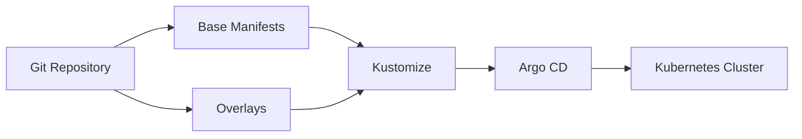
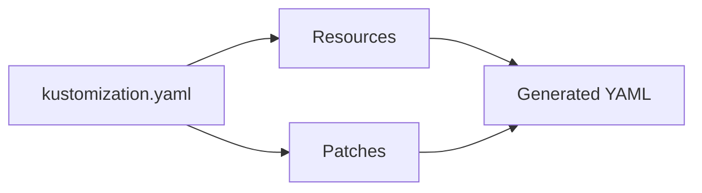
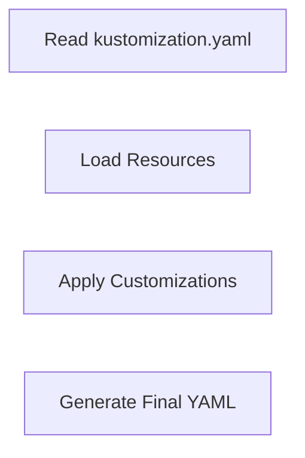
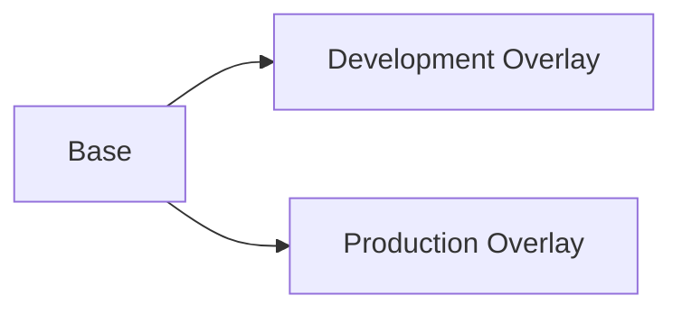
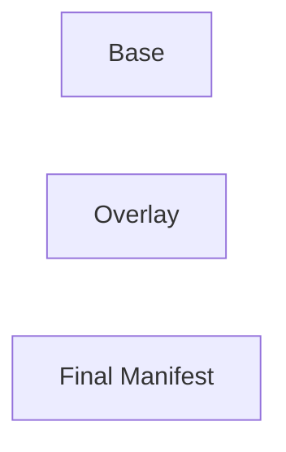
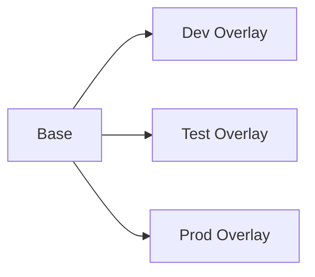

# Kustomize Integration

## Overview

Argo CD has native support for **Kustomize**, allowing Kubernetes applications to be deployed directly from Kustomize configurations stored in a Git repository.

Kustomize enables you to customize Kubernetes manifests **without modifying the original YAML files**. Argo CD detects the `kustomization.yaml` file, renders the manifests using Kustomize, and synchronizes the generated resources with the Kubernetes cluster.

> **Interview Tip**
>
> Argo CD automatically detects a Kustomize application when a `kustomization.yaml` file exists in the application's source directory.

---

## Why It Is Used

Kustomize Integration helps to:

- Deploy Kubernetes applications using GitOps
- Reuse common Kubernetes manifests
- Manage multiple environments (Dev, QA, Prod)
- Avoid duplication of YAML files
- Apply environment-specific customizations
- Keep base manifests unchanged

---

## Architecture / Working



---

## Key Components

| Component | Purpose |
|-----------|----------|
| Base | Common Kubernetes manifests |
| Overlay | Environment-specific customization |
| kustomization.yaml | Main Kustomize configuration |
| Patches | Modify resources without editing originals |
| Argo CD | Synchronizes rendered manifests |
| Kubernetes | Deploys the generated resources |

---

## Types (if applicable)

Common Kustomize structure

| Component | Purpose |
|----------|---------|
| Base | Shared resources |
| Overlay | Environment-specific configuration |
| Patch | Modify existing resources |
| Namespace | Override namespace |
| Labels | Add common labels |

---

## Lifecycle / Workflow (if applicable)


---

## Configuration / Syntax (if applicable)

Example Argo CD Application

```yaml
spec:
  source:
    repoURL: https://github.com/company/k8s-config
    path: overlays/production
    targetRevision: main
```

Example directory

```
base/
overlays/
```

---

## Important Commands (if applicable)

```bash
argocd app create

argocd app sync

argocd app get

kubectl apply -k .

kubectl kustomize .

kustomize build .
```

---

## Important Files (if applicable)

```
kustomization.yaml

deployment.yaml

service.yaml

namespace.yaml

application.yaml
```

---

## Real-World Use Cases

- Dev, QA, and Production environments
- Multi-cluster deployments
- Namespace customization
- Image tag updates
- Resource limit customization
- Enterprise GitOps workflows

---

## Advantages

- Native Kubernetes tool
- No template language
- Easy environment management
- Reusable manifests
- Git-friendly
- Reduces YAML duplication

---

## Limitations

- Less flexible than Helm for complex parameterization
- Large overlay structures can become difficult to manage
- Limited logic compared to Helm templates

---

## Common Interview Questions (Concept Only)

- What is Kustomize?
- How does Argo CD support Kustomize?
- What is a Base?
- What is an Overlay?
- What is `kustomization.yaml`?
- Can Argo CD automatically detect Kustomize applications?

---

## Common Mistakes

- Editing Base manifests directly
- Forgetting to include resources in `kustomization.yaml`
- Using incorrect overlay paths
- Creating duplicate resource names
- Committing generated YAML instead of source manifests

---

## Troubleshooting

| Problem | Possible Cause | Solution |
|----------|----------------|----------|
| Application not detected | Missing `kustomization.yaml` | Create or verify the file |
| Resources missing | Resource not listed | Update `resources:` section |
| Build failed | Invalid patch | Validate patch syntax |
| Application OutOfSync | Git changes not synchronized | Perform sync |
| Deployment failed | Invalid manifest | Run `kustomize build` locally |

---

## Summary

Kustomize Integration enables Argo CD to deploy Kubernetes applications using reusable base manifests and environment-specific overlays. It simplifies GitOps deployments by allowing configuration customization without modifying the original resources.

> **Interview Tip**
>
> **Helm = Template-based customization**
>
> **Kustomize = Patch-based customization**

---

# Kustomization

## Overview

A **Kustomization** is the configuration file (`kustomization.yaml`) that defines how Kubernetes manifests should be customized and combined before deployment.

It serves as the entry point for Kustomize.

---

## Why It Is Used

Kustomization is used to:

- Combine multiple Kubernetes resources
- Apply labels and annotations
- Modify namespaces
- Generate ConfigMaps and Secrets
- Apply patches
- Build environment-specific manifests

---

## Architecture / Working



---

## Key Components

| Component | Purpose |
|-----------|----------|
| resources | Lists Kubernetes manifests |
| namespace | Sets deployment namespace |
| commonLabels | Adds labels |
| commonAnnotations | Adds annotations |
| images | Updates image versions |
| patches | Modifies existing resources |

---

## Types (if applicable)

Common Kustomization sections

- Resources
- Images
- Namespace
- Labels
- Annotations
- Patches

---

## Lifecycle / Workflow (if applicable)



---

## Configuration / Syntax (if applicable)

Example

```yaml
resources:
  - deployment.yaml
  - service.yaml

namespace: production

commonLabels:
  app: nginx
```

---

## Important Commands (if applicable)

```bash
kustomize build

kubectl apply -k .
```

---

## Important Files (if applicable)

```
kustomization.yaml
```

---

## Real-World Use Cases

- Production namespace
- Shared labels
- Image updates

---

## Advantages

- Easy customization
- Native Kubernetes support

---

## Limitations

- Incorrect configuration affects all resources

---

## Common Interview Questions (Concept Only)

- What is `kustomization.yaml`?
- What does it contain?

---

## Common Mistakes

- Forgetting to reference resources

---

## Troubleshooting

- Validate YAML syntax
- Verify resource paths

---

## Summary

The `kustomization.yaml` file defines how Kubernetes resources are customized and deployed.

---

# Bases

## Overview

A **Base** contains the common Kubernetes manifests shared across multiple environments.

It represents the reusable portion of an application configuration.

> **Interview Tip**
>
> A Base should remain generic and contain no environment-specific configuration.

---

## Why It Is Used

Bases help to:

- Avoid duplication
- Share common manifests
- Simplify maintenance
- Improve consistency

---

## Architecture / Working



---

## Key Components

| Component | Purpose |
|-----------|----------|
| Deployment | Shared deployment |
| Service | Shared service |
| ConfigMap | Common configuration |

---

## Types (if applicable)

Typical Base resources

- Deployment
- Service
- ConfigMap
- Secret
- Namespace

---

## Lifecycle / Workflow (if applicable)



---

## Configuration / Syntax (if applicable)

Example

```yaml
resources:
  - ../../base
```

---

## Important Commands (if applicable)

```bash
kustomize build
```

---

## Important Files (if applicable)

```
base/

kustomization.yaml
```

---

## Real-World Use Cases

- Shared application manifests
- Enterprise platform templates

---

## Advantages

- Reusable
- Eases maintenance
- Consistent deployments

---

## Limitations

- Large bases may become difficult to manage

---

## Common Interview Questions (Concept Only)

- What is a Base?
- Why use Bases?

---

## Common Mistakes

- Adding environment-specific settings to Base

---

## Troubleshooting

- Verify Base resource paths

---

## Summary

A Base contains reusable Kubernetes manifests shared by multiple environments.

---

# Overlays

## Overview

An **Overlay** customizes a Base for a specific environment such as Development, Testing, or Production.

Overlays modify the Base without changing the original manifests.

> **Interview Tip**
>
> **Base = Common configuration**
>
> **Overlay = Environment-specific customization**

---

## Why It Is Used

Overlays allow:

- Different replica counts
- Different namespaces
- Different image versions
- Different resource limits
- Environment-specific labels

---

## Architecture / Working



---

## Key Components

| Component | Purpose |
|-----------|----------|
| Base Reference | References common manifests |
| Patches | Modify resources |
| Namespace | Override namespace |
| Images | Override image versions |
| Labels | Environment labels |

---

## Types (if applicable)

Common overlays

- Development
- Testing
- Staging
- Production

---

## Lifecycle / Workflow (if applicable)


---

## Configuration / Syntax (if applicable)

Example

```yaml
resources:
  - ../../base

namespace: production
```

---

## Important Commands (if applicable)

```bash
kustomize build overlays/production
```

---

## Important Files (if applicable)

```
overlays/

kustomization.yaml
```

---

## Real-World Use Cases

- Production deployments
- Dev/Test separation
- Cluster-specific customization
- Environment-specific images

---

## Advantages

- Keeps Base unchanged
- Easy environment management
- Reduces duplication

---

## Limitations

- Too many overlays can increase complexity

---

## Common Interview Questions (Concept Only)

- What is an Overlay?
- What is the difference between Base and Overlay?
- Why are Overlays used?

---

## Common Mistakes

- Modifying Base instead of creating an Overlay
- Incorrect patch references
- Duplicate resource definitions

---

## Troubleshooting

| Problem | Solution |
|----------|----------|
| Overlay not applied | Verify `resources` path |
| Patch failed | Validate patch syntax |
| Wrong namespace | Check overlay namespace |
| Image not updated | Verify image override configuration |

---

## Summary

Overlays extend Base configurations by applying environment-specific customizations. This enables reusable, maintainable, and GitOps-friendly Kubernetes deployments without modifying the original manifests.

> **Interview Tip (Very Important)**
>
> **Base vs Overlay**
>
> | Base | Overlay |
> |------|---------|
> | Common Kubernetes manifests | Environment-specific customization |
> | Reusable | References a Base |
> | No environment-specific values | Adds environment-specific changes |
> | Maintained once | Multiple overlays can reuse the same Base |
>
> **Argo CD + Kustomize Flow**
>
> Git Repository → `kustomization.yaml` → Kustomize Build → Generated Manifests → Argo CD Sync → Kubernetes Cluster
>
> **One-line Interview Answer:**  
> **Argo CD integrates natively with Kustomize by detecting `kustomization.yaml`, building customized Kubernetes manifests from Bases and Overlays, and synchronizing the generated resources to the target cluster using GitOps principles.**
