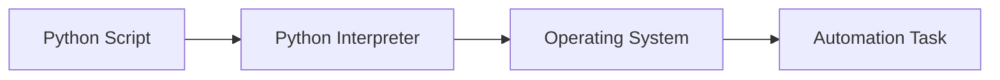
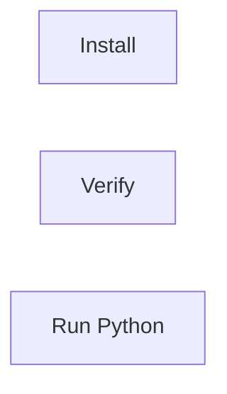
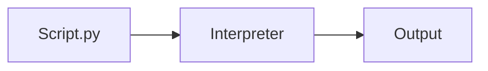
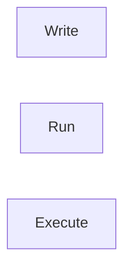
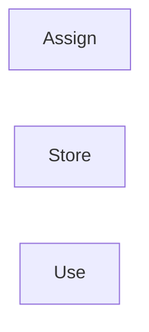
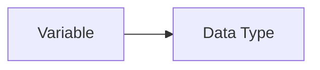
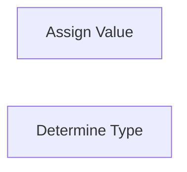
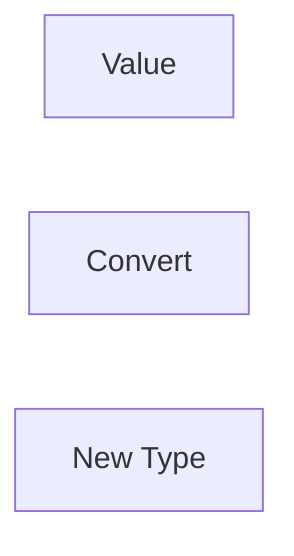
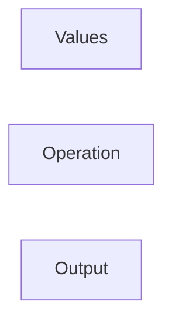

# Python Fundamentals

## Overview

Python is a high-level, interpreted, and general-purpose programming language widely used in DevOps for automation, scripting, cloud management, infrastructure provisioning, monitoring, and CI/CD pipelines.

Python is easy to learn, has extensive libraries, and is installed by default on many Linux distributions, making it one of the most popular languages for DevOps engineers.

> **Interview Tip**
>
> Python is used extensively in DevOps tools such as **Ansible, SaltStack, AWS CLI, Azure CLI, OpenStack, Kubernetes client libraries, Terraform automation scripts, Jenkins pipelines, and monitoring tools.**

---

## Why It Is Used

Python is commonly used to:

- Automate repetitive tasks
- Write shell replacement scripts
- Manage cloud resources
- Work with APIs
- Parse log files
- Build CI/CD automation
- Perform configuration management
- Monitor servers
- Process files
- Create deployment scripts

---

## Architecture / Working



---

## Key Components

| Component | Purpose |
|-----------|----------|
| Python Interpreter | Executes Python code |
| Script (.py) | Python source code |
| Variables | Store data |
| Data Types | Define data format |
| Operators | Perform operations |
| Comments | Improve readability |

---

## Types (if applicable)

Python Versions

| Version | Status |
|----------|--------|
| Python 2 | Deprecated |
| Python 3 | Current and recommended |

---

## Lifecycle / Workflow (if applicable)


---

## Configuration / Syntax (if applicable)

Print text

```python
print("Hello DevOps")
```

Variable

```python
name = "Akshay"
```

Simple calculation

```python
x = 10
y = 20

print(x + y)
```

---

## Important Commands (if applicable)

```bash
python --version

python3 --version

python script.py

python3 script.py

pip --version

pip3 --version

which python3
```

---

## Important Files (if applicable)

```
script.py

requirements.txt

venv/

__pycache__/
```

---

## Real-World Use Cases

- Server automation
- AWS resource automation
- Azure resource management
- Kubernetes scripting
- CI/CD automation
- Log analysis
- Health monitoring
- Backup automation
- File processing

---

## Advantages

- Easy to learn
- Cross-platform
- Large standard library
- Huge community support
- Excellent API integration
- Ideal for automation

---

## Limitations

- Slower than compiled languages
- Not ideal for low-level programming
- Higher memory usage
- Dynamic typing may introduce runtime errors

---

## Common Interview Questions (Concept Only)

- Why is Python popular in DevOps?
- What is an interpreted language?
- Difference between Python 2 and Python 3?
- What is the Python interpreter?
- Why is Python preferred for automation?

---

## Common Mistakes

- Mixing tabs and spaces
- Forgetting indentation
- Using Python 2 syntax
- Incorrect variable names
- Not using virtual environments

---

## Troubleshooting

| Problem | Possible Cause | Solution |
|----------|----------------|----------|
| Command not found | Python not installed | Install Python |
| Wrong Python version | Multiple installations | Use `python3` |
| Module not found | Package missing | Install using `pip` |
| Permission denied | Script not executable | Change permissions |
| IndentationError | Incorrect indentation | Use consistent spaces |

---

## Summary

Python is the most widely used scripting language in DevOps because it is simple, powerful, and integrates easily with operating systems, cloud platforms, APIs, and automation tools.

> **Interview Tip**
>
> Learn Python basics before learning automation libraries such as **boto3**, **requests**, **paramiko**, and **subprocess**.

---

# Python Installation

## Overview

Python must be installed before writing or running Python programs. Most Linux distributions already include Python 3, while Windows and macOS require installation if it is not already present.

---

## Why It Is Used

Installation provides:

- Python Interpreter
- Package Manager (pip)
- Standard Library

---

## Architecture / Working


---

## Key Components

| Component | Purpose |
|-----------|----------|
| Python Interpreter | Executes code |
| pip | Installs packages |
| Standard Library | Built-in modules |

---

## Types (if applicable)

Installation methods

- Windows Installer
- Linux Package Manager
- macOS Installer
- Source Installation

---

## Lifecycle / Workflow (if applicable)



---

## Configuration / Syntax (if applicable)

Ubuntu

```bash
sudo apt update

sudo apt install python3 python3-pip
```

Windows

Download installer and enable:

```
Add Python to PATH
```

Verify installation

```bash
python3 --version

pip3 --version
```

---

## Important Commands (if applicable)

```bash
python3 --version

pip3 --version

which python3
```

---

## Important Files (if applicable)

```
python.exe

python3

pip
```

---

## Real-World Use Cases

- Automation servers
- CI/CD runners
- Cloud VMs

---

## Advantages

- Easy installation
- Available on all major operating systems

---

## Limitations

- Multiple versions may cause confusion

---

## Common Interview Questions (Concept Only)

- How do you verify Python installation?
- What is pip?

---

## Common Mistakes

- Not adding Python to PATH
- Installing Python 2

---

## Troubleshooting

- Verify PATH variable
- Check installation version

---

## Summary

Installing Python includes the interpreter and package manager required for development.

---

# Running Python Scripts

## Overview

Python scripts are executed by the Python interpreter. Scripts usually have a `.py` extension.

---

## Why It Is Used

Scripts automate:

- Server management
- Cloud tasks
- File operations
- Monitoring

---

## Architecture / Working



---

## Key Components

| Component | Purpose |
|-----------|----------|
| Script | Python code |
| Interpreter | Executes code |

---

## Types (if applicable)

Execution methods

- Interactive Mode
- Script Mode

---

## Lifecycle / Workflow (if applicable)



---

## Configuration / Syntax (if applicable)

```bash
python3 script.py
```

Executable script

```python
#!/usr/bin/env python3
```

---

## Important Commands (if applicable)

```bash
python3 script.py

chmod +x script.py

./script.py
```

---

## Important Files (if applicable)

```
script.py
```

---

## Real-World Use Cases

- Automation scripts
- Backup scripts
- Deployment scripts

---

## Advantages

- Easy execution

---

## Limitations

- Requires interpreter

---

## Common Interview Questions (Concept Only)

- How do you execute a Python script?
- What is a shebang?

---

## Common Mistakes

- Running with wrong Python version

---

## Troubleshooting

- Verify execute permission

---

## Summary

Python scripts are executed through the interpreter or directly using a shebang.

---

# Variables

## Overview

Variables store values in memory. Python is dynamically typed, meaning variable types are determined automatically.

---

## Why It Is Used

Variables store:

- Strings
- Numbers
- Lists
- Objects

---

## Architecture / Working


---

## Key Components

| Component | Description |
|-----------|-------------|
| Variable Name | Identifier |
| Value | Stored data |

---

## Types (if applicable)

Examples

```python
name = "Akshay"

age = 24

salary = 75000
```

---

## Lifecycle / Workflow (if applicable)



---

## Configuration / Syntax (if applicable)

```python
server = "web01"
```

---

## Important Commands (if applicable)

Not applicable

---

## Important Files (if applicable)

Python scripts

---

## Real-World Use Cases

- Store IP addresses
- Credentials
- File paths

---

## Advantages

- Easy to use

---

## Limitations

- Dynamic typing may cause runtime issues

---

## Common Interview Questions (Concept Only)

- What is a variable?
- Why is Python dynamically typed?

---

## Common Mistakes

- Invalid variable names

---

## Troubleshooting

- Verify spelling

---

## Summary

Variables store data used during program execution.

---

# Data Types

## Overview

Data types define the kind of value stored in a variable.

---

## Why It Is Used

Different operations require different data types.

---

## Architecture / Working



---

## Key Components

| Data Type | Example |
|-----------|----------|
| int | 10 |
| float | 10.5 |
| str | "Azure" |
| bool | True |
| list | [] |
| tuple | () |
| dict | {} |
| set | {} |

---

## Types (if applicable)

Primitive

- int
- float
- bool
- str

Collections

- list
- tuple
- dict
- set

---

## Lifecycle / Workflow (if applicable)



---

## Configuration / Syntax (if applicable)

```python
number = 10

name = "DevOps"

enabled = True
```

---

## Important Commands (if applicable)

```python
type(variable)
```

---

## Important Files (if applicable)

Python scripts

---

## Real-World Use Cases

- Configuration
- API responses
- JSON processing

---

## Advantages

- Flexible

---

## Limitations

- Incorrect type usage causes errors

---

## Common Interview Questions (Concept Only)

- List Python data types.
- Difference between List and Tuple?
- Difference between Dictionary and Set?

---

## Common Mistakes

- Confusing list and tuple

---

## Troubleshooting

- Use `type()`

---

## Summary

Python provides multiple built-in data types for different kinds of data.

---

# Type Conversion

## Overview

Type conversion changes one data type into another.

---

## Why It Is Used

Used when working with:

- User input
- APIs
- Files
- Mathematical operations

---

## Architecture / Working

```mermaid
flowchart LR

    A[String]
    B[int()]
    C[Integer]

    A --> B
    B --> C
```

---

## Key Components

| Function | Converts To |
|-----------|-------------|
| int() | Integer |
| float() | Float |
| str() | String |
| bool() | Boolean |

---

## Types (if applicable)

- Implicit
- Explicit

---

## Lifecycle / Workflow (if applicable)



---

## Configuration / Syntax (if applicable)

```python
age = int("24")

price = float("99.99")
```

---

## Important Commands (if applicable)

```python
int()

float()

str()

bool()
```

---

## Important Files (if applicable)

Python scripts

---

## Real-World Use Cases

- Reading environment variables
- Parsing configuration files

---

## Advantages

- Flexible conversions

---

## Limitations

- Invalid conversion raises exceptions

---

## Common Interview Questions (Concept Only)

- Difference between implicit and explicit conversion?

---

## Common Mistakes

- Converting invalid strings to integers

---

## Troubleshooting

- Validate input before conversion

---

## Summary

Type conversion transforms values into compatible data types.

---

# Operators

## Overview

Operators perform calculations, comparisons, assignments, and logical operations.

---

## Why It Is Used

Operators manipulate variables and expressions.

---

## Architecture / Working


---

## Key Components

| Operator | Example |
|-----------|----------|
| + | Addition |
| - | Subtraction |
| * | Multiplication |
| / | Division |
| == | Equal |
| != | Not Equal |
| > | Greater Than |
| and | Logical AND |
| or | Logical OR |

---

## Types (if applicable)

- Arithmetic
- Comparison
- Logical
- Assignment
- Membership
- Identity

---

## Lifecycle / Workflow (if applicable)



---

## Configuration / Syntax (if applicable)

```python
a = 10

b = 20

print(a + b)
```

---

## Important Commands (if applicable)

Not applicable

---

## Important Files (if applicable)

Python scripts

---

## Real-World Use Cases

- Conditional logic
- Calculations
- Automation decisions

---

## Advantages

- Simple syntax

---

## Limitations

- Operator precedence can cause confusion

---

## Common Interview Questions (Concept Only)

- Difference between `=` and `==`?
- What are logical operators?

---

## Common Mistakes

- Using `=` instead of `==`

---

## Troubleshooting

- Verify operator precedence

---

## Summary

Operators perform computations and comparisons in Python programs.

---

# Comments

## Overview

Comments improve code readability by explaining the purpose of code. They are ignored by the Python interpreter.

---

## Why It Is Used

Comments help:

- Document code
- Explain logic
- Improve maintainability
- Support team collaboration

---

## Architecture / Working


---

## Key Components

| Type | Syntax |
|------|--------|
| Single-line | `#` |
| Multi-line | Triple quotes |

---

## Types (if applicable)

Single-line

```python
# Install dependencies
```

Multi-line

```python
"""
Deployment script
"""
```

---

## Lifecycle / Workflow (if applicable)

Not Applicable

---

## Configuration / Syntax (if applicable)

```python
# Start deployment
```

---

## Important Commands (if applicable)

Not Applicable

---

## Important Files (if applicable)

Python scripts

---

## Real-World Use Cases

- Explain automation scripts
- Document deployment steps

---

## Advantages

- Improves readability
- Easier maintenance

---

## Limitations

- Outdated comments can become misleading

---

## Common Interview Questions (Concept Only)

- How do you write comments in Python?
- Are comments executed?

---

## Common Mistakes

- Writing unnecessary comments
- Not updating comments after code changes

---

## Troubleshooting

- Ensure comments accurately reflect the code

---

## Summary

Comments document Python code and improve readability without affecting program execution.

> **Interview Tip (Very Important)**

### Frequently Used Python Commands

```bash
python3 --version

pip3 --version

python3 script.py

which python3
```

### Common Python Data Types

| Type | Example |
|------|---------|
| int | 10 |
| float | 10.5 |
| str | "DevOps" |
| bool | True |
| list | `[1,2,3]` |
| tuple | `(1,2,3)` |
| dict | `{"name":"Akshay"}` |
| set | `{1,2,3}` |

### Frequently Asked Interview Differences

| Concept | Description |
|---------|-------------|
| `=` | Assignment operator |
| `==` | Equality comparison operator |
| `int()` | Converts to integer |
| `str()` | Converts to string |
| `float()` | Converts to float |
| `bool()` | Converts to boolean |

### One-line Interview Answer

**Python is an interpreted, dynamically typed programming language widely used in DevOps for automation, cloud management, scripting, infrastructure operations, and CI/CD because of its simplicity, extensive libraries, and cross-platform support.**
