# Data Structures

## Overview

Data structures are built-in Python collections used to store, organize, and manipulate data efficiently. They are fundamental to Python programming and are heavily used in DevOps automation scripts for handling server lists, cloud resources, API responses, configuration files, and log data.

The most commonly used Python data structures are:

- Lists
- Tuples
- Dictionaries
- Sets

Python also provides **List Comprehensions** for creating lists efficiently.

> **Interview Tip**
>
> Dictionaries and Lists are the most frequently used data structures in DevOps scripting because APIs (AWS, Azure, Kubernetes, REST APIs) commonly exchange data in JSON format, which maps directly to Python dictionaries and lists.

---

## Why It Is Used

Data structures help to:

- Store multiple values
- Organize data efficiently
- Process API responses
- Parse JSON/YAML files
- Manage cloud resources
- Store configuration data
- Iterate over collections

---

## Architecture / Working

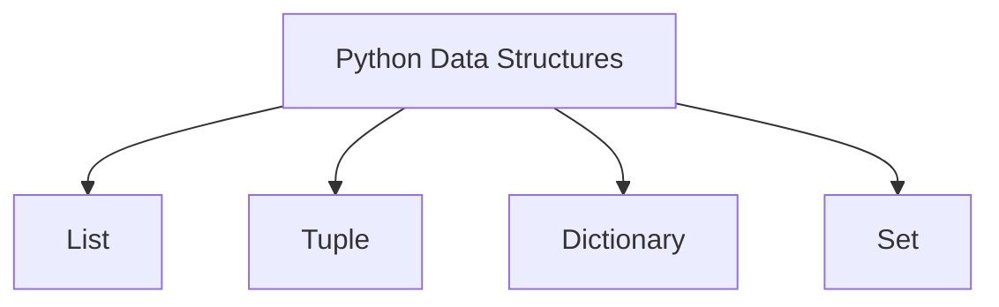

---

## Key Components

| Data Structure | Ordered | Mutable | Duplicate Values | Key Feature |
|---------------|---------|---------|------------------|-------------|
| List | Yes | Yes | Yes | Dynamic collection |
| Tuple | Yes | No | Yes | Immutable collection |
| Dictionary | Yes* | Yes | Keys: No | Key-Value storage |
| Set | No | Yes | No | Unique values |

> **Note:** Dictionaries preserve insertion order in Python 3.7+.

---

## Types (if applicable)

Python provides four primary built-in data structures:

- List
- Tuple
- Dictionary
- Set

---

## Lifecycle / Workflow (if applicable)

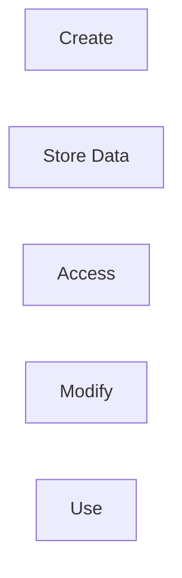

---

## Configuration / Syntax (if applicable)

```python
servers = ["web01", "web02"]

config = {
    "region": "East US"
}

ports = {80, 443}

coordinates = (10, 20)
```

---

## Important Commands (if applicable)

```python
len()

type()

append()

remove()

pop()

keys()

values()

items()

add()

update()
```

---

## Important Files (if applicable)

```
automation.py

inventory.py

config.py

backup.py
```

---

## Real-World Use Cases

- Store server inventory
- Read API responses
- Manage VM configurations
- Parse Kubernetes resources
- Process monitoring data
- Store deployment configurations

---

## Advantages

- Easy to use
- Flexible
- Efficient
- Rich built-in methods
- Excellent JSON compatibility

---

## Limitations

- Lists consume more memory than tuples
- Dictionaries require unique keys
- Sets do not preserve order
- Large collections may impact performance

---

## Common Interview Questions (Concept Only)

- Difference between List and Tuple?
- Difference between Dictionary and List?
- Difference between Set and List?
- What are mutable and immutable objects?
- Why are dictionaries used for JSON?
- When should you use a tuple?
- What are list comprehensions?

---

## Common Mistakes

- Modifying tuples
- Assuming sets maintain order
- Using duplicate dictionary keys
- Confusing list indexing with dictionary keys
- Forgetting dictionaries use key-value pairs

---

## Troubleshooting

| Problem | Possible Cause | Solution |
|----------|----------------|----------|
| KeyError | Key doesn't exist | Check key using `in` |
| IndexError | Invalid index | Verify list size |
| TypeError | Modified tuple | Use list if modification required |
| Duplicate values removed | Using a set | Use a list instead |
| AttributeError | Wrong method | Verify supported methods |

---

## Summary

Python data structures provide efficient ways to organize and manipulate data. Lists, tuples, dictionaries, and sets form the foundation of almost every DevOps automation script.

> **Interview Tip**
>
> Most DevOps automation scripts work extensively with **Lists** and **Dictionaries**.

---

# Lists

## Overview

A list is an ordered, mutable collection that allows duplicate values.

Lists are the most frequently used Python data structure.

---

## Why It Is Used

Lists store:

- Server names
- IP addresses
- Files
- Kubernetes Pods
- Virtual Machines

---

## Architecture / Working

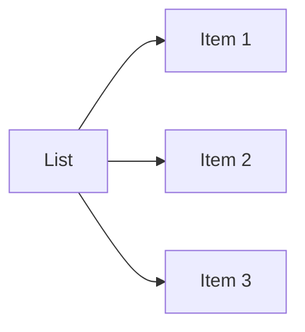

---

## Key Components

| Property | Value |
|----------|-------|
| Ordered | Yes |
| Mutable | Yes |
| Duplicate Values | Allowed |

---

## Types (if applicable)

Example

```python
servers = [
    "web01",
    "web02",
    "db01"
]
```

---

## Lifecycle / Workflow (if applicable)

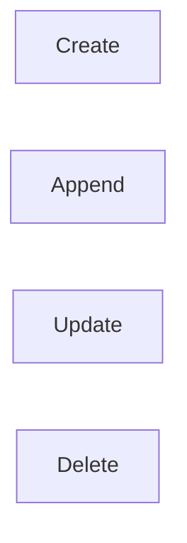

---

## Configuration / Syntax (if applicable)

Create

```python
servers = ["web01", "web02"]
```

Append

```python
servers.append("db01")
```

Access

```python
print(servers[0])
```

Remove

```python
servers.remove("web02")
```

---

## Important Commands (if applicable)

```python
append()

remove()

insert()

pop()

sort()

reverse()

len()
```

---

## Important Files (if applicable)

Python scripts

---

## Real-World Use Cases

- Server inventory
- Deployment targets
- VM list
- Container names

---

## Advantages

- Dynamic
- Easy to modify
- Rich methods

---

## Limitations

- Higher memory usage

---

## Common Interview Questions (Concept Only)

- Are lists mutable?
- Can lists contain duplicate values?

---

## Common Mistakes

- Accessing invalid indexes

---

## Troubleshooting

- Use `len()` before indexing

---

## Summary

Lists are dynamic collections used extensively in DevOps automation.

---

# Tuples

## Overview

A tuple is an ordered, immutable collection.

Once created, tuples cannot be modified.

---

## Why It Is Used

Used for:

- Constant values
- Coordinates
- Configuration values
- Database records

---

## Architecture / Working

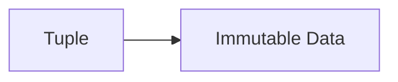

---

## Key Components

| Property | Value |
|----------|-------|
| Ordered | Yes |
| Mutable | No |
| Duplicate Values | Allowed |

---

## Types (if applicable)

```python
ports = (80, 443)
```

---

## Lifecycle / Workflow (if applicable)

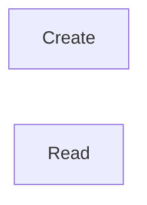

---

## Configuration / Syntax (if applicable)

```python
regions = ("East US", "West US")
```

---

## Important Commands (if applicable)

```python
count()

index()

len()
```

---

## Important Files (if applicable)

Python scripts

---

## Real-World Use Cases

- Fixed configuration
- Coordinates
- Immutable settings

---

## Advantages

- Faster than lists
- Immutable

---

## Limitations

- Cannot modify items

---

## Common Interview Questions (Concept Only)

- Difference between List and Tuple?

---

## Common Mistakes

- Trying to modify tuple

---

## Troubleshooting

- Convert tuple to list if modification is needed

---

## Summary

Tuples store data that should not change during program execution.

---

# Dictionaries

## Overview

A dictionary stores data as key-value pairs.

It is the most widely used data structure when working with JSON APIs.

---

## Why It Is Used

Store:

- Cloud resource details
- Configuration
- API responses
- User information

---

## Architecture / Working

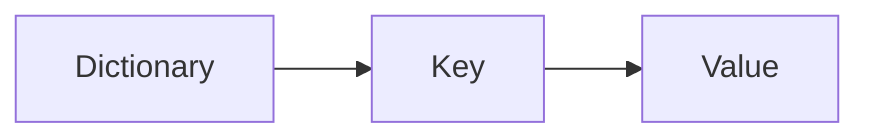

---

## Key Components

| Property | Value |
|----------|-------|
| Ordered | Yes |
| Mutable | Yes |
| Duplicate Keys | Not Allowed |

---

## Types (if applicable)

Example

```python
vm = {
    "name": "web01",
    "region": "East US"
}
```

---

## Lifecycle / Workflow (if applicable)

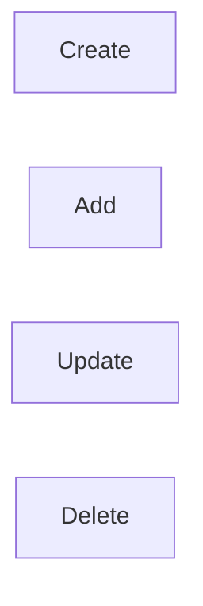

---

## Configuration / Syntax (if applicable)

Access

```python
vm["name"]
```

Update

```python
vm["size"] = "Standard_B2s"
```

---

## Important Commands (if applicable)

```python
keys()

values()

items()

get()

pop()

update()
```

---

## Important Files (if applicable)

Python scripts

---

## Real-World Use Cases

- JSON processing
- Cloud APIs
- Kubernetes manifests

---

## Advantages

- Fast lookup
- Flexible

---

## Limitations

- Keys must be unique

---

## Common Interview Questions (Concept Only)

- Why use dictionaries for JSON?
- Difference between get() and []?

---

## Common Mistakes

- Accessing missing keys

---

## Troubleshooting

Use

```python
dict.get("key")
```

instead of

```python
dict["key"]
```

---

## Summary

Dictionaries are the backbone of cloud automation and API processing.

---

# Sets

## Overview

A set is an unordered collection of unique values.

Duplicate values are automatically removed.

---

## Why It Is Used

Useful for:

- Removing duplicates
- Membership testing
- Set operations

---

## Architecture / Working


---

## Key Components

| Property | Value |
|----------|-------|
| Ordered | No |
| Mutable | Yes |
| Duplicate Values | Not Allowed |

---

## Types (if applicable)

```python
ports = {80, 443, 8080}
```

---

## Lifecycle / Workflow (if applicable)

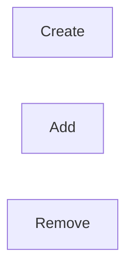

---

## Configuration / Syntax (if applicable)

```python
ports.add(22)

ports.remove(80)
```

---

## Important Commands (if applicable)

```python
add()

remove()

union()

intersection()

difference()
```

---

## Important Files (if applicable)

Python scripts

---

## Real-World Use Cases

- Remove duplicate IPs
- Unique server names
- Firewall ports

---

## Advantages

- Fast membership testing
- No duplicates

---

## Limitations

- No indexing
- Unordered

---

## Common Interview Questions (Concept Only)

- Difference between Set and List?

---

## Common Mistakes

- Expecting order

---

## Troubleshooting

Convert to list if indexing is required.

---

## Summary

Sets store unique values and are useful for duplicate removal and membership testing.

---

# List Comprehensions

## Overview

List comprehensions provide a concise and efficient way to create lists.

They replace traditional loops with cleaner syntax.

---

## Why It Is Used

Used for:

- Filtering data
- Transforming collections
- Shorter code
- Faster execution

---

## Architecture / Working

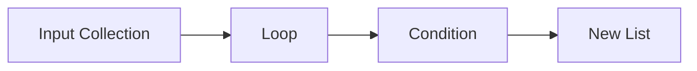

---

## Key Components

| Component | Purpose |
|-----------|----------|
| Expression | Value to generate |
| Loop | Iteration |
| Optional Condition | Filtering |

---

## Types (if applicable)

Simple

```python
numbers = [x for x in range(5)]
```

Filtered

```python
even = [x for x in range(10) if x % 2 == 0]
```

---

## Lifecycle / Workflow (if applicable)

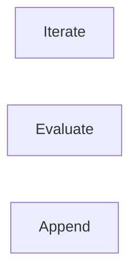

---

## Configuration / Syntax (if applicable)

Traditional

```python
servers = []

for i in range(5):
    servers.append(i)
```

List Comprehension

```python
servers = [i for i in range(5)]
```

---

## Important Commands (if applicable)

Not Applicable

---

## Important Files (if applicable)

Python scripts

---

## Real-World Use Cases

- Filter running VMs
- Process log files
- Build deployment lists
- API response filtering

---

## Advantages

- Cleaner syntax
- Faster execution
- Readable

---

## Limitations

- Complex comprehensions reduce readability

---

## Common Interview Questions (Concept Only)

- What is List Comprehension?
- Why is it preferred over loops?
- Can conditions be used in list comprehensions?

---

## Common Mistakes

- Writing overly complex comprehensions
- Nesting multiple comprehensions unnecessarily

---

## Troubleshooting

- Convert to regular loops if readability suffers

---

## Summary

List comprehensions provide a concise and efficient way to create and filter lists and are commonly used in production Python code.

> **Interview Tip (Very Important)**

### Data Structure Comparison

| Feature | List | Tuple | Dictionary | Set |
|---------|------|-------|------------|-----|
| Ordered | ✅ | ✅ | ✅ | ❌ |
| Mutable | ✅ | ❌ | ✅ | ✅ |
| Duplicate Values | ✅ | ✅ | Keys ❌ | ❌ |
| Indexed | ✅ | ✅ | By Key | ❌ |

### Frequently Asked Interview Differences

| Concept | Description |
|---------|-------------|
| List | Ordered, mutable collection |
| Tuple | Ordered, immutable collection |
| Dictionary | Key-value mapping |
| Set | Unordered collection of unique values |
| List Comprehension | Compact syntax for creating lists |

### Common DevOps Usage

| Data Structure | Typical Usage |
|---------------|---------------|
| List | Server names, Pods, Files |
| Tuple | Fixed configuration values |
| Dictionary | API responses, JSON, Configuration |
| Set | Remove duplicates, Membership checks |

### One-line Interview Answer

**Python data structures provide efficient ways to store and manipulate data. Lists are used for ordered collections, tuples for immutable data, dictionaries for key-value mappings (especially JSON), sets for unique values, and list comprehensions for concise list creation and filtering, making them essential for DevOps automation and cloud scripting.**
