# Object-Oriented Programming (Basics)

## Overview

Object-Oriented Programming (OOP) is a programming paradigm that organizes code into **objects**. An object combines **data (attributes)** and **behavior (methods)** into a single unit.

Instead of writing everything as separate functions, OOP groups related functionality together, making code more modular, reusable, and easier to maintain.

In DevOps, OOP is commonly used to build:

- Cloud automation tools
- Infrastructure management scripts
- API clients
- Configuration management utilities
- Monitoring and deployment frameworks

> **Interview Tip**
>
> **Class = Blueprint**
>
> **Object = Real instance created from the blueprint**

---

## Why It Is Used

OOP helps to:

- Organize large applications
- Improve code reusability
- Reduce code duplication
- Simplify maintenance
- Model real-world entities
- Build scalable automation tools

---

## Architecture / Working

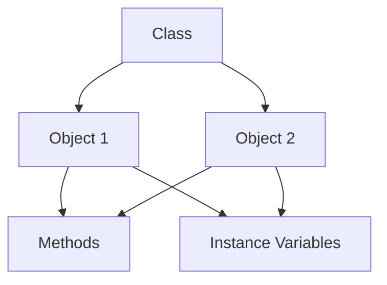

---

## Key Components

| Component | Description |
|-----------|-------------|
| Class | Blueprint for creating objects |
| Object | Instance of a class |
| Constructor | Initializes an object |
| Instance Variable | Stores object-specific data |
| Method | Function inside a class |
| `self` | Refers to the current object |

---

## Types (if applicable)

Basic OOP concepts:

- Class
- Object
- Constructor
- Instance Variables
- Methods

> Advanced concepts such as Inheritance, Polymorphism, Encapsulation, and Abstraction are covered separately.

---

## Lifecycle / Workflow (if applicable)

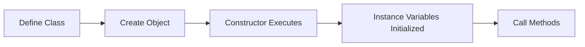

---

## Configuration / Syntax (if applicable)

```python
class Server:

    def __init__(self, name):
        self.name = name

    def display(self):
        print(self.name)

server = Server("WebServer")

server.display()
```

---

## Important Commands (if applicable)

Not Applicable

---

## Important Files (if applicable)

```
server.py

cloud.py

automation.py

main.py
```

---

## Real-World Use Cases

- Azure VM Manager
- AWS EC2 Automation
- Kubernetes Deployment Manager
- Docker Automation
- Monitoring Systems
- Configuration Management
- API Clients
- Backup Automation

---

## Advantages

- Reusable code
- Easier maintenance
- Better organization
- Scalable applications
- Improved readability

---

## Limitations

- More code than procedural programming
- Slightly higher memory usage
- Not necessary for very small scripts

---

## Common Interview Questions (Concept Only)

- What is OOP?
- What is a class?
- What is an object?
- What is a constructor?
- What is `self`?
- What is an instance variable?
- Difference between a function and a method?

---

## Common Mistakes

- Forgetting `self`
- Not using constructors correctly
- Creating unnecessary classes
- Confusing class variables with instance variables
- Accessing attributes before initialization

---

## Troubleshooting

| Problem | Cause | Solution |
|----------|-------|----------|
| `TypeError` | Missing `self` | Add `self` as first parameter |
| `AttributeError` | Variable not initialized | Initialize in constructor |
| Object not behaving correctly | Wrong method call | Use object instance |
| Constructor not executing | Incorrect object creation | Instantiate class correctly |
| Undefined attribute | Misspelled variable name | Verify attribute names |

---

## Summary

Object-Oriented Programming organizes code into reusable objects that combine data and behavior. It improves maintainability, scalability, and code organization, making it ideal for building production-ready DevOps automation tools.

> **Interview Tip**
>
> A **class** defines what an object looks like, while an **object** is the actual instance created from that class.

---

# Classes

## Overview

A **Class** is a blueprint used to create objects. It defines the attributes (variables) and methods (functions) that every object created from the class will have.

---

## Why It Is Used

Classes help to:

- Group related data and behavior
- Create multiple similar objects
- Improve code reuse
- Simplify maintenance

---

## Architecture / Working

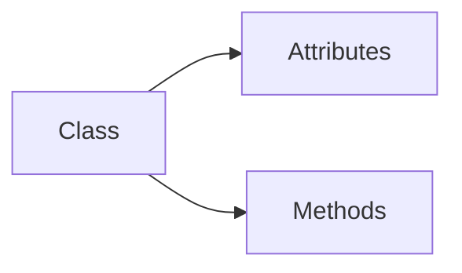

---

## Key Components

- Class name
- Attributes
- Methods
- Constructor

---

## Types (if applicable)

User-defined classes

---

## Lifecycle / Workflow (if applicable)

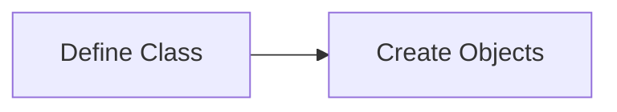

---

## Configuration / Syntax (if applicable)

```python
class Server:
    pass
```

---

## Important Commands (if applicable)

Not Applicable

---

## Important Files (if applicable)

Python source files

---

## Real-World Use Cases

- VM
- DockerContainer
- KubernetesCluster
- User
- Employee

---

## Advantages

- Organized code
- Easy reuse

---

## Limitations

- Slightly more verbose than procedural code

---

## Common Interview Questions (Concept Only)

- What is a class?
- Why use classes?

---

## Common Mistakes

- Defining everything as global functions

---

## Troubleshooting

- Check class syntax and indentation

---

## Summary

A class is a blueprint that defines the structure and behavior of objects.

---

# Objects

## Overview

An **Object** is an instance of a class. Each object has its own data while sharing the methods defined by the class.

---

## Why It Is Used

Objects represent real-world entities such as:

- Servers
- Virtual Machines
- Users
- Containers
- Applications

---

## Architecture / Working

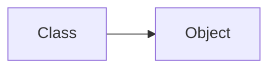

---

## Key Components

- Instance
- Attributes
- Methods

---

## Types (if applicable)

Multiple objects from one class

---

## Lifecycle / Workflow (if applicable)

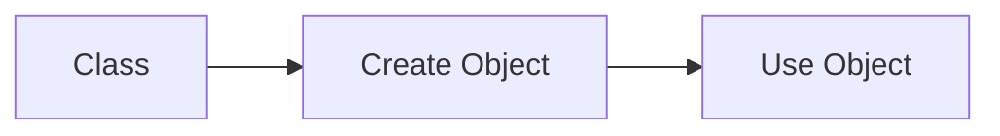

---

## Configuration / Syntax (if applicable)

```python
server = Server()
```

---

## Important Commands (if applicable)

Not Applicable

---

## Important Files (if applicable)

Python scripts

---

## Real-World Use Cases

- VM objects
- Employee objects
- Cloud resource objects

---

## Advantages

- Independent data
- Reusable methods

---

## Limitations

- Consumes memory

---

## Common Interview Questions (Concept Only)

- What is an object?

---

## Common Mistakes

- Confusing class with object

---

## Troubleshooting

- Instantiate the class correctly

---

## Summary

An object is a real instance created from a class.

---

# Constructors

## Overview

A **Constructor** is a special method named `__init__()` that automatically executes whenever an object is created.

It initializes object data.

---

## Why It Is Used

Used to:

- Initialize variables
- Set default values
- Prepare objects for use

---

## Architecture / Working

```mermaid
flowchart LR

    A[Create Object]
    B[__init__()]
    C[Object Ready]

    A --> B
    B --> C
```

---

## Key Components

- `__init__`
- `self`
- Parameters

---

## Types (if applicable)

Parameterized constructor

Default constructor

---

## Lifecycle / Workflow (if applicable)

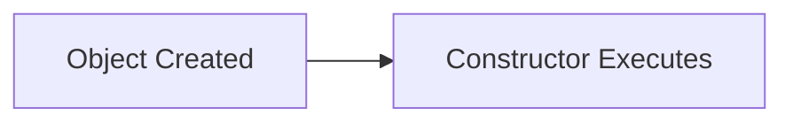

---

## Configuration / Syntax (if applicable)

```python
class Server:

    def __init__(self, name):
        self.name = name
```

---

## Important Commands (if applicable)

Not Applicable

---

## Important Files (if applicable)

Python classes

---

## Real-World Use Cases

- Initialize VM details
- Initialize cloud credentials
- Initialize API clients

---

## Advantages

- Automatic initialization

---

## Limitations

- Executes only during object creation

---

## Common Interview Questions (Concept Only)

- What is `__init__()`?
- Is constructor mandatory?

---

## Common Mistakes

- Forgetting `self`

---

## Troubleshooting

- Verify constructor parameters

---

## Summary

Constructors automatically initialize objects during creation.

---

# Instance Variables

## Overview

Instance variables store data unique to each object.

They are created using the `self` keyword inside the constructor or other methods.

---

## Why It Is Used

Store object-specific information such as:

- Server name
- IP address
- Region
- Status

---

## Architecture / Working

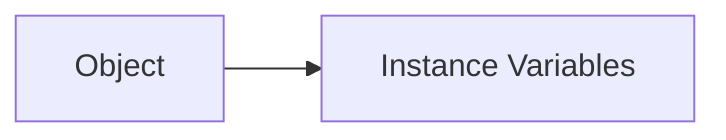

---

## Key Components

- `self.variable`

---

## Types (if applicable)

Object-specific variables

---

## Lifecycle / Workflow (if applicable)

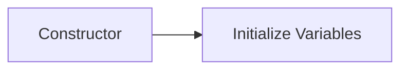

---

## Configuration / Syntax (if applicable)

```python
self.name = name
```

---

## Important Commands (if applicable)

Not Applicable

---

## Important Files (if applicable)

Python scripts

---

## Real-World Use Cases

- Hostname
- Region
- Cloud account
- Namespace

---

## Advantages

- Each object stores independent data

---

## Limitations

- Uses memory for each object

---

## Common Interview Questions (Concept Only)

- What is an instance variable?

---

## Common Mistakes

- Forgetting `self`

---

## Troubleshooting

- Initialize variables before using them

---

## Summary

Instance variables hold data specific to each object.

---

# Methods

## Overview

A **Method** is a function defined inside a class.

Methods define the behavior of objects.

---

## Why It Is Used

Used to perform operations such as:

- Deploy
- Backup
- Monitor
- Restart
- Scale

---

## Architecture / Working

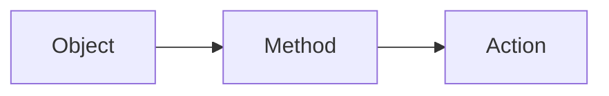

---

## Key Components

- Method name
- Parameters
- `self`

---

## Types (if applicable)

- Instance methods

---

## Lifecycle / Workflow (if applicable)

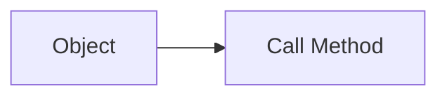

---

## Configuration / Syntax (if applicable)

```python
class Server:

    def start(self):
        print("Server Started")
```

---

## Important Commands (if applicable)

Not Applicable

---

## Important Files (if applicable)

Python source files

---

## Real-World Use Cases

- Start VM
- Stop VM
- Restart Service
- Deploy Container
- Backup Database

---

## Advantages

- Reusable behavior
- Organized logic

---

## Limitations

- Requires object creation

---

## Common Interview Questions (Concept Only)

- What is a method?
- Difference between a function and a method?

---

## Common Mistakes

- Forgetting `self`
- Calling methods without an object

---

## Troubleshooting

- Create an object before calling instance methods

---

## Summary

Methods define the actions that objects can perform.

---

# Interview Quick Revision

## OOP Lifecycle

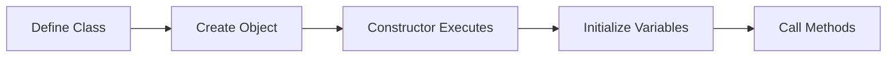

---

## Class vs Object

| Class | Object |
|--------|--------|
| Blueprint | Instance |
| Defines structure | Uses the structure |
| Created once | Multiple can be created |

---

## Constructor vs Method

| Constructor | Method |
|-------------|--------|
| `__init__()` | Any user-defined function |
| Runs automatically | Called explicitly |
| Initializes object | Performs actions |

---

## Function vs Method

| Function | Method |
|-----------|--------|
| Independent | Belongs to a class |
| No `self` | Uses `self` |
| Called directly | Called using an object |

---

## Frequently Asked Interview Questions

- What is Object-Oriented Programming?
- What is a class?
- What is an object?
- What is the purpose of a constructor?
- What is the `self` keyword?
- What are instance variables?
- Difference between a function and a method?
- Difference between a class and an object?
- When is the constructor executed?
- Why is OOP useful in DevOps automation?

---

## DevOps Real-World Example

| Class | Represents |
|--------|------------|
| `EC2Instance` | AWS EC2 VM |
| `AzureVM` | Azure Virtual Machine |
| `DockerContainer` | Docker Container |
| `KubernetesCluster` | Kubernetes Cluster |
| `LoadBalancer` | Load Balancer |
| `DeploymentManager` | Deployment Automation |
| `BackupManager` | Backup Tool |

---

## One-line Interview Answer

**Object-Oriented Programming (OOP) organizes Python code into reusable classes and objects, where constructors initialize object data, instance variables store object-specific information, and methods define object behavior, making DevOps automation more modular, maintainable, and scalable.**
