# Common Python Modules

## Overview

Python provides a rich **Standard Library** containing built-in modules that simplify common programming tasks. These modules are widely used in DevOps automation for interacting with the operating system, processing files, executing shell commands, handling JSON and CSV data, logging, parsing command-line arguments, and working with dates and times.

These modules are pre-installed with Python and do not require installation using `pip`.

> **Interview Tip**
>
> The modules **os, pathlib, subprocess, json, logging, argparse, and datetime** are among the most commonly used modules in DevOps automation.

---

## Why It Is Used

Common Python modules help to:

- Automate operating system tasks
- Execute Linux commands
- Process configuration files
- Handle JSON and CSV data
- Build CLI tools
- Manage logs
- Work with files and directories
- Handle timestamps and scheduling

---

## Architecture / Working

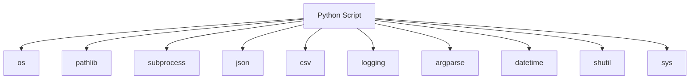

---

## Key Components

| Module | Primary Purpose |
|---------|-----------------|
| os | Operating system interaction |
| sys | Python runtime information |
| pathlib | Object-oriented file paths |
| shutil | File and directory operations |
| subprocess | Execute shell commands |
| json | JSON processing |
| csv | CSV file processing |
| logging | Logging events |
| argparse | Command-line argument parsing |
| datetime | Date and time operations |

---

## Types (if applicable)

Python Standard Library modules include:

- System modules
- File handling modules
- Process management modules
- Data serialization modules
- Utility modules

---

## Lifecycle / Workflow (if applicable)

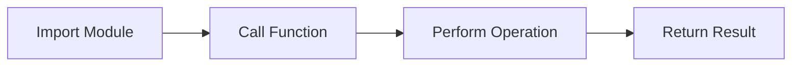

---

## Configuration / Syntax (if applicable)

```python
import os
import sys
import json
import logging
from pathlib import Path
```

---

## Important Commands (if applicable)

```python
import
from
```

---

## Important Files (if applicable)

```
automation.py

backup.py

deploy.py

monitor.py

config.json

servers.csv
```

---

## Real-World Use Cases

- Infrastructure automation
- Cloud resource management
- Backup scripts
- Deployment automation
- Configuration management
- Log processing
- CI/CD pipelines
- Kubernetes automation

---

## Advantages

- Built into Python
- Cross-platform
- Production ready
- Well documented
- Highly optimized

---

## Limitations

- Limited compared to specialized third-party libraries
- Some modules behave differently across operating systems

---

## Common Interview Questions (Concept Only)

- Which Python modules are most commonly used in DevOps?
- Why use `pathlib` instead of `os.path`?
- Difference between `os.system()` and `subprocess`?
- Why use the `logging` module instead of `print()`?
- What is `argparse` used for?

---

## Common Mistakes

- Using `print()` instead of logging
- Using `os.system()` instead of `subprocess`
- Hardcoding file paths
- Forgetting exception handling
- Ignoring return codes from shell commands

---

## Troubleshooting

| Problem | Cause | Solution |
|----------|-------|----------|
| File not found | Incorrect path | Use `pathlib` |
| Command fails | Invalid command | Verify command and arguments |
| JSON parsing error | Invalid JSON | Validate JSON format |
| Empty logs | Logging not configured | Configure logging properly |
| CSV not parsed | Incorrect delimiter | Specify correct delimiter |

---

## Summary

Python's Standard Library provides powerful built-in modules that simplify DevOps automation, system administration, cloud scripting, and infrastructure management without requiring additional installations.

> **Interview Tip**
>
> Know when to use **os**, **pathlib**, **subprocess**, **json**, **logging**, and **argparse**—these are frequently used in production DevOps scripts.

---

# os

## Overview

The `os` module provides functions to interact with the operating system.

It is commonly used for file operations, environment variables, directories, and process management.

---

## Why It Is Used

Used to:

- Manage directories
- Read environment variables
- Work with file paths
- Execute basic OS operations

---

## Architecture / Working

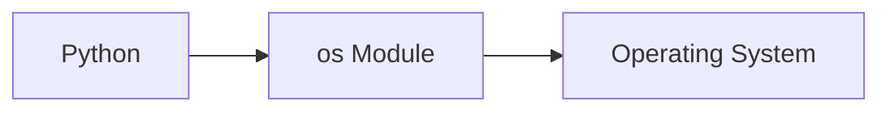

---

## Key Components

| Function | Purpose |
|----------|----------|
| `getcwd()` | Current working directory |
| `chdir()` | Change directory |
| `mkdir()` | Create directory |
| `listdir()` | List directory contents |
| `remove()` | Delete file |
| `rename()` | Rename file |
| `environ` | Environment variables |

---

## Types (if applicable)

- File operations
- Directory operations
- Environment management

---

## Lifecycle / Workflow (if applicable)

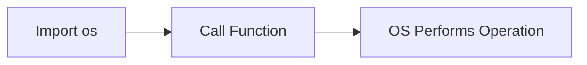

---

## Configuration / Syntax (if applicable)

```python
import os

print(os.getcwd())

os.mkdir("logs")
```

---

## Important Commands (if applicable)

```python
os.getcwd()

os.listdir()

os.mkdir()

os.remove()

os.environ
```

---

## Important Files (if applicable)

All Python automation scripts

---

## Real-World Use Cases

- Create deployment folders
- Read environment variables
- Manage log directories

---

## Advantages

- Cross-platform
- Built into Python

---

## Limitations

- Path handling is less elegant than `pathlib`

---

## Common Interview Questions (Concept Only)

- What is the `os` module?
- How do you access environment variables?

---

## Common Mistakes

- Hardcoding paths
- Ignoring exceptions

---

## Troubleshooting

- Verify file permissions
- Check path existence

---

## Summary

The `os` module enables Python scripts to interact with the operating system.

---

# sys

## Overview

The `sys` module provides access to Python interpreter information and runtime configuration.

---

## Why It Is Used

Used to:

- Read command-line arguments
- Exit programs
- Access Python version
- Modify module search paths

---

## Architecture / Working

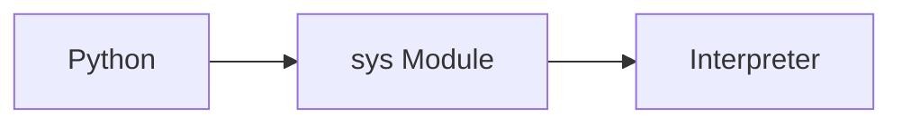

---

## Key Components

| Function | Purpose |
|----------|----------|
| `argv` | Command-line arguments |
| `exit()` | Exit program |
| `version` | Python version |
| `path` | Module search path |

---

## Types (if applicable)

Runtime management

---

## Lifecycle / Workflow (if applicable)

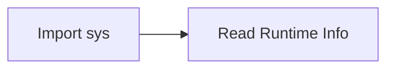

---

## Configuration / Syntax (if applicable)

```python
import sys

print(sys.argv)
```

---

## Important Commands (if applicable)

```python
sys.argv

sys.exit()

sys.version
```

---

## Important Files (if applicable)

CLI tools

---

## Real-World Use Cases

- Deployment scripts
- CLI automation

---

## Advantages

- Runtime information
- Interpreter control

---

## Limitations

- Low-level functionality

---

## Common Interview Questions (Concept Only)

- What is `sys.argv`?

---

## Common Mistakes

- Accessing missing arguments

---

## Troubleshooting

- Validate argument count

---

## Summary

The `sys` module provides access to Python runtime and interpreter information.

---

# pathlib

## Overview

`pathlib` provides an object-oriented way to work with file system paths.

It is the recommended alternative to `os.path`.

---

## Why It Is Used

Used to:

- Build file paths
- Check file existence
- Create directories
- Improve code readability

---

## Architecture / Working

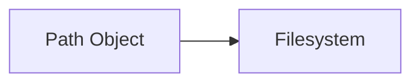

---

## Key Components

| Function | Purpose |
|----------|----------|
| `Path()` | Create path |
| `exists()` | Check existence |
| `mkdir()` | Create directory |
| `glob()` | Find files |

---

## Types (if applicable)

Object-oriented path handling

---

## Lifecycle / Workflow (if applicable)


---

## Configuration / Syntax (if applicable)

```python
from pathlib import Path

path = Path("logs")

path.mkdir(exist_ok=True)
```

---

## Important Commands (if applicable)

```python
Path()

exists()

mkdir()

glob()
```

---

## Important Files (if applicable)

Project directories

---

## Real-World Use Cases

- Configuration files
- Backup directories
- Deployment paths

---

## Advantages

- Cleaner syntax
- Cross-platform

---

## Limitations

- Slight learning curve

---

## Common Interview Questions (Concept Only)

- Why prefer `pathlib` over `os.path`?

---

## Common Mistakes

- Mixing strings and `Path` objects unnecessarily

---

## Troubleshooting

- Convert using `str(path)` if required by external libraries

---

## Summary

`pathlib` provides a modern, readable, and platform-independent way to manage file paths.

---

# shutil

## Overview

The `shutil` module performs high-level file and directory operations.

---

## Why It Is Used

Used to:

- Copy files
- Move files
- Delete directories
- Archive files

---

## Architecture / Working

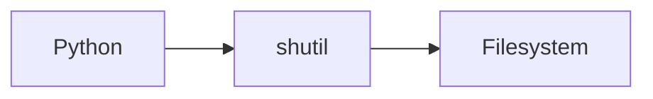

---

## Key Components

| Function | Purpose |
|----------|----------|
| `copy()` | Copy file |
| `copytree()` | Copy directory |
| `move()` | Move file |
| `rmtree()` | Delete directory |

---

## Types (if applicable)

File operations

---

## Lifecycle /Workflow (if applicable)


---

## Configuration / Syntax (if applicable)

```python
import shutil

shutil.copy("config.json", "backup/")
```

---

## Important Commands (if applicable)

```python
copy()

move()

copytree()

rmtree()
```

---

## Important Files (if applicable)

Backup files

---

## Real-World Use Cases

- Backup automation
- Deployment
- File migration

---

## Advantages

- Simple API
- Cross-platform

---

## Limitations

- No progress tracking

---

## Common Interview Questions (Concept Only)

- What is `shutil` used for?

---

## Common Mistakes

- Accidentally deleting directories with `rmtree()`

---

## Troubleshooting

- Verify destination paths and permissions

---

## Summary

`shutil` simplifies high-level file and directory management tasks.

---

# subprocess

## Overview

The `subprocess` module runs external commands and programs from Python.

It is the preferred way to execute shell commands in production scripts.

> **Interview Tip**
>
> Prefer `subprocess.run()` over `os.system()` because it provides better control, captures output, and supports robust error handling.

---

## Why It Is Used

Used to:

- Run Linux commands
- Execute Kubernetes CLI (`kubectl`)
- Execute Docker CLI
- Execute Git commands
- Execute Azure CLI
- Execute AWS CLI

---

## Architecture / Working

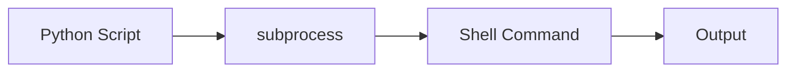

---

## Key Components

| Function | Purpose |
|----------|----------|
| `run()` | Execute command |
| `check_output()` | Capture output |
| `Popen()` | Advanced process control |

---

## Types (if applicable)

- Synchronous execution
- Asynchronous execution

---

## Lifecycle / Workflow (if applicable)

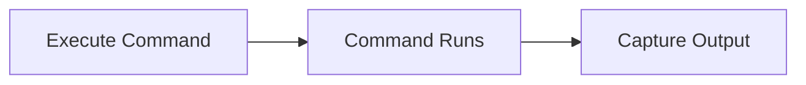

---

## Configuration / Syntax (if applicable)

```python
import subprocess

subprocess.run(["ls", "-l"])
```

---

## Important Commands (if applicable)

```python
run()

check_output()

Popen()
```

---

## Important Files (if applicable)

Automation scripts

---

## Real-World Use Cases

- Run `kubectl`
- Run `docker`
- Run `git`
- Run `az`
- Run `aws`

---

## Advantages

- Secure
- Powerful
- Production-ready

---

## Limitations

- Requires proper error handling

---

## Common Interview Questions (Concept Only)

- Why use `subprocess` instead of `os.system()`?

---

## Common Mistakes

- Ignoring exit codes
- Not capturing errors

---

## Troubleshooting

- Check command availability
- Verify PATH environment variable

---

## Summary

`subprocess` is the standard module for executing external commands in Python.

---

# json

## Overview

The `json` module reads and writes JSON data.

---

## Why It Is Used

Used for:

- Configuration files
- REST API responses
- Cloud SDKs
- Infrastructure definitions

---

## Architecture / Working

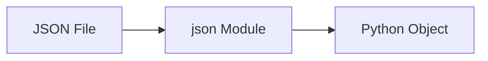

---

## Key Components

| Function | Purpose |
|----------|----------|
| `load()` | Read JSON file |
| `loads()` | Read JSON string |
| `dump()` | Write JSON file |
| `dumps()` | Convert object to JSON string |

---

## Types (if applicable)

- Serialization
- Deserialization

---

## Lifecycle / Workflow (if applicable)


---

## Configuration / Syntax (if applicable)

```python
import json

data = json.loads('{"name":"Server"}')
```

---

## Important Commands (if applicable)

```python
load()

loads()

dump()

dumps()
```

---

## Important Files (if applicable)

```
config.json
```

---

## Real-World Use Cases

- API responses
- Cloud configuration
- Kubernetes manifests

---

## Advantages

- Lightweight
- Standard format

---

## Limitations

- No comments supported

---

## Common Interview Questions (Concept Only)

- Difference between `load()` and `loads()`?

---

## Common Mistakes

- Confusing `load()` with `loads()`

---

## Troubleshooting

- Validate JSON syntax

---

## Summary

The `json` module converts JSON data to Python objects and vice versa.

---

# csv

## Overview

The `csv` module reads and writes CSV files.

---

## Why It Is Used

Used for:

- Reports
- Inventory
- Server lists
- Log exports

---

## Architecture / Working


---

## Key Components

| Function | Purpose |
|----------|----------|
| `reader()` | Read CSV |
| `writer()` | Write CSV |
| `DictReader()` | Read as dictionaries |
| `DictWriter()` | Write dictionaries |

---

## Types (if applicable)

CSV Reader

CSV Writer

---

## Lifecycle / Workflow (if applicable)

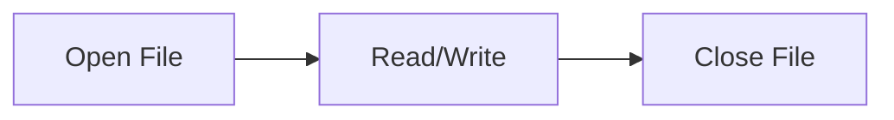

---

## Configuration / Syntax (if applicable)

```python
import csv
```

---

## Important Commands (if applicable)

```python
reader()

writer()

DictReader()

DictWriter()
```

---

## Important Files (if applicable)

```
servers.csv
```

---

## Real-World Use Cases

- Server inventory
- Reports
- Asset management

---

## Advantages

- Simple
- Portable

---

## Limitations

- Limited data types

---

## Common Interview Questions (Concept Only)

- What is `DictReader()`?

---

## Common Mistakes

- Wrong delimiter

---

## Troubleshooting

- Specify correct delimiter and encoding

---

## Summary

The `csv` module provides simple APIs for reading and writing CSV files.

---

# logging

## Overview

The `logging` module records application events and errors.

It is the recommended alternative to `print()` for production applications.

---

## Why It Is Used

Used to:

- Debug applications
- Record errors
- Audit operations
- Monitor automation

---

## Architecture / Working


---

## Key Components

| Level | Purpose |
|-------|----------|
| DEBUG | Diagnostic information |
| INFO | General events |
| WARNING | Potential issues |
| ERROR | Errors |
| CRITICAL | Serious failures |

---

## Types (if applicable)

Logging levels

---

## Lifecycle / Workflow (if applicable)


---

## Configuration / Syntax (if applicable)

```python
import logging

logging.basicConfig(level=logging.INFO)
```

---

## Important Commands (if applicable)

```python
logging.info()

logging.warning()

logging.error()

logging.debug()
```

---

## Important Files (if applicable)

```
app.log
```

---

## Real-World Use Cases

- Deployment logs
- Audit trails
- Monitoring

---

## Advantages

- Production ready
- Multiple log levels

---

## Limitations

- Requires configuration

---

## Common Interview Questions (Concept Only)

- Why use logging instead of print()?

---

## Common Mistakes

- Logging sensitive information

---

## Troubleshooting

- Configure logging before use

---

## Summary

The `logging` module provides structured and configurable logging for production applications.

---

# argparse

## Overview

The `argparse` module parses command-line arguments, enabling users to customize script behavior without modifying code.

---

## Why It Is Used

Used to:

- Build CLI tools
- Accept user input
- Pass deployment parameters

---

## Architecture / Working


---

## Key Components

- ArgumentParser
- add_argument()
- parse_args()

---

## Types (if applicable)

Positional and optional arguments

---

## Lifecycle / Workflow (if applicable)

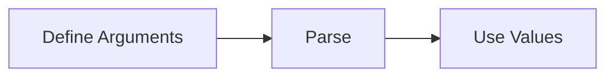

---

## Configuration / Syntax (if applicable)

```python
import argparse
```

---

## Important Commands (if applicable)

```python
ArgumentParser()

add_argument()

parse_args()
```

---

## Important Files (if applicable)

CLI scripts

---

## Real-World Use Cases

- Deployment utilities
- Backup tools
- Infrastructure automation

---

## Advantages

- User-friendly CLI
- Built-in help

---

## Limitations

- More verbose than simple argument parsing

---

## Common Interview Questions (Concept Only)

- What is argparse used for?

---

## Common Mistakes

- Not validating arguments

---

## Troubleshooting

- Use `--help` to verify argument definitions

---

## Summary

`argparse` simplifies the creation of professional command-line applications.

---

# datetime

## Overview

The `datetime` module provides classes for working with dates, times, timestamps, and durations.

---

## Why It Is Used

Used to:

- Timestamp logs
- Schedule jobs
- Calculate durations
- Generate reports

---

## Architecture / Working

```mermaid
flowchart LR

    A[Current Time]
    B[datetime]
    C[Formatted Output]

    A --> B
    B --> C
```

---

## Key Components

| Class | Purpose |
|--------|----------|
| `datetime` | Date and time |
| `date` | Date only |
| `time` | Time only |
| `timedelta` | Time difference |

---

## Types (if applicable)

Date

Time

DateTime

Timedelta

---

## Lifecycle / Workflow (if applicable)

```mermaid
flowchart LR

    A[Get Time]
    B[Process]
    C[Display]

    A --> B
    B --> C
```

---

## Configuration / Syntax (if applicable)

```python
from datetime import datetime

print(datetime.now())
```

---

## Important Commands (if applicable)

```python
now()

today()

strftime()

timedelta()
```

---

## Important Files (if applicable)

Logs and reports

---

## Real-World Use Cases

- Log timestamps
- Backup scheduling
- Expiry calculations
- Monitoring

---

## Advantages

- Built-in
- Accurate
- Flexible formatting

---

## Limitations

- Time zone handling requires additional care

---

## Common Interview Questions (Concept Only)

- How do you get the current date and time?
- What is `timedelta`?

---

## Common Mistakes

- Mixing naive and timezone-aware datetime objects

---

## Troubleshooting

- Use consistent timezone handling across applications

---

## Summary

The `datetime` module enables accurate date and time manipulation for automation, logging, scheduling, and reporting.

---

# Interview Quick Revision

## Frequently Used DevOps Modules

| Module | Main Purpose |
|---------|--------------|
| `os` | Operating system operations |
| `sys` | Runtime and interpreter information |
| `pathlib` | Modern path handling |
| `shutil` | File and directory operations |
| `subprocess` | Execute shell commands |
| `json` | JSON processing |
| `csv` | CSV file handling |
| `logging` | Production logging |
| `argparse` | Command-line arguments |
| `datetime` | Date and time handling |

---

## Frequently Asked Interview Differences

| Module | Best Used For |
|---------|---------------|
| `os` | OS interaction and environment variables |
| `pathlib` | Modern, object-oriented file paths |
| `os.system()` | Basic command execution (not recommended) |
| `subprocess` | Production-grade command execution |
| `print()` | Simple output |
| `logging` | Production logging |

---

## Production Best Practices

- Use **`pathlib`** instead of `os.path` for file paths.
- Use **`subprocess.run()`** instead of `os.system()`.
- Use the **`logging`** module instead of `print()` in production.
- Validate JSON before processing.
- Handle exceptions when performing file or system operations.
- Use `argparse` for command-line tools instead of hardcoding values.

---

## One-line Interview Answer

**Python's Standard Library provides powerful built-in modules such as `os`, `pathlib`, `subprocess`, `json`, `csv`, `logging`, `argparse`, and `datetime`, enabling DevOps engineers to automate operating system tasks, manage files, execute commands, process data, build CLI tools, and create reliable production automation scripts.**
