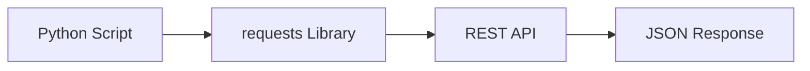
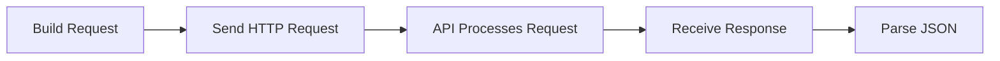
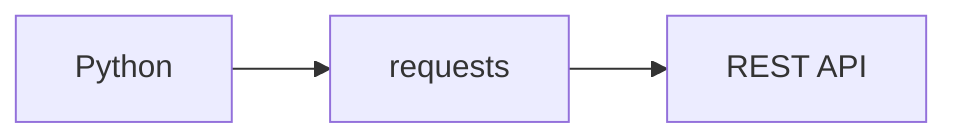
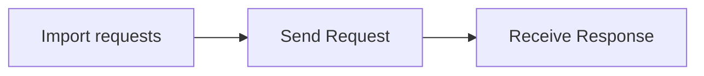
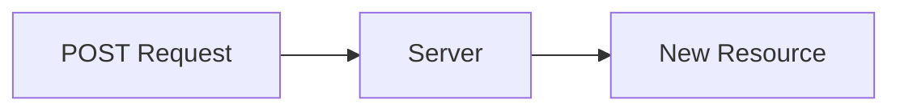
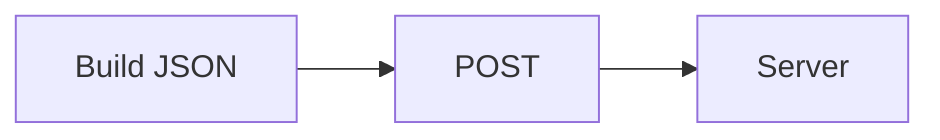
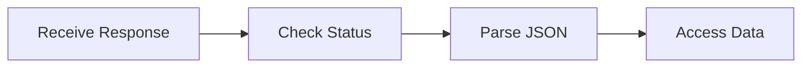

# Working with APIs

## Overview

An **API (Application Programming Interface)** allows different applications to communicate with each other.

Most modern cloud platforms and DevOps tools expose **REST APIs** over HTTP. Python interacts with these APIs using the **`requests`** library.

In DevOps, APIs are used to:

- Manage cloud resources (AWS, Azure, GCP)
- Deploy applications
- Trigger CI/CD pipelines
- Manage Kubernetes
- Query monitoring systems
- Integrate with GitHub, Jenkins, Docker, Argo CD, Terraform, and many other tools

> **Interview Tip**
>
> Nearly every modern DevOps tool provides a REST API. Knowing how to call APIs using Python is an essential skill.

---

## Why It Is Used

Working with APIs helps to:

- Automate cloud infrastructure
- Integrate multiple platforms
- Retrieve monitoring data
- Trigger deployments
- Manage virtual machines
- Update DNS records
- Create users
- Collect metrics

---

## Architecture / Working



---

## Key Components

| Component | Description |
|-----------|-------------|
| Client | Sends request |
| Server | Processes request |
| Endpoint | API URL |
| HTTP Method | GET, POST, PUT, DELETE |
| Headers | Authentication and metadata |
| JSON | Data exchange format |
| Status Code | Response status |

---

## Types (if applicable)

Common HTTP methods:

| Method | Purpose |
|---------|----------|
| GET | Read data |
| POST | Create data |
| PUT | Update data |
| PATCH | Partial update |
| DELETE | Remove data |

---

## Lifecycle / Workflow (if applicable)



---

## Configuration / Syntax (if applicable)

```python
import requests

response = requests.get("https://api.example.com")
```

---

## Important Commands (if applicable)

```python
requests.get()

requests.post()

response.json()

response.status_code
```

---

## Important Files (if applicable)

```
config.json

automation.py

api_client.py

deploy.py
```

---

## Real-World Use Cases

- Azure REST API
- AWS REST APIs
- GitHub API
- Jenkins API
- Kubernetes API
- Docker Registry API
- Argo CD API
- Prometheus API

---

## Advantages

- Platform independent
- Easy integration
- Supports automation
- Standard communication protocol
- JSON support

---

## Limitations

- Requires network connectivity
- Authentication required for most APIs
- Subject to rate limits
- API versions may change

---

## Common Interview Questions (Concept Only)

- What is a REST API?
- Why use APIs in DevOps?
- Difference between GET and POST?
- What is JSON?
- What is an HTTP status code?
- What is the `requests` library?
- Why check `response.status_code`?

---

## Common Mistakes

- Ignoring status codes
- Hardcoding API tokens
- Not handling exceptions
- Assuming responses are always JSON
- Ignoring request timeouts

---

## Troubleshooting

| Problem | Cause | Solution |
|----------|-------|----------|
| 401 Unauthorized | Invalid credentials | Verify authentication |
| 404 Not Found | Incorrect endpoint | Check API URL |
| 500 Server Error | Server issue | Retry or contact API provider |
| Connection timeout | Network problem | Check connectivity and timeout settings |
| JSON decode error | Invalid response | Validate response before parsing |

---

## Summary

Python simplifies REST API communication through the `requests` library, making it easy to integrate cloud services, automate infrastructure, and build production-ready DevOps tools.

> **Interview Tip**
>
> Always validate the **HTTP status code** before processing the response body.

---

# HTTP Requests

## Overview

An HTTP request is a message sent from a client to a server to perform an action such as retrieving, creating, updating, or deleting data.

---

## Why It Is Used

HTTP requests are used to:

- Retrieve cloud information
- Deploy applications
- Update infrastructure
- Access monitoring systems
- Trigger CI/CD pipelines

---

## Architecture / Working


---

## Key Components

| Component | Purpose |
|-----------|----------|
| URL | API endpoint |
| Method | Action to perform |
| Headers | Authentication and metadata |
| Body | Request data |
| Response | Server reply |

---

## Types (if applicable)

- GET
- POST
- PUT
- PATCH
- DELETE

---

## Lifecycle / Workflow (if applicable)


---

## Configuration / Syntax (if applicable)

```python
requests.get(url)
```

---

## Important Commands (if applicable)

```python
requests.get()

requests.post()
```

---

## Important Files (if applicable)

Automation scripts

---

## Real-World Use Cases

- Cloud APIs
- Monitoring APIs
- GitHub API

---

## Advantages

- Universal protocol
- Easy integration

---

## Limitations

- Depends on network availability

---

## Common Interview Questions (Concept Only)

- What is an HTTP request?

---

## Common Mistakes

- Incorrect request method

---

## Troubleshooting

- Verify endpoint URL

---

## Summary

HTTP requests enable communication between Python applications and remote services.

---

# requests Library

## Overview

The `requests` library is Python's most popular HTTP client for interacting with REST APIs.

Unlike the Standard Library's `urllib`, it provides a simpler and more readable interface.

> **Interview Tip**
>
> `requests` is a third-party package and must be installed using `pip`.

---

## Why It Is Used

Used to:

- Call REST APIs
- Upload data
- Download data
- Authenticate requests
- Send headers

---

## Architecture / Working



---

## Key Components

| Function | Purpose |
|----------|----------|
| `get()` | GET request |
| `post()` | POST request |
| `put()` | PUT request |
| `delete()` | DELETE request |
| `headers` | Request headers |
| `json` | JSON payload |

---

## Types (if applicable)

HTTP methods

---

## Lifecycle / Workflow (if applicable)



---

## Configuration / Syntax (if applicable)

Install

```bash
pip install requests
```

Import

```python
import requests
```

---

## Important Commands (if applicable)

```python
get()

post()

put()

delete()
```

---

## Important Files (if applicable)

API clients

---

## Real-World Use Cases

- Azure REST API
- GitHub API
- Jenkins API
- Kubernetes API

---

## Advantages

- Easy syntax
- Supports authentication
- Supports HTTPS
- Handles redirects

---

## Limitations

- Requires installation

---

## Common Interview Questions (Concept Only)

- Why use the `requests` library?
- Difference between `requests` and `urllib`?

---

## Common Mistakes

- Forgetting to install the package

---

## Troubleshooting

- Install using `pip`

---

## Summary

The `requests` library is the standard choice for making HTTP requests in Python.

---

# GET Requests

## Overview

A GET request retrieves information from an API.

It does **not modify server data**.

---

## Why It Is Used

Used to:

- Read cloud resources
- Get VM details
- Retrieve logs
- Fetch monitoring data

---

## Architecture / Working


---

## Key Components

- URL
- Headers
- Query parameters

---

## Types (if applicable)

Simple GET

Parameterized GET

---

## Lifecycle / Workflow (if applicable)


---

## Configuration / Syntax (if applicable)

```python
response = requests.get(url)
```

---

## Important Commands (if applicable)

```python
requests.get()
```

---

## Important Files (if applicable)

Automation scripts

---

## Real-World Use Cases

- Get EC2 instances
- Get Azure VMs
- Get Kubernetes pods

---

## Advantages

- Safe operation
- Easy to use

---

## Limitations

- Cannot create or update resources

---

## Common Interview Questions (Concept Only)

- What is a GET request?

---

## Common Mistakes

- Sending sensitive data in query parameters

---

## Troubleshooting

- Verify endpoint URL and query parameters

---

## Summary

GET requests retrieve data from APIs without modifying server resources.

---

# POST Requests

## Overview

A POST request sends data to an API to create a new resource or trigger an operation.

---

## Why It Is Used

Used to:

- Create cloud resources
- Trigger deployments
- Submit forms
- Create users

---

## Architecture / Working



---

## Key Components

- URL
- Headers
- Request body

---

## Types (if applicable)

JSON POST

Form POST

---

## Lifecycle / Workflow (if applicable)



---

## Configuration / Syntax (if applicable)

```python
requests.post(url, json=data)
```

---

## Important Commands (if applicable)

```python
requests.post()
```

---

## Important Files (if applicable)

Deployment scripts

---

## Real-World Use Cases

- Create Azure VM
- Trigger Jenkins job
- Create GitHub repository
- Start deployment

---

## Advantages

- Creates resources
- Supports large payloads

---

## Limitations

- Requires request validation

---

## Common Interview Questions (Concept Only)

- Difference between GET and POST?

---

## Common Mistakes

- Sending incorrect JSON

---

## Troubleshooting

- Validate payload format and headers

---

## Summary

POST requests create resources or trigger actions by sending data to an API.

---

# JSON Response Handling

## Overview

Most REST APIs return data in **JSON (JavaScript Object Notation)** format.

The `response.json()` method converts JSON responses into Python dictionaries or lists.

---

## Why It Is Used

Used to:

- Read API responses
- Access cloud resource details
- Process monitoring data
- Extract configuration values

---

## Architecture / Working

```mermaid
flowchart LR

    A[API Response]
    B[JSON]
    C[response.json()]
    D[Python Dictionary]

    A --> B
    B --> C
    C --> D
```

---

## Key Components

| Method | Purpose |
|----------|----------|
| `response.json()` | Convert JSON to Python object |
| `status_code` | Verify success |
| `headers` | Response metadata |
| `text` | Raw response body |

---

## Types (if applicable)

- Dictionary response
- List response

---

## Lifecycle / Workflow (if applicable)



---

## Configuration / Syntax (if applicable)

```python
data = response.json()

print(data["name"])
```

---

## Important Commands (if applicable)

```python
response.json()

response.text

response.status_code
```

---

## Important Files (if applicable)

JSON configuration files

---

## Real-World Use Cases

- Parse Azure API responses
- Read GitHub repositories
- Process monitoring metrics
- Read Kubernetes API responses

---

## Advantages

- Easy data access
- Native Python dictionaries
- Lightweight format

---

## Limitations

- Assumes response is valid JSON

---

## Common Interview Questions (Concept Only)

- What does `response.json()` return?
- Why check `status_code` before parsing JSON?

---

## Common Mistakes

- Calling `response.json()` on non-JSON responses
- Ignoring error responses before parsing

---

## Troubleshooting

- Verify `Content-Type` is `application/json`
- Check `response.status_code` before processing
- Handle `JSONDecodeError` when parsing fails

---

## Summary

JSON response handling converts API responses into Python objects, making it easy to access and process structured data.

---

# Interview Quick Revision

## Common HTTP Methods

| Method | Purpose |
|---------|----------|
| GET | Retrieve data |
| POST | Create resource |
| PUT | Replace resource |
| PATCH | Partially update resource |
| DELETE | Remove resource |

---

## Common HTTP Status Codes

| Code | Meaning |
|------|----------|
| 200 | OK |
| 201 | Created |
| 204 | No Content |
| 400 | Bad Request |
| 401 | Unauthorized |
| 403 | Forbidden |
| 404 | Not Found |
| 500 | Internal Server Error |

---

## Frequently Used requests Methods

| Method | Purpose |
|----------|----------|
| `requests.get()` | Retrieve data |
| `requests.post()` | Create data |
| `requests.put()` | Update resource |
| `requests.delete()` | Delete resource |
| `response.json()` | Parse JSON response |
| `response.status_code` | Check request status |

---

## Production Best Practices

- Always check `response.status_code` before processing data.
- Set request timeouts (for example, `timeout=30`) to avoid hanging requests.
- Store API keys and tokens in environment variables or secret managers instead of hardcoding them.
- Handle network and parsing exceptions gracefully.
- Validate JSON responses before accessing keys.
- Use HTTPS endpoints whenever possible.

---

## One-line Interview Answer

**Python's `requests` library enables DevOps engineers to interact with REST APIs by sending HTTP requests, handling JSON responses, and automating cloud services, CI/CD pipelines, monitoring systems, and infrastructure management tasks in a reliable and production-ready manner.**
